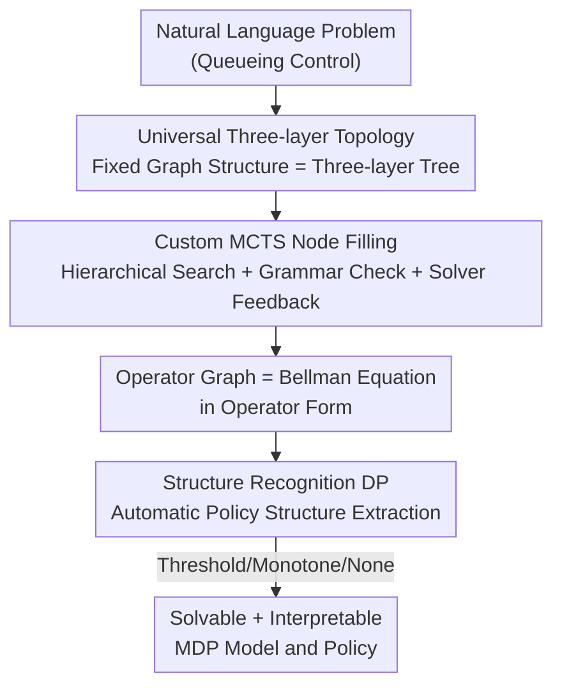

# Operator Theory-Driven Autoformulation of MDPs for Control of Queueing Systems

**Conference**: ICLR 2026  
**OpenReview**: [https://openreview.net/forum?id=hPOImB2mZW](https://openreview.net/forum?id=hPOImB2mZW)  
**Code**: The paper states that datasets and code are publicly available ("available here"); refer to the original text for the specific repository.  
**Area**: Reinforcement Learning / Sequential Decision Making / Operations Research  
**Keywords**: Autoformulation, MDP, Operator Theory, Queueing Systems, Monte Carlo Tree Search

## TL;DR
This paper utilizes Large Language Models (LLMs) to automatically translate natural language descriptions of queueing control problems into Bellman equations in the form of "operator graphs." By leveraging a rigorously proven "universal three-layer topology" to prune the vast modeling search space, it employs a customized MCTS for graph construction and low-complexity dynamic programming to automatically identify the structure of optimal policies (e.g., threshold/monotone types). On a self-constructed dataset of 36 problems, the modeling accuracy was improved from single digits in baselines to 83.3%.

## Background & Motivation
**Background**: Autoformulation is an emerging direction—enabling LLMs to automatically translate "natural language descriptions of decision problems" into solvable mathematical models, thereby opening Operations Research (OR) modeling capabilities to non-experts. However, most existing work focuses on **mathematical optimization**, which involves "one-time decision" problems (solved once).

**Limitations of Prior Work**: Many real-world problems are **sequential and evolve stochastically**, naturally requiring modeling as Markov Decision Processes (MDPs). Yet, autoformulation for MDPs is significantly more difficult than for optimization: ① The search space for candidate formulas is much larger, incorporating components like states and transition probabilities, as well as **implicit constraints** such as "non-negative states" or "state-dependent action sets"—which are often not explicitly stated in the problem description and must be inferred by the model; ② Even if the formula is correct, MDPs face the curse of dimensionality, making the solving process itself expensive; ③ Optimal policies for MDPs are high-dimensional state-action mappings with **poor interpretability**, making it difficult for humans to understand the reasoning behind decisions.

**Key Challenge**: While optimization problems are "solved once formulated," MDPs involve distinct "modeling" and "solving" phases, with the latter often bottlenecked by the curse of dimensionality. If the modeling phase only focuses on "writing the correct formula" without providing interfaces for downstream solving and interpretability, the resulting model remains difficult to use even if correct.

**Goal**: To develop an autoformulation framework for queueing control—a scenario critical to healthcare and logistics that requires significant professional expertise—while **simultaneously** addressing modeling correctness, computational tractability, and solution interpretability.

**Key Insight**: The authors introduce **operator theory** from operations research (Koole 1998/2007), which views the Bellman equation as a concatenation of "operators." Each operator represents an interpretable transformation of the value function corresponding to a specific event (arrival, departure, routing, etc.). This perspective is inherently interpretable and provides a theoretical foundation for "identifying optimal policy structures."

**Core Idea**: For the first time, the Bellman equation is represented as a **directed acyclic graph of operators (operator graph)**. It is proven that a large class of MDP operator graphs follows a "universal three-layer topology," thereby compressing the "search across all possible graphs" into "filling nodes within a fixed topology." MCTS is then used to fill the graph, and dynamic programming is used to automatically extract policy structures.

## Method

### Overall Architecture
The framework aims to solve the transformation from "natural language descriptions → solvable and interpretable MDP models." it consists of two main stages: the **Modeling Phase** uses LLM + MCTS to generate and evaluate operator graphs (i.e., Bellman equations in operator form), and the **Solving/Analysis Phase** runs structure recognition algorithms on the constructed operator graph to automatically determine if the optimal policy is of a threshold or monotone type.

Crucial event-based MDPs decompose the state $s=(x,e)$ into a controllable component $x$ (e.g., queue length) and an exogenous uncontrollable component $e$ (e.g., arrival events). The transition probability factorizes as $P[(x',e')|(x,e),a]=P_x[x'|(x,e),a]\cdot P_e(e'|x')$. Under this structure, the entire operator graph is fixed into three layers: the bottom layer consists of **event operators** $T_{e_j}$ (one per event), the middle layer consists of a **uniformization operator** $T_{\text{unif}}$ that merges events via probability weighting, and the top layer is the **cost operator** $T_{\text{cost}}$ which adds immediate costs and applies discounting. A single value iteration is written as $V^*_{n+1}(x)=T_{\text{cost}}\{T_{\text{unif}}(T_{e_1}[V^*_n(x)],\dots,T_{e_\ell}[V^*_n(x)])\}$.

### Key Designs

**1. Operator Graph + Universal Three-layer Topology: Compressing "Arbitrary Connectivity" into "Fixed Tree Completion"**

Naively treating "problem modeling" as a "search over all operator graphs" is catastrophic: the number of DAGs with $N$ nodes and a single output point grows approximately by $2^{N^2}$ (for $N=2\dots9$, this already reaches $1,2,15,316,16885,2174586,654313415,450179768312$). The core theoretical contribution (Theorem 4.1) proves: the Bellman equation of **any** event-based MDP can be constructed using a fixed three-layer tree topology—the root is the cost operator $T_{\text{cost}}[U(x)]=c(x)+\gamma U(x)$, its sole child is the uniformization operator $T_{\text{unif}}[U_1,\dots,U_\ell]=\sum_j P(e_j|x)\,U_j(x)$, and the leaves are the various event operators $T_{e_j}[V^*_n(x)]=V_{n+1}(x,e_j)$. This step fixes not only the "connectivity" but also the "type of operator" for each layer, causing the search space to plummet from "arbitrary topology × arbitrary operators" to "filling correct nodes in a three-layer tree." The authors emphasize that this result is non-trivial: other topologies may exist for event-based MDPs, whereas non-event-based MDPs **cannot** even be constructed using this universal topology, thus precisely delineating the method's boundaries.

**2. Custom MCTS: Hierarchical Search with Grammar Checks + Solver Feedback for Dense Rewards**

Knowing the topology still requires filling nodes correctly, and components have dependencies. A single-round prompt cannot handle this. This work decomposes the search into four layers based on dependency: problem parameters (queue scale, $m_1$), state variables and constraints ($m_2$), events/actions/costs and their probabilities ($m_3$), and operators ($m_4$). MCTS expands layer by layer. It follows the standard "Selection-Expansion-Evaluation-Backup" cycle but with two key modifications to the backup phase. For terminal rewards, to mitigate LLM self-evaluation bias, the LLM preference score $\text{score}_{\text{LLM}}\in[0,1]$ is multiplied by whether the solver converged $\text{score}_{\text{converged}}\in\{0,1\}$: $\text{score}_{\text{final}}=\text{score}_{\text{LLM}}\times\text{score}_{\text{converged}}$. Non-convergence results in a zero score, providing an objective signal. For intermediate rewards, inspired by AlphaZero, intermediate nodes are scored based on **grammatical correctness**. Rollouts that violate grammatical constraints are terminated early with zero reward, pruning invalid branches as early as possible. Given that grammatical errors are often local, the framework allows the LLM to use error messages as context for up to five self-corrections; if it still fails, the error is attributed to earlier steps.

**3. Structure Recognition Dynamic Programming: Automatically Extracting Interpretable Policy Structures**

Once the operator graph is built, determining whether the optimal policy has a useful structure (e.g., "action is monotone in state" or "threshold-type") usually relies on analyzing properties of the value function $V^*(x)$. For instance, if $V^*$ is convex in $x$, the optimal policy may be non-increasing in $x$. An operator "propagates" a property if $T[V_n]$ satisfies the property whenever $V_n$ does. The challenge is that $V^*_n$ passes through the entire graph, requiring the identification of properties **commonly propagated by all operators** in the graph. A brute-force approach would involve enumerating exponentially many possibilities. This paper proposes a DP algorithm (Algorithms 1–3): the key observation is that any common propagation space can be written as the intersection of sets of properties initially propagated by each operator. Instead of constructing the full closure, the algorithm repeatedly **removes** properties that cannot appear in this intersection until the property family stabilizes. Theorem 4.2 guarantees that this algorithm identifies all detectable structures within the framework with a complexity of only $O(N\cdot|G|)$ for memory and $O(N\cdot|G|^2)$ for time (where $|G|$ is the number of operators and $N$ is the upper bound on properties per operator), reducing "exponential brute force" to "low-order polynomial." This directly alleviates the curse of dimensionality and makes the solution interpretable.

### A Complete Example
Consider a hospital with two wards: Intensive Care (C) and General (G). Two parallel queues share beds; arrivals are controllable (CA), while departures are uncontrollable (D). The state controllable component is $x=(x_C,x_G)$. The framework first determines parameters, states, and events across four dependency layers, then fills operators: the Intensive arrival operator $T_{CAC}[U(x)]=\min\{U[(x_C{+}1,x_G)],\,c_C+U(x)\}$ (either admit to queue or reject with cost $c_C$), the Intensive departure operator $T_{DC}[U(x)]=U[((x_C{-}1)^+,x_G)]$; the uniformization operator merges these using rates $\lambda_C,\lambda_G,\mu_C,\mu_G$; the cost operator adds holding cost $\rho_h(x_C+x_G)/(\lambda+\alpha)$ and applies discount $\gamma$. The combination results in $V^*_{n+1}(x)=T_{\text{cost}}\{T_{\text{unif}}(T_{CAC}[V^*_n],T_{CAG}[V^*_n],T_{DC}[V^*_n],T_{DG}[V^*_n])\}$. If MCTS incorrectly splits one ward into "bed + waiting" queues, it is penalized as a variable definition error. After construction, structure recognition DP extracts the threshold structure of the optimal policy.

## Key Experimental Results

### Main Results
The dataset consists of 36 self-constructed queueing control natural language problems, categorized by state space size/shape and number of event types. Problems are divided into three types: those with provable structures, those with empirical but unprovable structures, and those with no structure. Problems were adapted from literature in hospital management, telecommunications, freight scheduling, assembly lines, and traffic control. Multiple MCTS rollouts were run per problem, picking the highest-scoring path. A DP solver was used for verification (errors if non-convergent); accuracy required the value function to be within tolerance of the ground truth.

| Method (12 Rollouts) | Modeling Accuracy | completion tokens |
|--------|------|------|
| GPT-4o (single prompt + solver feedback SF) | 0% | 38k |
| CoT (single prompt + SF) | 2.7% | 50k |
| GPT-4o (step-by-step prompt + SF) | 8.3% | 42k |
| CoT (step-by-step prompt + SF) | 11.0% | 85k |
| GPT-4o (step-by-step prompt + SF + grammar check SC) | 72.0% | 80k |
| CoT (step-by-step prompt + SF + SC) | 75.2% | 180k |
| **MCTS (+SF +SC, Ours)** | **83.3%** | 96k |

Single-prompt methods almost completely failed (even with CoT). CoT as test-time scaling was more computationally expensive yet less effective than MCTS. MCTS performed better under identical feedback conditions and became increasingly efficient by reusing historical computations.

### Ablation Study

| Configuration (12 Rollouts) | Accuracy | Description |
|------|---------|------|
| MCTS (w/o SF & SC) | 16.0% | Removed solver feedback and grammar check |
| MCTS (w. SF, w/o SC) | 41.6% | With solver feedback, but no grammar check |
| MCTS (w. SF & SC) | 83.3% | Full model |

Grammar checks (SC) were the primary driver of performance: once added, all formulas proposed by MCTS were executable by the solver, essentially eliminating "grammatical validity" failures. Remaining errors were almost entirely due to **semantic misunderstanding**.

### Key Findings
- Distribution of failed rollout errors: Uniformization errors 33%, variable definition errors 26%, missing constraints 24%, event dynamics errors 12%, parameter identification errors 5%. The bottleneck lies in the semantic layer (especially uniformization, such as confusing parallel vs. serial processing probabilities) rather than the grammatical layer.
- Typical semantic errors were specific: LLMs often created unnecessary extra queues for a single ward (variable definition error); missing constraints often stemmed from implicit assumptions (e.g., non-negative patients), which the solver could detect as an "unbounded state space."
- Structure recognition successfully identified structural properties in 74% of cases, demonstrating that the operator graph effectively addresses "structural expressibility." Failures were mainly due to prior modeling errors, operator mislabeling, or correct formulas that did not expose the structure.

## Highlights & Insights
- **Turning "Graph Search" into "Topology Proof then Completion"**: Theorem 4.1 uses a theoretical conclusion to collapse a $2^{N^2}$ search space into a fixed three-layer tree. This is a paradigm of "using mathematical priors for LLM search pruning," which is more sophisticated than simple prompting or sampling.
- **Solver as the Umpire**: Using "solver convergence" as an objective binary reward to multiply the LLM self-score effectively counters LLM over-optimism. This "external verifiable signal × model preference" multiplicative reward can be transferred to any "modeling-solving" closed-loop task.
- **Dense Supervision via Intermediate Grammar Checks**: Porting AlphaZero-style intermediate rewards to formal modeling allows invalid branches to be pruned early, serving as the single largest contributor to performance (41.6%→83.3%).
- **Paving the Way for Solving and Interpretability during Modeling**: Identifying policy structures (threshold/monotone) before solving manually alleviates the curse of dimensionality. This approach is highly relevant for the autoformulation of any sequential decision-making task.

## Limitations & Future Work
- The applicability boundary is strictly limited to **event-based MDPs**: Theorem 4.1's universal topology does not hold for non-event-based MDPs, rendering the framework inapplicable.
- The evaluation scale is relatively small (36 problems, single domain of queueing control), and it relies on a self-constructed dataset and specific solver/tolerance settings; cross-domain generalization remains to be verified.
- The remaining bottleneck is at the semantic layer: uniformization and variable definition errors comprise the majority. **Operator mislabeling** is the main remaining hurdle for structure recognition—if the LLM models state dynamics correctly but labels the operator incorrectly, the structure cannot be extracted.
- Some correct formulas are "structurally inexpressible," suggesting that different correct models of the same problem vary in analyzability. How to guide LLMs toward modeling that "favors structural analysis" is an open question.

## Related Work & Insights
- **vs. Autoformulation of Mathematical Optimization (ORLM, Autoformulator)**: They only handle one-time decision optimization problems and focus solely on modeling challenges; this work handles discrete and continuous-time MDPs and additionally addresses computational and interpretability challenges.
- **vs. Autoformulation of Dynamic Programming (DPLM, Zhou et al. 2025)**: The closest work, relying on synthetic data + fine-tuning, but does not address computational or interpretability challenges; this work uses prompting + operator graph search without fine-tuning, filling those two gaps.
- **vs. Efficient MDP Solving (Approximate DP, RL, structural property exploitation)**: These are complementary—once this framework identifies structures in the modeling phase, they can be cascaded to accelerate downstream solving.

## Rating
- Novelty: ⭐⭐⭐⭐⭐ First to treat Bellman equations as operator graphs and prove a universal three-layer topology; theory and method are both highly novel.
- Experimental Thoroughness: ⭐⭐⭐⭐ Baselines, ablations, and error analysis are comprehensive, though the dataset is small (36 problems) and limited to one domain.
- Writing Quality: ⭐⭐⭐⭐ Clear mapping between challenges and contributions; good integration of theory and examples, with some details appropriately deferred to the appendix.
- Value: ⭐⭐⭐⭐⭐ Opens a new path for autoformulation of sequential decisions through "theoretical pruning + interpretable structure recognition," targeting high-value scenarios like healthcare and logistics.

<!-- RELATED:START -->

## Related Papers

- [\[ICLR 2026\] VerifyBench: Benchmarking Reference-based Reward Systems for Large Language Models](verifybench_benchmarking_reference-based_reward_systems_for_large_language_model.md)
- [\[ICLR 2026\] UME-R1: Exploring Reasoning-Driven Generative Multimodal Embeddings](ume-r1_exploring_reasoning-driven_generative_multimodal_embeddings.md)
- [\[ICLR 2026\] Is Pure Exploitation Sufficient in Exogenous MDPs with Linear Function Approximation?](is_pure_exploitation_sufficient_in_exogenous_mdps_with_linear_function_approxima.md)
- [\[ICLR 2026\] Optimal Robust Subsidy Policies for Irrational Agent in Principal-Agent MDPs](optimal_robust_subsidy_policies_for_irrational_agent_in_principal-agent_mdps.md)
- [\[ICLR 2026\] APC-RL: Exceeding Data-Driven Behavior Priors with Adaptive Policy Composition](apc-rl_exceeding_data-driven_behavior_priors_with_adaptive_policy_composition.md)

<!-- RELATED:END -->
