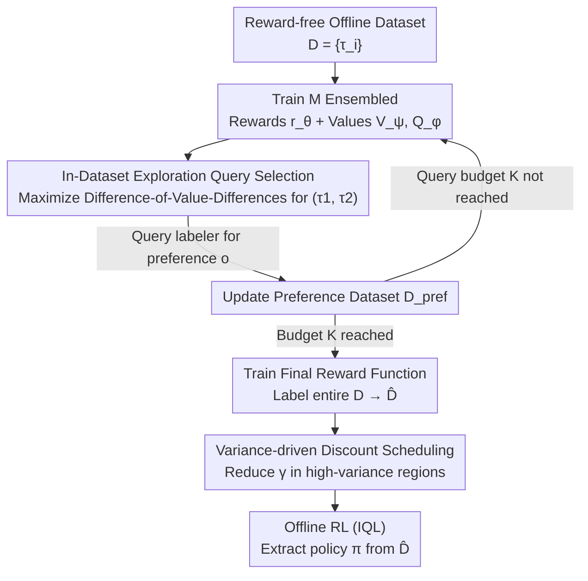

# OPRIDE: Efficient Offline Preference Reinforcement Learning via In-Dataset Exploration

**Conference**: ICLR 2026  
**OpenReview**: [https://openreview.net/forum?id=QLDHukpozh](https://openreview.net/forum?id=QLDHukpozh)  
**Code**: None  
**Area**: Reinforcement Learning / Offline RL / Preference Learning  
**Keywords**: Preference Reinforcement Learning, Offline RL, Query Efficiency, Exploration, Discount Scheduling

## TL;DR
OPRIDE addresses the high cost of human feedback in Offline Preference Reinforcement Learning (PbRL) by proposing **Difference-of-Value-Differences** to select the most informative preference queries and **Variance-driven Discount Scheduling** to suppress over-optimization of learned rewards. It significantly outperforms previous SOTA on Meta-World and AntMaze using only approximately 10 preference queries.

## Background & Motivation

**Background**: Reward functions for many real-world tasks are extremely difficult to design manually. Preference Reinforcement Learning (PbRL) instead uses pairwise comparisons where humans indicate "which trajectory is better." Rewards are then inferred using the Bradley-Terry model to train policies via standard (offline) RL. These relative judgments are more intuitive and less labor-intensive than absolute scoring.

**Limitations of Prior Work**: Human preference labeling is slow and expensive, making **query efficiency** the primary bottleneck for PbRL deployment. The authors attribute the low query efficiency of offline PbRL to two specific causes: (1) **Inefficient exploration**, where existing query selection methods (e.g., reward model disagreement, information gain) focus the budget on "accurate reward estimation," which may target regions irrelevant to the optimal policy. (2) **Reward over-optimization**, where learned rewards are noisy, and offline RL naturally tends to overestimate value, causing the policy to be misled by "inflated" rewards.

**Key Challenge**: Aiming to reduce reward function uncertainty is an incorrect objective. The goal should be to reduce uncertainty **regarding the optimal policy**. The Eluder dimension of the reward function class $d_{\text{Elu}}(\mathcal{R})$ is typically much larger than that of the optimal value function class $d_{\text{Elu}}(\mathcal{V}^*)$; focusing on the former results in wasted labeling effort.

**Goal**: (1) Design a query selection criterion that maximizes information gain regarding the **optimal policy** for each preference. (2) Suppress value overestimation caused by over-optimization during policy extraction using learned rewards.

**Core Idea**: Use "Difference-of-Value-Differences" as an in-dataset exploration criterion for query selection, and variance-driven discount scheduling for pessimistic regularization—**optimistic exploration during optimization, pessimistic exploitation during policy extraction**.

## Method

### Overall Architecture

OPRIDE is a two-stage algorithm built upon an reward-free offline trajectory dataset $\mathcal{D}=\{\tau_i\}_{i=1}^N$. **Stage 1 (Query Selection)** is an iterative loop: training $M$ bootstrap-ensembled reward functions $\{r_{\theta_i}\}$ and corresponding value functions $\{V_{\psi_i}, Q_{\phi_i}\}$ (using offline algorithms like IQL) based on the current preference dataset $\mathcal{D}_{\text{pref}}$. It then selects the most informative trajectory pair $(\tau^{k,1},\tau^{k,2})$ from the dataset based on the exploration criterion, queries the labeler for preference $o_k$, and adds it to $\mathcal{D}_{\text{pref}}$ for $K$ iterations (the query budget). **Stage 2 (Policy Extraction)**: The final preference data is used to train the reward function, which labels the entire reward-free dataset to produce $\hat{\mathcal{D}}$. The discount factor is scheduled from $\gamma$ down to $\hat\gamma$ based on value variance, and a policy is extracted from $\hat{\mathcal{D}}$ using standard offline RL (IQL).

### Key Designs

**1. In-Dataset Exploration: Selecting Queries via "Difference-of-Value-Differences"**

To address the issue of wasting budget on reward regions irrelevant to the optimal policy, OPRIDE minimizes the **diameter of the value function uncertainty set** rather than reward uncertainty. After training $M$ ensembled rewards and values, the algorithm selects the trajectory pair that maximizes:

$$\arg\max_{(\tau_1,\tau_2)\in\mathcal{D}}\ \arg\max_{i,j\in[M]}\ \big|\,(V_{\psi_i}(\tau_1)-V_{\psi_j}(\tau_1))-(V_{\psi_i}(\tau_2)-V_{\psi_j}(\tau_2))\,\big|$$

Intuitively, the inner term $V_{\psi_i}(\tau)-V_{\psi_j}(\tau)$ measures the disagreement between two candidate value functions on the same trajectory. The outer maximization seeks a pair where this disagreement differs most—finding trajectories where one reward strongly prefers $\tau_1$ while another strongly prefers $\tau_2$. Querying this pair forces the ensemble to converge effectively, maximizing information gain regarding the optimal policy. The authors relate this to the uncertainty set diameter via the information ratio $\Gamma$: $\text{diam}(\mathcal{R})\le \Gamma_\delta\sqrt{I(\mathcal{R};\mathcal{D})}$. A key advantage is that its sample complexity is determined by $d_{\text{Elu}}(\mathcal{V}^*)$ rather than the typically larger $d_{\text{Elu}}(\mathcal{R})$.

**2. Variance-driven Discount Scheduling: Pessimism under Uncertainty to Suppress Over-optimization**

To mitigate noisy learned rewards and offline RL value overestimation, OPRIDE reduces the discount factor **per-sample** based on value estimation variance during policy extraction. If the variance of ensembled Q-values at a given $(s,a)$ ranks within the Top-$m\%$ of the current batch, the reward is assumed to have over-optimization noise, and the discount is lowered:

$$\hat\gamma(s,a)=\begin{cases}\gamma_{\text{small}}, & \text{if } \mathrm{Var}\{Q_{\phi_i}(s,a)\}_{i=1}^M > \text{Top-}m\%\\ \gamma, & \text{otherwise}\end{cases}$$

This works because a smaller discount factor reduces the effective time horizon, leading to more pessimistic and robust value estimations. Since preference feedback is binary and sparse, it is more prone to over-optimization than standard rewards. Applying pessimism where variance is high suppresses the source of overestimation. A smoother "soft confidence discount" variant is also provided in the appendix.

**3. Two-stage Structure + Provable Exploration Guarantees**

OPRIDE deliberately maintains a two-stage structure (learning rewards first, then extracting policy via mature offline RL), unlike single-stage methods such as IPL/CPL/DPPO. This allows direct reuse of robust offline RL implementations like IQL. Theoretically, the authors prove that under mild assumptions, the suboptimality upper bound is:

$$\text{SubOpt}(\bar\pi)\le O\Big(\sqrt{\frac{C^\dagger \log(N|\mathcal{Q}||\Pi|)}{N(1-\gamma)^2}}+\sqrt{\frac{\kappa\, d_{\text{Elu}}(\Delta\mathcal{R},1/K)\log(K|\Delta\mathcal{R}|)}{K(1-\gamma)}}\Big)$$

The bound consists of "offline error" (controlled by dataset size $N$) and "preference error" (controlled by query count $K$). A critical insight is that compared to pure online learning, the preference error is reduced by a factor of $1/(1-\gamma)$ because the offline dataset contains rich dynamics info that shortens the effective horizon. This theoretically explains why ~10 queries suffice in experiments.

### Loss & Training
Reward/return functions are trained using cross-entropy loss under the Bradley-Terry preference model: $P(\tau_i\succ\tau_j)=1/(\exp(R(\tau_j)-R(\tau_i))+1)$, where $R(\tau)=\sum_t\gamma^t r(s_t,a_t)$. For simplicity, the model learns a return model directly. Bootstrapping is used for the ensemble. Segment lengths are set to 50, the default query budget is 10, and IQL is used for offline RL to ensure fair comparison.

## Key Experimental Results

### Main Results
Evaluated on Meta-World and D4RL AntMaze, all methods were restricted to **10 queries** and used IQL for terminal offline training. Normalized returns are reported across 5 seeds.

| Task Set | Metric | OPRIDE | Strongest Baseline | Gain |
|--------|------|--------|----------|------|
| Meta-World (Mean of 11 tasks) | Normalized Score | **65.3** | 57.0 (IDRL) | +8.3 |
| AntMaze (Mean of 6 tasks) | Normalized Score | **56.8** | 52.8 (IDRL) | +4.0 |

Gaps are extreme in specific tasks: on `peg-insert-side`, OPRIDE scored 79.0 vs. OPRL's 3.5 and PT's 16.8; on `sweep`, 78.5 vs. OPRL's 6.8 and PT's 8.0. This indicates that the benefits of correct query selection are most pronounced in difficult tasks.

### Ablation Study
Table 3 decomposes the modules (IDE = In-Dataset Exploration, VDS = Variance Discount Scheduling) across different query/extraction combinations:

| Configuration | peg-insert-side | sweep | faucet-close | Description |
|------|-----------------|-------|--------------|------|
| PT (Random query, no PDS) | 16.8 | 8.0 | 57.8 | Basic two-stage |
| PDS + Random query | 12.4 | 8.0 | 46.2 | Discount/sharing only |
| VDS + Random query | 13.8 | 28.7 | 59.4 | Variance discount only |
| VDS + Disagreement query | 9.7 | 18.2 | 48.7 | Discount + Old disagreement query |
| **OPRIDE (VDS+IDE)** | **79.0** | **78.5** | **73.1** | Full model |

Removing either module causes significant performance drops. Notably, swapping IDE for "disagreement-based queries" caused `peg-insert-side` to crash from 79.0 to 9.7, proving that **the exploration criterion for query selection is the primary performance driver**.

### Key Findings
- **IDE is the primary contributor**: Without it (using disagreement-based queries), performance nearly drops to zero in several hard tasks, confirming that targeting the optimal policy rather than the reward is the core insight.
- **Extreme query efficiency**: Approximately 10 queries are sufficient for strong performance in Meta-World, consistent with the theoretical finding that preference error is reduced by $1/(1-\gamma)$.
- Comparisons with "survival instinct" (zero/random/negative rewards) in Table 4 show OPRIDE is significantly stronger in `sweep` (78.5 vs 29.0) and `push-wall` (102.2 vs 81.9), proving the learned rewards are genuinely effective rather than relying on environmental priors.

## Highlights & Insights
- **Shifting the Query Objective from Reward to Value**: Using Difference-of-Value-Differences to measure information gain successfully reduces sample complexity from $d_{\text{Elu}}(\mathcal{R})$ to $d_{\text{Elu}}(\mathcal{V}^*)$.
- **Sample-wise Pessimism**: VDS only increases pessimism in high-uncertainty regions, providing a more granular regularization than a global $ \gamma $ reduction. This is transferable to any offline RL using ensemble variance.
- **Optimistic Exploration + Pessimistic Exploitation**: The two-stage design—optimistically exploring informative queries and then pessimistically utilizing rewards—offers a paradigm that could benefit other active learning or RLHF scenarios.

## Limitations & Future Work
- **Dependence on Ensembles**: Both the exploration criterion and discount scheduling rely on $M$ reward/value ensembles. Training costs and sensitivity to $M$ as tasks scale were not deeply explored.
- **Domain Bias toward Control**: Evaluations focused on locomotion, manipulation, and navigation (Meta-World, AntMaze). Effectiveness in high-dimensional preference scenarios like LLM alignment remains unverified despite being mentioned as a motivation.
- **Theory-Implementation Gap**: There is a simplification between the provable Algorithm 2 (uncertainty sets, candidate policy sets, min-max solvers) and the implemented Algorithm 1 (approximate value differences). The selection of hyperparameters like $\gamma_{\text{small}}$ and $m\%$ warrants more systematic analysis.

## Related Work & Insights
- **vs. OPRL (Disagreement-based)**: OPRL selects queries based on reward model disagreement to estimate rewards accurately; OPRIDE uses value differences to align the optimal policy. Ablations show this shift is the main source of the performance gap.
- **vs. IDRL (Information-directed)**: IDRL uses Laplacian approximation and Hessians for posterior calculation, which is complex. OPRIDE uses critic values directly, making it easier to implement and empirically stronger.
- **vs. IPL / CPL / DPPO (Single-stage)**: These bypass explicit reward modeling. OPRIDE retains the two-stage structure to leverage mature offline RL algorithms.
- **vs. PDS (Pessimism/Discounting)**: PDS introduced pessimistic discounting; OPRIDE upgrades this to VDS, which schedules per-sample based on variance.

## Rating
- Novelty: ⭐⭐⭐⭐ The combination of Difference-of-Value-Differences and VDS is a substantive new approach to Offline PbRL query efficiency with theoretical backing.
- Experimental Thoroughness: ⭐⭐⭐⭐ Multiple tasks in Meta-World and AntMaze, 5 seeds, module ablations, and survival baseline comparisons, though limited to control domains.
- Writing Quality: ⭐⭐⭐⭐ Clear chain from motivation to method and theory; the approximation between theory and implementation could be more detailed.
- Value: ⭐⭐⭐⭐ Reducing the labeling budget to ~10 queries provides a tangible efficiency gain for practical PbRL deployment.

<!-- RELATED:START -->

## Related Papers

- [\[ICLR 2026\] Toward Conservative Planning from Human-AI Preferences in Reinforcement Learning](toward_conservative_planning_from_human-ai_preferences_in_reinforcement_learning.md)
- [\[ICLR 2026\] Spectral Bellman Method: Unifying Representation and Exploration in RL](spectral_bellman_method_unifying_representation_and_exploration_in_rl.md)
- [\[ICLR 2026\] Flow Actor-Critic for Offline Reinforcement Learning (FAC)](flow_actor-critic_for_offline_reinforcement_learning.md)
- [\[ICLR 2026\] Offline Reinforcement Learning with Adaptive Feature Fusion](offline_reinforcement_learning_with_adaptive_feature_fusion.md)
- [\[ICLR 2026\] Trajectory Generation with Conservative Value Guidance for Offline Reinforcement Learning](trajectory_generation_with_conservative_value_guidance_for_offline_reinforcement.md)

<!-- RELATED:END -->
