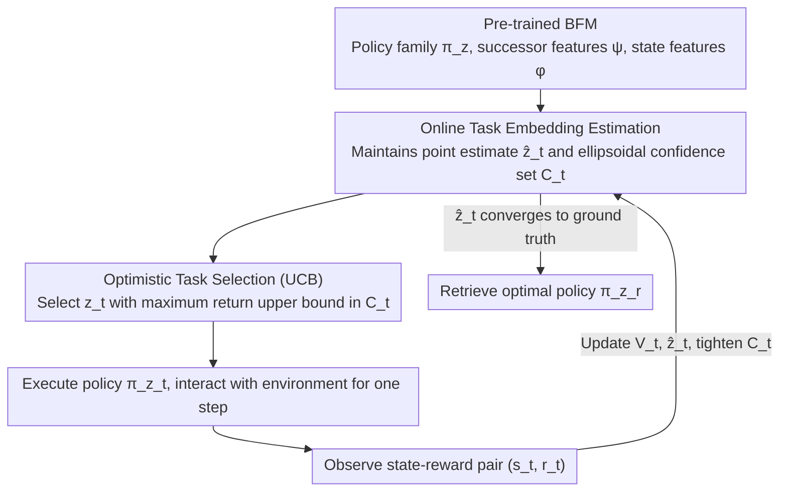

# Optimistic Task Inference for Behavior Foundation Models

**Conference**: ICLR 2026 Oral  
**arXiv**: [2510.20264](https://arxiv.org/abs/2510.20264)  
**Code**: [GitHub](https://github.com/ThomasRupf/opti-bfm)  
**Area**: Reinforcement Learning / Foundation Models / Zero-shot RL  
**Keywords**: behavior foundation models, task inference, zero-shot RL, successor features, UCB, linear bandits

## TL;DR
This paper proposes OpTI-BFM—a method for Behavior Foundation Models that, during test-time, does not require a complete reward function or labeled datasets. Instead, it infers tasks and recovers Oracle performance within just 5 episodes of environment interaction. The core idea leverages the linear structure of successor features to reduce task inference to a linear bandit problem, utilizing a UCB strategy for optimistic exploration with a formal regret bound.

## Background & Motivation
**Background**: Behavior Foundation Models (BFMs) achieve zero-shot RL based on Universal Successor Features (USFs). During pre-training, they learn a family of policies $(\pi_z)_{z \in \mathcal{Z}}$; at test time, given a reward function $r$, the optimal policy $\pi_{z_r}$ can be immediately retrieved.

**Limitations of Prior Work**: 
   - Standard task inference (Eq. 4) requires computing $z_r = \text{Cov}(\phi)^{-1} \mathbb{E}[\phi(s) r(s)]$ on an inference dataset $\mathcal{D}$, which necessitates (i) access to an inference dataset and (ii) reward labels for every state.
   - Pre-training data might be unavailable or private; labeling rewards from pixels is expensive.
   - Existing methods (e.g., FB) default to using 50K labeled samples for task inference.

**Key Challenge**: The zero-shot policy retrieval of BFMs is computationally efficient (requiring only one linear regression) but data-inefficient for labeling (requiring massive labeled data for task inference).

**Core Idea**: Transform task inference from offline regression to online interaction—utilizing the linear structure of successor features $V^{\pi_z}(s) = z^\top \psi^{\pi_z}(s)$ to reduce policy selection to a linear bandit problem, employing a UCB strategy for optimistic exploration in the task embedding space.

## Method

### Overall Architecture
OpTI-BFM aims to solve the following: given a pre-trained BFM (providing a policy family $\pi_z$, successor features $\psi$, and state features $\phi$), identify the task embedding $z_r$ corresponding to the current task through a few environment episodes without a reward function or labeled dataset, thereby retrieving the optimal policy. The entire test-time process is a closed loop: the algorithm maintains a posterior estimate $\hat{z}_t$ of $z_r$ and an ellipsoidal confidence set $\mathcal{C}_t$. At each step, an "optimistic" task embedding $z_t$ is selected from the confidence set (the one with the highest predicted return under the upper bound of uncertainty). The corresponding policy $\pi_{z_t}$ is executed, and observed state-reward pairs $(s_t, r_t)$ are collected to update the estimates. This continues until $\hat{z}_t$ converges to the ground truth task. Crucially, successor features ensure that values remain linear over task embeddings $V^{\pi_z}(s) = z^\top \psi^{\pi_z}(s)$, which precisely transforms the "policy selection" problem into a linear bandit.

### Key Designs

**1. Online Task Embedding Estimation: Replacing "Labeled Dataset Regression" with Incremental Least Squares**

Standard BFM inference calculates $z_r$ at once on an offline dataset $\mathcal{D}$, assuming every state has a reward label—a practical bottleneck. OpTI-BFM uses an incremental approach: each step yields a new $(s_t, r_t)$ pair to update a regularized least squares estimate $\hat{z}_t = V_t^{-1} \sum_{i=0}^t \phi(s_i) r_i$, where the covariance matrix $V_t = \lambda I_d + \sum_{i=0}^t \phi(s_i) \phi(s_i)^\top$ accumulates features. Around this point estimate, the algorithm maintains an ellipsoidal confidence set $\mathcal{C}_t = \{z : \|z - \hat{z}_t\|_{V_t} \leq \beta_t\}$, where the Mahalanobis distance induced by $V_t$ characterizes uncertainty directions. The ellipsoid tightens in explored directions and remains wide in unexplored ones. Thus, task inference no longer depends on pre-stored data but converges online via interaction.

**2. Optimistic Task Selection (UCB): Driving Exploration with Confidence Bounds**

With a confidence set established, the next step is determining which policy to execute. OpTI-BFM adopts the optimism principle, selecting $z_t = \arg\max_{z \in \mathcal{C}_t} \psi^{\pi_z}(s_t)^\top z$—finding the task embedding within the confidence set that maximizes predicted returns. High uncertainty in a direction leads to a wider confidence set, prompting the optimistic selection to sample it (exploration). As the estimate tightens, the optimistic value nears the true optimum, and the algorithm shifts to exploiting the estimated optimal policy. A subtle distinction from classic linear bandits is the use of two "contexts": $\phi$ for regression and confidence intervals, and $\psi$ for the acquisition function. Using raw $\phi$ for regression yields tighter estimates than using $\psi$ directly.

**3. Regret Bound: Theoretical Guarantees via LinUCB**

Since inference is reduced to a linear bandit, OpTI-BFM inherits theoretical tools from that domain. The paper proves that for a perfectly trained BFM (accurate successor features, optimal policies, and rewards within the linear span of features), the cumulative regret after $n$ episodes satisfies $R_n = \tilde{O}(\sqrt{n \cdot d})$, where $d$ is the task embedding dimension. This sub-linear growth relative to interaction counts and its scaling with the square root of dimensions provides a formal basis for the sample efficiency of optimistic exploration.

**4. Thompson Sampling Variant (OpTI-BFM-TS): Bypassing Optimization via Posterior Sampling**

While the UCB version solves an $\arg\max$ optimization at each step, OpTI-BFM-TS provides a simpler alternative: sampling $z_t \sim \mathcal{N}(\hat{z}_t, \beta_t V_t^{-1})$ from the posterior distribution. This implementation avoids explicit optimization but typically shows slightly lower performance—notably on Cheetah—making it a lightweight alternative rather than the primary solution.

### Loss & Training
- Pre-training: Uses the standard Forward-Backward (FB) framework.
- Test-time Inference: Purely online, no additional training required. Only $V_t$ and $\hat{z}_t$ (matrix-vector operations) are updated at each step.
- Computational Overhead: Approximately 5× slower than pure policy inference (Table 1), but absolute time remains minimal.

## Key Experimental Results

### Main Results (DMC Walker/Cheetah/Quadruped, 4 tasks each)

| Method | Episodes to recover Oracle performance | Labeling Requirements |
|------|---------------------------|---------|
| Oracle (Offline Inference) | — | 50K labeled samples |
| **OpTI-BFM** | **~5 episodes (5K steps)** | **5K online rewards** |
| OpTI-BFM-TS | ~8 episodes | 8K online rewards |
| LoLA (Black-box search) | ~30+ episodes | 30K+ |
| Random | Does not converge | — |

OpTI-BFM matches the performance of offline inference (which requires 50K labels) using 10x fewer labels.

### Ablation Study

| Configuration | Effect | Description |
|------|------|------|
| Step-wise vs. Episode-wise updates | Step-wise converges faster | Episode-wise has theoretical guarantees |
| OpTI-BFM vs. RND (Task-agnostic) | OpTI-BFM is more efficient | Value of task-aware exploration |
| OpTI-BFM vs. Random baseline | Active data outperforms passive | Validates importance of active collection |
| Non-stationary rewards (decay $\rho < 1$) | Successfully tracks changing rewards | Requires appropriate forgetting factor |
| Warm-start ($n$ offline samples) | Initial performance improves with $n$ | Compatible with offline data |

### Key Findings
- Oracle performance is recovered in all environments and tasks within 5 episodes—a result of fully utilizing the BFM's linear structure.
- LoLA (black-box search) converges slower by ignoring linear structure, highlighting the value of structure-aware exploration.
- OpTI-BFM handles non-stationary rewards (via forgetting factor $\rho$) and warm-starts (via offline initialization) naturally.
- Computational overhead is manageable (~5×), with the bottleneck being environment interaction rather than inference itself.

## Highlights & Insights
- **Eliminating the BFM Bottleneck**: Previous BFM "zero-shot" capabilities required 50K labeled samples for task inference, severely limiting deployment. OpTI-BFM reduces this to ~5K online samples without pre-stored data.
- **Elegant Theoretical Link**: Precision reduction of BFM task inference to linear bandits allows the use of established tools (regret bounds, elliptical confidence sets, elliptical potential lemma).
- **Versatile Interface**: OpTI-BFM supports three modes—purely online without priors, warm-start with offline data, and non-stationary reward tracking—making it a unified framework for BFM deployment.

## Limitations & Future Work
- Dependent on the linear Successor Feature (SF) structure—non-linear rewards lack theoretical guarantees.
- Theoretical analysis assumes a perfectly trained BFM; how approximation errors propagate requires further study.
- Regret bounds cover episode-level updates, but step-level updates perform better in practice (theory-practice gap).
- Validated only in DMC environments; higher-dimensional visual scenes remain untested.
- The dimension $d$ of task embedding space $\mathcal{Z}$ affects regret; high-dimensional scenarios may require more exploration.

## Related Work & Insights
- **vs. Standard BFM Task Inference (FB)**: Requires 50K labeled samples + pre-stored dataset; OpTI-BFM needs only 5 episodes of online interaction.
- **vs. LoLA (Sikchi 2025)**: Black-box policy search that ignores linear structure, resulting in 6×+ slower convergence.
- **vs. LinUCB (Abbasi-Yadkori 2011)**: Theoretical foundation for OpTI-BFM, extended here to a new setting using different contexts for regression and acquisition.

## Rating
- Novelty: ⭐⭐⭐⭐⭐ The link between BFM task inference and linear bandits is elegant and solves the core practical bottleneck.
- Experimental Thoroughness: ⭐⭐⭐⭐ Standard benchmarks plus extensive ablations (non-stationary, warm-start, efficiency).
- Writing Quality: ⭐⭐⭐⭐⭐ Clear theoretical motivation and smooth transition from intuition to formal derivation.
- Value: ⭐⭐⭐⭐⭐ Deserving of the ICLR Oral, providing a significant boost to the practical deployment of BFMs.

<!-- RELATED:START -->

## Related Papers

- [\[ICLR 2026\] Task Tokens: A Flexible Approach to Adapting Behavior Foundation Models](task_tokens_a_flexible_approach_to_adapting_behavior_foundation_models.md)
- [\[ICLR 2026\] Zero-Shot Adaptation of Behavioral Foundation Models to Unseen Dynamics](zero-shot_adaptation_of_behavioral_foundation_models_to_unseen_dynamics.md)
- [\[ICLR 2026\] Efficient Estimation of Kernel Surrogate Models for Task Attribution](efficient_estimation_of_kernel_surrogate_models_for_task_attribution.md)
- [\[ICLR 2026\] ARM-FM: Automated Reward Machines via Foundation Models for Compositional Reinforcement Learning](arm-fm_automated_reward_machines_via_foundation_models_for_compositional_reinfor.md)
- [\[ICLR 2026\] Off-Policy Safe Reinforcement Learning with Constrained Optimistic Exploration](off-policy_safe_reinforcement_learning_with_cost-constrained_optimistic_explorat.md)

<!-- RELATED:END -->
