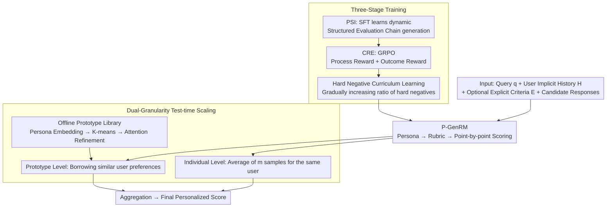

# P-GenRM: Personalized Generative Reward Model with Test-time User-based Scaling

**Conference**: ICLR 2026 Oral  
**arXiv**: [2602.12116](https://arxiv.org/abs/2602.12116)  
**Code**: [GitHub](https://github.com/Tongyi-ConvAI/Qwen-Character/tree/main/Character-GenRM)  
**Area**: Reinforcement Learning  
**Keywords**: Personalized Reward Model, Generative Critique, Structured Evaluation Chain, Test-time Scaling, Collaborative Filtering

## TL;DR

Ours proposes P-GenRM, the first personalized generative reward model. Through three-stage training (PSI supervised fine-tuning to build structured evaluation chains → CRE reinforcement learning to enhance reasoning under missing preferences → hard negative curriculum learning to improve robustness), mixed preference signals are transformed into scenario-adaptive user personas and scoring rubrics. By introducing dual-granularity test-time scaling (individual-level multi-sampling aggregation + prototype-level collaborative filtering leveraging similar user preferences), it outperforms the Prev. SOTA by 2.31% on PersonalRewardBench, achieves an additional 3% Gain via test-time scaling, and generalizes to unseen users.

## Background & Motivation

**Background**: RLHF is the mainstream paradigm for LLM alignment, with the reward model at its core—providing scoring signals to guide the policy model's output. As applications move from "general value alignment" toward "personalized alignment," reward models must capture every user's unique preference standards rather than learning a single set of global human preferences.

**Limitations of Prior Work**: Existing personalized reward methods face two fundamental problems. First, **static preference modeling**—simplifying dynamic, scenario-dependent user preferences into a set of fixed rules. However, the same user may have different preferences in different scenarios (e.g., wanting short answers while driving but detailed discussions when chatting). Fixed rules fail to cover these variations. While SynthesizeMe infers synthetic personas from historical preferences, its personas are static and do not adjust per scenario once generated. Second, **difficulty in generalizing to new users**—historical interactions are extremely sparse in cold-start scenarios, making it difficult for existing methods to build reliable reward signals from limited feedback. Methods like GPO, VPL, and PAL all require sufficient user data to function.

**Key Challenge**: Personalized rewards require a fine-grained understanding of user preferences, yet preference signals are naturally sparse and noisy—explicit preferences ("I like a concise style") are rarely provided actively, while implicit preferences (interaction history) are abundant but noisy. How can scenario-adaptive evaluation standards be reliably inferred from such mixed signals? How can reasonable scores be provided even when user information is minimal?

**Key Insight**: A Generative Reward Model (GenRM) does not just output a single score; it generates a complete evaluation chain—including user persona inference, scoring rubric formulation, and a point-by-point scoring process. This offers three advantages: (1) the generation process itself performs reasoning, allowing for dynamic adaptation to different scenarios; (2) the evaluation chain is textual and naturally interpretable; (3) it allows for multi-sampling and aggregation at test time, similar to LLM test-time compute scaling. The authors further draw on the idea of collaborative filtering from recommendation systems—similar users have similar preferences—clustering users into prototypes to allow new users to obtain reliable scores through prototype transfer.

**Core Idea**: Use a generative reward model to transform mixed preference signals into scenario-adaptive evaluation chains, and reduce noise while enhancing generalization through dual-granularity test-time scaling at both the individual and prototype levels.

## Method

### Overall Architecture

P-GenRM aims to solve the problem: how to enable the reward model to understand "what this specific user wants in this specific scenario" and provide reliable scores even with minimal user information. Its inputs include the current query $q_t$, the user's implicit preference history $H_t^{(u)}$ (chosen/rejected response pairs from several interaction rounds), optional explicit preference criteria $E^{(u)}$, and candidate responses to be scored. Unlike traditional reward models that directly output a scalar, P-GenRM outputs a complete Structured Evaluation Chain (SEC): first inferring the user's persona in the current scenario, then deriving a weighted scoring rubric from the persona, and finally scoring the candidate responses point-by-point to aggregate into a final score.

The entire pipeline is divided into two parts. On the **training side**, the model is developed through three progressive stages: PSI uses supervised fine-tuning to teach the model to generate evaluation chains dynamically by scenario; CRE uses reinforcement learning to turn "format writing" into "genuine reasoning"; and hard negative curriculum learning refines the model to distinguish between responses of similar quality that do not match the user's taste. On the **inference side**, dual-granularity test-time scaling is overlaid to further reduce noise and address cold starts—averaging multiple samples for the same user (individual level) and filling information gaps by borrowing preferences from similar users (prototype level), the latter relying on an offline-clustered user prototype library.

### Key Designs

The first three points address specific challenges in the three-stage training, while the fourth point covers dual-granularity scaling during inference.

**1. PSI: Embedding "Persona Inference" into the generation process to make evaluation criteria scenario-dynamic**

The Persona-guided Scoring Induction (PSI) stage addresses the issue that "the model initially cannot generate structured evaluation chains." The authors first use strong models like o3 to construct the SEC dataset: given a user's implicit history and explicit criteria, the strong model infers a scenario-aware persona, derives preference dimensions and weights for that scenario, and provides results after point-by-point scoring. Rejection sampling is used to filter out low-quality samples before performing SFT. The key is not just "generating a persona," but that the persona is **dynamically generated**—the same user will have different personas and scoring rubrics inferred under different queries, rather than a single static persona generated once and placed in the prompt as in SynthesizeMe. This choice is evidence-based: preliminary experiments (Table 6) show that user personas as preference priors provide the largest Gain in scoring accuracy (+1.6%), exceeding other signals like self-descriptions or demographics; making persona inference part of the generation process allows the model to adjust flexibly to the current scenario.

**2. CRE: Using dual signals of process reward + outcome reward to force the model to learn reasoning even without explicit preferences**

Relying solely on SFT imitation often leads the model to learn "templated" evaluation chains—the format is correct, but the reasoning is empty. The Criteria-based Reasoning Enhancement (CRE) stage is based on GRPO, applying two rewards to the evaluation chain: the process reward $PR_t$ is assessed by an LLM judge to see if the generated evaluation chain covers the user's true preference dimensions, taking a continuous value of 0-1; the outcome reward $OR_t$ checks if the final scores correctly rank the chosen/rejected responses, giving 1 for correct, 0 for incorrect, and a $-0.1$ penalty for format errors. The total reward is:

$$R_t = \alpha \cdot PR_t + \beta \cdot OR_t,\quad \alpha=0.5,\ \beta=1.0$$

During training, the model is intentionally fed limited historical interactions without explicit preferences, forcing it into a situation where it must "infer preferences from sparse signals." Process rewards ensure the evaluation chain covers the correct dimensions, while outcome rewards ensure the final ranking is correct—消融实验 (ablation study) shows that removing either significantly degrades performance, proving both are indispensable.

**3. Hard Negative Curriculum Learning: Feeding response pairs with "similar quality but mismatching user taste" from easy to hard**

Personalized scoring is inherently subjective; the difficulty often lies not in "which response is high quality" but in "which of two similar-quality responses better fits this user's unique preference." The curriculum learning stage gradually increases the proportion of "hard negatives" in training—these are responses with similar quality that do not match the specific user's preference. To allow more exploration space for hard samples, the process reward $PR_t$ is removed in this stage, leaving only the outcome reward $OR_t$. Robustness is improved by letting the model transition from simple to difficult distinctions.

**4. Dual-Granularity Test-time Scaling: Individual multi-sampling + Prototype borrowing to simultaneously reduce noise and address cold starts**

The trained model still has two weaknesses in single-shot inference: persona/rubric inference from a single sample inevitably carries noise, and cold-start users have too little history. Two granularities are used together during inference. **Individual-level** scaling involves parallel sampling $m$ times for the current query, with each inference producing slightly different personas and scoring rubrics; the average of multiple plans is taken—essentially performing multi-hypothesis exploration in the preference inference space to suppress single-shot noise. **Prototype-level** scaling applies the collaborative filtering assumption that "similar users have similar preferences" to RLHF: first, each user's persona $P_t^{(u)}$ across scenarios is vectorized using Qwen3-Embedding-0.6B and concatenated into a cross-scenario preference embedding matrix $\mathbf{P}$. K-means clusters these into $k$ prototypes, which are refined through prototype-augmented attention (attention-weighted aggregation of history + discriminative loss to distinguish chosen/rejected + two regularization terms to prevent excessive drift; PCA shows 50 prototypes cover most preference variance). During scoring, the closest prototype is found based on the user preference embedding, $n$ most similar users are selected, and the model generates $n$ additional sets of scores based on their histories, which are finally aggregated with individual-level results. Quality is more important than quantity here—Ind-16+Pro-8 outperforms purely stacking individual sampling (Ind-32), but a Pro value that is too large (Pro-16) introduces inconsistent noisy preferences and performance drops; cold-start users benefit most from prototype transfer.

### Loss & Training

The three stages are: (1) PSI stage uses standard SFT cross-entropy loss; (2) CRE stage uses the GRPO objective with total reward $R_t = 0.5 \cdot PR_t + 1.0 \cdot OR_t$, including KL regularization to prevent drifting too far from the reference policy; (3) Curriculum Learning stage follows the GRPO framework but removes $PR_t$, keeping only $OR_t$, and gradually increases the ratio of hard negatives. The offline prototype optimization stage uses a discriminative pairwise loss:

$$\mathcal{L}_{\text{pair}} = -\log\sigma(z_t^\top y_t^{+} - z_t^\top y_t^{-})$$

along with center regularization and temporal smoothing regularization.

## Key Experimental Results

### Main Results—Comparison on PersonalRewardBench

| Method | Model | Chatbot Arena | PRISM |
|------|------|:---:|:---:|
| Default (LLM-as-Judge) | 8B | 56.37% | 52.04% |
| + Preference History | 8B | 58.53% | 56.24% |
| + SynthesizeMe | 8B | 61.07% | 54.70% |
| GPO | 8B | 57.87% | 57.29% |
| VPL | 8B | 58.12% | 58.25% |
| FT RM + SynthesizeMe | 8B | 69.78% | 62.84% |
| **P-GenRM** | **8B** | **72.68%** | **65.32%** |
| **P-GenRM + Ind-16,Pro-8** | **8B** | **75.92%** | **68.06%** |
| FT RM + SynthesizeMe | 70B | 72.05% | 63.74% |
| P-GenRM | 70B | 73.42% | 66.21% |
| o3 + PSI | — | 69.14% | 63.87% |

P-GenRM-8B outperforms the Prev. SOTA (FT RM + SynthesizeMe-70B) by an average of 1.04%, with an additional ~3% Gain after adding test-time scaling. The 8B model even surpasses the 70B level SynthesizeMe.

### Ablation Study

| Config | Chatbot Arena | PRISM | Description |
|------|:---:|:---:|------|
| P-GenRM (Full) | 72.68% | 65.32% | Full Model |
| w/o CL | 71.07% | 63.82% | Remove Curriculum Learning, drop 1.5-1.6% |
| w/o CL, PR | 70.22% | 62.70% | Remove Process Reward further, drop 0.8-1.1% |
| w/o CL, OR | 69.05% | 60.94% | Removing Outcome Reward drops more than Process Reward |
| w/o CL, RL | 66.76% | 57.08% | Removing entire RL stage drops 6-8% |
| w/o CL, RL, SFT | 56.37% | 52.04% | Degenerates to baseline LLM-as-Judge |

### Test-time Scaling Detailed Analysis

| Scaling Config | Chatbot Arena | PRISM |
|------|:---:|:---:|
| P-GenRM (No scaling) | 72.68% | 65.32% |
| + Ind-8 | 73.61% | 65.79% |
| + Ind-16 | 73.87% | 66.66% |
| + Ind-32 | 75.59% | 67.65% |
| + Ind-8, Pro-4 | 74.30% | 67.54% |
| **+ Ind-16, Pro-8** | **75.92%** | **68.06%** |
| + Ind-0, Pro-8 | 66.90% | 57.65% |
| + Ind-16, Pro-16 | 72.59% | 64.61% |

### Key Findings

- **RL is the largest contributor**: Removing all RL stages leads to a 6-8% drop, indicating that SFT alone is insufficient to mimic evaluation chains; outcome rewards are more critical than process rewards.
- **Prototype-level scaling helps new users most but is not "the more the better"**: Ind-16+Pro-8 is the optimal configuration (24 total inferences), but Pro-16 performs worse than Pro-8—too many similar users introduce noisy preferences inconsistent with the target user.
- **Pure prototype scaling is insufficient**: Ind-0+Pro-8 drops to 66.90%/57.65%, far below the baseline without scaling, indicating that the individual's own preferences must remain the primary subject of scoring.
- **Dynamic Persona vs. Static Persona**: Under the LLM-as-Judge setting, PSI consistently outperforms SynthesizeMe on all base models (Qwen3-8B: +1.65/+1.68, o3: +1.41/+5.38), validating the necessity of scenario-adaptive personas.
- **Strong OOD Generalization**: In the LaMP-QA cold-start scenario, P-GenRM-8B surpasses the 235B Qwen3, proving the effectiveness of the prototype transfer mechanism for new users.
- **No bias towards majority groups**: Prototype-level macro accuracy (65.21%) is nearly identical to sample-level accuracy (65.32%, a 0.11% difference), showing that minority groups are not ignored under long-tail distributions.

## Highlights & Insights

- **Evaluation Chain = Debuggable Reward Signal**: Traditional reward models output a scalar, failing to explain "why this answer scored high." P-GenRM outputs a full reasoning process (Persona → Rubric → Point-by-point scoring), allowing users and developers to check if each step is reasonable, which is crucial for highly subjective personalized scoring.
- **Collaborative Filtering Crosses Over to RLHF**: The core assumption from recommendation systems that "similar users have similar preferences" has traditionally stayed within that field. This paper introduces it to reward models—solving cold-start problems through user prototype clustering and prototype-based transfer. This approach can migrate to any scenario requiring personalized evaluation (e.g., personalized summarization, personalized educational feedback).
- **"Quality" over "Quantity" in Test-time Scaling**: Simply increasing individual sampling (Ind-32) is less effective than mixing individual + prototype scaling (Ind-16+Pro-8), achieveing better results with fewer total inferences. This suggests that diversity (introducing perspectives of different users) is more valuable than redundancy (repeated sampling for the same user).
- **Logical Progression of Three-stage Training**: SFT for format and basic capability → RL for deep reasoning → Curriculum learning for distinguishing difficult samples. Each stage addresses specific bottlenecks on top of the previous one rather than simple stacking.

## Limitations & Future Work

- **Manual Selection of Prototype Count**: Currently, 50 prototypes are determined via PCA variance analysis, lacking an adaptive mechanism. The optimal number of prototypes may vary significantly across different data distributions.
- **High Inference Cost**: The best configuration (Ind-16+Pro-8) requires 24 full generations per sample. Although the authors claim latency is lower than Prev. SOTA, it remains heavy for real-time dialogue scenarios.
- **Unmodeled Preference Drift**: User preferences evolve over time (short-term vs. long-term). The current framework performs random sampling from history without distinguishing recency, failing to capture preference trends.
- **Limited Evaluation Benchmarks**: Testing was primarily on PersonalRewardBench and LaMP-QA; validation in real product-level personalized dialogue systems is lacking.
- **Fixed Embedding Model for Prototype Refinement**: Qwen3-Embedding-0.6B is used for user embeddings, but whether this embedding truly captures "preference similarity" rather than "textual similarity" warrants investigation.

## Related Work & Insights

- **vs SynthesizeMe**: SynthesizeMe synthesizes static personas from historical preferences as prompts, whereas Ours' PSI generates scenario-adaptive personas dynamically during each scoring. Ours consistently outperforms SynthesizeMe across all base models, with the gap more pronounced in smaller models.
- **vs PAL/VPL/GPO**: These methods use latent variables or prototype mixtures to model user preferences, but all are based on traditional discriminative reward models (outputting scalars). P-GenRM uses a generative approach to output evaluation chains, naturally supporting test-time scaling and interpretability, which discriminative methods cannot achieve.
- **vs GenRM Series (Self-Principled Critique, etc.)**: Existing GenRM work focuses on general evaluation quality improvement without considering personalization. P-GenRM is the first to combine GenRM with personalized alignment, filling this gap.

## Rating
- Novelty: ⭐⭐⭐⭐⭐ First personalized GenRM + organic combination of collaborative filtering and RLHF; elegant dual-granularity test-time scaling design.
- Experimental Thoroughness: ⭐⭐⭐⭐⭐ Two benchmarks + OOD generalization + detailed ablation + scaling configuration analysis + macro accuracy fairness verification.
- Writing Quality: ⭐⭐⭐⭐ Clear overall structure, though many formulas/symbols; some expressions could be more concise.
- Value: ⭐⭐⭐⭐⭐ Personalized alignment is a core requirement for LLM deployment; P-GenRM provides an interpretable and scalable paradigm.
- Mechanism: ⭐⭐⭐⭐ Clear framework description.
- Value: ⭐⭐⭐⭐⭐ Significant promotion of LLM personalized alignment.

<!-- RELATED:START -->

## Related Papers

- [\[NeurIPS 2025\] Reinforcement Learning Teachers of Test Time Scaling](../../NeurIPS2025/reinforcement_learning/reinforcement_learning_teachers_of_test_time_scaling.md)
- [\[ICLR 2026\] R1-Reward: Training Multimodal Reward Model Through Stable Reinforcement Learning](r1-reward_training_multimodal_reward_model_through_stable_reinforcement_learning.md)
- [\[ICLR 2026\] GAS: Enhancing Reward-Cost Balance of Generative Model-assisted Offline Safe RL](gas_enhancing_reward-cost_balance_of_generative_model-assisted_offline_safe_rl.md)
- [\[ICLR 2026\] Representation-Based Exploration for Language Models: From Test-Time to Post-Training](representation-based_exploration_for_language_models_from_test-time_to_post-trai.md)
- [\[CVPR 2026\] MSRL: Scaling Generative Multimodal Reward Modeling via Multi-Stage Reinforcement Learning](../../CVPR2026/reinforcement_learning/msrl_scaling_generative_multimodal_reward_modeling.md)

<!-- RELATED:END -->
