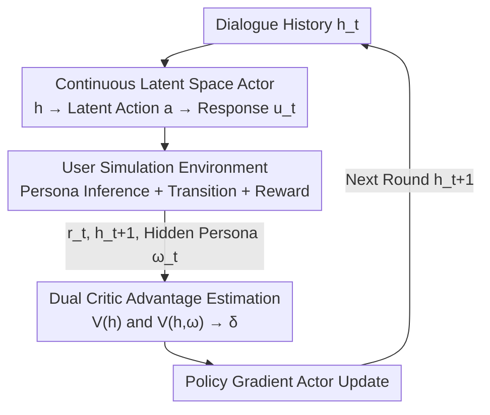

# PAMDP: Interact to Persona Alignment via a Partially Observable Markov Decision Process

**Conference**: ICLR 2026  
**OpenReview**: [https://openreview.net/forum?id=tNWZVoVPzZ](https://openreview.net/forum?id=tNWZVoVPzZ)  
**Code**: TBD  
**Area**: Reinforcement Learning / Alignment / Personalized Dialogue  
**Keywords**: Persona Alignment, POMDP, Dual Critic, Continuous Latent Action, Multi-turn Dialogue

## TL;DR
This paper models "gradual alignment to user persona during multi-turn interaction" as a Partially Observable Markov Decision Process (PAMDP) where user profiles are unobservable. It utilizes a lightweight Actor with continuous latent space actions and a "partial state + full state" dual Critic for unbiased advantage estimation, achieving higher alignment win rates and cumulative rewards on both offline datasets and online simulators.

## Background & Motivation

**Background**: Current mainstream LLM alignment practices involve SFT + RLHF, which pull models toward general human preferences such as "helpful, harmless, and honest" using a unified reward model.

**Limitations of Prior Work**: Human preferences are naturally heterogeneous—significant differences exist between user groups and individuals, and even a single user's preferences may shift subtly across different contexts. A single reward model tends to flatten preference diversity in multi-user data, causing the model to align only with "average preferences" rather than specific individuals. Directly providing user profiles, history, or behavioral data for personalization is often restricted by privacy, making it difficult to obtain sufficient user-specific data.

**Key Challenge**: Personalization that truly mirrors real dialogue is not about "reading a complete profile before answering," but rather "gradually uncovering and adapting to the user through rounds of interaction without knowing their full hand." Since user profiles are hidden from the assistant during deployment, this is essentially a **partially observable** problem that cannot be directly modeled with standard MDP or single-Critic RL.

**Goal**: To explicitly model the long-term objective of "interaction-based persona alignment" as a decision process and design an RL framework that utilizes hidden profiles during training while ensuring decision-making relies solely on dialogue history during deployment.

**Key Insight**: The authors draw inspiration from the asymmetric actor-critic paradigm in POMDPs (offline learning, online execution)—where profiles are visible during training (from data/simulators) but invisible during deployment. Thus, the Actor observes only dialogue history, while the Critic additionally sees the profile to improve value estimation during the training "look-ahead" phase without breaking deployability.

**Core Idea**: By treating the user persona $\omega$ as an unobservable environmental variable, the Bellman equation for PAMDP is derived. A dual Critic consisting of a "partial state value $V(h)$ + full state value $V(h, \omega)$" provides an **unbiased** estimation of the advantage function, optimized by an Actor using continuous latent space actions.

## Method

### Overall Architecture

The problem PAMDP addresses is: the assistant sees only the dialogue history $h_t=(q_0, u_0, \dots, q_t)$ and not the true user persona $\omega_t$. It must infer the persona through continuous interaction, gradually align responses to the user's true preferences, and maximize the discounted return $\sum_t \gamma^t r(h_t, \omega_t, u_t)$ of the dialogue trajectory.

The overall flow is a closed loop: The **Actor** reads the dialogue history $h_t$, encodes it into a low-dimensional continuous action vector $a$, and decodes (injects back into the LLM) it into the assistant's response $u_t$. The **Environment** (user) performs a state transition to $h_{t+1}$ based on $h_t$, $u_t$, and the hidden persona $\omega_t$, while emitting an immediate reward $r_t$. The **Dual Critic** estimates value using the partial state value $V_\phi(h)$ and full state value $V_\xi(h, \omega)$ to compute the advantage $\hat A = \delta(h, \omega, u)$. Finally, the Actor is updated via policy gradient $\nabla_\theta J = \mathbb{E}[\delta(h, \omega, u) \nabla_\theta \log \pi_\theta(u|h)]$. Through this cycle, the assistant's belief distribution over the user converges, making responses increasingly personalized.

### Key Designs

**1. PAMDP: Modeling Persona Alignment as a Partially Observable Decision Process**

This paper addresses the pain point that "user personas are unavailable during deployment but are critical latent variables driving preferences." The authors formalize dialogue personalization as a POMDP tuple $(S, H, U, \Omega, D(\omega))$, where $\Omega$ is the unobservable persona variable. The state is split into an observable part $s_o$ and an unobservable part $\omega$, with $h=s_o$ in dialogue scenarios (the dialogue history is the observable state). The assistant is the agent, the response $u_i$ (a sequence of tokens) is the action, and the user is the environment driving state transitions. The authors emphasize a fundamental constraint (Remark 1): the assistant can only infer a "plausible" persona $c_t=I(h_t) \neq \omega_t$ from history. This partial observability ensures that PAMDP **cannot be reduced to a standard MDP**. Based on the probabilistic graph of the "Persona Interaction Process," the Bellman equation for PAMDP is derived:

$$V(h)=\sum p(\omega|h)\sum \pi(u|h)\Big(r(h,\omega,u)+\gamma\sum p(h'|h,\omega,u)V(h')\Big),$$

where $V(h,\omega)$ is the persona-conditioned value, $Q(h,\omega,u)$ is the action value depending on both observable state and hidden persona, and $h'=h \oplus u \oplus q'$ is the new history after executing the action and receiving the user's next utterance. This step provides the theoretical foundation for all subsequent algorithm designs.

**2. Continuous Latent Space Actor: Replacing Token-Level Actions with a Lightweight Planner**

If the "entire response $u_i$" is treated directly as an action, the action space explodes with the number of tokens and vocabulary size, making value estimation and policy optimization intractable. The authors adopt a continuous action representation: the policy is defined as $u=F(q_\theta(a|h))$, where a pretrained LLM encodes the history $h$ to obtain hidden states, which are then dimensionally reduced to a low-dimensional action vector $a$:

$$q_\theta(a|h)=H(h)\times A_1,\quad A_1\in\mathbb{R}^{d\times d_a},\ d_a\ll d,$$

Then $F(\cdot)$ projects $a$ back to the LLM's native hidden dimension and injects it as an embedding, guiding the LLM to autoregressively generate a coherent response $u=F(a)=D(a\times A_2)$. Crucially, the action acquisition process **only takes dialogue history as input, not the persona $\omega$**—aligning with Remark 1 to force the policy to infer contextual clues through interaction while the true persona remains invisible to the policy during training. The Actor's loss is derived from policy gradients with KL regularization:

$$l_a=-\mathbb{E}[\delta(h,\omega,u)\log q_\theta(a|h)]+\lambda\,\mathrm{KL}(q_\theta(a|h)\,\|\,q_b(a|h)),$$

where $q_b$ is the initial policy distribution obtained via behavior cloning, ensuring coherent output after action mapping.

**3. Dual Critic Unbiased Advantage Estimation: Peeking at Personas without Introducing Bias**

Asymmetric A2C (UAAC / DCRL) utilizes hidden information by linearly combining $V(h)$ and $V(h, \omega)$, but the authors prove that such combinations result in **biased** advantage estimates. This paper utilizes a more concise dual Critic TD form for PAMDP advantage estimation (Theorem 2):

$$\hat A\triangleq\delta(h,\omega,u)=r(h,\omega,u)+\gamma V(h')-V(h,\omega),$$

The first term $r+\gamma V(h')$ captures the Markovian dynamics of the environment using the **partial state value** $V(h')$, while the second term $V(h,\omega)$ is the **full state value** quantifying the bias introduced by the persona. Theorem 3 proves that this is an unbiased estimate of the advantage $A$ in symmetric A2C: $\mathbb{E}_{\omega|h}[\hat A-A]=\mathbb{E}_{\omega|h}[V(h,\omega)-V(h)]=0$; whereas the bias of asymmetric A2C is $\mathbb{E}_{\omega|h}[A_{asy}-A]=\beta\gamma(V(h',\omega')-V(h'))\neq 0$. Implementation uses two scalar heads to estimate partial/full state values:

$$V_\phi(h)=v_m\cdot\sigma(H(h)\times B_1),\quad V_\xi(h,\omega)=v_m\cdot\sigma(H(h,\omega)\times B_2),$$

where $\sigma$ is tanh and $v_m$ is the maximum state value. The two Critics are optimized via regression using their respective TD targets $R(h, u)$ and $R(h, \omega, u)$. The combination of a "full-state Critic peeking at the persona" and a "partial-state Critic looking only at history" allows training to exploit hidden information while maintaining unbiasedness, marking a core theoretical advantage over UAAC/DCRL.

**4. Online User Simulation Environment and BC Initialization**

To train and evaluate "alignment through interaction" without human participants, the authors constructed an adaptive user environment using LLM prompts similar to PPDPP, consisting of three modules: **Profile Infer** (generates context-relevant persona descriptions from history $h$ to drive transitions and rewards), **User Simulator** (holds the full persona but selectively reveals details each round, responding to the assistant or initiating topics based on history), and **Reward Generator** (uses the same reward paradigm as offline data to score assistant responses against the current persona). The reward signal itself is scored by Qwen2.5-72B-Instruct: it generates a ground-truth response $u_g$, then determines which candidate response fits the current persona better, assigning $+1$ for the superior, $-1$ for the inferior, and $+0.5$ for ties. Before RL, Behavior Cloning (BC) is performed on offline expert trajectories to pretrain the Actor, providing a robust starting point.

### Loss & Training
- **Actor**: $l_a=-\mathbb{E}[\delta\log q_\theta(a|h)]+\lambda\,\mathrm{KL}(q_\theta\|q_b)$, policy gradient + KL regularization.
- **Dual Critic**: $l_c=\alpha_1\mathbb{E}\|V_\phi(h)-R(h)\|^2+\alpha_2\mathbb{E}\|V_\xi(h,\omega)-R(h,\omega)\|^2$, dual TD regression.
- **Initialization**: Behavior Cloning (BC) pretrains the Actor; base LLMs are Qwen2.5-7B / Llama3-8B.

## Key Experimental Results

### Main Results

In the offline setting across ALOE and PrefEval datasets, responses from various methods were compared against Vanilla base model outputs using Qwen2.5-72B-Instruct to calculate the success rate $r_w=\frac{N_w-N_l}{N_w+N_l+N_e}$ (ties are included in the denominator to dilute the impact of wins/losses).

| Dataset | Base | Metric | Ours | Strongest Baseline (BC) | Gain |
|--------|------|------|------|--------------------|------|
| PrefEval | Qwen2.5-7B | $r_w$ | **0.439** | 0.296 | +0.143 |
| ALOE | Qwen2.5-7B | $r_w$ | **0.1046** | 0.0901 (CoT) | +0.0145 |
| PrefEval | Llama3-8B | $r_w$ | **0.3776** | 0.3265 | +0.0511 |
| ALOE | Llama3-8B | $r_w$ | **0.2671** | 0.1945 | +0.0726 |

In the online setting, 256 users were sampled from ALOE for training and 128 for evaluation, with a maximum of 6 interaction steps. Cumulative rewards were recorded and compared with POMDP techniques UAAC and DCRL:

| Method | step 1 | step 3 | step 6 (Final) |
|------|--------|--------|----------------|
| UAAC | 0.1446 | 0.6636 | 1.5784 |
| DCRL | 0.1836 | 0.6419 | 1.4305 |
| **Ours** | **0.2265** | **0.7302** | **1.7389** |

The final round average reward was 1.7389, exceeding UAAC by 0.1605 and DCRL by 0.3084. Initial round leads (+0.0819 / +0.0429) indicate superiority even in single-turn Q&A.

### Ablation Study

| Configuration | Key Observation | Mechanism |
|------|---------|------|
| Prompt | Most ties with Vanilla | Persona prompts help understanding but have marginal impact on response quality |
| FPFT → CoT | CoT consistently superior (e.g., Qwen/PrefEval +0.0306) | Explicitly inferring the persona before answering deepens comprehension |
| BC Initialization | 0.1945/0.3265 on Llama | Expert trajectory warm-start provides a robust baseline for RL |
| Ours (Latent Action + Dual Critic) | Comprehensive outperformance | Latent space actions alleviate the high-dimensionality of text actions |

### Key Findings
- **Continuous latent space actions are critical for performance**: Projecting high-dimensional text actions into compact embeddings avoids computational intractability, directly contributing to outperforming all baselines.
- **BC warm-start value is evident**: Pretraining the Actor with supervised learning before RL provides a much steadier starting point than pure RL.
- **Alignment improves with interaction**: Cumulative rewards for all methods increase, but the gain amplification (0.6173) is highest for Ours, suggesting it "figures out" the user persona in fewer turns.

## Highlights & Insights
- **Reframing personalization as a "partially observable" problem**: Defining user personas as unobservable latent variables distinguishes this from standard single-Critic RLHF, providing a clean Bellman derivation and a self-consistent perspective.
- **Provable unbiasedness of the Dual Critic**: Rather than an engineering trick, the paper proves $\mathbb{E}_{\omega|h}[\hat A-A]=0$ and identifies the residual bias $\beta\gamma(V(h',\omega')-V(h'))$ in asymmetric A2C, making it theoretically more stable than UAAC/DCRL.
- **The "peek during training, hide during deployment" paradigm is transferable**: The asymmetric design (Actor sees history, Critic sees full state) can be applied to any dialogue or decision task where privileged information is available only during training.

## Limitations & Future Work
- **Heavy dependence on LLM judges and simulators**: Reward scoring, user simulation, and persona inference are all performed by LLMs (Qwen2.5-72B / prompts), potentially inheriting judge bias; human evaluation is missing.
- **Limited scale and base models**: Validated only on 7B/8B models with a few hundred personas; whether it remains unbiased and effective in larger models, longer dialogues, or real-world deployments is yet to be verified.
- **Weak interpretability of continuous latent actions**: Since actions are compressed into low-dimensional vectors before injection, it is difficult to audit what strategies the assistant has learned or directly measure the accuracy of persona inference.
- **Future directions**: Introduce explicit supervision for persona belief $c_t$ convergence, calibrate LLM rewards with small-sample human data, and extend Dual Critic to multi-objective/multi-constraint persona alignment.

## Related Work & Insights
- **vs RLHF (Single Reward Model)**: RLHF aligns to an average preference, smoothing out diversity; Ours treats the persona as a latent variable inferred through interaction, aligning to specific individuals.
- **vs Wu et al. (ALOE, Explicit Inference)**: They finetune LLMs on persona + multi-turn preference data to explicitly infer preferences; Ours does not treat persona inference as an explicit output but optimizes long-term alignment reward via RL while keeping the persona unobservable.
- **vs UAAC / DCRL (Asymmetric Actor-Critic)**: Both use full-state Critics for privileged information but combine advantages biasedly; the Dual Critic TD form in this paper is proven unbiased and outperforms them in online cumulative rewards.
- **vs PPDPP (Dialogue Policy Planner)**: PPDPP uses adjustable LLM plugins for proactive policy planning; Ours adopts its online simulation paradigm but places the strategy within a continuous latent action + dual Critic PAMDP framework.

## Rating
- Novelty: ⭐⭐⭐⭐⭐ First to model persona alignment as PAMDP with a theoretical proof for unbiased dual Critic advantage.
- Experimental Thoroughness: ⭐⭐⭐⭐ Extensive offline tests on two datasets/bases + online POMDP baseline comparisons, though scale is small and lacks human evaluation.
- Writing Quality: ⭐⭐⭐⭐ Complete derivations and clear theorems; notation-heavy, with some implementation details slightly brief.
- Value: ⭐⭐⭐⭐ The asymmetric alignment paradigm and unbiased dual Critic have high transferability.

<!-- RELATED:START -->

## Related Papers

- [\[ICLR 2026\] Solving General-Utility Markov Decision Processes in the Single-Trial Regime with Online Planning](solving_general-utility_markov_decision_processes_in_the_single-trial_regime_wit.md)
- [\[ICLR 2026\] Analysis of Approximate Linear Programming Solution to Markov Decision Problem with Log Barrier Function](analysis_of_approximate_linear_programming_solution_to_markov_decision_problem_w.md)
- [\[ICML 2025\] PIGDreamer: Privileged Information Guided World Models for Safe Partially Observable RL](../../ICML2025/reinforcement_learning/pigdreamer_privileged_information_guided_world_models_for_safe_partially_observa.md)
- [\[ICML 2025\] Learning Utilities from Demonstrations in Markov Decision Processes](../../ICML2025/reinforcement_learning/learning_utilities_from_demonstrations_in_markov_decision_processes.md)
- [\[ICLR 2026\] Reasoning Boosts Opinion Alignment in LLMs](reasoning_boosts_opinion_alignment_in_llms.md)

<!-- RELATED:END -->
