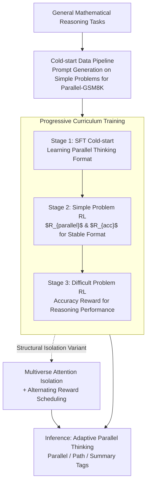

# Parallel-R1: Towards Parallel Thinking via Reinforcement Learning

**Conference**: ICLR 2026  
**OpenReview**: [https://openreview.net/forum?id=wOmjeBN6hP](https://openreview.net/forum?id=wOmjeBN6hP)  
**Code**: To be open-sourced (authors committed to release after cleaning)  
**Area**: LLM Reasoning / Reinforcement Learning  
**Keywords**: Parallel Thinking, Reinforcement Learning, Curriculum Training, Reward Design, Mathematical Reasoning

## TL;DR
Parallel-R1 proposes the first framework to inject "parallel thinking" capabilities into real-world mathematical reasoning tasks via reinforcement learning (RL) rather than pure SFT. By employing a progressive curriculum—"cold-start data generation via simple task prompts → SFT for format learning → simple-task RL for format stabilization → difficult-task RL for performance enhancement"—the framework bypasses cold-start challenges. Combined with alternating rewards, it outperforms sequential RL baselines by an average of 8.4% on AIME/AMC/MATH. Furthermore, it identifies that parallel thinking acts as a "mid-training exploration scaffold," yielding Gains up to 42.9%.

## Background & Motivation
**Background**: Parallel thinking refers to a model's ability to develop multiple independent reasoning branches concurrently and then synthesize them into a single conclusion. Part of Gemini's success on IMO is attributed to this capability. Currently, there are two main paths to activate this ability: inference-time strategies (self-consistency, ToT, MCTS, etc.), which only take effect temporarily during inference without "internalizing" the capability into the model; and training-time methods, which almost entirely rely on Supervised Fine-Tuning (SFT) on synthetic trajectories.

**Limitations of Prior Work**: SFT-based training methods suffer from three critical flaws: (i) reliance on expensive multi-stage pipelines to rewrite long CoTs into parallel trajectories; (ii) difficulty in bringing real performance gains beyond faster inference; (iii) imitation of known patterns via teacher-forcing rather than free exploration, leading to poor generalization as the model only replicates fixed routines.

**Key Challenge**: RL should be a more scalable route for discovering new reasoning behaviors through exploration. However, current autoregressive LLMs have never encountered parallel thinking trajectories during pre-training or SFT, making it impossible to produce such samples natively for RL. Consequently, RL requires a "cold-start" phase to seed this capability. Since high-quality parallel data for complex real-world problems is extremely scarce and difficult to synthesize, previous RL efforts for parallel thinking were restricted to narrow synthetic tasks like CountDown. Furthermore, reward design remains an open question: outcome-only rewards may lead the model to take shortcuts, while forced structural rewards might compel parallelization even where unnecessary.

**Goal**: To truly "teach" LLMs adaptive parallel thinking on general mathematical reasoning tasks via RL, and to understand how this capability evolves and why it is effective during training.

**Key Insight**: The authors observe that while lightweight prompting fails to generate compliant parallel trajectories for difficult problems like DAPO (0%), it is highly effective for simple problems like GSM8K (83.7%). Since cold-start data for simple problems can be obtained "for free," it can be used to learn the format first, followed by RL to migrate the capability to harder problems, thereby bypassing the need for synthetic data on difficult tasks.

**Core Idea**: Utilize a progressive curriculum of "seeding format on easy tasks + exploration and generalization via RL on hard tasks" to extend parallel thinking from synthetic tasks to real-world mathematical reasoning, treating parallel thinking as an exploration scaffold for RL.

## Method

### Overall Architecture
Parallel-R1 addresses the deadlock where autoregressive LLMs cannot initiate RL due to a lack of exposure to parallel thinking. The approach decomposes learning into three independent objectives—**learning the format, stabilizing behavior, and enhancing reasoning**—linked through an easy-to-hard curriculum. First, a lightweight data pipeline generates a cold-start corpus, Parallel-GSM8K, from simple problems. SFT is then applied to teach the model special tags for parallel thinking. This is followed by a small-scale RL phase on simple problems to stabilize the format. Finally, large-scale RL is performed on general difficult problems to improve reasoning performance. The trained model adaptively triggers parallel branches at "critical steps" during inference, summarizes them, and continues the main thread. The authors explore two variants: **Parallel-R1-Seen**, an autoregressive version without architectural changes, and **Parallel-R1-Unseen**, which uses a Multiverse attention mask to explicitly isolate paths.

### Key Designs

**1. Lightweight Cold-start Data Pipeline: Obtaining High-Quality Parallel Trajectories from Simple Problems**

Large-scale, high-quality parallel thinking corpora are nearly unobtainable for difficult problems. Previous methods relied on complex multi-stage pipelines to rewrite long CoTs, which essentially results in teacher-induced imitation samples, contradicting the goal of allowing RL to discover parallel thinking via exploration. The authors resolve this through a comparative experiment: using the same prompt template and sampling settings, DeepSeek-R1-0528-Qwen-3-8B naturally produces compliant parallel thinking formats in **83.7%** of samples on GSM8K, but **0.0%** on the harder DAPO. Thus, they focus on simple problems: they use this model to generate parallel thinking trajectories for 7,473 GSM8K training samples with detailed prompts. The non-thought portions are extracted as gold labels to form the cold-start corpus **Parallel-GSM8K**. For the structural variant requiring strict formatting, an additional Parallel Thinking Format Check (Algorithm 1) is applied. The value of this pipeline lies in solving the fundamental RL starting point bottleneck using the most affordable simple problems.

**2. Progressive Curriculum Training: Decoupling Format, Behavior, and Reasoning**

Directly performing RL on difficult problems places an excessive optimization burden on the model, as it must simultaneously discover parallel thinking behaviors and improve mathematical proficiency. Parallel-R1 splits training into three stages. **Cold-start stage**: SFT on Parallel-GSM8K to provide the model with basic parallel formatting capabilities. **Simple Problem RL**: Since special tags never appeared in pre-training and SFT behavior is unstable, a small-scale RL phase using GRPO is conducted on the same GSM8K task. The reward is defined as $R_{\text{final}} = R_{\langle\text{Parallel}\rangle}\,\&\,R_{\text{acc}}$, where +1 is given only if the output contains at least one parallel thinking unit **and** the final answer is correct; otherwise, -1. This strict binary reward forces the model to stabilize the parallel format. **Difficult Problem RL**: Large-scale RL is performed on DAPO. In this stage, only the accuracy reward $R_{\text{acc}}$ is used, as the goal shifts to purely enhancing reasoning performance, producing the primary variant Parallel-Seen. Ablations show that removing the simple task RL leads to an average 2.3% drop, while removing the cold-start SFT results in almost no activation of parallel behavior—each of the three stages is indispensable.

**3. Formalization and Control Tags for Parallel Thinking: Enabling Autonomous Branching**

Humans explore multiple candidate paths when encountering "critical steps" (confusion/uncertainty). The authors formalize this as a two-stage cycle: **Exploration**—the model pauses the main line upon identifying a critical step and generates $N$ independent reasoning branches; **Summary**—it aggregates all branches, extracts unique insights, resolves conflicts, and automatically resumes the main line with the injected conclusion. Implementation uses three sets of control tags: `<Parallel>…</Parallel>`, `<Path>…</Path>`, and `
…
`, corresponding to the exploration phase, isolation of independent paths, and aggregation. During inference, the model generates autoregressively; once `<Parallel>` is predicted, the main line pauses, multiple threads are generated concurrently within `<Path>` blocks, and upon completion, they are merged into `
` to resume the context. Unlike brute-force parallelization that branches at the start or at fixed intervals, the timing for branching and aggregation here is determined by the reasoning progress itself.

**4. Multiverse Structural Isolation and Alternating Rewards: Explicit Path Isolation and Balancing Parallelism**

The autoregressive variant Parallel-Seen does not explicitly isolate paths, allowing forward computations and gradients to interfere across paths. The structural variant Parallel-Unseen adopts Multiverse concepts, embedding inductive biases into the attention layers: **Attention Masks** restrict tokens within `<Path>` blocks to seeing only their own path and shared context, blocking information leakage between sibling paths; **Shared Position Encoding** assigns non-overlapping position indices to each path, allowing parallel paths to decode from the same position without interference while maintaining visibility of the shared `
` block for cross-path integration. The authors found that applying the Seen curriculum directly to the structural variant was ineffective (easy-task masks did not generalize to hard tasks). Thus, they removed Stage 2 RL for Unseen and redesigned the reward: using **Alternating Rewards (S2)**, within a fixed window of $W=10$ steps, 80% use pure accuracy rewards, while 20% use hierarchical rewards (+1.2 for correct answer with parallel units; +1.0 for correct answer without; -1.0 for incorrect). This provides a "calibrated" incentive for parallel thinking without letting it dominate training. Ablations confirm that pure accuracy rewards lead to only 13.6% parallelism, while pure parallel rewards hit 80.3% but suffer significant performance loss. The alternating strategy achieves the best balance at 63.0% parallelism.

### Loss & Training
The RL algorithm used is GRPO (Group Relative Policy Optimization). The rollout follows a multi-round interaction framework, alternating between "sequential generation ↔ parallel exploration ↔ sequential summary." The backbone is Qwen-3-4B-Base, implemented via the official VERL recipe without hyperparameter tuning. Cold-start SFT: batch 128, lr 1e-5, weight decay 0.01, cosine scheduler, warm-up ratio 0.1 (58 steps for Seen, 230 for Unseen). Simple Problem RL: batch 1024, 5 rollouts, lr 1e-6, 35 steps. Difficult Problem RL: 300 steps on DAPO, batch 512, 8 rollouts, lr 1e-6.

## Key Experimental Results

### Main Results
Evaluated on AIME25 / AIME24 / AMC23 using Mean@16 and Pass@16, and on MATH using Mean@1. The backbone is Qwen-3-4B-Base.

| Method | Parallel Rate | AIME25 (Mean@16) | AIME24 (Mean@16) | AMC23 (Mean@16) | MATH | Avg. |
|------|--------|------|------|------|------|------|
| Qwen3-4B-Base | 0.0 | 5.5 | 10.0 | 39.3 | 54.0 | 27.2 |
| GRPO (DAPO) | 0.0 | 14.8 | 18.5 | 63.6 | 83.5 | 45.1 |
| GRPO + RL on GSM8K | 0.0 | 13.3 | 18.8 | 66.4 | 82.6 | 45.3 |
| **Parallel-R1-Seen** | 27.3 | **19.2** | 19.4 | 70.5 | **86.7** | **48.9** |
| Parallel-R1-Unseen (S1) | 13.6 | 17.7 | 18.3 | 69.7 | 82.6 | 47.1 |
| Parallel-R1-Unseen (S2) | 63.0 | 19.0 | 16.3 | 67.5 | 84.5 | 46.8 |

Parallel-R1-Seen achieves an average score of 48.9, approximately 8.4% higher (relative) than the strongest sequential RL baseline (45.1), and ranks best on AIME25 and MATH. The autoregressive version generally performs better than the Multiverse version with explicit architectural changes, suggesting structural modifications impose a burden on RL training.

### Ablation Study

| Config | AIME25 | AIME24 | AMC23 | MATH | Avg. |
|------|--------|--------|-------|------|------|
| Parallel-R1-Seen (Full) | 19.2 | 19.4 | 70.5 | 86.7 | 48.9 |
| - w/o RL on GSM8K | 17.9 | 19.0 | 65.0 | 84.5 | 46.6 |
| Parallel-R1-Unseen (S1) | 17.7 | 18.3 | 69.7 | 82.6 | 47.1 |
| - w/ RL on GSM8K for Unseen | 14.4 | 12.9 | 52.3 | 74.4 | 38.5 |
| - w/o Parallel Thinking Prompt | 20.4 | 16.5 | 66.7 | 84.8 | 47.1 |

Reward ablation (under Unseen S2): Pure Accuracy resulted in 13.6% parallelism and higher Avg, but parallel behavior nearly disappeared. Pure Parallel increased parallelism to 80.3% but caused a significant performance drop. The alternating strategy at 63.0% parallelism achieved the best balance.

### Key Findings
- **Opposing Training Recipes for Autoregressive vs. Structural**: Removing simple task RL dropped Seen's average by 2.3%. However, adding the same simple task RL to the structural Unseen caused a sharp decline from 48.9 to 38.5, as the learned attention masks on easy tasks failed to generalize, over-fitting to surface patterns. The two variants require different training recipes.
- **Evolving Role of Parallel Thinking**: The relative position of the `<Parallel>` block shifts monotonically later in the sequence as training progresses. Early on, parallelization acts as high-variance "computational exploration" to discover solutions. As reasoning capability improves, it transitions into a risk-averse "multi-view verification" strategy following a high-confidence single path.
- **Exploration Scaffold (The Biggest Highlight)**: A two-stage curriculum was designed: Stage 1 (0–200 steps) uses alternating rewards to push exploration; Stage 2 (after 200 steps) switches back to pure accuracy rewards for exploitation. Even though the parallelism rate declined in Stage 2, AIME25 accuracy climbed to **25.6%**, which is **42.9%** higher than the GRPO sequential baseline. This indicates that the benefits of parallel thinking stem from pushing the policy into a superior region of the policy space during the exploration phase.
- **Diversity of Paths**: Within parallel blocks, pairwise BLEU (0.0627) and semantic cosine similarity (0.6083) are low, suggesting branches are not simple copies but truly distinct reasoning trajectories.

## Highlights & Insights
- **"If hard tasks lack data, don't synthesize data on hard tasks"**: The stark contrast of 83.7% vs 0.0% between GSM8K and DAPO allows cold-starting purely on easy tasks and migrating via RL. This is an elegant solution to the scarcity of parallel data in real tasks and can be applied to any scenario where the target behavior is difficult to label in complex tasks but easy to trigger in simple ones.
- **Parallel thinking as an "exploration scaffold" is a truly counter-intuitive insight**: The fact that performance improves even as parallelism rates drop implies that structural value can be "procedural"—it guides the policy to better regions mid-training before the structure itself becomes secondary. This redefines parallel thinking from an "inference structure" to an "RL exploration mechanism."
- **Alternating reward windows (80% accuracy / 20% hierarchical parallel)** are a practical trick for balancing structure vs. performance. Restricting behavioral rewards to a few steps and using hierarchical (+1.2/+1.0/-1.0) rather than binary incentives prevents the model from mindlessly inserting parallel blocks just for rewards.
- **The curriculum decomposition of learning format, behavior, and reasoning** serves as a generic reference for any RL reasoning task introducing a new output format inaccessible to the model's base.

## Limitations & Future Work
- The "mid-training scaffold" is explicitly described as preliminary evidence; the 200-step switch point is empirical, and the mechanism explanation (superior policy space region) remains a hypothesis.
- Experiments were validated only on the Qwen-3-4B-Base backbone and pure mathematical reasoning tasks (numeric answers). To avoid evaluation artifacts, LaTeX-heavy problems were filtered and response lengths capped at 3000. Generalization to code or open-domain tasks is only briefly touched upon in the appendix.
- The structural Multiverse variant has significantly higher training costs (~6 days vs ~3.5 days for Seen on 8×40GB) due to online 4D mask construction during RL rollouts. Its performance did not exceed the simpler autoregressive version, leaving the cost-benefit of structural isolation in question.
- Cold-start data generated by a single teacher model (DeepSeek-R1-0528-Qwen-3-8B) might bias the "style" of parallel thinking. The authors acknowledge that RL exploration needs to break through this teacher bias.

## Related Work & Insights
- **vs Multiverse (Yang et al., 2025b)**: Multiverse focuses on "losslessly" converting single long CoTs into adaptive parallel forms for efficiency, using offline pre-processed 4D masks. This study borrows the attention mechanism for the Unseen variant but emphasizes "discovering new reasoning via RL" with online mask construction. The advantage here is the emergence of new behaviors; the disadvantage is the higher training cost for structural variants.
- **vs Parallel RL on CountDown (Pan et al., 2025)**: Previous parallel thinking via RL was validated only on synthetic tasks; this is the first to extend it to real-world mathematical reasoning.
- **vs Inference-time Parallel Strategies (ToT / MCTS / self-consistency / Group Think)**: Those methods rely on manual heuristics or external verifiers during inference; this work "learns" the timing of adaptive branching/aggregation into the model weights.
- **vs RLVR Pipelines (DeepSeek-R1, etc.)**: Standard RLVR cannot directly inject parallel thinking as autoregressive models do not naturally produce such trajectories. This work represents the first attempt to extend RLVR to parallel thinking.

## Rating
- Novelty: ⭐⭐⭐⭐⭐ First framework to inject parallel thinking into real math reasoning via RL; the "scaffold" perspective is truly novel.
- Experimental Thoroughness: ⭐⭐⭐⭐ Solid across four benchmarks with extensive ablations and behavioral evolution analysis, though limited to a single backbone and domain.
- Writing Quality: ⭐⭐⭐⭐⭐ Clear derivation of motivation, well-organized explanation of the difficulties of RL, cold-start solutions, and reward design.
- Value: ⭐⭐⭐⭐⭐ Progressive curriculum, alternating rewards, and exploration scaffold are all transferable takeaways for RL reasoning training.

<!-- RELATED:START -->

## Related Papers

- [\[ACL 2026\] DPEPO: Diverse Parallel Exploration Policy Optimization for LLM-based Agents](../../ACL2026/reinforcement_learning/dpepo_diverse_parallel_exploration_policy_optimization_for_llm-based_agents.md)
- [\[ICLR 2026\] J1: Incentivizing Thinking in LLM-as-a-Judge via Reinforcement Learning](j1_incentivizing_thinking_in_llm-as-a-judge_via_reinforcement_learning.md)
- [\[NeurIPS 2025\] PARCO: Parallel AutoRegressive Models for Multi-Agent Combinatorial Optimization](../../NeurIPS2025/reinforcement_learning/parco_parallel_autoregressive_models_for_multi-agent_combinatorial_optimization.md)
- [\[ICLR 2026\] R1-Reward: Training Multimodal Reward Model Through Stable Reinforcement Learning](r1-reward_training_multimodal_reward_model_through_stable_reinforcement_learning.md)
- [\[ICLR 2026\] RM-R1: Reward Modeling as Reasoning](rm-r1_reward_modeling_as_reasoning.md)

<!-- RELATED:END -->
