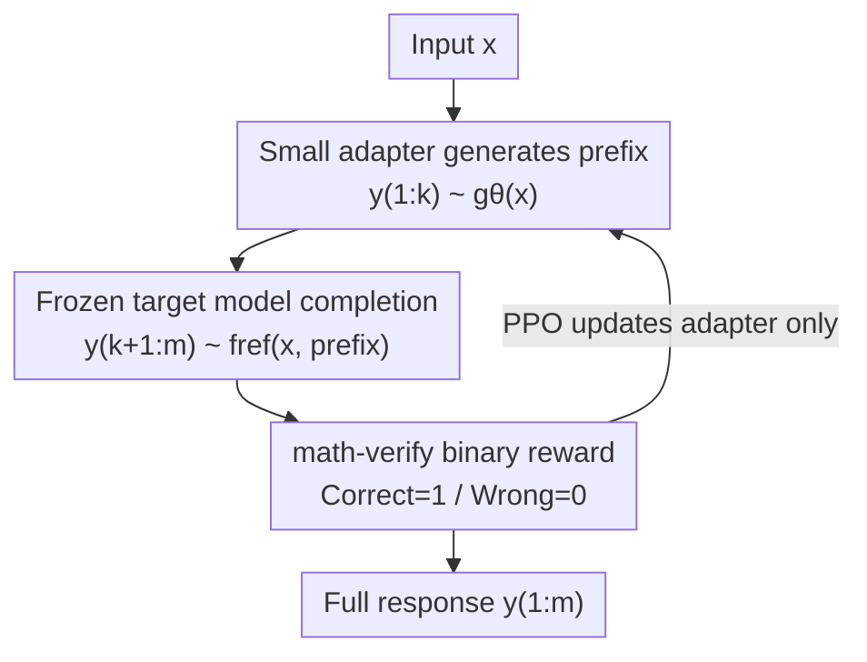

# Parameter-Efficient Reinforcement Learning using Prefix Optimization

**Conference**: ICLR 2026  
**OpenReview**: [https://openreview.net/forum?id=SLhLUdlaqc](https://openreview.net/forum?id=SLhLUdlaqc)  
**Code**: https://github.com/ItamarRocha/Prefix-RL  
**Area**: LLM Reasoning / Reinforcement Learning / Parameter-Efficient Fine-Tuning  
**Keywords**: RLVR, Prefix Optimization, Mathematical Reasoning, Parameter-Efficient, PPO

## TL;DR
This paper proposes optimizing only the first $k$ tokens (the prefix) of a response while delegating the subsequent generation to a frozen reference model. This demonstrates that a significant portion of RLVR gains in mathematical reasoning stems from "selecting a better problem-solving strategy/format." Based on this, a computationally efficient method, Prefix-RL, is derived: using a 1B adapter to generate prefixes that guide 7B~72B models. Training only the adapter improves Qwen-7B from 67.4% to 74.4% on MATH-500.

## Background & Motivation

**Background**: RLVR (Reinforcement Learning with Verifiable Rewards) is a mainstream approach to enhancing mathematical reasoning in LLMs. It involves generating solutions for a given problem and performing policy gradient fine-tuning (e.g., PPO) using a verifiable reward (binary signal for correct/incorrect answers). Most reasoning models achieve benchmark improvements through this pipeline.

**Limitations of Prior Work**: A long-standing ambiguity remains: whether RLVR gains result from the model "actually learning to reason" (better arithmetic, better execution of proof steps, memorizing mathematical facts) or simply from RL shifting the output distribution toward "better-performing solution formats/strategies already present in the pre-training distribution." Recent works (Zhao et al. 2025; Yue et al. 2025) observed that models concentrate on specific generation formats after RL, suggesting the latter contributes significantly.

**Key Challenge**: If gains mainly come from "weighting existing good strategies" rather than "teaching new reasoning skills," performing full-model RL fine-tuning is excessively expensive. Full-model RL requires reasoning rollouts and backpropagation through the entire model, where compute scales linearly with model size, often exceeding typical budgets for 70B-class models.

**Goal**: (1) Design an experiment to isolate the "strategy shifting" component and quantify its contribution to RL gains; (2) Convert this insight into a truly parameter-efficient RL alternative.

**Key Insight**: The "strategy and format" of a solution are almost entirely determined by the first few tokens—for instance, starting with `## Step 1: To...` implies a step-by-step reasoning path. By modifying only the first $k$ tokens and letting a reference model complete the rest, one can cleanly separate "strategy switching" from "reasoning enhancement." Since the vast majority of tokens come from the frozen reference model, any improvement is attributable solely to "choosing a better start."

**Core Idea**: Use "optimizing only the prefix" as a replacement for "optimizing the full sequence." This serves as both a diagnostic probe for RL gain sources and a parameter-efficient RL method that decouples training costs from the target model size.

## Method

### Overall Architecture
This paper narrows the optimization of the "entire response" to "only the first $k$ tokens of the response." Formally: given input $x_1,\dots,x_n$, a model $g_\theta$ generates the prefix $y_1,\dots,y_k \sim g_\theta(x)$. A frozen reference model $f_{\text{ref}}$ completes the remainder $y_{k+1},\dots,y_m \sim f_{\text{ref}}(x, y_{1:k})$ conditional on the input and prefix. A verifiable reward $r(\cdot)$ (1 for correct, 0 for incorrect) is calculated for the full sequence $y_{1:m}$.

Two paths are proposed for obtaining the prefix: **Prefix Clustering** (no training, sampling prefixes from the reference model, clustering them, and selecting a "globally fixed prefix" with the highest reward on the training set) and **Prefix-RL** (using a lightweight adapter to generate prefixes conditionally and training only the adapter via PPO while the target model remains frozen). The latter is the primary parameter-efficient method, as illustrated below:

### Key Designs

**1. Prefix Optimization Setup: Isolating RL Gains**
This methodological foundation addresses whether RL gains come from strategy switching or actual reasoning. Optimization is strictly limited to the first $k$ tokens ($k\in\{32,64\}$), with $y_{k+1:m}$ sampled from the frozen $f_{\text{ref}}$. Since the backbone weights are unchanged, any accuracy improvement must stem from "how the sequence starts" rather than "teaching the backbone new token-level skills." Experiments (Llama-1B self-prefix optimization vs. full-sequence RL) show that while full RL is highest, prefix optimization recovers a major portion of the accuracy gain, proving RL's benefit is largely about guiding the model to effective formats.

**2. Prefix Clustering: A Zero-Training Diagnostic Baseline**
This design answers whether a fixed opening can improve accuracy. The process is simple: sample outputs for the training set $D$, take prefixes of length $k=16$, perform k-means clustering into $c$ clusters (usually 5~6), and select the candidate prefix with the highest average reward:
$$i_{\max} = \arg\max_i\ \mathbb{E}_{x\sim D}\big[\,r\big(f_{\text{ref}}(x_1,\dots,x_n, y^{(i)}_{1},\dots,y^{(i)}_{k})\big)\,\big]$$
This **input-agnostic** fixed prefix $y^{(i_{\max})}_{1:k}$ is then prepended to all test queries. It acts as a probe for the "format shifting" effect: in Llama models, a fixed step-by-step start brings significant gains (+15.2 for Llama-70B-FP8 on AIME), whereas in Qwen, it often leads to performance drops (-8.0 on MATH-500), indicating Qwen's optimal starts are more input-dependent.

**3. Prefix-RL: Decoupling Training Cost from the Target Model**
The main method uses a small adapter $g_\theta$ (~1B) to generate the prefix for a larger target model $f_{\text{ref}}$. During rollout, $y_{1:k}\sim g_\theta(x)$ and $y_{k+1:m}\sim f_{\text{ref}}(x,y_{1:k})$. PPO optimizes only $g_\theta$ based on $r(y_{1:m})$. While PEFT methods like LoRA/QLoRA reduce updated parameters, RL gradients must still flow through the entire backbone. In Prefix-RL, backpropagation only occurs within the independent adapter, making **training compute independent of target model size**. Prefix-RL requires approximately $C_{\text{train}}N_a R k$ compute compared to $C_{\text{train}}N_t R T$ for standard RL (where $N_a \ll N_t$ and $k \ll T$). This allows fine-tuning 70B models with 8 GPUs (4 for training the adapter, 4 for serving the target), a 4x reduction compared to standard RL requirements.

### Loss & Training
The pipeline uses OpenRLHF and PPO with KL penalty $\beta=0.001$ and entropy reward $\alpha=-0.001$. Rollout temperature is 0.7 (vLLM), with batch sizes of 512 and 8 responses per query. Learning rates are 5e-7 (actor) and 9e-6 (critic). Rewards are binary correctness from `math-verify`. Adapters used include Llama-3.1-1B-Instruct or Qwen2.5-1.5B, while targets include Llama-3.1-8B/70B-FP8 and Qwen2.5-7B/72B.

## Key Experimental Results

### Main Results
Comparison of target models before and after prefix optimization (selection, relative gains in parentheses):

| Target Model | Method | MATH-500 | AIME | AMC23 | Minerva |
|----------|------|----------|------|-------|---------|
| Qwen-7B | Baseline | 67.4 | 23.0 | 40.3 | 19.1 |
| Qwen-7B | +Prefix-RL (k=32) | 74.4 (+7.0) | 25.8 (+2.8) | 50.0 (+9.7) | 22.4 (+3.3) |
| Qwen-7B | +Prefix Clustering (k=16) | 59.4 (−8.0) | 24.4 (+1.4) | 42.2 (+1.9) | 29.4 (+10.3) |
| Qwen-7B | +LoRA | 70.2 (+2.8) | 24.4 (+1.4) | 36.2 (−4.0) | 20.9 (+1.8) |
| Qwen-7B | +Prefix-Tuning (SFT) | 45.4 (−22.0) | 4.93 (−18.07) | 20.62 (−19.68) | 13.97 (−5.13) |
| Llama-70B-FP8 | +Prefix-RL (k=32) | 67.8 (+5.8) | 49.1 (+16.3) | 46.2 (+1.2) | 34.6 (+5.5) |
| Qwen-72B | +Prefix-RL (k=32) | 84.0 (+2.0) | 40.6 (−0.5) | 66.6 (+9.7) | 29.0 (+5.9) |

### Ablation Study

| Configuration | Key Phenomenon | Description |
|------|---------|------|
| Prefix Clustering | Inconsistent | Strong for Llama, poor for Qwen; useful only as a probe. |
| LoRA (RL) | Unstable Gains | MATH +2.8, but AMC23 -4.0; requires full backbone backprop. |
| Prefix-Tuning (SFT) | Performance Collapse | -22.0 on MATH-500; continuous vector SFT fails for this task. |
| Prefix Length $k$ | Robust $k\geq4$ | $k=1$ drops on OOD tasks; $k\in\{4{-}64\}$ shows consistent gains. |
| OOD Physics | Transferable | Prefixes trained on MATH improve performance on physics (OCW). |

### Key Findings
- **Format Shifting is a Major Driver**: Prefix-only optimization recovers most of the full RL gain (7/10 points on Qwen-7B), proving RL's benefit is often about selecting strategies rather than enhancing base reasoning.
- **Prefix-RL Outperforms PEFT Baselines**: LoRA and Prefix-Tuning (SFT) show weak or negative gains while requiring higher training costs.
- **Significant Gains on Quantized Models**: Prefix-RL on Llama-70B-FP8 significantly improves AIME performance (+16.3) and narrows the gap between quantized and full-precision models.
- **$k=1$ is Too Short**: A single token is insufficient to encode a complex strategy, causing drops in OOD performance.

## Highlights & Insights
- **Unified Diagnostic and Utility**: The "prefix-only" setting serves as both a scientific probe to isolate RL gain sources and a practical, compute-saving RL method.
- **Training Decoupling**: Unlike LoRA, which still requires backpropagation through the backbone during RL, Prefix-RL true training FLOPs are confined to the adapter, enabling 70B fine-tuning on consumer-level resources.
- **Frozen Backbone Benefits**: Zero risk of catastrophic forgetting, no alignment tax, no language drift, and the ability to apply RL to closed-source API-based models.
- **Guidance for Quantized Models**: Since quantized weights (FP8) cannot be directly updated via gradients, using a full-precision adapter to guide them provides a new optimization path for quantized models.

## Limitations & Future Work
- Prefix-RL is a compute-for-performance tradeoff and is not claimed to surpass full-model RL.
- The study is limited to single-pass generation and does not cover multi-pass reflective strategies (backtracking/revision).
- The adapter and target must belong to the same model family for effective guidance.
- Future work is needed to see if "prefix-determined strategy" holds for non-mathematical tasks like open-ended writing or multi-turn agents where strategies might shift mid-sequence.

## Related Work & Insights
- **vs. Prefix-Tuning**: Whereas Prefix-Tuning optimizes continuous vectors added to the input, Prefix-RL optimizes discrete token prefixes of the response using verifiable rewards.
- **vs. LoRA/QLoRA**: These still involve backpropagation through the full backbone; Prefix-RL decouples training costs.
- **vs. IPA**: IPA rescales logits at every step (increasing inference cost); Prefix-RL intervenes once at the start, maintaining standard inference speed.

## Rating
- Novelty: ⭐⭐⭐⭐
- Experimental Thoroughness: ⭐⭐⭐⭐
- Writing Quality: ⭐⭐⭐⭐
- Value: ⭐⭐⭐⭐

<!-- RELATED:START -->

## Related Papers

- [\[ICLR 2026\] PROS: Towards Compute-Efficient RLVR via Rollout Prefix Reuse](pros_towards_compute-efficient_rlvr_via_rollout_prefix_reuse.md)
- [\[ICLR 2026\] QuRL: Low-Precision Reinforcement Learning for Efficient Reasoning](qurl_low-precision_reinforcement_learning_for_efficient_reasoning.md)
- [\[ICLR 2026\] Efficient Morphology-Control Co-Design via Stackelberg Proximal Policy Optimization](efficient_morphology-control_co-design_via_stackelberg_proximal_policy_optimizat.md)
- [\[ICLR 2026\] Solving Parameter-Robust Avoid Problems with Unknown Feasibility using Reinforcement Learning](solving_parameter-robust_avoid_problems_with_unknown_feasibility_using_reinforce.md)
- [\[ICLR 2026\] PolicyFlow: Policy Optimization with Continuous Normalizing Flow in Reinforcement Learning](policyflow_policy_optimization_with_continuous_normalizing_flow_in_reinforcement.md)

<!-- RELATED:END -->
