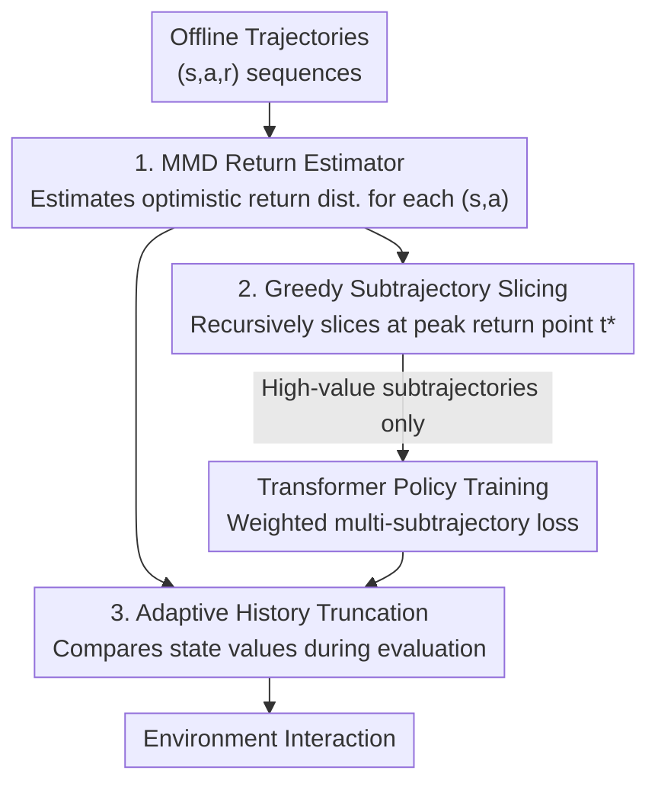

# Peak-Return Greedy Slicing: Subtrajectory Selection for Transformer-based Offline RL

**Conference**: ICLR 2026  
**OpenReview**: [https://openreview.net/forum?id=7vpehpWnnY](https://openreview.net/forum?id=7vpehpWnnY)  
**Code**: https://github.com/deligentfool/PRGS  
**Area**: Reinforcement Learning / Offline RL  
**Keywords**: Offline Reinforcement Learning, Decision Transformer, Subtrajectory Selection, Stitching Capability, MMD Return Estimation

## TL;DR
PRGS introduces a pre-processing step for Transformer-based offline RL that "picks high-quality fragments at the timestep level." It utilizes an MMD return estimator to calculate optimistic future return distributions for each state-action pair, greedily slices trajectories into "peak-return subtrajectories" for training, and adaptively truncates history during evaluation. This approach achieves an average improvement of 15.8% across multiple benchmarks including D4RL, BabyAI, and AuctionNet.

## Background & Motivation
**Background**: Offline RL learns policies from fixed datasets without environment interaction, making it ideal for scenarios where interaction is costly or dangerous, such as autonomous driving, robotics, and recommendation systems. Recently, treating trajectories as sequences of tokens and modeling them with Transformers (e.g., Decision Transformer, Trajectory Transformer) has become a mainstream paradigm due to their strong long-range dependency modeling capabilities.

**Limitations of Prior Work**: Existing methods almost exclusively learn by conditioning on the final return of the entire trajectory—feeding the whole $\tau=\{(s_t,a_t,r_t)\}$ and using return-to-go as the conditional signal. However, trajectory quality in datasets is inconsistent: a trajectory with a poor overall outcome often contains high-value local segments. Coarse-grained processing at the trajectory level fails to "stitch" these high-quality segments across different trajectories. Consequently, the learned policy rarely exceeds the performance of the best single trajectory in the dataset.

**Key Challenge**: The bottleneck for stitching capability lies in "granularity." Previous improvements in trajectory resampling, value guidance, or conditional modeling remain at the **trajectory level** or use implicit latent representations. No mechanism explicitly slices a trajectory into "good" and "bad" subtrajectories at the **timestep level**. The difficulty lies in identifying appropriate split points within a single trajectory.

**Key Insight**: The authors draw inspiration from human decision-making: humans do not judge an experience solely by its final outcome but distinguish between valuable and valueless segments within a long experience, retaining the good ones and recombining them into new experiences. This is precisely the capability missing in Transformer-based offline RL.

**Core Idea**: Use an optimistic return estimator to find the timestep corresponding to the "peak return" in each trajectory as the split point. Recursively slice trajectories into multiple subtrajectories and use only high-value subtrajectories for training, achieving explicit subtrajectory selection and stitching at timestep granularity.

## Method

### Overall Architecture
PRGS is a plug-and-play training framework compatible with existing Transformer-based offline RL algorithms (e.g., BC, DT, PDiT). It consists of three integrated modules: an **MMD Return Estimator** used before training to estimate an optimistic future return distribution for each $(s_t,a_t)$; **Greedy Subtrajectory Slicing** used during training to recursively split trajectories based on "peak return" points; and **Adaptive History Truncation** used during evaluation to dynamically decide whether to keep or discard history, ensuring consistency between inference and the "starting from intermediate states" nature of training. All three modules share the same return estimator.

### Key Designs

**1. MMD Return Estimator: Providing Optimistic Return Distributions at the Timestep Level**

To compare the value of segments at the timestep level, a fine-grained value signal reflecting "potential" is required. Traditional approaches use either return-to-go (affected by irrelevant history) or scalar value functions (losing the uncertainty of multiple future returns for the same $(s,a)$). The authors employ **Maximum Mean Discrepancy (MMD)** to non-parametrically fit the return distribution. MMD measures the distance between two distributions in a Reproducing Kernel Hilbert Space: $\mathrm{MMD}^2(X,Y)=\mathbb{E}_{x,x'}[k(x,x')]+\mathbb{E}_{y,y'}[k(y,y')]-2\mathbb{E}_{x,y}[k(x,y)]$. The estimator $Z_\psi(s_t,a_t)=\{z_1,\dots,z_N\}$ outputs $N$ scalar particles to approximate the return distribution. During training, the MMD loss between the predicted distribution and the TD target distribution $Z_{\text{target}}=r_t+\gamma Z_{\psi^-}(s_{t+1},a_{t+1})$ is minimized (using kernel $k(x,y)=-\lVert x-y\rVert^2$, where $\psi^-$ is the target network). Crucially, this estimator depends only on the current $(s,a)$, characterizing the intrinsic value of the state-action pair to provide reliable signals for slicing.

**2. Greedy Subtrajectory Slicing: Recursive Slicing with Start-Aligned Peak Returns**

This module converts distribution estimates into slicing decisions via three steps. **Estimation**: Sort $N$ particles for each timestep descendingly and take the mean of the top $n$ particles as the optimistic value $\tilde{Q}^{(n)}_t(s_t,a_t)=\frac{1}{n}\sum_{i=1}^{n}z_{t,(i)}$. Smaller $n$ represents higher optimism. To make timesteps comparable, values are aligned to the trajectory start: $\hat{R}^t_0=\sum_{i=0}^{t-1}\gamma^i r_i+\tilde{Q}^{(n)}_t$, representing the "optimistic total return reachable by following the trajectory to step $t$ and then executing $a_t$." **Slicing**: Find the timestep $t^*=\arg\max_t \hat{R}^t_0$ as the split point, as any segment after $t^*$ only decreases this estimate. Thus, $\tau_{0:t^*}$ is the approximately optimal subtrajectory. **Training**: Only timesteps within $\tau_{0:t^*}$ contribute to the loss. The remaining $\tau_{t^*+1:K}$ is sliced recursively. The total loss is a weighted sum of $M$ disjoint subtrajectories: $L_{\text{total}}=\sum_{m=1}^{M}\lambda^{m-1}L_m$, where $\lambda \in [0, 1]$ controls the decay.

**3. Adaptive History Truncation: Aligning Evaluation History with Training Starts**

During training, the model learns subtrajectories starting from intermediate states. If the entire history is unconditionally preserved during evaluation, a training-evaluation mismatch occurs. PRGS uses the return estimator to calculate the optimistic value of the current state $V_t(s_t)=\tilde{Q}^{(n)}_{t-1}(s_{t-1},a_{t-1})$ and compares it with the previous step: $\Delta V_t=V_t(s_t)-V_{t-1}(s_{t-1})$. If $\Delta V_t>0$, the current state has higher potential, and previous history is discarded to treat the current state as a new starting point ($H_t=\{s_t\}$); otherwise, history is accumulated ($H_t=H_{t-1}\cup\{s_t\}$).

### Loss & Training
The return estimator fits the TD target distribution via $L_{\text{MMD}}$. The policy follows the standard autoregressive objective on selected subtrajectories: $L_1(\theta)=-\mathbb{E}_\tau\sum_{t=0}^{t^*}\log\pi_\theta(a_t\mid\tau_{0:t^*})$. The final loss $L_{\text{total}}$ is a geometrically decayed weighted sum of subtrajectory losses. Key hyperparameters include the number of top particles $n$ and the decay coefficient $\lambda$.

## Key Experimental Results

### Main Results
PRGS was integrated into BC, DT, and PDiT (denoted as X-PRGS) and evaluated on D4RL, BabyAI, and AuctionNet. The overall average improvement was approximately 15.8%.

| Dataset (Domain Mean) | DT | DT-PRGS | Gain |
|--------|------|---------|------|
| D4RL Gym | 75.3 | 82.9 | ↑7.6 |
| Adroit | 30.9 | 35.2 | ↑4.3 |
| Kitchen | 50.1 | 65.5 | ↑15.4 |
| Maze2D | 40.9 | 100.1 | ↑59.2 |
| AntMaze | 33.4 | 48.7 | ↑15.3 |

The most significant gains were observed in Maze2D, which requires stitching and long-range planning: DT-PRGS achieved 127.5 on maze2d-large. Compared to stitching-focused methods like QDT, EDT, and CGDT, PRGS averaged 72.1 on Gym medium/medium-replay tasks, outperforming vanilla DT by 10.9 points.

### Ablation Study

| Configuration | Key Observation | Explanation |
|------|---------|------|
| Particle count $n$ too small | Suboptimal performance | MMD estimator prone to outlier estimates, harming accuracy |
| Particle count $n$ too large | Performance degradation | Degenerates to standard value estimation, losing optimistic bias |
| w/o AHT | Significant performance drop | Training-evaluation mismatch without adaptive truncation |
| Top 10% / 20% Traj Filtering | Not consistently better | Proves gains come from timestep-level slicing rather than trajectory filtering |

### Key Findings
- **Moderate Optimism is Essential**: $n$ acts as a knob for optimistic bias; a "sweet spot" exists between being misled by outliers and being too conservative.
- **AHT is Indispensable**: The drop in performance without AHT confirms that the training context (starting from intermediate states) must be aligned with evaluation history length.
- **Granularity Trumps Filtering**: Filtering trajectories (Top 10%/20%) does not match PRGS performance, verifying that gains originate from explicit subtrajectory slicing at the timestep level.
- **Visualization**: In Maze2D, the first subtrajectory selected by PRGS consistently includes high-value regions while discarding low-quality segments deviating from the target.

## Highlights & Insights
- **Intuitive "Peak Return" Slicing**: Aligning optimistic returns to a common start $\hat{R}^t_0$ makes the argmax a natural split point where further continuation would only decrease the estimated value.
- **Adjustable Optimism via MMD**: Combining distributional estimation with top-$n$ averaging allows for continuous adjustment between optimism and conservatism, more flexible than fixed quantile regression.
- **Train-Eval Consistency as a Priority**: PRGS addresses the hidden mismatch where models are trained on slices but evaluated on full histories by replicating the history reset logic during inference.
- **Plug-and-Play**: The framework modifies the organization of training samples without altering the Transformer backbone, making it compatible with BC, DT, and PDiT.

## Limitations & Future Work
- **Dependency on Estimator Quality**: Accuracy relies heavily on the MMD estimator. In difficult tasks like AntMaze medium/large-diverse, gains are marginal or negative if the estimator fails.
- **Transformer-Specific**: Current integration is tied to tokenized autoregressive losses and the Transformer paradigm.
- **Hyperparameter Sensitivity**: $n$ and $\lambda$ require task-specific tuning, and an automated selection mechanism is currently missing.
- **Greedy Slicing Risks**: Recursive greedy slicing does not guarantee a globally optimal subtrajectory partition for complex long-range tasks.

## Related Work & Insights
- **vs DT / Trajectory Transformer**: These condition on final trajectory returns and process at the trajectory level; PRGS provides the fine granularity needed for "stitching."
- **vs EDT**: While EDT adaptively determines context length during evaluation, PRGS aligns both training (via slicing) and evaluation (via AHT).
- **vs QDT / CGDT**: While these use value guidance, PRGS provides an interpretable "split-point discovery + explicit selection" mechanism compatible with various Transformer bases.
- **vs CQL / IQL**: Traditional methods use policy constraints or conservative value regularization; PRGS improves stitching purely through training data organization.

## Rating
- Novelty: ⭐⭐⭐⭐ The combination of peak-return slicing, MMD optimism, and AHT is a novel and self-consistent perspective.
- Experimental Thoroughness: ⭐⭐⭐⭐ Covers multiple domains and bases; ablations effectively distinguish slicing from trajectory filtering.
- Writing Quality: ⭐⭐⭐⭐ Clear narrative across the three modules with well-defined motivations.
- Value: ⭐⭐⭐⭐ A practical, plug-and-play solution to the stitching bottleneck in Transformer-based offline RL.

<!-- RELATED:START -->

## Related Papers

- [\[ICLR 2026\] Recurrent Action Transformer with Memory](recurrent_action_transformer_with_memory.md)
- [\[ICLR 2026\] The State of Reinforcement Finetuning for Transformer-based Agents](the_state_of_reinforcement_finetuning_for_transformer-based_agents.md)
- [\[ICLR 2026\] ReFORM: Reflected Flows for On-support Offline RL via Noise Manipulation](reform_reflected_flows_for_on-support_offline_rl_via_noise_manipulation.md)
- [\[ICLR 2026\] Less is More: Clustered Cross-Covariance Control for Offline RL](less_is_more_clustered_cross-covariance_control_for_offline_rl.md)
- [\[ICLR 2026\] STAIRS-Former: Spatio-Temporal Attention with Interleaved Recursive Structure Transformer for Offline Multi-Task Multi-Agent Reinforcement Learning](stairs-former_spatio-temporal_attention_with_interleaved_recursive_structure_tra.md)

<!-- RELATED:END -->
