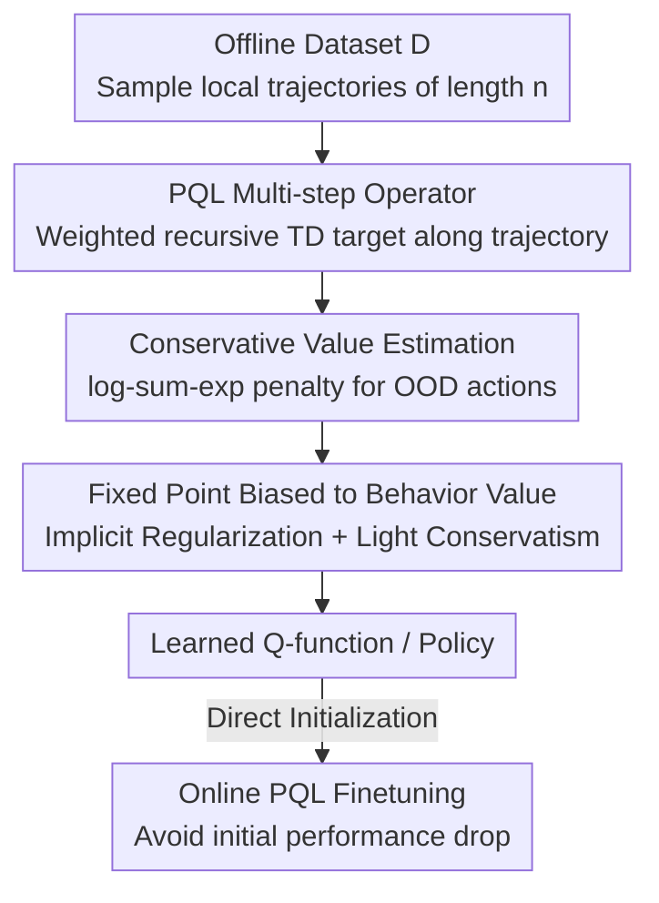

# Peng's Q($\lambda$) for Conservative Value Estimation in Offline Reinforcement Learning

**Conference**: ICLR 2026  
**OpenReview**: [https://openreview.net/forum?id=Ml4AtrrfQT](https://openreview.net/forum?id=Ml4AtrrfQT)  
**Code**: https://github.com/oh-lab/CPQL  
**Area**: Reinforcement Learning / Offline RL  
**Keywords**: Offline Reinforcement Learning, Multi-step Operators, Conservative Value Estimation, Peng's Q(λ), Offline-to-Online  

## TL;DR
CPQL introduces the multi-step operator Peng's Q($\lambda$) from online RL into offline RL for the first time, replacing the single-step Bellman operator in CQL for conservative value estimation. By leveraging the property that the PQL fixed point naturally aligns with the behavioral policy value, it mitigates over-pessimism, consistently outperforms various single-step baselines on D4RL, and enables seamless offline-to-online finetuning.

## Background & Motivation
**Background**: Offline RL aims to learn policies from a fixed dataset without environment interaction. The mainstream approach adds conservative constraints to the value function. CQL is a representative method that penalizes Q-values for out-of-distribution (OOD) actions induced by the learned policy. Numerous subsequent works (MCQ, CSVE, EPQ, etc.) attempt to fix CQL's "over-pessimism."

**Limitations of Prior Work**: Most improvements rely on **external components**—either estimating the unknown behavior policy to handle OOD actions or introducing extra networks to learn quantile or state-value functions. These add-ons cause side effects: distribution mismatch between the estimated behavior policy and the dataset, intensive hyperparameter tuning, and slower training. Crucially, almost all model-free offline methods decompose trajectories into **individual single-step transitions**, discarding valuable multi-step information within the trajectories.

**Key Challenge**: Conservatism is a double-edged sword—if too weak, it fails to suppress OOD overestimation (distribution shift); if too strong, it penalizes in-distribution actions (over-pessimism). CQL is extremely sensitive to the conservative coefficient $\alpha$, where small changes lead to massive performance fluctuations.

**Goal**: Can we design an offline RL value estimation method that **utilizes multi-step information** to suppress distribution shift without over-pessimism, and without relying on external models?

**Key Insight**: Online RL has long used multi-step TD operators (Retrace, Tree-backup, Peng's Q(λ), etc.) to generalize single-step Q-learning to full trajectories. The authors noted a property often considered a "downside" in online RL: under a **fixed behavior policy** (exactly the offline setting), the fixed point of the Peng's Q($\lambda$) (PQL) operator converges to the Q-function of a **mixture policy** between the behavior and target policies, naturally staying close to the behavior policy value. While online RL avoids this as it fails to reach $Q^*$, in offline RL, this "behavior bias" serves as the desired implicit behavioral regularization.

**Core Idea**: Replace the single-step Bellman operator in the CQL loss with the PQL operator to shift the fixed point toward the behavior value. This allows for **minimal conservatism** to suppress OOD overestimation without extra behavior estimation or supplementary networks.

## Method

### Overall Architecture
CPQL (Conservative Peng's Q($\lambda$)) takes local trajectories of length $n$ sampled from an offline dataset $D$ and outputs a conservative, behavior-biased Q-function and a corresponding policy. The workflow maintains CQL's skeleton—"single-step TD target + log-sum-exp conservative penalty"—but replaces the **TD target calculation** with the PQL multi-step operator computed via trajectory recursion. Finally, it updates the critic and actor as usual.

The PQL operator is defined as the $\lambda$-weighted sum of $n$-step returns: $T^{\pi_\beta,\pi}_\lambda Q := (1-\lambda)\sum_{n=1}^\infty \lambda^{n-1} T^{\pi_\beta,\pi}_n Q$, where $T^{\pi_\beta,\pi}_n Q := (T^{\pi_\beta})^{n-1} T^\pi Q$. Its fixed point satisfies $Q^{\pi_\beta,\pi} = (\lambda T^{\pi_\beta} + (1-\lambda)T^\pi)Q^{\pi_\beta,\pi}$, which converges to the Q-function of the mixture policy $\lambda\hat\pi_\beta + (1-\lambda)\pi$ under a fixed empirical behavior policy $\hat\pi_\beta$, with a convergence rate $\beta = \frac{\gamma(1-\lambda)}{1-\gamma\lambda}$.

### Key Designs

**1. Replacing Bellman with PQL: Shifting the Fixed Point to Behavior Value**

To address the loss of trajectory info and the difficulty of tuning conservatism, CPQL replaces $T^\pi$ in CQL with the PQL operator $T^{\hat\pi_\beta,\pi_k}_\lambda$:

$$\hat Q_{k+1} \in \min_Q \tfrac{1}{2}\mathbb{E}_{s,a,s'\sim D}\big[(Q(s,a) - T^{\hat\pi_\beta,\pi_k}_\lambda \hat Q_k(s,a))^2\big] + \alpha\big(\mathbb{E}_{s\sim D,a\sim\pi_k}[Q(s,a)] - \mathbb{E}_{s,a\sim D}[Q(s,a)]\big).$$

This is effective because the PQL fixed point converges to the value of the mixture policy $\lambda\hat\pi_\beta + (1-\lambda) \pi$. This provides "free" implicit behavioral regularization. Since the learned policy's impact on Q-estimates is diluted by $\lambda$, a very mild $\alpha$ suffices to suppress OOD overestimation, avoiding the over-pessimism seen in CQL's hard penalty. Unlike Retrace, PQL **does not use importance sampling**, avoiding issues caused by inaccurate behavior policy estimation.

**2. Recursive Multi-step Target Calculation with Last-step Entropy Reward**

The PQL target is calculated via **backward recursion** along a trajectory of length $n$. For $i = n-1$ down to $0$:

$$\hat Q^i_{\theta_j} = r_i + \gamma Q_{\theta_j^-}(s_{i+1}, \pi_\phi(s_{i+1})) + \gamma\lambda\big(\hat Q^{i+1}_{\theta_j} - Q_{\theta_j^-}(s_{i+1}, \pi_\phi(s_{i+1}))\big),$$

The final target is $y = \min_{j=1,2}\hat Q^0_{\theta_j} - \gamma^n \alpha_{td}\log\pi_\phi(\cdot|s_n)$. A key trick is that while based on SAC, the entropy reward $\alpha_{td}$ is **only kept at the final step** of the trajectory. Multi-step recursion would otherwise accumulate entropy rewards at every step, magnifying numerical scales and destabilizing value estimation. The trajectory length is capped at $n=5$.

**3. Utilizing CQL log-sum-exp Penalty with a Smaller $\alpha$**

The conservative term follows CQL: minimizing $\alpha\,\mathbb{E}_{s\sim D}[\log\sum_a \exp(Q_{\theta_j}(s,a)) - \mathbb{E}_{a\sim\hat\pi_\beta}[Q_{\theta_j}(s,a)]]$ plus the TD squared error. Because the PQL operator already anchors the fixed point to behavior values, this conservative term acts as a "refinement" rather than the "primary force." Consequently, CPQL trains stably with a much smaller $\alpha$, avoiding CQL's sensitivity and the tendency to over-penalize states with few observations.

**4. Three Theoretical Guarantees: Lower Bound, Performance Gain, and Gap Reduction**

**Theorem 1** (Value Lower Bound): The learned state value $\hat V^{\lambda\hat\pi_\beta+(1-\lambda)\pi}(s)$ is a lower bound of the true value given a sufficiently large $\alpha$. **Theorem 2** (Performance over Behavior Policy): The mixture policy performs no worse than the behavior policy in the true MDP:

$$J_M(\lambda\hat\pi_\beta+(1-\lambda)\hat\pi) \geq J_M(\hat\pi_\beta) + \tfrac{\alpha(1-\lambda)}{1-\gamma}\mathbb{E}\big[\mathbb{E}_{a\sim\hat\pi}[\tfrac{\hat\pi(a|s)}{\hat\pi_\beta(a|s)}-1]\big].$$.

**Theorem 3** (Suboptimality Gap): The gap between the optimal policy $\pi^*$ and the CPQL mixture policy is bounded by terms involving $\lambda$ and $\alpha$. $\lambda$ acts as a balancer—when $\hat\pi_\beta$ is near-optimal, a larger $\lambda$ further reduces the gap. Together, these ensure CPQL avoids overestimation, stays at least as good as the behavior policy, and approaches optimality.

### Loss & Training
Critic loss = conservative log-sum-exp term + TD squared error of multi-step target $y$; Actor updates by maximizing $\mathbb{E}_{s\sim D,a\sim\pi_\phi}[\min_{j}Q_{\theta_j}(s,a) - \alpha_{pol}\log\pi_\phi(\cdot|s)]$; Target networks use soft updates $\theta_j^- \leftarrow \tau\theta_j + (1-\tau)\theta_j^-$. Offline evaluation runs for 1M gradient steps with $n=5$ across 5 seeds.

## Key Experimental Results

### Main Results
On the D4RL benchmark (MuJoCo, Adroit, AntMaze), CPQL achieves top performance in 22 out of 29 tasks. Total scores across categories:

| Category | CQL | IQL | MCQ | EPQ | CPQL (ours) |
|----------|-----|-----|-----|-----|-------------|
| MuJoCo Total | 1010.2 | 1033.1 | 1188.4 | 1193.7 | **1252.1** |
| Adroit Total | 93.6 | 118.1 | 124.3 | 128.7 | **166.7** |
| AntMaze Total | 303.6 | 378.0 | 278.3 | 326.2 | **397.6** |

Representative single tasks (normalized): halfcheetah-random improved from 17.5 (CQL) to 38.8; walker2d-medium-replay 81.8→97.4; door-cloned 0.4→6.4; antmaze-large-diverse 14.9→46.6. Improvements are particularly significant on sparse-reward AntMaze tasks.

### Ablation Study

| Config / Question | Observation | Explanation |
|------------|------|------|
| Sensitivity to small $\alpha$ | CQL fluctuates wildly with $\alpha$; CPQL is stable for $\alpha \in [0.1, 0.9]$ | PQL reduces target policy influence; mild conservatism suffices |
| Other Multi-step Operators | N-step / Retrace / Tree-backup fast initially but then collapse | Retrace lacks accurate behavior estimates; Tree-backup unstable with $\ln\pi$ in continuous space |
| Offline-to-Online | CPQL→PQL starts without performance drop; Q-values rise steadily | No extra calibration/alignment needed for transition to online PQL |

### Key Findings
- **PQL stands out among multi-step operators**: Unlike N-step or Retrace, which often peak early and collapse, CPQL remains stable and strong because it avoids importance sampling and behavior estimation.
- **Zero-mechanism Offline-to-Online**: While CQL→SAC suffers a steep drop initially due to high conservatism, CPQL allows online PQL to take over smoothly, with Q-values rising steadily during finetuning.
- **$\lambda$ as an implicit regularization knob**: Increasing $\lambda$ pulls the fixed point closer to the behavior value, allowing the suboptimality gap to be tuned based on data quality.

## Highlights & Insights
- **Turning a "Flaw" into a "Feature"**: Online RL dislikes that the PQL fixed point doesn't reach $Q^*$; CPQL repurposes this behavior bias as implicit regularization. It is a clever shift in perspective.
- **Eliminating Peripheral Networks**: Compared to CSVE/EPQ which require learning state values or behavior policies, CPQL achieves theoretical guarantees (lower bounds, behavior surpassing) simply by changing the operator.
- **Transferable Trick for Entropy**: The "last-step entropy only" trick in multi-step recursion avoids numerical explosion and is a valuable reference for any method integrating SAC-style regularization into multi-step targets.

## Limitations & Future Work
- The authors acknowledge additional computational overhead for multi-step recursion (though practical increase in runtime is reported as small).
- On **low-quality datasets**, multi-step operators might underperform compared to single-step updates; however, CPQL can revert to single-step TD when $\lambda=0$.
- Observations: $\lambda$ selection significantly impacts results. Qualitative advice is given (larger $\lambda$ for better behavior policies), but an automated selection mechanism is missing. Trajectory length $n=5$ is a fixed hyperparameter without adaptive exploration.

## Related Work & Insights
- **vs CQL**: Both use log-sum-exp, but CQL's single-step Bellman is hyper-sensitive to $\alpha$ and prone to over-pessimism. CPQL uses PQL to anchor the fixed point, stabilizing it with small $\alpha$ and providing better theoretical bounds.
- **vs Retrace / Tree-backup**: These involve importance sampling or trajectory truncation, requiring behavior estimation which is unstable in continuous spaces. PQL uses the full trajectory segment without importance sampling, bypassing estimation errors.
- **vs Cal-QL**: Cal-QL calibrates the value function to prevent initial drops in offline-to-online transitions; CPQL avoids over-pessimism during offline training, making the transition to online PQL smoother without additional alignment mechanisms.

## Rating
- Novelty: ⭐⭐⭐⭐⭐ First introduction of multi-step operators for conservative estimation in offline RL with solid theory.
- Experimental Thoroughness: ⭐⭐⭐⭐ Extensive D4RL coverage, multi-step comparisons, and offline-to-online results; less discussion on low-quality data.
- Writing Quality: ⭐⭐⭐⭐ Clear motivation and logical progression of theorems.
- Value: ⭐⭐⭐⭐⭐ High utility through a cleaner operator that yields stronger, more stable results and seamless online finetuning.

<!-- RELATED:START -->

## Related Papers

- [\[ICLR 2026\] Trajectory Generation with Conservative Value Guidance for Offline Reinforcement Learning](trajectory_generation_with_conservative_value_guidance_for_offline_reinforcement.md)
- [\[ICLR 2026\] Guided Flow Policy: Learning from High-Value Actions in Offline Reinforcement Learning](guided_flow_policy_learning_from_high-value_actions_in_offline_reinforcement_lea.md)
- [\[ICLR 2026\] Offline Preference-based Value Optimization](offline_preference-based_value_optimization.md)
- [\[ICLR 2026\] Who Matters Matters: Agent-Specific Conservative Offline MARL](who_matters_matters_agent-specific_conservative_offline_marl.md)
- [\[ICLR 2026\] Toward Conservative Planning from Human-AI Preferences in Reinforcement Learning](toward_conservative_planning_from_human-ai_preferences_in_reinforcement_learning.md)

<!-- RELATED:END -->
