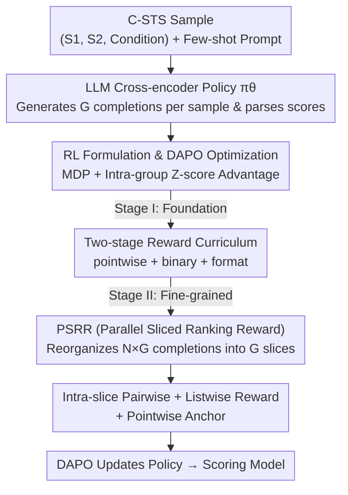

# PoLi-RL: A Point-to-List Reinforcement Learning Framework for Conditional Semantic Textual Similarity

**Conference**: ICLR 2026  
**OpenReview**: [https://openreview.net/forum?id=sLcRCH1U68](https://openreview.net/forum?id=sLcRCH1U68)  
**Code**: https://github.com/ZBWpro/PoLi-RL  
**Area**: Reinforcement Learning / LLM Alignment / Semantic Textual Similarity  
**Keywords**: Conditional Semantic Textual Similarity (C-STS), Reinforcement Learning, Ranking Reward, Curriculum Learning, Cross-encoder

## TL;DR
This paper introduces Reinforcement Learning (RL) to the Conditional Semantic Textual Similarity (C-STS) task for the first time. It proposes PoLi-RL, a two-stage curriculum RL framework that progresses from "point-to-list," along with a Parallel Sliced Ranking Reward (PSRR) mechanism that decomposes coarse batch-level ranking signals into precise rewards for each individual completion. An 8B model trained with this framework achieves a Spearman correlation of 48.18 on the official C-STS benchmark, surpassing GPT-4o and DeepSeek-R1 to set a new Cross-encoder SOTA.

## Background & Motivation
**Background**: Semantic Textual Similarity (STS) is a core task in computational linguistics, but traditional definitions of "similarity" are subjective and inherently ambiguous. Conditional Semantic Textual Similarity (C-STS) resolves this ambiguity by providing a natural language condition (e.g., "distance between player and basket" vs. "player's movement")—the similarity of the same sentence pair can vary significantly under different conditions. This necessitates fine-grained reasoning beyond surface semantics. Existing C-STS methods mainly include Bi-encoders, Tri-encoders, and Cross-encoders, but most remain within the discriminative paradigm and fail to leverage the advantages of LLM + RL.

**Limitations of Prior Work**: Current attempts to apply LLMs to C-STS are limited to two rudimentary approaches: direct few-shot inference (where even SOTA closed-source models struggle) or using LLMs as feature extractors to generate embeddings (essentially still the discriminative paradigm). End-to-end LLM-based Cross-encoders integrated with RL have not been explored.

**Key Challenge**: The evaluation metric for C-STS is the Spearman rank correlation coefficient, which is ranking-based and **non-differentiable**. Traditional SFT can only optimize it indirectly and approximately via losses like MSE, leading to misalignment between training and evaluation objectives. While RL is theoretically the most suitable paradigm to directly optimize non-differentiable ranking rewards and guide the reasoning process, it faces significant hurdles.

**Obstacles to the Key Insight**: The authors found that naively incorporating listwise ranking rewards (e.g., calculating Spearman directly on batch completions) into RL results in performance barely better than few-shot inference. This is due to two reasons: 1) Ranking objectives are too complex for a model that has not yet mastered basic scoring rules, leading to training collapse; 2) Scalar rewards calculated over an entire batch are too coarse, preventing precise credit assignment as a few poor completions can penalize good ones.

**Core Idea**: Decompose the task difficulty using a "point-to-list" curriculum—teaching the model basic scoring rules via simple pointwise rewards before transitioning to hybrid rewards (pointwise/pairwise/listwise) for fine-grained distinction. Simultaneously, utilize a parallel slicing mechanism to break down batch-level ranking rewards into precise, discriminative signals for every completion.

## Method

### Overall Architecture
PoLi-RL aims to train an end-to-end LLM-based Cross-encoder via RL to align its scoring sequence with human annotations. The pipeline consists of a policy model, a two-stage reward curriculum, and a parallel sliced reward mechanism.

The input is a C-STS sample $(t_1, t_2, c)$ formatted into a prompt $p=[I, E, x]$ (instruction + K few-shot examples + query). The policy model $\pi_\theta$ (based on Qwen3) generates $G$ completions per sample, from which predicted scores $\tilde y$ are parsed. The generation is modeled as an MDP where rewards are provided only at the terminal state, and the policy is updated using DAPO (an enhanced version of GRPO). Training involves two stages: Stage I focuses on foundational scoring rules using pointwise, binary, and format rewards; Stage II matures the model's fine-grained semantic discrimination using a hybrid reward supported by the PSRR mechanism.

### Key Designs

**1. RL Formulation & DAPO Optimization: Transforming Non-differentiable Spearman into Optimizable Rewards**

This design addresses the misalignment between SFT (using MSE) and the evaluation metric (Spearman). The authors formulate C-STS as an MDP $M=(S,A,T,R,\gamma)$: the agent is the LLM policy $\pi_\theta$, the state $s_t=(p, o_{<t})$ is the generated token sequence, and the action $a_t$ is selecting the next token. A terminal reward $R_T=R(x,y,o)$ is given after individual sequence generation, with $\gamma=1$ to ensure rewards propagate back without decay. The objective is to maximize the expected reward $\theta^*=\arg\max_\theta \mathbb{E}_{(x,y)\sim D, o\sim\pi_\theta(p)}[R(x,y,o)]$.

The DAPO optimizer (an extension of GRPO) is used: $G$ completions are generated per sample, scalar rewards $r_i$ are calculated, and advantages are normalized via intra-group Z-scores: $\hat A_i=\frac{r_i-\mathrm{mean}(\{r_i\})}{\mathrm{std}(\{r_i\})+\epsilon}$. This allows the reward function to be designed around metrics strongly correlated with Spearman.

**2. Two-stage Reward Curriculum: Transitioning from Point to List to Avoid Training Collapse**

To solve the issue where naive listwise RL fails or collapses, the authors introduce a curriculum.

Stage I (Foundational Skill Acquisition) uses a weighted reward $R_{S1}=\lambda_1 R_{pointwise}+\lambda_2 R_{binary}+\lambda_3 R_{format}$. The pointwise reward measures the normalized distance between the predicted score and ground truth $R_{pointwise}=1-\frac{|\tilde y_j-y_j|}{\max(Y)-\min(Y)}$. A binary reward is added to push the model to at least distinguish "similar" (score $\ge3$) from "dissimilar" (score $\le2$). Format rewards ensure correct output syntax.

Stage II (Fine-Grained Semantic Distinction) switches to a hybrid reward $R_{S2}=\mu_1 R_{pointwise}+\mu_2 R_{pairwise}+\mu_3 R_{listwise}$. Pointwise remains as a stable anchor, while pairwise/listwise rewards hone the model's ability to distinguish subtle semantic differences.

**3. PSRR (Parallel Sliced Ranking Reward): Granular Credit Assignment for Batch-Level Signals**

PSRR is the core innovation, decomposing reward calculation into two levels.

The first level is "Parallel Slicing": for a batch of $N$ samples with $G$ completions each, $N \times G$ scores are parsed. Instead of a flat list, they are organized into $G$ "parallel slices." The $j$-th slice $Y^j_{pred}=\{\tilde y_{1,j},\tilde y_{2,j},\dots,\tilde y_{N,j}\}$ contains the $j$-th completion from every sample. Advantage calculation follows the "slice" direction (between $G$ completions of the same sample), while ranking rewards are calculated within each slice (across different samples). This provides each completion with a specific signal reflecting its relative performance.

The second level involves calculating individual rank differences within slices. The **listwise reward** uses the normalized difference between predicted and ground truth ranks: $R^{listwise}_{i,j}=1-\frac{|\mathrm{Rank}(\tilde y_{i,j}, Y^j_{pred})-\mathrm{Rank}(y_i, Y_{true})|}{N-1}$. The **pairwise reward** leverages the paired structure of C-STS data (where adjacent samples share sentence pairs but different conditions, with $y_{high} \ge y_{low}$).

### Loss & Training
The policy is updated using the DAPO objective:
$$J_{DAPO}(\theta)=\mathbb{E}_{(x,y)\sim D,\{o_i\}\sim\pi_\theta(\cdot|p)}\left[\frac{1}{\sum_{i=1}^G|o_i|}\sum_{i=1}^G\sum_{t=1}^{|o_i|}\frac{\pi_\theta(o_{i,t}|p,o_{i,<t})}{[\pi_\theta(o_{i,t}|p,o_{i,<t})]_{nograd}}\hat A_i\right]$$
The model uses Qwen3 (0.6B / 4B / 8B) as the backbone, trained via the ms-swift framework. In Stage II, the default slice size is $N=24$ with reward weights $(\mu_1,\mu_2,\mu_3)=(1.0,1.5,1.0)$.

## Key Experimental Results

### Main Results
Official C-STS benchmark (Spearman/Pearson $\times$ 100):

| Method | Paradigm | Params | Spearman ↑ | Pearson ↑ |
|------|------|--------|------------|-----------|
| SimCSE-Large | SFT | 355M | 43.2 | 43.2 |
| SEAVER (Prev. SOTA) | SFT | 355M | 43.83 | 43.81 |
| DeepSeek-R1 | Few-shot | - | 42.85 | 42.36 |
| GPT-4o | Few-shot | - | 44.23 | 44.07 |
| **PoLi-RL (Qwen3-0.6B)** | RL | 0.6B | **44.34** | 44.36 |
| **PoLi-RL (Qwen3-8B)** | RL | 8B | **48.18** | 48.27 |

The 0.6B model already outperforms GPT-4 and SEAVER, while the 8B model sets a new SOTA, significantly exceeding GPT-4o and DeepSeek-R1.

### Ablation Study
Two-stage curriculum and reward components:

| Configuration | Reward Components | Spearman ↑ | $\Delta$ |
|------|---------|------------|---|
| (1) Few-shot | - | 37.9 | - |
| (2) Naive RL | Listwise | 38.19 | +0.29 vs (1) |
| (3) PoLi-RL Stage I | Pointwise + Binary | 44.77 | +6.87 vs (1) |
| (5) PoLi-RL Full | Pointwise + Pairwise + Listwise | 48.18 | +3.41 vs (3) |

The curriculum is essential. Naive RL barely improves over few-shot, whereas Stage I provides a massive jump, and Stage II further refines performance.

## Key Findings
- **Naive listwise RL is largely ineffective (+0.29)**, identifying that the challenge lies in signal complexity rather than RL itself.
- **Listwise signals are critical for final refinement**, contributing the most gain in Stage II.
- **Robustness**: Reward weights are not hyper-sensitive; Stage II converges steadily across various configurations.
- **Transferability**: Applied to WMT-QE 2020, PoLi-RL improved Spearman from 50.90 (SFT) to 54.33, proving PSRR is a general alignment solution for listwise ranking tasks.

## Highlights & Insights
- **Defining credit assignment granularity as the bottleneck**: The paper identifies "coarse batch-level rewards" as the reason previous listwise RL efforts failed and provides a structured solution via parallel slicing.
- **Orthogonal axes design**: By separating advantage calculation (intra-sample) and ranking rewards (intra-slice), PoLi-RL ensures precise rewards for each individual completion.
- **Curriculum RL as a stabilizer**: The tiered difficulty approach (pointwise $\rightarrow$ binary $\rightarrow$ ranking) provides a reusable template for stabilizing RL training on complex tasks.

## Limitations & Future Work
- **Structure dependency**: The pairwise reward relies on the specific paired structure of C-STS.
- **Slice size sensitivity**: $N$ follows an inverted U-shaped curve, requiring some tuning for different tasks.
- **Parsing reliance**: The framework depends on parsing numerical scores from generated text, which might face robustness issues with complex outputs.

## Related Work & Insights
- **Vs. Discriminative Cross-encoders**: While prior SFT models like SEAVER use MSE to approximate Spearman, PoLi-RL uses RL to optimize the ranking metric directly, allowing the 0.6B model to surpass much larger discriminative SOTAs.
- **Vs. Closed-source models**: Specialized RL alignment allows an 8B model to outperform GPT-4o and DeepSeek-R1, reinforcing that "specialized alignment > scale" for specific conditional ranking tasks.

## Rating
- Novelty: ⭐⭐⭐⭐⭐ 
- Experimental Thoroughness: ⭐⭐⭐⭐ 
- Writing Quality: ⭐⭐⭐⭐⭐ 
- Value: ⭐⭐⭐⭐ 

<!-- RELATED:START -->

## Related Papers

- [\[ICLR 2026\] GRACE: A Language Model Framework for Explainable Inverse Reinforcement Learning](grace_a_language_model_framework_for_explainable_inverse_reinforcement_learning.md)
- [\[ICLR 2026\] Revolutionizing Reinforcement Learning Framework for Diffusion Large Language Models](revolutionizing_reinforcement_learning_framework_for_diffusion_large_language_mo.md)
- [\[CVPR 2026\] JoPPO: Hierarchical Photography Assessment via Contrastive Joint Conditional Probabilistic Reinforcement Learning](../../CVPR2026/reinforcement_learning/joppo_hierarchical_photography_assessment_via_contrastive_joint_conditional_prob.md)
- [\[ICLR 2026\] RL for Reasoning by Adaptively Revealing Rationales](rl_for_reasoning_by_adaptively_revealing_rationales.md)
- [\[NeurIPS 2025\] Enhancing Interpretability in Deep Reinforcement Learning through Semantic Clustering](../../NeurIPS2025/reinforcement_learning/enhancing_interpretability_in_deep_reinforcement_learning_through_semantic_clust.md)

<!-- RELATED:END -->
