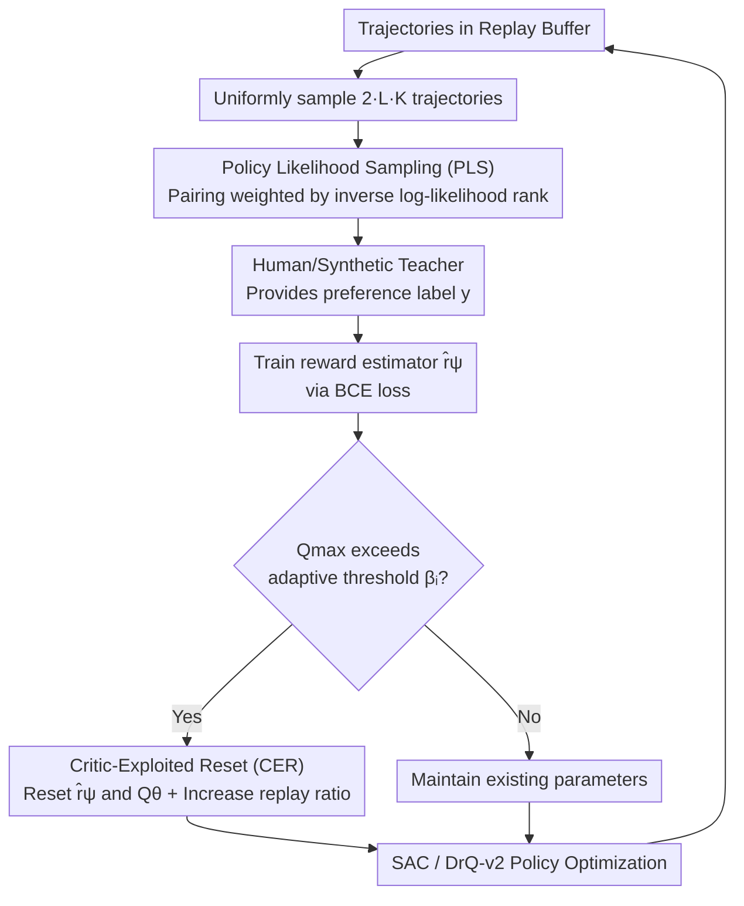

# Policy Likelihood-based Query Sampling and Critic-Exploited Reset for Efficient Preference-based Reinforcement Learning

**Conference**: ICLR 2026  
**OpenReview**: [https://openreview.net/forum?id=ITeuGb2bYg](https://openreview.net/forum?id=ITeuGb2bYg)  
**Code**: https://github.com/JongKook-Heo/PoLiCER  
**Area**: Reinforcement Learning / Preference-based Reinforcement Learning (PbRL)  
**Keywords**: Preference-based RL, Query Sampling, Policy Likelihood, Primacy Bias, Dynamic Reset

## TL;DR
PoLiCER addresses two persistent issues in preference-based RL—the decoupling of queries from the current policy and the reward estimator's overfitting to early feedback. It proposes a combination of "query sampling ranked by policy likelihood" and "reward/Q-network resets triggered by critic outputs." The method consistently outperforms existing baselines such as PEBBLE and QPA on locomotion and robotic arm tasks in DMControl and Meta-World.

## Background & Motivation
**Background**: Preference-based Reinforcement Learning (PbRL) eliminates the need for manual reward engineering by training agents through binary feedback on which of two trajectory segments is "better." The standard approach fits human preferences into a reward estimator $\hat r_\psi$ using the Bradley-Terry model, which then drives a standard RL algorithm (e.g., SAC). Since human labeling is expensive, "query sampling"—how to ask the most valuable questions under a limited feedback budget—is a core research topic.

**Limitations of Prior Work**: PbRL suffers from two structural problems arising from the sequential nature of feedback. First is **query-policy mismatch**: many sampling strategies select trajectories from stale replay buffers that have extremely low probabilities under the current policy, making the resulting feedback irrelevant for current policy updates. Second is **primacy bias**: neural networks tend to overfit the earliest data in an expanding dataset. Consequently, the reward estimator becomes dominated by early feedback—which is often trivial or ambiguous—leading the entire training process astray.

**Key Challenge**: To address the first issue, QPA (Hu et al., 2024) proposed "Near On-policy Sampling" (NOS), assuming that "temporal recency equals policy relevance." However, through experiments on Meta-World *Sweep Into* (Fig. 1), the authors found that in goal-conditioned tasks where target positions vary, **temporal recency is a poor proxy for policy relevance**. As training progresses, the gap between the "30 most recent episodes" and the "30 episodes with highest policy likelihood" widens significantly. In short, recency $\neq$ policy relevance.

**Goal**: (1) Identify a signal that truly measures how representative a trajectory is of the current policy; (2) suppress primacy bias in the reward estimator without the high cost of frequent full resets or leaving residual bias in the Q-network.

**Key Insight**: Quantify policy relevance directly using the **log-likelihood rank** of trajectories under the current policy for query sampling (PLS). Simultaneously, use the critic output as a probe for reward overestimation to trigger dynamic resets of both the reward estimator and the Q-network **only when necessary** (CER). These two components form PoLiCER.

## Method

### Overall Architecture
PoLiCER integrates two modules into the standard PEBBLE-based PbRL loop. During each feedback session, it performs two tasks: first, **PLS** selects trajectories from the replay buffer that "best match the current policy" to form queries for human labeling; second, **CER** monitors the critic output and resets both the reward estimator and the Q-network if reward overestimation is detected. After the reward estimator is updated, it drives the underlying RL (SAC / DrQ-v2) to continue policy optimization.

### Key Designs

**1. Policy Likelihood Sampling (PLS): Replacing Recency with Log-Likelihood Rank**

This design directly addresses query-policy mismatch and the failure of NOS. Instead of checking if a trajectory is recent, PLS quantifies how representative it is of current behavior by calculating its average log-likelihood under the current policy $\pi_\phi$:

$$l_i = \frac{1}{H}\sum_{(s_t,a_t)\sim\sigma_i}\log\pi_\phi(a_t\mid s_t).$$

Higher likelihood indicates a trajectory closer to the current policy. However, since probability densities are unbounded in continuous control, raw likelihood is sensitive to outliers. Inspired by Prioritized Experience Replay, the authors use the **inverse rank of the likelihood $w_i$ as the sampling weight** rather than the raw value, with a temperature parameter $\alpha$ to control distribution sharpness:

$$p(i) = w_i^{\alpha}\Big/\sum_j w_j^{\alpha}.$$

A larger $\alpha$ favors high-likelihood trajectories. Specifically, $2 \times L \times K$ trajectories ($K$ is the number of queries, $L$ is a magnification factor) are sampled, ranked, and then $2K$ segments are selected based on $p(i)$ to form pairs. Compared to disagreement sampling, which requires $N$ forward passes through an ensemble, PLS only requires $2 \times L \times K$ forward passes, introducing negligible overhead while selecting more relevant queries than NOS.

**2. Critic-Exploited Reset (CER): Using Critic Output as an Overestimation Probe**

Relying solely on PLS introduces a new problem: policy-aligned sampling "localizes" learning, narrowing the policy distribution and exacerbating **reward overestimation** caused by primacy bias. An observational experiment confirmed that while resetting the reward estimator every session significantly reduces overestimation (Fig. 2), it is computationally expensive and leaves residual bias in the Q-network accumulated via TD learning.

CER uses the critic output as an indirect indicator of overestimation—since the critic approximates the expected cumulative return, overestimated rewards propagate to Q-values. CER tracks the maximum critic output $Q_{\max}$ observed across all gradient steps since the last reset. During each feedback session, if $Q_{\max}$ exceeds a threshold $\beta_i$, **both the reward estimator $r_\psi$ and the Q-network $Q_\theta$ are reset**. Since rewards in PbRL are typically constrained to $[-1,1]$ via tanh, the critic output is bounded by $|\tfrac{r}{1-\gamma}|=100$ (for $\gamma=0.99$), allowing the threshold to be monitored on a unified scale across tasks.

The threshold is designed to be **monotonically increasing and exponentially saturating**:

$$\beta_{i+1} = \beta_i + \delta\times\rho^{i},$$

where $\delta>0$ is the initial step size, $\rho\in(0,1)$ controls decay, and $i$ is the number of resets performed. This schedule uses a low early threshold to catch bias and a higher late threshold to accommodate genuine policy improvements.

**3. Post-Reset Adaptive Replay Ratio + Temporal Augmentation (TA)**

After each reset, the authors increase the replay ratio to accelerate adaptation to the updated reward estimates. Initially, a low replay ratio protects plasticity, which is then gradually increased to improve sample efficiency. Once feedback collection ends, resets stop and the replay ratio returns to 1. Additionally, Temporal Augmentation (TA, ratio $\tau=20$) is applied to augment feedback data, further enhancing efficiency.

### Loss & Training
The reward estimator models preference probability using the Bradley-Terry model:
$$P_\psi(\sigma_1\succ\sigma_0)=\frac{\exp\big(\sum_{(s_t,a_t)\in\sigma_1}\hat r_\psi\big)}{\exp\big(\sum_{\sigma_1}\hat r_\psi\big)+\exp\big(\sum_{\sigma_0}\hat r_\psi\big)},$$
and is optimized using binary cross-entropy against true preference labels $y$:
$$L_\psi=-\mathbb{E}_{(\sigma_0,\sigma_1,y)\sim D}\big[y^{(0)}\log P_\psi(\sigma_0\succ\sigma_1)+y^{(1)}\log P_\psi(\sigma_1\succ\sigma_0)\big].$$
The underlying RL uses SAC (for vector inputs) or DrQ-v2 (for pixel inputs).

## Key Experimental Results

### Main Results
Evaluation spans 3 locomotion tasks in DMControl and 4 robotic arm tasks in Meta-World, comparing against SAC (upper bound), PEBBLE, SURF, RUNE, MRN, and QPA.

| Scene | Task | PoLiCER Performance | Key Comparison |
|------|------|---------|----------|
| DMControl (Vector) | Walker / Cheetah / Humanoid | Equivalent mean to QPA but with lower variance | Both significantly outperform PEBBLE |
| Meta-World (Vector) | Door / Drawer / Hammer / Sweep | >80% Success Rate; Low variance | QPA shows limited gains in goal-conditioned tasks |
| Pixel Input | Window Open (800/20) | ~80% Success Rate | Approximately double the performance of PEBBLE |
| Human Labeling | Walker Walk / Window Open | Significant efficiency gains | PEBBLE agents often fail to learn coordinated movement |

### Ablation Study
Incremental stacking of PLS → CER → TA analyzed on *Walker Walk*, *Door Open*, and *Drawer Open* (Fig. 6).

| Configuration | Observation | Explanation |
|------|------|------|
| PLS only | High performance but high critic overestimation | Policy-guided sampling narrows distribution, worsening bias |
| CER only | ~100% Success on Drawer Open | Strongest configuration for tasks with reward-task mismatch |
| PLS + CER | Robust complementarity in most envs | Complementarity not always present in specific tasks like Drawer Open |

### Key Findings
- **PLS and CER both provide significant gains independently**, but their combination is not always strictly complementary. In *Drawer Open*, CER alone is superior because early "successful" and "failed" trajectories have overlapping reward distributions (Fig. 7), causing PLS to amplify noise from early mislabeling.
- **Recency failure worsens with complexity**: In pixel-based tasks, visual complexity further weakens the link between recency and relevance. QPA fails in *Cheetah Run* and *Window Open*, while PoLiCER maintains its advantage.
- **CER outperforms periodic resets**: It achieves higher returns and lower overestimation while reducing computational costs by triggering resets only when necessary.

## Highlights & Insights
- **Direct Policy Relevance Computation**: Replacing temporal recency (a proxy) with policy log-likelihood (a direct measure) and using inverse ranking to handle numerical instability is a clean and efficient improvement.
- **Critic as an Overestimation Probe**: Using Q-value boundary violations as a signal for reward bias is clever. By combining this with the prior that Q-values should rise monotonically with valid policy improvement, the authors separate "true improvement" from "bias-driven overestimation."
- **Honest Component Analysis**: The authors identify that PLS can exacerbate overestimation and that PLS and CER are not always complementary. This self-consistent analysis of failure cases (e.g., reward overlap in Fig. 7) is highly valuable for reproducibility.

## Limitations & Future Work
- The adaptive replay ratio post-reset increases training time compared to baselines, especially with pixel rendering overhead.
- Experiments primarily use **synthetic teachers** from B-Pref. While a 10-person human-in-the-loop study was included, the scale remains limited.
- The threshold schedule introduces hyperparameters ($\delta, \rho, \beta_0$), where $\delta$ requires tuning based on task complexity. Automating these settings remains an open problem.

## Related Work & Insights
- **vs QPA / NOS (Hu et al., 2024)**: While QPA uses recency as a proxy, PoLiCER proves that recency fails in goal-conditioned and pixel tasks, offering a more robust alternative via likelihood ranking.
- **vs DUO (Feng et al., 2025)**: DUO uses rectified Z-scores normalized by the buffer; PoLiCER uses a simpler ranking method that is more robust to outliers without requiring buffer-wide normalization.
- **vs Periodic Resets (Nikishin et al., 2022)**: Instead of fixed intervals, CER uses adaptive thresholds and resets the Q-network alongside the reward estimator to clear residual TD bias.

## Rating
- Novelty: ⭐⭐⭐⭐ Clear improvement of existing signals rather than a fundamental paradigm shift.
- Experimental Thoroughness: ⭐⭐⭐⭐ Excellent coverage across vector, pixel, and human feedback.
- Writing Quality: ⭐⭐⭐⭐ Motivated logically with clear diagnostic figures.
- Value: ⭐⭐⭐⭐ High practical value as a plug-and-play module for improving PbRL efficiency.

<!-- RELATED:START -->

## Related Papers

- [\[ICLR 2026\] OPRIDE: Efficient Offline Preference Reinforcement Learning via In-Dataset Exploration](opride_efficient_offline_preference-based_reinforcement_learning_via_in-dataset_.md)
- [\[ICML 2026\] Video-Based Optimal Transport for Feedback-Efficient Offline Preference-Based Reinforcement Learning](../../ICML2026/reinforcement_learning/video-based_optimal_transport_for_feedback-efficient_offline_preference-based_re.md)
- [\[ICLR 2026\] Asynchronous Policy Gradient Aggregation for Efficient Distributed Reinforcement Learning](asynchronous_policy_gradient_aggregation_for_efficient_distributed_reinforcement.md)
- [\[ICLR 2026\] Q-learning with Posterior Sampling](q-learning_with_posterior_sampling.md)
- [\[ICLR 2026\] Preference-based Policy Optimization from Sparse-reward Offline Dataset](preference-based_policy_optimization_from_sparse-reward_offline_dataset.md)

<!-- RELATED:END -->
