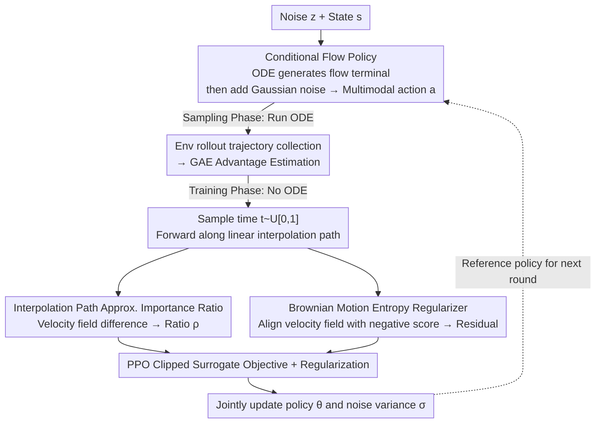

# PolicyFlow: Policy Optimization with Continuous Normalizing Flow in Reinforcement Learning

**Conference**: ICLR 2026  
**arXiv**: [2602.01156](https://arxiv.org/abs/2602.01156)  
**Code**: [Project Page](https://policyflow2026.github.io/)  
**Area**: Reinforcement Learning/Policy Optimization  
**Keywords**: Continuous Normalizing Flows, PPO, Multimodal Policy, Importance Ratio Approximation, Brownian Motion Entropy Regularization

## TL;DR

This paper proposes PolicyFlow, which seamlessly integrates Continuous Normalizing Flow (CNF) policies into the PPO framework. By approximating importance ratios through velocity field changes along an interpolation path (avoiding backpropagation through the full ODE path) and introducing an implicit entropy regularizer inspired by Brownian motion to prevent mode collapse, PolicyFlow achieves or exceeds the performance of Gaussian PPO and flow-based baselines (FPO/DPPO) in environments such as MultiGoal, PointMaze, IsaacLab, and MuJoCo.

## Background & Motivation

**Background**: PPO is the most mainstream policy gradient method for online reinforcement learning, widely used in robotic control and LLM alignment. Its core involves updating the policy via importance ratios, typically assuming a Gaussian distribution to simplify likelihood calculations. However, Gaussian policies can only represent unimodal distributions and fail to model complex multimodal actions.

**Limitations of Prior Work**:

- **Insufficient expressivity of Gaussian policies**: In scenarios requiring multi-goal reaching or multi-path planning, Gaussian policies can only cover a single mode.
- **High computational cost of likelihood for generative policies**: While CNF and diffusion models are sufficiently expressive, calculating importance ratios requires backpropagation through the entire ODE path—which is memory-intensive and leads to unstable gradients.
- **Bias issue in FPO**: FPO estimates importance ratios via ELBO but suffers from asymmetric estimation bias (reliable when the ratio increases, unreliable when it decreases), requiring larger batches for stability.
- **Limitations of DPPO**: DPPO treats the diffusion process as an internal MDP, making it suitable for fine-tuning but causing performance degradation when training from scratch due to a lack of off-manifold exploration.
- **Difficulty in entropy regularization**: The action log-likelihood of flow-based policies is difficult to compute directly, rendering traditional entropy regularization methods inapplicable.

## Method

### Overall Architecture

PolicyFlow treats a continuous normalizing flow as the PPO policy. It uses a flow model to generate actions from noise for multimodal expressivity, employs an approximation that bypasses ODE path backpropagation to compute importance ratios, and finally performs implicit entropy maximization using a regularizer inspired by Brownian motion. The key to this framework is running the expensive ODE only once during trajectory sampling; the training phase is simplified to forward computations of the velocity field. This division of labor—"ODE for sampling, forward-only for training"—is the core reason for the method's efficiency.

### Key Designs

**1. Conditional Flow Policy: Using flow terminals plus noise for Gaussian mixture expressivity**

Gaussian policies can only represent unimodal actions. PolicyFlow instead uses a conditional flow $\varphi:[0,1]\times\mathbb{R}^d\times\mathbb{R}^n\to\mathbb{R}^d$ to generate actions, governed by the ODE $\frac{d}{dt}\varphi_t(\mathbf{z};\mathbf{s}) = v_t(\varphi_t(\mathbf{z};\mathbf{s});\mathbf{s})$ with initial value $\varphi_0(\mathbf{z};\mathbf{s})=\mathbf{z}$, where $v$ is a time-dependent velocity field parameterized by a neural network. The final action is the flow terminal plus additive Gaussian noise: $\mathbf{a}=\varphi_1(\mathbf{z};\mathbf{s})+\mathbf{n}$, where $\mathbf{z}\sim\mathcal{N}(\mathbf{0},\mathbf{I})$ and $\mathbf{n}\sim\mathcal{N}(\mathbf{0},\boldsymbol{\sigma}^2)$. Integrating over $\mathbf{z}$, the policy $\pi(\mathbf{a}|\mathbf{s})=\int\mathcal{N}(\mathbf{a};\varphi_1(\mathbf{z};\mathbf{s}),\boldsymbol{\sigma}^2)p_z(\mathbf{z})d\mathbf{z}$ becomes a mixture distribution strictly more powerful than a single Gaussian. This tail Gaussian noise is not just for exploration; its Gaussian nature allows the importance ratio to be expanded analytically.

**2. Importance Ratio Approximation via Interpolation Path: Replacing ODE path integrals with a single velocity field forward difference**

PPO requires calculating the likelihood ratio $\rho$ between new and old policies. For flow policies, this would normally involve backpropagation through the entire ODE trajectory—resulting in high memory usage and unstable gradients. PolicyFlow first leverages the translation invariance of Gaussian likelihood ratios to simplify the ratio into a form depending only on the flow terminal displacement difference $\delta_{\varphi_1}$. It then uses the velocity field difference $\delta_{v_t}=v_t(\mathbf{x}_t;\mathbf{s},\theta)-\hat{v}_t(\mathbf{x}_t;\mathbf{s})$ along a linear interpolation path $\mathbf{x}_t=(1-t)\mathbf{z}+t\hat{\varphi}_1(\mathbf{z};\mathbf{s})$ to substitute for the terminal displacement difference, yielding:

$$\rho \approx \mathbb{E}_{p(t)}\left[\frac{p_n(\mathbf{a}-\hat{\varphi}_1; \delta_{v_t}(\mathbf{x}_t;\mathbf{s}), \boldsymbol{\sigma}^2)}{p_n(\mathbf{a}-\hat{\varphi}_1; \mathbf{0}, \hat{\boldsymbol{\sigma}}^2)}\right]\,.$$

Theoretically, the error of this approximation is $\mathcal{O}(\epsilon)$, where $\epsilon$ is exactly the PPO clipping range. Since policy updates are already restricted to small steps, the first-order approximation is sufficiently accurate within this range, and errors are naturally suppressed by the clipping mechanism. Substituting this into the standard PPO objective yields the clipped surrogate $J^{\text{Flow}}(\theta,\boldsymbol{\sigma})=\mathbb{E}[\min(\rho\hat{A},\text{clip}(\rho,1-\epsilon,1+\epsilon)\hat{A})]$. The entire training process no longer requires any ODE simulation.

**3. Brownian Motion Entropy Regularizer: Preventing mode collapse without computing log-likelihood**

As action likelihoods for flow policies are hard to calculate directly, traditional entropy regularization fails, causing FPO/DPPO to suffer from mode collapse. PolicyFlow employs a physical intuition: Brownian motion particles naturally diffuse and entropy increases monotonically, with probability paths following the heat equation $\partial p_t/\partial t=\nabla^2 p_t$, where the corresponding velocity field is exactly the negative score $v_t=-\nabla\log p_t$. Thus, aligning the policy velocity field with the negative score of a reference flow is equivalent to making trajectories more "dispersed," implicitly increasing entropy. Using the explicit relationship between the score and velocity field $\nabla_{\mathbf{x}}\log\hat{p}_t(\mathbf{x}_t;\mathbf{s})=\frac{1}{1-t}(t\hat{v}_t(\mathbf{x}_t;\mathbf{s})-\mathbf{x}_t)$, the alignment residual is defined as $\eta_t=(1-t)v_t(\mathbf{x}_t;\mathbf{s},\theta)-(\mathbf{x}_t-t\hat{v}_t(\mathbf{x}_t;\mathbf{s}))$. Penalizing its norm turns entropy maximization into pure forward speed-score alignment, completely bypassing likelihood calculations.

### Loss & Training

The total training objective adds a regularization term to the clipped surrogate. $J^{\text{Reg}}$ consists of two parts: the Brownian regularizer $-w_b\|\eta_t\|_2^2$ pushes the velocity field to align with the negative score to promote trajectory diffusion, and the Gaussian noise entropy $\frac{w_g}{2}\sum_i\log(2\pi e\sigma_i^2)$ encourages randomness in the terminal noise. Together, $J^{\text{Flow}}+J^{\text{Reg}}$ are optimized. The iteration process is as follows: first, sample trajectories using the reference policy (running the ODE to generate $\hat{\varphi}_1$) and compute GAE advantage estimates; then, sample time $t\sim U[0,1]$ on mini-batches and compute the approximate ratio $\rho$ and Brownian residual $\eta_t$ via a single forward pass along the interpolation path; finally, jointly update the policy parameters $\theta$ and noise variance $\boldsymbol{\sigma}$. The ODE only appears in the sampling phase; the training phase neither simulates the ODE nor backpropagates along the path, which is why it can utilize flow models without sacrificing efficiency.

## Key Experimental Results

### Main Results: IsaacLab Benchmark

| Environment | PPO | PolicyFlow | p-value |
|------|-----|-----------|---------|
| Lift-Cube | $153.1\pm3.0$ | $\mathbf{154.6\pm0.6}$ | 0.32 |
| Navigation | $3.5\pm0.3$ | $\mathbf{4.2\pm0.1}$ | **0.0027** |
| Open-Drawer | $\mathbf{99.8\pm1.7}$ | $99.1\pm0.7$ | 0.41 |
| Quadcopter | $\mathbf{141.8\pm0.5}$ | $141.0\pm0.09$ | 0.099 |
| Anymal-D | $24.5\pm0.1$ | $\mathbf{24.6\pm0.2}$ | 0.26 |
| G1 | $25.4\pm1.2$ | $\mathbf{30.0\pm1.1}$ | **0.00026** |
| H1 | $\mathbf{29.3\pm0.9}$ | $27.3\pm0.2$ | **0.0069** |
| Go2 | $\mathbf{27.9\pm0.3}$ | $27.4\pm0.9$ | 0.33 |

PolicyFlow performs comparably to or better than PPO in most IsaacLab tasks, significantly outperforming PPO on the G1 humanoid robot (+18%) and showing statistically significant advantages in Navigation.

### Efficiency Comparison

| Environment | Embedding Dim | PPO (ms) | PolicyFlow (ms) | Gain |
|------|--------------|----------|-----------------|------|
| Lift-Cube | 64 | 43.0 | 57.7 | +34% |
| Navigation | 64 | 36.9 | 54.1 | +47% |
| Open-Drawer | 64 | 81.3 | 104.1 | +28% |
| Quadcopter | 64 | 37.8 | 55.6 | +47% |
| Anymal-D | 64 | 41.2 | 57.1 | +39% |
| G1 | 256 | 66.9 | 90.6 | +35% |
| H1 | 512 | 63.4 | 115.5 | +82% |
| Go2 | 512 | 63.9 | 111.5 | +74% |

When model parameters are comparable to PPO, training time per iteration increases by <50%. Even when embedding dimensions increase 8-fold, the computational cost remains less than twice that of PPO.

### Multimodal Capability (MultiGoal)

In a MultiGoal environment with 6 equidistant targets: PPO (Gaussian policy) can only cover partial targets; FPO/DPPO also suffer from mode collapse due to the lack of effective entropy regularization. PolicyFlow with the Brownian regularizer achieves the most balanced reach across all 6 targets, demonstrating the multimodal expressivity of CNF. Ablations show: uniform noise injection alone leads to mode collapse → Gaussian entropy regularization partially mitigates this → adding the Brownian regularizer is optimal.

### Ablation Study

- **Clipped Range $\epsilon$**: Smaller $\epsilon$ reduces approximation error but limits update step size (slower learning); $\epsilon=0.2$ is the best balance.
- **Network Initialization**: Glorot initialization + zero-out last layer (GI+ZOL) > Standard Glorot (GI) > Zero Initialization (ZI).
- **Time Sampling**: Continuous uniform (USC), discrete uniform (USD), and multi-point discrete uniform (Multi-USD) show little difference; USD is chosen as default for simplicity.
- **Interpolation Path**: Rectified Flow and TrigFlow paths outperform Stochastic Interpolant on MultiGoal; no significant difference in locomotion tasks.

## Highlights & Insights

- ⭐⭐⭐ **Sophisticated Importance Ratio Approximation**: By leveraging the translation invariance of Gaussian likelihood ratios and interpolation path approximations, the expensive ODE path integral is transformed into a simple forward calculation of velocity field differences, with error naturally controlled by the PPO clipping range.
- ⭐⭐⭐ **Brownian Motion Entropy Regularizer**: An elegant design based on physical intuition—requiring neither log-likelihood calculations nor heuristic noise injection, it achieves implicit entropy maximization directly through speed-score alignment.
- ⭐⭐ **Broad Experimental Coverage**: Validates the method's generality across tasks ranging from simple 2D multi-goal to the IsaacLab robotics suite (manipulation, navigation, gait, quadcopter).
- ⭐⭐ **Honest Efficiency Analysis**: Clearly reports training time overhead (+28% to +82%), acknowledging additional costs in higher dimensions.

## Limitations & Future Work

- ⭐⭐ **Limited Theoretical Foundation for Brownian Regularizer**: The authors admit this is not a strictly rigorous theoretical derivation—the policy velocity field is not obtained from flow matching gradients and does not perfectly correspond to rectified flow dynamics; it is more of a heuristic design.
- ⭐⭐ **Significantly Increased Computational Overhead at High Dimensions**: Training time approaches twice that of PPO in H1/Go2 environments with embedding=512, which may be a bottleneck for large-scale deployment.
- ⭐ **Lack of Direct Comparison with FPO/DPPO on IsaacLab**: Due to framework differences (JAX vs PyTorch), direct comparisons were not performed, making relative advantages on these benchmarks unconfirmed.
- ⭐ **Tested Only on Medium-Dimensional Action Spaces**: The method's scalability has yet to be verified in ultra-high-dimensional action spaces (e.g., dexterous hand manipulation).

<!-- RELATED:START -->

## Related Papers

- [\[ICLR 2026\] Flow Matching Policy Gradients](flow_matching_policy_gradients.md)
- [\[ICLR 2026\] Guided Flow Policy: Learning from High-Value Actions in Offline Reinforcement Learning](guided_flow_policy_learning_from_high-value_actions_in_offline_reinforcement_lea.md)
- [\[ICLR 2026\] Reinforcement Learning via Value Gradient Flow](reinforcement_learning_via_value_gradient_flow.md)
- [\[ICLR 2026\] Bridging Successor Measure and Online Policy Learning with Flow Matching-Based Representations](bridging_successor_measure_and_online_policy_learning_with_flow_matching-based_r.md)
- [\[ICLR 2026\] Belief-Based Offline Reinforcement Learning for Delay-Robust Policy Optimization](belief-based_offline_reinforcement_learning_for_delay-robust_policy_optimization.md)

<!-- RELATED:END -->
## Related Papers

- [\[ICLR 2026\] Flow Actor-Critic for Offline Reinforcement Learning (FAC)](flow_actor-critic_for_offline_reinforcement_learning.md)
- [\[ICLR 2026\] Guided Flow Policy: Learning from High-Value Actions in Offline Reinforcement Learning](guided_flow_policy_learning_from_high-value_actions_in_offline_reinforcement_lea.md)
- [\[ICLR 2026\] Reinforcement Learning via Value Gradient Flow](reinforcement_learning_via_value_gradient_flow.md)
- [\[ICLR 2026\] Parameter-Efficient Reinforcement Learning using Prefix Optimization](parameter-efficient_reinforcement_learning_using_prefix_optimization.md)
- [\[ICLR 2026\] One-Step Flow Q-Learning: Addressing the Diffusion Policy Bottleneck in Offline RL](one-step_flow_q-learning_addressing_the_diffusion_policy_bottleneck_in_offline_r.md)

<!-- RELATED:END -->
