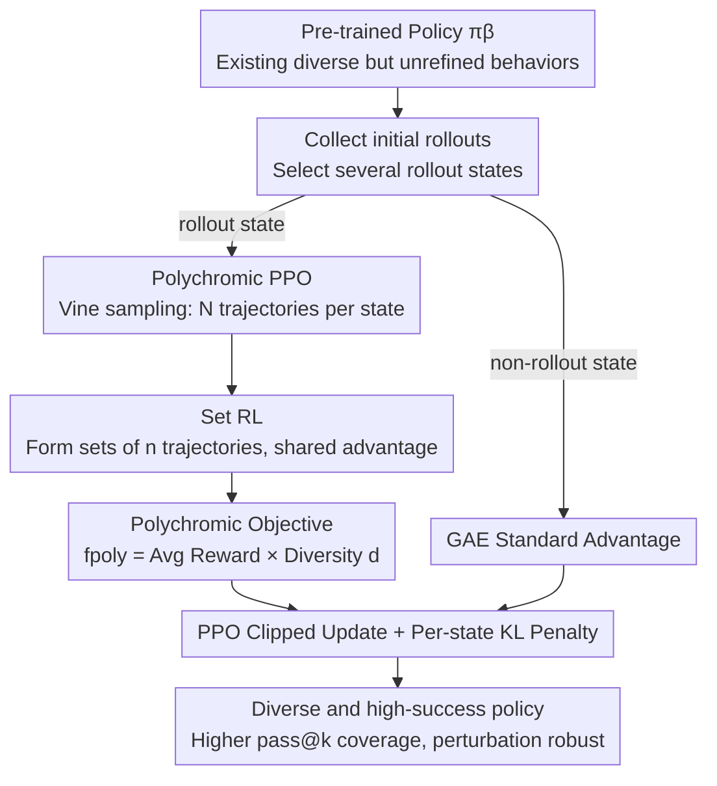

# Polychromic Objectives for Reinforcement Learning

**Conference**: ICLR 2026  
**OpenReview**: [https://openreview.net/forum?id=zzTQISAGUp](https://openreview.net/forum?id=zzTQISAGUp)  
**Code**: TBD  
**Area**: Reinforcement Learning / RLFT / Exploration  
**Keywords**: RL Fine-tuning, Entropy Collapse, Diversity Exploration, Set RL, Vine Sampling, PPO

## TL;DR
To address the problem where Reinforcement Learning Fine-tuning (RLFT) tends to collapse the policy into a few high-reward behaviors and discard the diversity of the pre-trained model, this paper proposes "polychromic objectives." This method couples reward with diversity, assigning high scores only to sets of trajectories that are both "successful and diverse." By integrating vine sampling and set-shared advantages into PPO (Polychromic PPO), the method achieves higher success rates, greater pass@k coverage, and stronger perturbation robustness across BabyAI, Minigrid, and Algorithmic Creativity tasks.

## Background & Motivation
**Background**: Reinforcement Learning Fine-tuning (RLFT) has become the mainstream approach for aligning pre-trained large models to downstream tasks, forming the basis for instruction following and complex reasoning in LLMs. Pre-trained distributions, trained on massive datasets, carry a large set of "promising but unrefined" diverse strategies. The role of RLFT should be to reinforce those strategies that are more reliable and yield higher returns.

**Limitations of Prior Work**: In practice, RLFT often suffers from **entropy collapse**. Instead of expanding its repertoire, the fine-tuned policy concentrates probability mass on a few high-reward behaviors already present and easily exploitable in the pre-trained distribution, sacrificing entropy and diversity. This is most evident in the pass@n metric: when $n$ is large, the RL-fine-tuned model often underperforms compared to the original pre-trained model because the latter preserves higher diversity. Diversity is crucial for generalizing to new tasks and scaling test-time compute (sampling multiple times and selecting the best).

**Key Challenge**: An inherent trade-off exists between diversity and accuracy. The objective of standard RL is to "maximize the likelihood of the single best trajectory," which naturally pushes probability mass toward one or two winner trajectories. Standard regularizations like entropy bonuses only create token-level or local stochastic jitter, failing to achieve semantic-level or trajectory-level exploration, and are easily overshadowed by the primary RL objective.

**Goal**: Design an objective function that enables the policy to **actively explore and refine the diverse trajectories** within the pre-trained distribution during the RLFT process, rather than collapsing to a few.

**Key Insight**: The authors observe that the root cause lies in the "granularity of the optimization target." As long as the optimization objective is defined on a **single** trajectory, it will favor a winner-take-all outcome. To encourage diversity, the objective must be defined on a **set** of trajectories, using multi-sample standards to evaluate quality.

**Core Idea**: Upgrade the optimization target of RL from a "single trajectory" to a "set of independently sampled trajectories" (Set RL). Within this framework, design a "polychromic objective" ($f_{\text{poly}}$) that only rewards sets containing both successful and diverse trajectories, and implement it as an optimizable algorithm, Polychromic PPO.

## Method

### Overall Architecture
The method centers on a single concept: **Do not evaluate the quality of a single trajectory in isolation; instead, sample a set of trajectories, score the entire set, and reinforce the "successful + diverse" set as a whole.**

The framework consists of three layers: (1) A **set RL** framework that redefines the objective function from $R(\tau)$ on a single trajectory to $f(s_0, \tau_{1:n})$ on a set of $n$ independently sampled trajectories, proving that all trajectories within a set share the same advantage term. (2) An instantiation of the **polychromic objective** $f_{\text{poly}}$ within this framework, which multiplies average reward by diversity—granting high scores only to sets that are simultaneously successful and diverse. (3) The use of **vine sampling** to avoid the exponential cost of branching $n$ times at every state, embedding the set advantage into the clipped updates of PPO to create **Polychromic PPO**.

The following diagram illustrates the iteration process from a pre-trained policy to the final policy (rollout states follow the polychromic objective path, while other states revert to standard PPO):

### Key Designs

**1. Set RL: Changing the Optimization Target to a Trajectory Set**

Standard RL solves $\max_\theta \mathbb{E}_{\tau\sim\pi_\theta}[R(\tau)]$. Since the objective is defined on a single trajectory, it naturally seeks to increase the likelihood of the "single best trajectory," which is the root of collapse. Set RL modifies this to $\max_\theta \mathbb{E}_{\tau_{1:n}\sim\pi_\theta(\cdot|s_0)}[f(s_0,\tau_1,\dots,\tau_n)]$, where the objective is defined on a set of $n$ **independently sampled** trajectories. This can still be optimized using policy gradients: $\nabla_\theta\mathbb{E}[f] = \mathbb{E}\big[(f(s_0,\tau_{1:n})-\hat f(s_0))\sum_{i=1}^{n}\sum_{t}\nabla_\theta\log\pi_\theta(a_t^{(i)}|s_t^{(i)})\big]$, where the baseline is $\hat f(s_0)=\mathbb{E}_{\tau_{1:n}}[f(s_0,\tau_{1:n})]$.

A crucial feature is the **set-shared advantage**: the advantage term $f(s_0,\tau_{1:n})-\hat f(s_0)$ is multiplied by the gradient of **every** trajectory in the set. This is the opposite of the leave-one-out trajectory-specific baseline in Tang et al. (2025). Set RL intentionally **does not distinguish between trajectories within the set**, comparing different sets as holistic units instead. This is vital: because of the shared signal, an exploratory trajectory that "has not yet achieved high rewards but contributes to diversity" can be reinforced by the same positive signal, rather than being penalized individually. The authors extend the performance difference lemma to set RL, defining set value functions $V^\sharp_\pi$ and set Q-functions $Q^\sharp_\pi$ (requiring $\gamma\in(0,\tfrac1n)$ for boundedness), proving that ensuring positive set advantages $A^\sharp$ across visited states leads to monotonic improvement.

**2. Polychromic Objective: Reward × Diversity**

The instantiated polychromic objective is:

$$f_{\text{poly}}(s,\tau_{1:n}) := \Big(\frac{1}{n}\sum_{i=1}^{n}R(\tau_i)\Big)\, d(s,\tau_{1:n}),$ \

where $R(\tau_i)$ is the discounted return of a single trajectory and $d(s,\tau_{1:n})$ measures the diversity of the set, both normalized to $[0,1]$. Using **multiplication** instead of addition is a key design choice: the score is high only when the set **contains both successful trajectories (non-zero reward) and diverse trajectories (non-zero diversity)**. Coupled with set-shared advantages, this objective increases the likelihood of both successful behaviors and exploratory trajectories. The objective is **agnostic** to the diversity metric $d$: one could use Vendi Score, classifier-guided diversity, etc. In experiments, $d$ is defined as the "proportion of unique trajectories in the set" (e.g., in Minigrid, trajectories are unique if they visit different sets of rooms).

**3. Polychromic PPO: Vine Sampling + Set Advantage**

Implementing set advantages directly requires sampling $n$ actions at **every visited state** and expanding them, leading to exponential data requirements. To solve this, the authors use **vine sampling**: they sample initial rollouts under the behavior policy $\pi_\beta$, select a subset of visited states $\{s_1,\dots,s_p\}$ as **rollout states**, and reset the environment at each $s_i$ to generate $N$ additional trajectories ("vines"). This obtains sets of independent trajectories only at selected states, avoiding full tree expansion (**requiring a resettable environment**).

At rollout states, sets are formed from $N>n$ trajectories to estimate the polychromic advantage $A^\sharp(s_t,a_t;f_{\text{poly}})$. Since PPO requires **per-action** advantages, the advantage of "the set containing that action" is assigned to the action. Thus, all actions branching from $s_t$ in the same set receive the same update signal. The value baseline $\hat V^\sharp(s_t)$ is estimated via Monte Carlo. For **non-rollout states**, the update reverts to standard PPO using GAE. A per-state KL penalty $D_{\text{KL}}(\pi_\beta(\cdot|s)\,\|\,\pi_\theta(\cdot|s))$ is added to maintain training stability.

### Loss & Training
- Follows the PPO clipped objective $\mathbb{E}[\min(r_t\hat A,\ \mathrm{clip}(r_t,1-\epsilon,1+\epsilon)\hat A)]$, replacing $\hat A$ with the polychromic set advantage at rollout states.
- Advantage is shared within the set at rollout states, boosting exploratory trajectories.
- A per-state KL penalty is added at every state for stability.
- Policies are pre-trained on expert demonstrations before starting RLFT.

## Key Experimental Results

Evaluated on BabyAI, Minigrid, and Algorithmic Creativity (long-horizon, sparse reward tasks), comparing against REINFORCE (with baseline), standard PPO, and variants with UCB exploration bonuses $\lambda_{\text{UCB}}\cdot\min\{1,N(s,a)^{-1/2}\}$.

### Main Results
(Mean Return, Success Rate %) on BabyAI / Minigrid (100 rollouts × 50 configs × 3 seeds):

| Environment | Pre-trained | REINFORCE | PPO | Poly-PPO (Ours) | Poly-PPO w/ UCB |
|------|--------|-----------|-----|------------------|-----------------|
| Goto | (0.246, 34.2) | (0.533, 73.0) | (0.406, 46.2) | **(0.575, 80.2)** | (0.561, 76.2) |
| Pickup | (0.141, 21.4) | (0.259, 39.8) | (0.283, 33.4) | (0.452, 63.2) | **(0.486, 65.6)** |
| Bosslevel | (0.212, 20.6) | (0.266, 33.4) | (0.336, 38.8) | (0.378, 45.2) | **(0.379, 46.8)** |
| Four Rooms | (0.469, 70.4) | (0.639, 89.6) | (0.618, 89.2) | (0.666, 92.4) | **(0.667, 93.2)** |

Poly-PPO consistently matches or exceeds the best baselines. UCB is complementary and further improves performance on Pickup / Bosslevel when combined with Poly-PPO.

### Diversity / Coverage and Robustness
- **pass@k**: The pass rate of Poly-PPO is $\ge$ the pre-trained policy across nearly all $k$ and significantly higher than all baselines. Its curve continues to rise until $k\approx80$, while baselines saturate at $k\approx20$.
- **Algorithmic Creativity**: Poly-PPO outperforms all methods, including the pre-trained model, in diversity (unique valid triangles) and creativity (proportion of valid triangles not in pre-training data).
- **Generalization to State Perturbations (pass@1, initial state moved to different rooms)**:

| Environment | Pre-trained | REINFORCE | PPO | Poly-PPO |
|------|--------|-----------|-----|----------|
| Goto | 30.2 | 41.3 | 21.1 | **60.6** |
| Pickup | 15.2 | 22.0 | 12.5 | **33.4** |
| Four Rooms | 65.0 | 82.7 | 15.3 | **88.7** |

Standard PPO collapses significantly under perturbation (e.g., 15.3 in Four Rooms), whereas Poly-PPO remains robust due to preserving a diverse strategy library.

### Key Findings
- **Multiplicative "Reward × Diversity" + Shared Advantage** is the core: it reinforces exploratory trajectories even before they succeed, expanding coverage. Pure UCB bonuses only provide limited improvement for small $k$.
- Success rate can mask coverage differences—a policy overfitted to certain configurations can have a high mean success rate, whereas pass@k reveals the true disparity.
- Entropy analysis in a bandit setting shows where the policy is most likely to collapse, providing theoretical groundedness.

## Highlights & Insights
- **Identifying "Optimization Granularity" as the Root Cause**: The paper insightfully notes that single-trajectory objectives lead to winner-take-all behavior, thus shifting the target to "trajectory sets."
- **Shared Advantage vs. Individual Credit Assignment**: Intentionally avoiding leave-one-out updates and using set-shared signals is the key mechanism that "lifts" exploratory trajectories.
- **Multiplicative Objective**: Forcing "both criteria to be met" prevents "high-reward, low-diversity" or "high-diversity, low-reward" sets from gaining high scores. This trick is transferable to any multi-metric objective design.
- **Agnostic to Diversity Measures**: $d$ can be swapped for any metric, making the method a general template.

## Limitations & Future Work
- **Reliance on Environment Resets**: Vine sampling requires resetting the environment at rollout states, which is not applicable to non-resettable or real-world online scenarios.
- **MC Value Baselines**: The use of unbiased MC estimates results in high variance; biased estimates could be used to reduce variance in the future.
- **Validity vs. Diversity Trade-off**: In the creativity task, Poly-PPO's validity was slightly lower than pure PPO, indicating that emphasizing exploration still incurs a slight cost in "single-attempt accuracy."
- **Benchmark Scale**: Experiments focused on grid-worlds and algorithmic tasks; validation on large-scale LLM RLFT is yet to be conducted.

## Related Work & Insights
- **vs. Entropy Bonuses**: Entropy bonuses produce token-level stochasticity that is easily overwhelmed; this method encourages semantic/trajectory-level diversity.
- **vs. Multi-Objective RL**: MORL still defines objectives on single trajectories; this method generalizes at the set level.
- **vs. Tang et al. (2025)**: While both use multi-sample objectives, Tang uses trajectory-specific (leave-one-out) baselines for credit assignment, whereas this work uses shared advantages to specifically avoid distinguishing within the set and promote diversity.

## Rating
- Novelty: ⭐⭐⭐⭐⭐ (A clean, theoretically supported framework shifting RL targets to trajectory sets with multiplicative objectives).
- Experimental Thoroughness: ⭐⭐⭐⭐ (Multiple environments and metrics, but lacks large-scale LLM validation).
- Writing Quality: ⭐⭐⭐⭐ (Logical flow from motivation to theory and algorithm).
- Value: ⭐⭐⭐⭐ (Directly addresses entropy collapse in RLFT with high potential for LLM application).

<!-- RELATED:START -->

## Related Papers

- [\[ICML 2025\] Optimizing Language Models for Inference Time Objectives using Reinforcement Learning](../../ICML2025/reinforcement_learning/optimizing_language_models_for_inference_time_objectives_using_reinforcement_lea.md)
- [\[AAAI 2026\] Revealing POMDPs: Qualitative and Quantitative Analysis for Parity Objectives](../../AAAI2026/reinforcement_learning/revealing_pomdps_qualitative_and_quantitative_analysis_for_parity_objectives.md)
- [\[ICLR 2026\] Understanding and Improving Hyperbolic Deep Reinforcement Learning](understanding_and_improving_hyperbolic_deep_reinforcement_learning.md)
- [\[ICLR 2026\] Parameter-Efficient Reinforcement Learning using Prefix Optimization](parameter-efficient_reinforcement_learning_using_prefix_optimization.md)
- [\[ICLR 2026\] ReTool: Reinforcement Learning for Strategic Tool Use in LLMs](retool_reinforcement_learning_for_strategic_tool_use_in_llms.md)

<!-- RELATED:END -->
