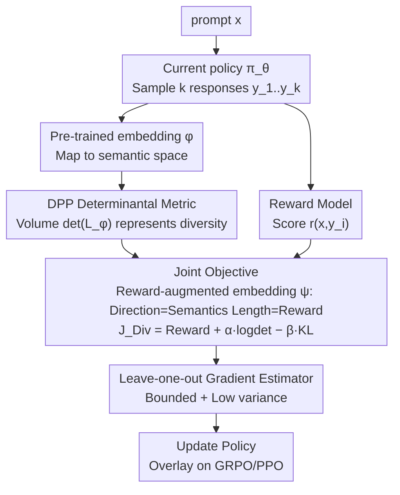

# Post-training Large Language Models for Diverse High-Quality Responses

**Conference**: ICLR 2026  
**arXiv**: [2509.04784](https://arxiv.org/abs/2509.04784)  
**Code**: [https://github.com/fairytale9/diversity-quality-optimization](https://github.com/fairytale9/diversity-quality-optimization)  
**Area**: Reinforcement Learning  
**Keywords**: Diversity, Determinantal Point Processes, GRPO, Post-training, Quality-Diversity Trade-off  

## TL;DR
The authors propose DQO (Diversity Quality Optimization), which defines a diversity metric in the semantic embedding space based on Determinantal Point Processes (DPP). By jointly optimizing this metric with reward signals, LLM post-training improves both semantic diversity and response quality. DQO can be integrated on top of GRPO/PPO.

## Background & Motivation

**Background**: LLM post-training (RLHF/GRPO, etc.) significantly improves performance on downstream tasks, but a primary side effect is the severe reduction in output diversity. Models tend to collapse toward narrow "standard answers," losing the ability to explore diverse solution paths and personalized styles.

**Limitations of Prior Work**: Existing methods to promote diversity focus on the inference stage (temperature scaling, top-k sampling) or only address token-level differences (token entropy regularization). These methods fail to recover modes missing from the base model distribution and cannot capture diversity at the semantic level.

**Key Challenge**: How to define a semantic diversity metric during the training phase that is both computationally efficient and theoretically rigorous while balancing quality objectives. Simple pairwise distance metrics often lead to degradation, where the model might only learn two widely separated clusters.

**Goal**: (a) Define a semantic-level diversity metric; (b) avoid cluster degradation associated with pairwise distances; (c) jointly optimize quality and diversity during training.

**Key Insight**: Utilize the determinant of a DPP to define diversity—the larger the volume spanned by the embedding vectors, the higher the diversity. Determinants naturally penalize linear correlation (clustering), thus overcoming the degradation problem of pairwise distances.

**Core Idea**: Use the DPP determinant as a semantic diversity metric and rewards as scaling factors for embedding vectors, then stabilize training via a leave-one-out gradient estimator.

## Method

### Overall Architecture
DQO addresses the conflict where post-training improves model quality but collapses diversity. It achieves this by adding a semantic diversity reward term to the standard RL post-training objective, integrated within the GRPO/PPO frameworks. For each prompt $x$, the current policy $\pi_\theta$ samples $k$ responses $y_{1:k}$, which are then mapped to a semantic space using a pre-trained embedding model $\phi$. The **DPP Determinantal Diversity Metric** measures the volume spanned by these semantic vectors $\det(L_\phi)$ as a diversity score. In the **Joint Quality-Diversity Objective**, rewards are folded into the embedding vector lengths via exponential scaling (reward-augmented embeddings $\psi$), ensuring that a "larger volume" implies both "high quality and semantic distinctness." Finally, a **Leave-one-out Gradient Estimator** replaces the unstable $\log\det$ objective with a bounded, low-variance surrogate to update the policy.

### Key Designs

**1. DPP Determinantal Diversity Metric: Defining Semantic Diversity via "Volume" instead of "Pairwise Distance"**

A naive approach is to use pairwise distances between responses as diversity, but this is easily exploited by "pseudo-diversity"—a model could learn two distant clusters, resulting in a large average distance while responses only fluctuate between two modes. This paper uses the DPP determinant: the (squared) volume of the parallelepiped spanned by $k$ response embeddings $\det(L_\phi(y_{1:k}))$ is treated as the diversity score. Geometrically, if vectors are more linearly independent and directions are more spread out, the determinant is larger. If they fall into the same low-dimensional subspace (clustering), the vectors become linearly dependent and the determinant approaches zero. Because the determinant is sensitive to linear dependence, it detects degradation where pairwise distances appear large but samples are actually cramped in a subspace.

**2. Joint Quality-Diversity Objective: Merging Reward into Embedding Length**

To balance diversity with quality, a DPP diversity term is added to the standard RL objective:

$$J_{Div}(\pi_\theta) = \mathbb{E}\Big[\textstyle\sum_i r(x,y_i) + \alpha \log\det(L_\phi(y_{1:k})) - \beta\, \text{KL}(\pi_\theta \| \pi_{ref})\Big]$$

where $\alpha$ adjusts the quality-diversity trade-off and $\beta$ is the KL constraint. The optimal policy for this objective can be written as $\pi_{div}(y_{1:k}|x) \propto \det(L_\psi(x,y_{1:k}))$. Crucially, the Gram matrix utilizes **reward-augmented embeddings** $\psi(x,y) = \sqrt{\exp(r/\alpha)\,\pi_{ref}(y|x)} \cdot \phi(y)$. Here, the semantics $\phi(y)$ determine the **direction** of the vector, while the exponentially scaled reward $r$ determines the **length**. Consequently, "maximizing volume" inherently requires vectors to be both long (high reward/quality) and orthogonal (semantically different/diverse). This provides a clean geometric interpretation and aligns theoretically with D-optimal experimental design.

**3. Leave-one-out Gradient Estimator: Stabilizing Training via Regularization and Baselines**

Calculating gradients directly for $\log\det(L)$ presents a major issue: when responses cluster and the determinant approaches zero, $\log\det$ approaches negative infinity, causing gradient explosion and training collapse. This paper employs a bounded and low-variance surrogate:

$$\log\frac{\det(L(y_{1:k})+I_k)}{\det(L(y_{-i})+I_{k-1})}$$

to replace the original $\log\det$. Adding the identity matrix $I_k$ as regularization clamps the value within the bounded range $[0, \log(1+k)]$, eliminating the negative infinity problem (proven in Lemma 1). Using the determinant of the set excluding the $i$-th response $\det(L(y_{-i})+I_{k-1})$ as a leave-one-out baseline removes components unrelated to the $i$-th sample, thereby reducing gradient variance. Together, these solve both stability and variance issues, making the method robust to the number of samples $k$.

### Loss & Training
- Can be overlaid on GRPO (for reasoning tasks) or PPO (for non-reasoning tasks).
- Hyperparameter $\alpha$ controls the quality-diversity trade-off; $k$ controls samples per prompt.
- Uses a Reward Model (rather than outcome rewards) for scoring to avoid reward hacking (where a model might provide a correct answer followed by random content to inflate diversity scores).

## Key Experimental Results

### Main Results

| Method | Dolly distinct-4↑ | Dolly self-rouge↑ | Dolly pass@1↑ | Dolly pass@10↑ |
|------|------------------|-------------------|---------------|----------------|
| PPO | 0.64 | 0.49 | 5.65 | 8.39 |
| GRPO-likelihood | 0.70 | 0.54 | 5.86 | 8.50 |
| GRPO-entropy | 0.75 | 0.57 | 4.71 | 7.70 |
| **DQO** | **0.69** | **0.54** | **5.92** | **8.74** |

| Method | GSM8K distinct-4↑ | GSM8K self-rouge↑ | GSM8K pass@1↑ | GSM8K pass@10↑ |
|------|------------------|-------------------|---------------|----------------|
| GRPO | 0.32 | 0.21 | 76.8 | 87.9 |
| GRPO-likelihood | 0.86 | 0.59 | 50.9 | 80.4 |
| GRPO-entropy | 0.38 | 0.25 | 77.0 | 92.6 |
| **DQO** | **0.42** | **0.31** | **76.3** | **91.2** |

### Ablation Study

| $\alpha$ | $k$ | distinct-4↑ | pass@1↑ | pass@10↑ |
|----------|-----|------------|---------|----------|
| 0 (PPO) | - | 0.64 | 5.65 | 8.39 |
| 0.5 | 4 | 0.69 | 5.84 | 8.79 |
| 1.0 | 4 | 0.69 | 5.92 | 8.74 |
| 2.0 | 4 | 0.75 | 5.27 | 7.86 |

### Key Findings
- DQO is the only method that maintains both high quality and high diversity across all tasks. GRPO-entropy performs well on diversity for GSM8K but suffers in quality on Dolly.
- DPP-determinant vs pairwise distance: In city recommendation experiments, pairwise distance led to two clusters, while determinants produced truly broad diversity.
- DQO's advantage becomes more pronounced as $n$ in pass@n increases—higher diversity increases the probability of finding a good answer in larger sample sizes.
- Excessively large $\alpha$ (e.g., 2.0) sacrifices pass@1 quality.

## Highlights & Insights
- Using the **DPP determinant as a diversity metric** resolves the degradation of pairwise distances and connects theoretically to D-optimal design. This metric is transferable to any scenario requiring set diversity (e.g., recommendation systems, active learning).
- The boundedness guarantee of the **leave-one-out gradient estimator** (Lemma 1) ensures training stability and robustness to $k$, representing a critical engineering contribution.
- Outcome rewards are found to be susceptible to reward hacking (answering correctly then writing nonsense); using a reward model is essential.

## Limitations & Future Work
- Diversity depends on the quality of the pre-trained embedding model; different embeddings may yield different results.
- Sampling $k$ responses and calculating determinants simultaneously increases GPU overhead during training.
- Diversity gains on reasoning tasks (GSM8K) are limited, likely because the diversity space for correct answers is inherently constrained.

## Related Work & Insights
- **vs GRPO-entropy (Yao et al.)**: Token-level entropy regularization fails to capture semantic diversity and results in significant quality degradation on non-reasoning tasks.
- **vs GRPO-likelihood (He et al.)**: Diversity methods based on generation probability perform poorly on reasoning tasks.
- **vs Chung et al.**: Weighting based on pairwise embedding distances for DPO is prone to clustering degradation.

## Rating
- Novelty: ⭐⭐⭐⭐ Combines DPP with LLM post-training, linking theory to experimental design.
- Experimental Thoroughness: ⭐⭐⭐⭐ 4 task types, multiple diversity metrics, comprehensive ablation.
- Writing Quality: ⭐⭐⭐⭐ Clear geometric interpretations and insightful connections to D-optimal design.
- Value: ⭐⭐⭐⭐ Practical contribution to the diversity problem in LLM post-training.

<!-- RELATED:START -->

## Related Papers

- [\[ICLR 2026\] Representation-Based Exploration for Language Models: From Test-Time to Post-Training](representation-based_exploration_for_language_models_from_test-time_to_post-trai.md)
- [\[ICLR 2026\] Using Reinforcement Learning to Train Large Language Models to Explain Human Decisions](using_reinforcement_learning_to_train_large_language_models_to_explain_human_dec.md)
- [\[ICLR 2026\] AutoQD: Automatic Discovery of Diverse Behaviors with Quality-Diversity Optimization](autoqd_automatic_discovery_of_diverse_behaviors_with_quality-diversity_optimizat.md)
- [\[ICLR 2026\] Risk-Sensitive Reinforcement Learning for Alleviating Exploration Dilemmas in Large Language Models](risk-sensitive_reinforcement_learning_for_alleviating_exploration_dilemmas_in_la.md)
- [\[ACL 2025\] MAPoRL: Multi-Agent Post-Co-Training for Collaborative Large Language Models with Reinforcement Learning](../../ACL2025/reinforcement_learning/maporl_multi-agent_post-co-training_for_collaborative_large_language_models_with.md)

<!-- RELATED:END -->
