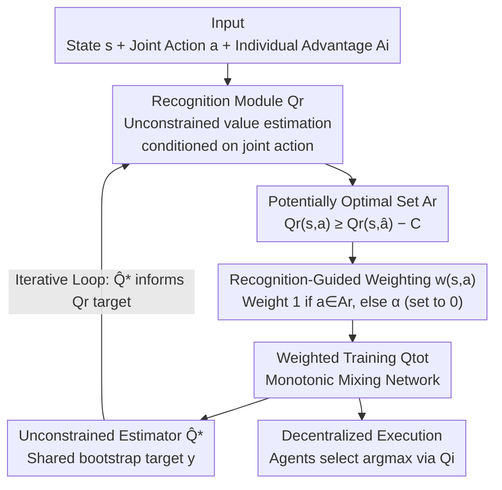

# Potentially Optimal Joint Actions Recognition for Cooperative Multi-Agent Reinforcement Learning

**Conference**: ICLR 2026  
**OpenReview**: [https://openreview.net/forum?id=YQ1muQBDV4](https://openreview.net/forum?id=YQ1muQBDV4)  
**Code**: To be confirmed  
**Area**: Reinforcement Learning / Multi-Agent  
**Keywords**: Cooperative MARL, Value Decomposition, Weighted Training, Optimal Joint Actions, QMIX

## TL;DR
Ours proposes POW (Potentially Optimal Joint Actions Weighting), which uses an explicit joint-action-conditioned recognition module $Q_r$ to iteratively "identify" a set of potentially optimal joint actions and assign them higher training weights. This theoretically guarantees the recovery of the true optimal policy, bridging the gap between the "theoretical promise" and "heuristic approximation" of the WQMIX series. It consistently outperforms value-based SOTA in tasks such as Matrix Games, Predator-Prey, SMAC/SMACv2, and highway-env.

## Background & Motivation
**Background**: In cooperative Multi-Agent Reinforcement Learning (MARL), Centralized Training and Decentralized Execution (CTDE) is the mainstream paradigm. Value decomposition methods decompose the joint action-value $Q_{tot}(\tau, a)$ into individual utilities $Q_i(\tau_i, a_i)$ and combine them using a mixing network. QMIX satisfies the IGM (Individual-Global-Max) property by enforcing monotonic mixing ($\partial Q_{tot}/\partial Q_i \geq 0$), which supports decentralized execution and achieved strong results on SMAC.

**Limitations of Prior Work**: While the monotonicity constraint guarantees IGM, it severely limits the expressiveness of the value function—it cannot represent many "non-monotonic" joint action-values. Consequently, it often converges to suboptimal policies in tasks with non-monotonic reward structures. Even if one agent selects the correct action, it may receive an incorrect penalty signal if teammates select incorrectly, leading to credit assignment failure.

**Key Challenge**: WQMIX previously noted that assigning higher training weights to optimal joint actions can alleviate this issue. However, identifying the true optimal joint action requires traversing the exponential joint action space, which is infeasible in practice. Consequently, practical variants like CW-QMIX anchor weights to $\arg\max Q_{tot}$ (instead of $\arg\max Q^*$), and OW-QMIX optimistically judges based directly on $Q_{tot}$ values—both are **heuristic approximations**. Suboptimal actions may receive large weights, while true optimal ones are suppressed. A gap remains between theoretical guarantees and practical implementation.

**Goal**: To find a weighting mechanism that **provably converges to the true optimal set** without traversing the joint action space or depending on heuristic approximations.

**Core Idea**: Introduce an explicit recognition module $Q_r$ conditioned on joint action $a$ to approximate the unconstrained optimal value $\hat Q^*$. This is used to identify a set of "potentially optimal joint actions" $A_r$, and then only actions in $A_r$ are given high weights to train $Q_{tot}$. The authors prove that $A_r$ shrinks to include the true optimal actions over iterations, aligning the theoretical guarantees of "weighted value decomposition" with practice for the first time.

## Method

### Overall Architecture
POW consists of three mutually reinforcing networks sharing the same Q-learning bootstrap target $y$:

- **$\hat Q^*$ (Unconstrained Optimal Value Estimator)**: Approximates the true optimal joint action-value $Q^*$ without any decomposition or monotonicity constraints, providing a shared bootstrap target for all networks.
- **$Q_{tot}$ (Monotonic Mixing Network)**: Can be any value decomposition network satisfying IGM (e.g., QMIX, VDN, QPLEX), responsible for supporting decentralized execution. Its ability to learn the optimal policy depends on the correct weighting of "optimal vs. suboptimal joint actions" during training.
- **$Q_r$ (Potentially Optimal Joint Action Recognition Module)**: Explicitly takes the global state $s$, joint action $a$, and fixed individual advantages $A_i$ as input to approximate $\hat Q^*$ (and $Q^*$ in theoretical analysis). Its output determines the adaptive training weight for each joint action.

These three form a closed loop: $Q_r$ proposes the potentially optimal action set $A_r$ → Weights $w(s,a)$ derived from $A_r$ shape the update of $Q_{tot}$ → $\hat Q^*$ uses the updated $Q_{tot}$ for consistent bootstrapping → Which in turn serves as the approximation target for $Q_r$. This recognition-weighting cycle persists throughout training.

### Key Designs

**1. Recognition Module $Q_r$ Conditioned on Joint Actions: Expressing Non-monotonic Values without Breaking IGM**

The pain point is that monotonic mixing cannot suppress non-monotonic joint action values, and joint action inputs in methods like QPLEX were only used to "improve the expressiveness of $Q_{tot}$" without being tied to a weighting mechanism. POW uses the joint action input directly for "recognition." The form of $Q_r$ is:

$$Q_r(\tau, a) = \sum_{i=1}^{n} \lambda_i(s, a)\left(Q_i(\tau_i, a_i) - \max_{a_i \in A_i} Q_i(\tau_i, a_i)\right) + V(s),$$

where $\lambda_i(s,a) \geq 0$ is a scaling factor generated by a hypernetwork (taking $s$ and $a$ as input, with absolute values to guarantee non-negativity). The "centered" term in parentheses subtracts the individual optimal choice from each agent's action-value, characterizing "whether this joint action sacrifices any agent's individual optimum"; $V(s)$ captures the state-dependent shared value. The elegance of this construction is that $\arg\max$ of $Q_r$ is equivalent to the respective $\arg\max$ of $Q_i$ if and only if each $a_i$ is individually optimal—**naturally satisfying IGM without monotonic constraints on the underlying $Q_i$**, thus preserving the ability to express non-monotonic values.

**2. Potentially Optimal Joint Action Set $A_r$: Using a Tolerance Band to Encompass "Possible Optimal" Candidates instead of Deadlocking a Single Greedy Action**

With $Q_r$ able to reliably distinguish joint actions, a candidate set can be defined. Let $A_{igm}$ be the set of joint actions obtained via greedy selection by each agent. Taking $\hat a \in A_{igm}$, then:

$$A_r := \{a \in A \mid Q_r(s, a) \geq Q_r(s, \hat a) - C\},$$

where $C \geq 0$ is a small tolerance constant to ensure stability. This definition ensures that $A_r$ contains at least the joint greedy action while including other "nearly optimal" promising actions. The key theoretical support is **Theorem 1 (Inclusion of Optimal Actions)**: If $Q_r$ converges to $Q^*$, the true optimal joint action set $A_{tgm} \subseteq A_r$—meaning $A_r$ is guaranteed **not to miss** the optimal action. This is the fundamental difference from CW/OW-QMIX, which use heuristic argmax of $Q_{tot}$ as anchors and may mistake suboptimal actions for optimal ones; POW uses a provably convergent recognizer to frame candidates, preferring to include more candidates than to omit the true optimum.

**3. Recognition-guided Weighting Function $w(s,a)$: Aligning Theory to Practice by Allowing only Candidate Actions to Contribute Gradients**

Once the candidate set is framed, the weight function is minimalist:

$$w(s, a) = \begin{cases} 1, & a \in A_r \\ \alpha, & a \notin A_r,\ \alpha \in [0,1) \end{cases}$$

In all experiments, $\alpha = 0$ is used, meaning **only joint actions within $A_r$ participate in the update of $Q_{tot}$**, effectively excluding interference from suboptimal actions. The training objective for $Q_{tot}$ is $\mathcal{L}_{Q_{tot}} = \mathbb{E}[w(s,a)(Q_{tot}(s,a) - y)^2]$, where the bootstrap target is $y = r + \gamma \hat Q^*(s', \arg\max_a Q_{tot}(s', a))$. **Theorem 2 (Convergence of Weighted Training)** proves: If $A_r$ converges to containing only optimal joint actions, $Q_{tot}$ can recover the optimal policy—when $\arg\max_a Q_{tot} = \arg\max_a \hat Q^*$, $\hat Q^*$ becomes the true optimal value function $Q^*$ according to the Bellman equation. This makes the "ideal weighting" of WQMIX a provably correct implementation for the first time.

**4. Iterative Weighted Training Loop: Allowing the Candidate Set to Progressively Shrink to the True Optimal Set**

POW iterates through three steps: (1) Update $Q_r$ with a supervised objective to approximate $\hat Q^*$; (2) Update $Q_{tot}$ using weights $w(s,a)$ derived from the current $A_r$; (3) Update $\hat Q^*$ based on the updated $Q_{tot}$. These three cycle repeatedly. Unlike the one-time heuristic approximation of CW/OW-QMIX, this iterative format allows $A_r$ to **gradually shrink** towards the true optimal set—$A_r$ is larger early on when $Q_r$ is inaccurate (fault tolerance) and tightens as $Q_r$ converges, eventually closing the gap between theory and practice. Note that when updating $Q_r$, only the mixing function parameters are modified, while underlying individual value function parameters remain fixed.

### Loss & Training
The three networks share the same TD target $y = r + \hat Q^*(\tau', \arg\max_a Q_{tot}(\tau', a))$ and optimize separately:

$$\mathcal{L}_{\hat Q^*} = \mathbb{E}[(\hat Q^*(\tau,a) - y)^2],\quad \mathcal{L}_{Q_{tot}} = \mathbb{E}[w(s,a)(Q_{tot}(\tau,a) - y)^2],\quad \mathcal{L}_{Q_r} = \mathbb{E}[(Q_r(\tau,a) - y)^2].$$

The implementation is based on PyMARL2, with all results averaged over 5 random seeds and reported with 95% confidence intervals. $Q_r$ introduces approximately 15–20% training time overhead, which the authors position as an effective trade-off between computational cost and policy quality.

## Key Experimental Results

### Main Results
POW-QMIX is instantiated by applying POW to QMIX, covering Matrix Games, Predator-Prey, SMAC, SMACv2, and highway-env benchmarks.

| Task | Observation | POW-QMIX | Comparison |
|------|-----------|----------|------------|
| Matrix Games (Strongly non-monotonic) | $Q_r$ accurately estimates all joint values and identifies optimal set. | Recovers optimal policy | QMIX/OW-QMIX converge to suboptimal; CW-QMIX, ResQ succeed |
| Predator-Prey ($p=-3/-4/-5$) | Non-monotonicity increases with mis-capture penalty. | **Unique** stable learner of optimal strategy across all penalties. | Baselines generally fail |
| SMAC (6 maps, 1 easy, 1 hard, 4 super hard) | SMAC is largely monotonic. | Matches or exceeds baselines; stable. | CW-QMIX scales poorly; QPLEX is unstable |
| highway-env Intersection | Safety-efficiency trade-off. | Best overall performance; balances safety and efficiency. | CW-QMIX is too conservative; QPLEX unstable; QMIX learns slowly |
| SMACv2 (Measured by Mean Return) | Win rates saturated in most tasks. | Consistently leads in most tasks. | QPLEX strong in Protoss but collapses in Zerg |

Visualization of Matrix Games (Fig. 2) is telling: POW-QMIX's $Q_r$ restores value for all 9 joint actions accurately (the true optimal 7.9 cell is correctly identified), whereas QMIX compresses the optimal cell to negative values due to monotonicity, and OW-QMIX is distorted by global overestimation.

### Ablation Study

**(a) Integrating POW into VDN / QPLEX** (Tab. 1, Return for Predator-Prey/SMACv2, Win Rate for Crossroads/SMAC, ↑ indicates Gain over corresponding baseline):

| Algorithm | P-P $p{=}{-}4$ | P-P $p{=}{-}5$ | 3s_vs_5z | corridor | MMM2 | protoss | terran | zerg |
|-----------|---------------|---------------|----------|----------|------|---------|--------|------|
| QMIX      | 0             | 0             | 0.28     | 1.00     | 0.69 | 18.3    | 17.1   | 17.6 |
| QPLEX     | 0             | 0             | 0.26     | 0.96     | 0.30 | 19.2    | 17.3   | 0    |
| OW-QMIX   | 8             | 0             | 0.88     | 1.00     | 0.70 | 18.4    | 16.3   | 16.9 |
| **POW-QMIX** | **40↑**     | **40↑**       | **0.92↑** | 1.00     | **0.95↑** | 18.8↑ | **19.0↑** | 18.4↑ |
| POW-VDN   | 40↑           | 40↑           | 0.81↑    | 0.96     | 0.87 | 17.9↑   | 17.0   | 16.8↑ |
| POW-QPLEX | 40↑           | 40↑           | 0.93↑    | 1.00↑    | 0.94↑ | 19.9↑   | 19.4↑  | 18.1↑ |

VDN/QPLEX initially failed in Predator-Prey (Return 0), but converged to optimal (40) after applying POW. POW-QPLEX also recovered QPLEX from its Zerg collapse (0 to 18.1), proving that POW's benefits are not limited to QMIX.

**(b) Increasing Network Capacity** (Fig. 7): After scaling baseline networks to match POW's parameter count, CW/OW-QMIX improved slightly in Predator-Prey but worsened in SMAC. Scaling QMIX still failed to handle non-monotonicity, and QPLEX performed poorly regardless of size. This indicates POW's Gains **stem from the recognition-weighting design rather than parameter count**.

### Key Findings
- The most significant contribution is the combination of "Recognition Module $Q_r$ + Weighting only for $A_r$ ($\alpha=0$)": removing this reverts the algorithm to QMIX, causing failure in non-monotonic tasks.
- The gap becomes more pronounced as non-monotonicity increases (larger $|p|$); only the three POW variants achieved the maximum return of 40 in Predator-Prey at $p=-5$.
- POW is an architecture-agnostic plug-and-play module: VDN/QPLEX generally improved and became more stable with it, particularly stabilizing QPLEX's dueling architecture instability issues.
- The cost is approximately 15–20% additional training time, which the authors consider a worthwhile trade-off for policy quality improvements.

## Highlights & Insights
- **Upgrading "Weighting" from Heuristic to Provable Recognition**: The pain point of WQMIX was not knowing the true optimal set. POW uses an explicit joint-action-conditioned $Q_r$ that naturally satisfies IGM to "recognize" candidates, proving $A_r$ does not omit the optimum and shrinks towards it—a qualitative shift from engineering trick to theoretical guarantee.
- **Clever $Q_r$ Centralization Construction**: The $Q_i - \max Q_i$ term makes the "sacrifice of individual optimum" explicit while automatically ensuring IGM without monotonicity constraints. This provides a "third way" between expressiveness and decentralized execution.
- **Tolerance Band $A_r$ as Elegant Uncertainty Handling**: By including multiple candidates when $Q_r$ is inaccurate early in training and tightening automatically upon convergence, the system avoids the fragility of "prematurely locking into a single greedy action." This "wide-to-narrow candidate set" approach is transferable to other weighting/selection tasks under uncertainty.

## Limitations & Future Work
- **Training Overhead**: $Q_r$ introduces 15–20% extra time and requires maintaining the unconstrained estimator $\hat Q^*$, which may scale poorly in tasks with massive agent counts or long horizons.
- **Theoretical vs. Practical Gap**: Theorems 1/2 rely on "$Q_r$ converging to $Q^*$," but $Q_r$ is a neural network approximating $\hat Q^*$. While empirical observations support the shrinkage of $A_r$, no convergence rates for finite samples were provided.
- **Selection of Tolerance Constant $C$ and $\alpha$**: Using $\alpha=0$ worked in these tasks, but totally excluding non-candidate actions might be extreme in environments with insufficient exploration or high reward noise. There is also no adaptive scheme for $C$.
- **Future Directions**: Developing adaptive schemes for $C$ and $\alpha$; combining $Q_r$ recognition with stronger temporal/representation learning (e.g., CIA, VDT); and analyzing $A_r$ convergence under off-policy data distribution shifts.

## Related Work & Insights
- **vs WQMIX (CW/OW-QMIX)**: Closest related work. Both aim to weight optimal actions higher, but WQMIX relies on heuristic argmax of $Q_{tot}$ which may misidentify optimal sets. POW replaces heuristics with a provably convergent $Q_r$ module to reliably distinguish joint actions, closing the gap between theory and implementation.
- **vs QPLEX**: QPLEX also takes joint actions as input to enhance $Q_{tot}$ expressiveness. POW ties joint action input to the recognition-weighting mechanism and its convergence properties, serving a different purpose while stabilizing QPLEX's inherent instability.
- **vs ResQ / REMIX / concaveQ / CIA / VDT**: These methods change structural assumptions (residuals, concavity, regularization) or enhance representation/temporal modeling. POW is orthogonal to these; it does not change structural assumptions but rethinks "how to identify and up-weight potentially optimal joint actions during training."

## Rating
- Novelty: ⭐⭐⭐⭐⭐ Upgrades WQMIX's heuristic weighting to a recognition-guided framework with convergence proofs and a clever IGM-compliant $Q_r$ construction.
- Experimental Thoroughness: ⭐⭐⭐⭐⭐ Covers five benchmark categories from Matrix Games to SMACv2/highway-env, including visualizations and plug-and-play ablations across VDN/QPLEX with 5 seeds and confidence intervals.
- Writing Quality: ⭐⭐⭐⭐ Clear chain from motivation to method and theory; theorems and pseudocode are complete; some notation ($\hat Q^*$ vs. $Q^*$) requires appendix cross-referencing for full clarity.
- Value: ⭐⭐⭐⭐⭐ Architecture-agnostic, plug-and-play, and the first to align theory with practice for weighted value decomposition, offering significant practical value for non-monotonic cooperative tasks.

<!-- RELATED:START -->

## Related Papers

- [\[ICLR 2026\] Retaining Suboptimal Actions to Follow Shifting Optima in Multi-Agent RL](retaining_suboptimal_actions_to_follow_shifting_optima_in_multi-agent_reinforcem.md)
- [\[ICLR 2026\] When Is Diversity Rewarded in Cooperative Multi-Agent Learning?](when_is_diversity_rewarded_in_cooperative_multi-agent_learning.md)
- [\[ICLR 2026\] Distributionally Robust Cooperative Multi-agent Reinforcement Learning with Value Factorization](distributionally_robust_cooperative_multi-agent_reinforcement_learning_with_valu.md)
- [\[ICLR 2026\] Bayesian Robust Cooperative Multi-Agent Reinforcement Learning Against Unknown Adversaries](bayesian_robust_cooperative_multi-agent_reinforcement_learning_against_unknown_a.md)
- [\[ICML 2026\] LLM-Guided Communication for Cooperative Multi-Agent Reinforcement Learning](../../ICML2026/reinforcement_learning/llm-guided_communication_for_cooperative_multi-agent_reinforcement_learning.md)

<!-- RELATED:END -->
