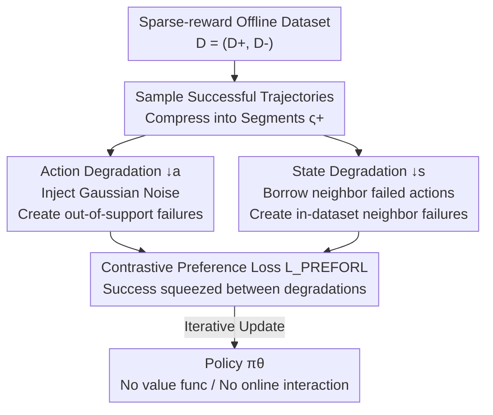

# Preference-based Policy Optimization from Sparse-reward Offline Dataset

**Conference**: ICLR 2026  
**OpenReview**: [https://openreview.net/forum?id=zyLI9LEmry](https://openreview.net/forum?id=zyLI9LEmry)  
**Code**: To be confirmed  
**Area**: Reinforcement Learning / Offline RL / Preference Learning  
**Keywords**: Offline Reinforcement Learning, Sparse Rewards, Contrastive Preference Learning, Value Overestimation, Data Degradation

## TL;DR
PREFORL reformulates sparse-reward offline RL as a contrastive preference learning problem. By bypassing value function estimation and contrasting successful trajectories against both "in-dataset failures" and "synthesized out-of-distribution failures," it suppresses value overestimation and enhances robustness. It consistently outperforms SOTA methods like CQL, IQL, CPL, and ReBRAC on sparse-reward benchmarks including Adroit, Sparse-MuJoCo, Maze2D, and MetaWorld.

## Background & Motivation
**Background**: Offline reinforcement learning aims to train high-performing policies using only static datasets to avoid expensive or dangerous online interactions. The mainstream approach involves learning a value function from the data and optimizing the policy accordingly.

**Limitations of Prior Work**: When data is limited and rewards are sparse, the value function becomes overly optimistic (extrapolation error / value overestimation) when queried on state-action pairs with poor data coverage, leading to policy instability or collapse. Existing remedies have weaknesses: ① Pessimism-based methods (e.g., CQL) forcibly lower values in uncertain regions but require careful calibration of the pessimism degree, which is difficult in high-dimensional sparse settings; ② Regularization-based methods constrain the policy to stay near the behavior policy, which works when coverage is good but is fragile and prone to getting stuck in sub-optimal behaviors; ③ Importance sampling / DICE-based methods reweight rewards by state-action density, which is theoretically elegant but sensitive to support mismatch and suffers from high variance.

**Key Challenge**: The root cause lies in whether and how to estimate the value function. As long as the value function is estimated, sparse rewards combined with insufficient coverage inevitably lead to overestimation. Simply using preference learning to contrast "successes vs. in-dataset failures" cannot solve this, as the dataset lacks strong counter-examples in regions with poor coverage, allowing the policy to remain optimistic in those areas.

**Goal**: Bypassing value function estimation entirely while directly countering overestimation and providing "counter-examples" for regions with poor coverage.

**Key Insight**: Rewrite offline policy optimization as contrastive preference learning (following the CPL approach of representing the optimal advantage with the optimal policy, thereby eliminating explicit advantage/value functions). The key observation is that since the data lacks failure samples in low-coverage regions, one can **synthesize** failed behaviors that fall outside the data distribution to serve as counter-examples.

**Core Idea**: Use "successful demonstrations" to contrast two types of failures: existing in-dataset neighbor failures and synthesized degraded behaviors that fall outside the data support. By "squeezing" successful behaviors between these two types of failures, the model learns to imitate success while actively avoiding behaviors that lead to failure or cross distribution boundaries.

## Method

### Overall Architecture
PREFORL (PREFerence-based Optimization for Offline RL) takes a sparse-reward offline dataset $D=(D^+, D^-)$ as input, where $D^+=\{\tau \mid R(\tau)>\eta\}$ are successful trajectories with cumulative returns exceeding threshold $\eta$, and $D^-$ are failed trajectories (often $\eta=0$ in sparse environments). It outputs a policy $\pi_\theta$ **without environment interaction or value function estimation** throughout the process.

The pipeline is an iterative loop: in each round, several successful trajectories are sampled from $D^+$ and compressed into order-preserving "representative segments" $\varsigma=\Sigma(\tau,k)$ (sampling $k$ state-actions from the trajectory in chronological order). Then, for each successful trajectory, a "degradation operator" is used to create a corresponding failed trajectory, resulting in synthesized failure datasets $D^{\downarrow a}\cup D^{\downarrow s}$. Successful segments are treated as preferred, while degraded segments are non-preferred, and fed into the contrastive preference loss $L_{\text{PREFORL}}$ to update $\pi_\theta$. The unique and critical difference from CPL is that while CPL contrasts $D^+$ with original in-dataset $D^-$, PREFORL contrasts $D^+$ with **synthesized degradations** $D^{\downarrow s}\cup D^{\downarrow a}$.

### Key Designs

**1. Contrastive Preference as a Substitute for Value Estimation: Representing Preference via the Optimal Policy**

Addressing the fundamental pain point that "value estimation leads to overestimation," PREFORL utilizes a key identity from CPL under Maximum Entropy RL: the optimal advantage and optimal policy satisfy $A^*(s,a)=\alpha\log\pi^*(a\mid s)$ (assuming the normalization $\int e^{A^*(s,a)/\alpha}\,da=1$). This implies that instead of learning an implicit optimal advantage function, one can substitute $A^*$ in the advantage-based Bradley-Terry preference model with $\alpha\log\pi_\theta$, allowing preference signals to directly shape the policy. Thus, the segment-level preference probability is written as:

$$P_{A^*}[\varsigma^+>\varsigma^-]=\frac{\exp\sum_{\varsigma^+}\gamma^t A^*(\hat s_t^+,\hat a_t^+)}{\exp\sum_{\varsigma^+}\gamma^t A^*(\hat s_t^+,\hat a_t^+)+\exp\sum_{\varsigma^-}\gamma^t A^*(\hat s_t^-,\hat a_t^-)}.$$

Compared to using "partial discounted returns" directly to compare segments, advantage-based preferences are more reliable when rewards are sparse or highly imbalanced because they compare relative quality rather than returns that are zero almost everywhere. This step ensures PREFORL has no value functions, naturally avoiding overestimation.

**2. Dual Degradation Operators: Synthesizing Counter-examples for Poorly Covered Regions**

Simply contrasting "success vs. in-dataset failure" does not prevent overestimation—because regions with poor coverage lack failure samples to suppress optimism. The core innovation of PREFORL is using two degradation operators to actively construct failure counter-examples from successful trajectories $\tau^+$. **Action Degradation $\downarrow a$**: Gaussian noise $a_t^{(i)-}=a_t^{(i)}+\epsilon_t^{(i)},\ \epsilon_t^{(i)}\sim\mathcal N(0,\sigma^2 I)$ is added to each action of the success trajectory, yielding $D^{\downarrow a}$—synthesized failures falling **outside the data support**. $\sigma$ controls the noise magnitude (experiments show that "locality"—small noise—is sufficient and does not require fine-tuning). **State Degradation $\downarrow s$**: Instead of perturbing actions, for each state $s_t^{(i)}$ in the success trajectory, a nearest-neighbor search is performed in the failure dataset $D^-$. The recorded action $a_{t'}^{(j)}$ from the neighbor state is "borrowed" to replace the original action, yielding $D^{\downarrow s}$—failures that are **in-dataset neighbors**. Both satisfy $D^+>D^{\downarrow a}$ and $D^+>D^{\downarrow s}$ by construction. The authors describe this as "squeezing" the policy: successful behavior is sandwiched between two types of synthesized degradations, defining what is desirable while simultaneously covering both "in-dataset neighbor failures" and "out-of-support failures."

**3. PREFORL Contrastive Loss: Optimizing Policy by Squeezing Success Between Degradations**

The degradation results are combined into a contrastive preference dataset $D_{\text{pref}}=(D^+,\ D^{\downarrow s}\cup D^{\downarrow a})$, with the loss defined as:

$$L_{\text{PREFORL}}(\pi_\theta,D_{\text{pref}})=\mathbb E_{(\varsigma^+,\varsigma^-)\sim D_{\text{pref}}}\Big[-\log\frac{\exp\sum_{\varsigma^+}\gamma^t\alpha\log\pi_\theta(\hat s_t^+,\hat a_t^+)}{\exp\sum_{\varsigma^+}\gamma^t\alpha\log\pi_\theta(\hat s_t^+,\hat a_t^+)+\exp\lambda\sum_{\varsigma^-}\gamma^t\alpha\log\pi_\theta(\hat s_t^-,\hat a_t^-)}\Big].$$

Here, $\alpha$ is the temperature and $\lambda\in(0,1]$ is an asymmetric "bias" regularization used to down-weight negative segments (following DPPO). This is the key difference from Behavior Cloning (BC) and traditional offline RL: BC only imitates demonstrations and collapses upon distribution shift; offline RL suffers from value overestimation under sparse coverage. PREFORL enables the policy to learn not just from "success" but also from synthesized counter-examples that "lead to failure or go out of bounds," making it more robust. Theoretically, the authors prove (Lemma 3.1) that when degradation segments cover the action space for each $s\sim d^*$, $L_{\text{PREFORL}}\to 0$ implies $\mathbb E_{s\sim d^*}[D_{\text{TV}}(\pi^*\|\pi)]\to 0$. In other words, minimizing this loss is equivalent to pushing the learned policy towards the success trajectory distribution $d^*$, bounded by sub-optimality limits.

### Loss & Training
Training involves the outer loop of Algorithm 1: in each round, $M$ successful trajectories are sampled from $D^+$, each compressed into representative segments of length $k$ to form $D^+_j$. Then, $D^{\downarrow a}_j\cup D^{\downarrow s}_j$ is synthesized via Equations (4) and (5) to serve as $D^-_j$. Finally, a minimization step is performed on $\theta$ using the discounted contrastive log-likelihood (letting $L^\pm=\log\pi_\theta(\hat s_t^\pm,\hat a_t^\pm)$). Key hyperparameters include temperature $\alpha$, contrastive preference bias $\lambda$, segment length $k$, degradation noise $\sigma$, and the ratio of degradation to success data. The paper reports that performance is insensitive to $\lambda$, $k$, the ratio, and $\sigma$, remaining stable across a wide range without requiring per-environment tuning.

## Key Experimental Results

### Main Results
On D4RL Adroit (24-DoF Shadow Hand manipulation, pen/door/hammer/relocate × human/cloned/expert), compared to BC, CQL, IQL, TD3+BC, CDE, ReBRAC, and CPL, PREFORL achieves the best normalized scores in most environments:

| Task | CPL | ReBRAC | CDE | PREFORL |
|------|------|--------|-----|---------|
| pen-human | 100.1±2.2 | 103.5±14.1 | 72.1 | **119.1±3.1** |
| door-cloned | 3.6±3.5 | 1.1±2.6 | 0.1 | **16.3±0.7** |
| hammer-cloned | 13.2±8.1 | 6.7±3.7 | 7.3 | **28.4±3.2** |
| relocate-expert | 110.2±0.4 | 106.6±3.2 | 102.6 | **111.2±0.7** |

On Sparse-MuJoCo (where dense rewards are binarized into sparse success/failure at the 75th percentile), measured by success rate, PREFORL leads across medium and medium-expert tiers. Notably, it achieves 100.0 on halfcheetah-medium-expert, where ReBRAC scored 0 and CPL scored 47.3:

| Task | CPL | CDE | ReBRAC | PREFORL |
|------|------|-----|--------|---------|
| walker2d-medium | 85.3±6.1 | 53.0±11.7 | 42.0 | **98.0±3.5** |
| hopper-medium-expert | 0.0±0.0 | 97.0±1.4 | 21.0 | **98.4±3.6** |
| halfcheetah-medium-expert | 47.3±4.6 | 95.2±2.9 | 0.0 | **100.0±0.0** |

On Maze2D navigation (umaze/medium/large, where training and evaluation distributions differ and trajectory lengths vary), PREFORL leads in average success count for umaze (2.22 vs ReBRAC 2.07) and large (0.63 vs CDE 0.55), demonstrating its stability across both narrow (Adroit) and diverse (Maze2D) distributions.

### Ablation Study

| Configuration / Analysis | Conclusion | Explanation |
|------|------|------|
| Degradation noise $\sigma$ (Appx C) | Stable within small noise range | $\sigma$ only needs "locality"; no per-env tuning required |
| Degradation/Success ratio (Appx D) | Highly insensitive to ratio | Performance is reliable as ratio changes |
| Bias $\lambda$, Segment length $k$ (Appx E) | Stable across wide range | Neither key hyperparameter requires fine-tuning |
| MetaWorld Image Input (Table 4) | Exceeds BC on nearly all 16 tasks | ResNet-50 encoding of 84×84 RGB; expert demo only, no rewards |

### Key Findings
- **"Synthesizing failure counter-examples" is the source of performance**: Compared to CPL, which only contrasts with in-dataset failures, PREFORL shows the largest gains on poorly covered "cloned" data (e.g., door-cloned 16.3 vs 3.6), confirming the value of out-of-support degradation for suppressing overestimation.
- **Strong Robustness**: Hyperparameters $\sigma, \lambda, k$, and degradation ratio are reported as insensitive, making the method user-friendly for deployment.
- **High-dimensional Applicability**: Using synthesized preference signals allows for significant improvements over BC in demonstration-only, reward-free MetaWorld image tasks (e.g., Soccer 67.7 vs 25.0, Peg Insert 73.3 vs 49.0).

## Highlights & Insights
- **Turning "missing counter-examples" into "synthesized counter-examples"**: The biggest challenge in offline sparse-reward RL is the lack of failure samples in poorly covered regions. PREFORL cleverly converts "data gaps" into "controllable contrastive signals" via degradation operators.
- **Complementary Dual Degradation**: State degradation covers "in-dataset neighbor failures," while action degradation covers "out-of-support failures." Squeezing success between the two provides more comprehensive coverage than simple noise injection.
- **No Value Function = No Overestimation**: By fundamentally bypassing value estimation rather than patching it with pessimism or regularization, the approach is cleaner and avoids the difficulty of calibrating pessimism levels.
- **Generalizability**: The paradigm of "synthesizing negatives via degradation/perturbation followed by contrastive preference optimization" can be transferred to imitation learning, robot learning-from-demonstration, and even RLHF scenarios lacking negative samples.

## Limitations & Future Work
- The degradation operator implicitly assumes that "perturbations near a success trajectory are indeed worse"—if the environment has multi-modal optima or symmetric solutions where small perturbations remain optimal, synthesized counter-examples might provide incorrect preference signals.
- State degradation depends on the quality of nearest neighbor search. In high-dimensional or image spaces, this relies on feature distances; if features are poor, the "borrowed" actions might not constitute meaningful failures.
- Evaluations are concentrated on simulated manipulation/navigation benchmarks; validation in real-world robotics or high-risk domains like offline recommendation/healthcare is missing. Theoretical guarantees rely on the assumption that degradation segments cover the action space, which is not fully quantified in practice.
- The method still requires pre-partitioning data into $D^+/D^-$ using a threshold $\eta$. How to partition data in tasks without clear success signals remains an open question.

## Related Work & Insights
- **vs CPL (Hejna et al. 2024)**: Both use advantage-based contrastive preferences and simplify the value function via $A^*=\alpha\log\pi^*$. The difference is that CPL contrasts $D^+$ with original $D^-$, still allowing overestimation in poorly covered regions. PREFORL contrasts with synthesized $D^{\downarrow s}\cup D^{\downarrow a}$, filling the out-of-support gap and leading to significant gains on cloned/sparse data.
- **vs Pessimism/Regularization (CQL, TD3+BC, ReBRAC)**: These still estimate values and rely on pessimism or constraints to suppress overestimation, requiring strength calibration and being fragile in high-dimensional sparse settings. PREFORL avoids overestimation by design by not estimating values.
- **vs DICE / Importance Sampling (CDE)**: CDE reweights rewards by density, which is sensitive to support mismatch and has high variance. PREFORL does not perform density correction but handles mismatch through synthesized counter-examples, offering better stability.
- **vs BC**: BC only imitates and collapses under distribution shift. PREFORL additionally learns "what to avoid" from synthesized failures, making it notably more robust in demonstration-only tasks like MetaWorld.

## Rating
- Novelty: ⭐⭐⭐⭐⭐ The combination of "synthesizing out-of-support failure counter-examples + contrastive preference to bypass value estimation" is a clear, theoretically-grounded new perspective for sparse offline RL.
- Experimental Thoroughness: ⭐⭐⭐⭐ Covers four benchmark types (Adroit/Sparse-MuJoCo/Maze2D/MetaWorld) and multiple hyperparameter sensitivity analyses, though largely restricted to simulation.
- Writing Quality: ⭐⭐⭐⭐ The motivation-method-theory chain is logical. Occasional minor flaws in notation (e.g., $\downarrow a$/$\downarrow s$ captions).
- Value: ⭐⭐⭐⭐ Sparse-reward offline RL is a high-value problem. The method is robust, requires little tuning, and is deployment-friendly.

<!-- RELATED:START -->

## Related Papers

- [\[ICLR 2026\] OPRIDE: Efficient Offline Preference Reinforcement Learning via In-Dataset Exploration](opride_efficient_offline_preference-based_reinforcement_learning_via_in-dataset_.md)
- [\[ICLR 2026\] Offline Preference-based Value Optimization](offline_preference-based_value_optimization.md)
- [\[ICLR 2026\] Belief-Based Offline Reinforcement Learning for Delay-Robust Policy Optimization](belief-based_offline_reinforcement_learning_for_delay-robust_policy_optimization.md)
- [\[ICLR 2026\] RiskPO: Risk-based Policy Optimization with Verifiable Reward for LLM Post-Training](riskpo_risk-based_policy_optimization_with_verifiable_reward_for_llm_post-traini.md)
- [\[ICLR 2026\] Enhancing Generative Auto-bidding with Offline Reward Evaluation and Policy Search](enhancing_generative_auto-bidding_with_offline_reward_evaluation_and_policy_sear.md)

<!-- RELATED:END -->
