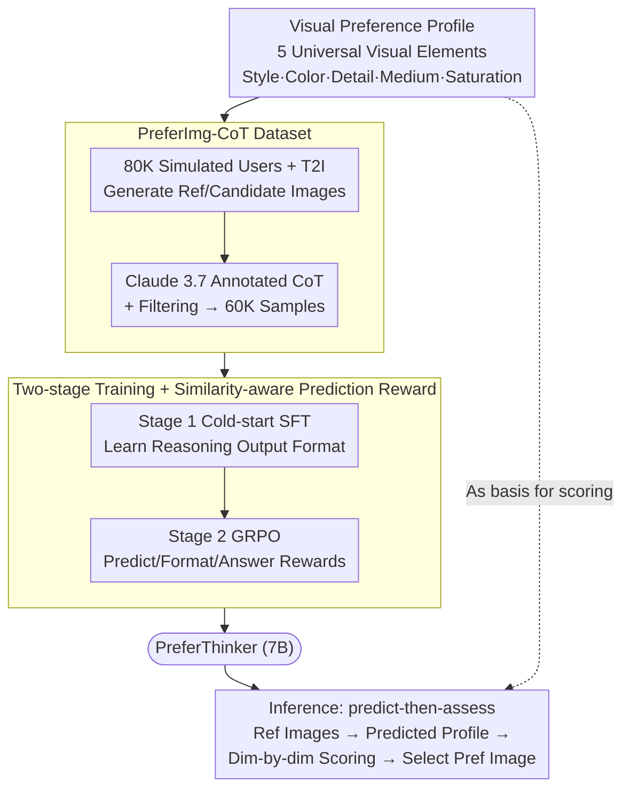

# PreferThinker: Reasoning-based Personalized Image Preference Assessment

**Conference**: ICLR2024  
**arXiv**: [2511.00609](https://arxiv.org/abs/2511.00609)  
**Code**: [Project Page](https://preferthinker.github.io/)  
**Area**: Reinforcement Learning  
**Keywords**: personalized preference assessment, reasoning, GRPO, predict-then-assess, visual preference profile, CoT  

## TL;DR
The paper proposes PreferThinker, which connects diverse users through universal visual preference profiles and adopts a "predict-then-assess" CoT reasoning paradigm for interpretable personalized image preference assessment. Combined with cold-start SFT + GRPO reinforcement learning and a similarity-aware prediction reward, the 7B model outperforms GPT-4o (+5.2%) and Claude 3.7 (+5.1%).

## Background & Motivation
- **Two major challenges in personalized preference assessment**:
  1. Personalized data for each user is extremely scarce and cannot be scaled up, unlike general preference data with shared evaluation standards.
  2. Personalized preferences span multiple dimensions (art style, color, medium, etc.), making them complex and diverse.
- **Limitations of Prior Work**:
  - **CLIP-based methods** (PickScore, ImageReward, etc.): Rely on large-scale general preference data and cannot handle personalized scenarios; they lack interpretability as they only output numerical scores.
  - **MLLM-based methods** (UnifiedReward, etc.): Require extensive VQA pair fine-tuning, which personalized image datasets cannot support.
  - **ViPer**: The only existing personalized method, but it only implicitly uses reference images for score regression and lacks interpretable reasoning steps.
- **Key Insight**: Although every user's preferences are unique, the fundamental visual elements (art style, color, detail, art medium, saturation) forming these preferences are universal and can serve as a bridge across different users.

## Method

### Overall Architecture
PreferThinker decomposes personalized preference assessment into a two-step "predict-then-assess" CoT reasoning process: it first predicts a "visual preference profile" and a corresponding non-preference profile based on the user's liked/disliked reference images, then uses these profiles as a basis to score two candidate images dimension-by-dimension and provide interpretable conclusions. The entire method centers on the observation that while user preferences vary significantly, the constituent visual elements are universal. Thus, using profiles as intermediaries addresses data scarcity while transforming black-box scoring into evidence-based multidimensional reasoning. To enable a 7B model to learn this, the authors define profiles using universal visual elements, synthesize training data with reasoning chains, and finally inject this "predict-then-assess" capability via two-stage training.

### Key Designs

**1. Visual Preference Profile: Bridging scarce personalized data with universal visual elements**

The primary pain point of personalized preference assessment is the scarcity and non-shareability of per-user data. PreferThinker's solution is to decompose preferences into a set of universal visual elements. First, 15 common visual elements were identified from Lexica platform text prompts, then filtered down to the top 5—art style, color, detail, art medium, and saturation—via a 100-person user study. 288 related descriptors were collected to ensure diversity. In this way, each user's unique preference is expressed as a combination of values across these five dimensions (along with a "non-preference profile"). This enables structured descriptions where knowledge can be transferred between users at the dimension level, and assessment can be performed dimension-by-dimension rather than as a black box.

**2. PreferImg-CoT Dataset: Synthesizing training data with reasoning chains via simulated users**

Since real personalized data is hard to scale, the authors synthesized it. PreferImg constructs 80K simulated users (including 20K multi-preference users) and 1.36M images. Profiles are sampled for each user, and T2I models generate images based on prompts from Lexica, DiffusionDB, and COCO. Claude 3.7 was then used to label each sample with a "predict-then-assess" reasoning chain: predicting profiles from references, then providing dimension-based scores and conclusions for candidates. After filtering for logical consistency, 60K high-quality CoT samples remained, providing both profile supervision and reasoning process examples for cold-start training.

**3. Two-stage Training and Similarity-aware Prediction Reward: Formatting and optimizing prediction quality**

To ensure stable convergence, a two-stage strategy (SFT then GRPO) was adopted. Stage 1 used Qwen2.5-VL-7B as a backbone for cold-start fine-tuning on 60K CoT samples using standard cross-entropy: $\mathcal{L}_{SFT}(\theta) = -\mathbb{E}_{(x,y)\sim\mathcal{D}_{CoT}}\sum_{t=1}^{T}\log P(y_t|x,y_{<t};\theta)$. Stage 2 applied GRPO: sampling $G$ CoT outputs per input and updating the policy using group-normalized benefits $A_i$ with a PPO-clip objective and KL regularization. A "similarity-aware prediction reward" was designed to measure profile accuracy: SBERT calculates semantic similarity $s_{text}$ between predicted and ground truth profiles, while images generated from both profiles are compared using DreamSim for visual similarity $s_{img}$. The combined reward is $r_{predict} = w_{img}s_{img} + w_{text}s_{text}$. The final reward is a mixture:

$$r = w_p\, r_{predict} + w_f\, r_{format} + w_a\, r_{accuracy}$$

(weights set to 0.7, 0.3, 1.0). Ablations show that removing the prediction reward degrades profile accuracy, which directly impacts the assessment quality.

## Key Experimental Results

### Main Results (Assessment Accuracy, %)

| Method | Params | PreferImg Seen-SP | Seen-MP | Unseen-SP | Unseen-MP | PickaPic | Average |
|------|--------|----------|---------|-----------|-----------|---------|------|
| PickScore | 986M | 49.6 | 48.4 | 51.2 | 56.4 | 67.9 | 54.7 |
| ViPer | 8B | 92.4 | 78.0 | 93.4 | 80.0 | 62.2 | 81.2 |
| GPT-4o | - | 94.2 | 80.4 | 92.2 | 85.2 | 65.7 | 83.5 |
| Claude 3.7 | - | 93.8 | 83.2 | 90.2 | 86.0 | 64.9 | 83.6 |
| **PreferThinker** | **7B** | **96.6** | **92.0** | **96.4** | **92.8** | 65.7 | **88.7** |

### Ablation Study

| Configuration | Seen-SP Acc | Seen-SP Pred | Unseen-MP Acc | Unseen-MP Pred |
|------|-------------|---------|------------|---------|
| Base (Qwen2.5-VL-7B) | 75.4 | 70.4 | 64.8 | 71.1 |
| + SFT | 92.0 | 84.2 | 81.6 | 74.2 |
| + SFT + RL | 93.8 | 85.0 | 88.4 | 79.5 |
| + SFT + RL + PR (Full) | **96.6** | **87.5** | **92.8** | **83.1** |

### Key Findings
1. **7B model outperforms all close-sourced models**: PreferThinker surpasses GPT-4o and Claude 3.7 across PreferImg benchmarks.
2. **Significant improvement in Multi-Preference (MP) scenarios**: A +8.8% gain over SOTA in Seen-MP demonstrates the profile mechanism's efficacy in handling complex preferences.
3. **RL enhances generalization**: The improvement on unseen users (+6.8%) via RL is greater than on seen users (+4.6%).
4. **Prediction reward is critical**: Accurate profile prediction is a prerequisite for reasonable assessment.
5. **Transferability to image generation**: Predicted preference profiles can guide personalized image generation.

## Highlights
- Introduced the concept of "preference profiles" to bridge different users, elegantly solving personalized data scarcity.
- The "predict-then-assess" paradigm achieves interpretable multidimensional evaluation instead of black-box scoring.
- The similarity-aware prediction reward design effectively utilizes both text and vision space similarity signals.
- A 7B open-source model outperforms commercial models like GPT-4o and Claude 3.7.

## Limitations & Future Work
- The PreferImg dataset is based on simulated users (T2I generated), which may differ from real-world user preference distributions.
- Performance on the PickaPic real-user dataset is average (65.7%), as PickaPic labels general rather than personalized preferences.
- The 5 visual elements are fixed and may not cover all personalized dimensions (e.g., composition, emotion).
- Training costs are relatively high due to the need for T2I generation to compute visual similarity rewards.

## Related Work
- **Image Preference Assessment**: Evolution from CLIP-based (PickScore, ImageReward) to MLLM-based (UnifiedReward, LLaVA-Reward).
- **Personalized Preference**: ViPer (ECCV2024) made the first attempt but lacks interpretability.
- **Reasoning MLLMs**: Post-training paradigms inspired by DeepSeek-R1 and GRPO.
- **Preference Datasets**: ImageRewardDB, PickaPic, and HPD_v2 primarily focus on general preferences.

## Rating
⭐⭐⭐⭐ (4/5)

The method design is comprehensive, with innovations in both data construction and training. The preference profile concept is a simple yet effective bridge. The primary concern is the gap between simulated data and real personalized preferences, as evidenced by the PickaPic results.

<!-- RELATED:START -->

## Related Papers

- [\[ICLR 2026\] Reasoning as Representation: Rethinking Visual Reinforcement Learning in Image Quality Assessment](reasoning_as_representation_rethinking_visual_reinforcement_learning_in_image_qu.md)
- [\[ICLR 2026\] DiVE-k: Differential Visual Reasoning for Fine-grained Image Recognition](dive-k_differential_visual_reasoning_for_fine-grained_image_recognition.md)
- [\[ICLR 2026\] DuPO: Enabling Reliable Self-Verification via Dual Preference Optimization](dupo_enabling_reliable_self-verification_via_dual_preference_optimization.md)
- [\[ICLR 2026\] P-GenRM: Personalized Generative Reward Model with Test-time User-based Scaling](p-genrm_personalized_generative_reward_model_with_test-time_user-based_scaling.md)
- [\[ICLR 2026\] Offline Preference-based Value Optimization](offline_preference-based_value_optimization.md)

<!-- RELATED:END -->
