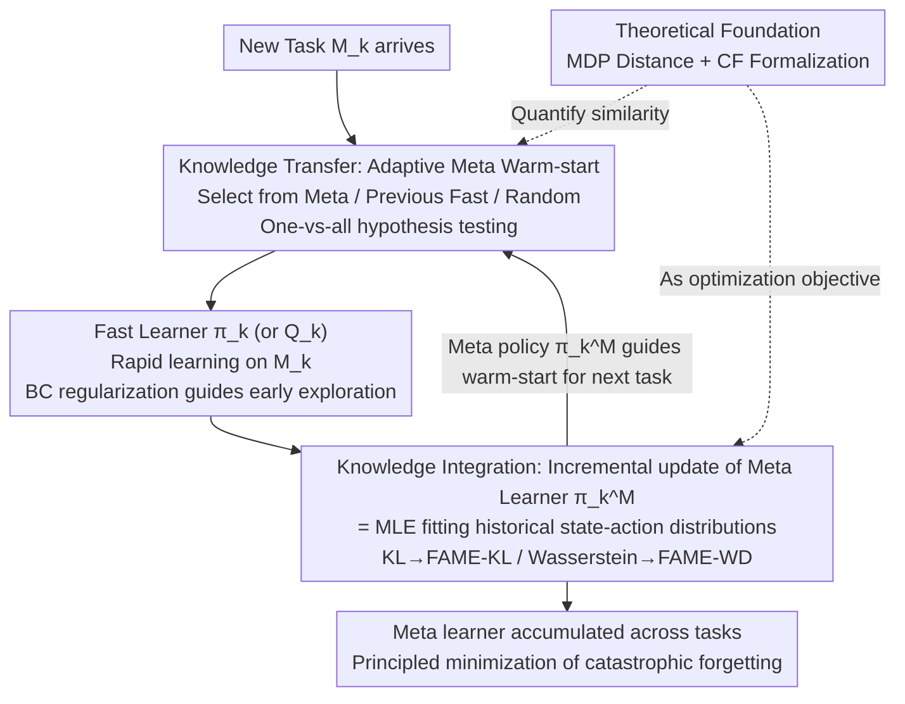

# Principled Fast and Meta Knowledge Learners for Continual Reinforcement Learning

**Conference**: ICLR 2026  
**arXiv**: [2603.00903](https://arxiv.org/abs/2603.00903)  
**Code**: [GitHub](https://github.com/datake/FAME)  
**Area**: Reinforcement Learning  
**Keywords**: continual RL, catastrophic forgetting, knowledge transfer, dual-learner, meta learning

## TL;DR

Inspired by the hippocampal-cortical interaction mechanism in the human brain, this paper proposes the FAME dual-learner framework. It achieves efficient continual reinforcement learning by employing a fast learner for knowledge transfer and a meta learner for knowledge integration, while principledly minimizing catastrophic forgetting.

## Background & Motivation

**Key Challenge of Continual Learning**: Traditional deep RL algorithms are designed for single tasks. When facing a sequence of tasks, they must balance plasticity (adapting quickly to new tasks) and stability (retaining old knowledge).

**Limitations of Prior Work**: Existing continual RL methods are mostly based on heuristics or independent designs from different perspectives, lacking a unified theoretical framework to analyze when knowledge transfer is effective and how to quantify forgetting.

**Negative Transfer Problem**: Direct fine-tuning can lead to performance degradation (negative transfer) when tasks differ significantly, while training from scratch (reset) fails to utilize previously accumulated knowledge.

**Key Insight**: In the human brain, the hippocampus is responsible for rapidly encoding new experiences, while the cerebral cortex handles incremental knowledge integration. This division of labor provides a biological foundation for algorithm design.

**Limitations of Prior Work**: Traditional multi-task RL shares knowledge by maximizing average return but cannot explicitly control catastrophic forgetting.

**Limitations of Prior Work**: There was previously no principled method to quantify the similarity between different environments, making it difficult to judge whether knowledge transfer would be beneficial.

## Method

### Overall Architecture

Continual RL faces a sequence of tasks $\mathcal{M}_1,\dots,\mathcal{M}_K$ (identical state and action spaces, known task boundaries), requiring both fast learning of new tasks and retention of old ones. Borrowing from the hippocampal-cortical division of labor, FAME (FAst and MEta knowledge learner) decomposes this into two coupled learners: the **fast learner**, analogous to the hippocampus, is responsible only for rapidly learning a policy $\pi_k$ (or $Q_k$) on the current task; the **meta learner** $\pi_k^M$, analogous to the cerebral cortex, is responsible for incrementally integrating knowledge from all tasks. The two feed each other in a loop: when a new task arrives, the meta learner first uses "adaptive meta warm-start" to select a reliable initialization for the fast learner, transferring prior knowledge (**knowledge transfer**). After the fast learner finishes training on the task, its learned policy is incrementally integrated back into the meta learner, explicitly minimizing catastrophic forgetting in this step (**knowledge integration**). The two cornerstones of this loop are two quantifiable definitions established in the paper: how similar environments are (MDP distance) and how much old knowledge has been altered (catastrophic forgetting).

### Key Designs

**1. Theoretical Foundations: Quantifying "Environment Similarity" and "Forgetting Degree"**

Previous continual RL methods were mostly heuristic, unable to explain when knowledge transfer is beneficial or how severe forgetting is due to the lack of calculable metrics. FAME fills this gap: **MDP distance** characterizes similarity by the difference between the optimal solutions of two environments, either using the $\ell_2$ distance of optimal $Q$-functions $d_Q(Q_1^*,Q_2^*)$ or the KL divergence of optimal policies $d_\pi(\pi_1^*,\pi_2^*)$, providing a unified geometric scale for task similarity. **Catastrophic forgetting (CF)** is defined as the weighted difference between old and new policies (or $Q$) under the **state distribution of the old task**, e.g., at the policy level:

$$\mathrm{CF}(\pi_{k-1},\pi_k)=\sum_s \mu_{k-1}^{\pi_{k-1}}(s)\,d_\pi\!\big(\pi_k(\cdot|s),\pi_{k-1}(\cdot|s)\big).$$

Crucially, the weight uses the occupancy distribution of the **old policy** $\pi_{k-1}$ rather than the new one—ensuring the metric focuses on high-frequency, important states in the old task. If the new policy were used, states it no longer visits but were silently corrupted would be missed. These definitions provide optimizable targets for the dual-learner system.

**2. Knowledge Transfer — Adaptive Meta Warm-start: Avoiding Negative Transfer via Hypothesis Testing**

How should the fast learner be initialized for a new task? Direct fine-tuning works well when tasks are similar but causes negative transfer when they differ, slowing or damaging learning. FAME does not use hardcoded rules; instead, during the early interaction phase of a new task, it evaluates three candidate initializations—the meta learner $\pi_{k-1}^M$, the previous fast learner $Q_{k-1}$ (finetune), and random initialization $Q^0$ (reset)—to obtain returns $V_k^M, V_k^f, V_k^r$. It then performs a one-vs-all hypothesis test:

$$H_0:V_k^M\le\max\{V_k^f,V_k^r\}\quad\text{vs.}\quad H_1:V_k^M>\max\{V_k^f,V_k^r\}$$

to select the statistically superior one. When $H_0$ is rejected and meta warm-start is selected, since the meta learner is a policy and cannot be directly copied to the $Q$-function, behavior cloning (BC) regularization is used to treat the meta policy as an expert to guide exploration. This statistical framework replaces heuristics: in experiments, it selects meta warm-start for ~95.1% of known environments and falls back to random initialization for completely new environments.

**3. Knowledge Integration — Incremental Meta Learner Update: Forgetting Minimization Equals Maximum Likelihood**

After training, new knowledge must be merged into the meta learner. Directly saving all historical $Q_i$ for weighted averaging would scale linearly with the number of tasks. FAME provides an incremental integration rule (Proposition 1): minimizing the policy-level forgetting objective under KL divergence is equivalent to **Maximum Likelihood Estimation (MLE)** for the meta learner—fitting it to the mixture of state-action distributions of all encountered environments:

$$Q_k^M=\arg\max_{\widetilde Q_k^M}\sum_{i=1}^{k}\mathbb{E}_{w_i^Q}\big[\log\widetilde\pi_k^M\big].$$

This directly connects continual RL with multi-task RL, requiring only a single meta policy updated per task. The paper uses a policy-level rather than $Q$-level definition because $Q$-values are unscaled in unknown environments (high-reward tasks overshadow low-reward ones), whereas policies are more robust to reward scales and have lower variance. Since KL divergence is insensitive to geometric structure for Gaussian policies in continuous control, **FAME-WD** is introduced: using the closed-form 2-Wasserstein distance to measure policy differences, enabling efficient incremental updates while utilizing the geometry of the data space.

### A Complete Example: What happens when the $k$-th task arrives?

Assuming $k-1$ tasks are completed, the meta learner $\pi_{k-1}^M$ contains their mixed knowledge. When task $\mathcal{M}_k$ arrives, FAME spends $L$ steps testing the meta learner, the previous fast learner, and random initialization, evaluating their returns. Hypothesis testing determines if $\mathcal{M}_k$ is similar to old tasks (~95% of known environments fall here). If so, it selects meta warm-start and uses BC regularization with $\pi_{k-1}^M$ as an expert to guide exploration. The fast learner then trains $\pi_k$ on $\mathcal{M}_k$. In the final $N$ steps (approx. 1–2% of data), state-action pairs are stored in the meta buffer to estimate integration weights. Finally, $\pi_k$ is incrementally merged into $\pi_k^M$ via Proposition 1, explicitly suppressing forgetting. $\pi_k^M$ then becomes a candidate for the next task's warm-start.

### Loss & Training

During the knowledge integration phase, minimizing the policy-level catastrophic forgetting objective (Eq. 4) is equivalent to maximizing the log-likelihood of the meta learner on all historical state-action distributions. In value-based methods, meta warm-start guides early exploration via behavior cloning regularization: $L(Q_k)=L_0(Q_k)+\lambda\,\mathbb{E}_s[\mathrm{KL}(\pi_{k-1}^M\,\|\,\pi^{Q_k})]$. To estimate the state occupancy weights $w_i^Q$, FAME maintains a **meta buffer** $\mathcal{M}$, collecting state-action pairs only in the last $N$ steps of each task (1–2% of training data) with minimal overhead.

## Key Experimental Results

### Main Results

**MinAtar Results (10 sequences × 3 seeds)**:

| Method | Avg. Perf ↑ | FT ↑ | Forgetting ↓ |
|------|------------|------|-------------|
| Reset | 6.51 ± 1.67 | 0.74 ± 0.38 | 1.31 ± 0.23 |
| Finetune | 10.62 ± 2.75 | 0.89 ± 0.49 | 1.26 ± 0.32 |
| LargeBuffer | 10.71 ± 2.84 | 1.16 ± 0.59 | 1.65 ± 0.33 |
| **Ours (FAME)** | **14.54 ± 0.58** | **1.69 ± 0.17** | **0.72 ± 0.13** |

**Meta-World Results (3 sequences × 10 seeds)**:

| Method | Avg. Perf ↑ | FT ↑ | Forgetting ↓ |
|------|------------|------|-------------|
| Reset | 0.093 ± 0.017 | 0.000 | 0.710 ± 0.030 |
| PackNet | 0.491 ± 0.025 | -0.194 | 0.000 |
| FAME-KL | 0.733 ± 0.026 | 0.022 | 0.073 ± 0.019 |
| **FAME-WD** | **0.767 ± 0.024** | -0.003 | **0.023 ± 0.015** |

### Ablation Study

**Selection ratio for Adaptive Meta Warm-start**:

| Arrival Environment Type | Meta Warm-up | Reset | Finetune |
|-------------|-------------|-------|----------|
| Known Env | 95.1% | Low | Low |
| Unknown Env | Low | High | Low |

**Atari Results**:

| Method | Freeway Avg. Perf | SpaceInvader Avg. Perf |
|------|------------------|----------------------|
| Reset | 0.16 | 0.10 |
| PackNet | 0.41 | 0.47 |
| ProgressiveNet | 0.39 | 0.61 |
| **Ours (FAME)** | **0.90** | **0.96** |

### Key Findings

1. FAME significantly outperforms baseline methods across all benchmarks, achieving the highest average performance with the lowest variance and greatest stability.
2. Adaptive meta warm-start correctly identifies known/unknown environments: selecting meta warm-start with 95.1% probability for known environments while reverting to random initialization for new ones.
3. FAME-WD slightly outperforms FAME-KL in continuous action spaces, validating the advantage of Wasserstein distance for complex policy distributions.
4. While PackNet achieves zero forgetting by storing parameters, it requires prior knowledge of task count and task IDs, limiting its practicality.

## Highlights & Insights

1. **Robust Theoretical Contribution**: Provides the first formal definitions of MDP distance and catastrophic forgetting for continual RL, grounding algorithmic design in theory.
2. **Effective Biological Inspiration**: The hippocampus-cortex dual-system analogy maps directly to algorithmic components and their interactions.
3. **Knowledge Integration = MLE**: Establishing that minimizing policy-level forgetting is equivalent to MLE connects continual RL deeply with multi-task RL.
4. **Hypothesis Testing for Warm-start**: Solves the negative transfer problem using a rigorous statistical framework rather than heuristics.
5. **Generalizable to Value and Policy Methods**: The framework is highly versatile and not restricted to specific RL algorithms.

## Limitations & Future Work

1. **Assumptions**: Requires identical state/action spaces and known task boundaries, which may not hold in all applications.
2. **Meta Buffer Size**: Though small, it still grows linearly with the number of tasks.
3. **Scalability**: Hypothesis testing may increase computational overhead when task switching is highly frequent.
4. **Future Directions**: Learning latent representations instead of direct policy/value storage; online hypothesis testing for unknown task boundaries; context embeddings for enhanced transfer.

## Related Work & Insights

- Compared to **PackNet** and **ProgressiveNet**: These methods avoid forgetting by storing parameters/structures but lack flexibility and knowledge transfer capabilities; FAME addresses both via principled integration.
- Difference from **PT-DQN**: PT-DQN has limited capacity for permanent value function knowledge; FAME's meta learner is more effective by explicitly optimizing against forgetting.
- **Inspiration**: Combining theory-driven methods with brain-inspired concepts provides more principled guidance for RL design. The formalization of catastrophic forgetting can be generalized to other continual learning scenarios.

## Rating

- **Novelty**: ⭐⭐⭐⭐ Theoretical contributions (MDP distance, forgetting metric) are innovative; the dual-learner framework is well-formalized for RL.
- **Experimental Thoroughness**: ⭐⭐⭐⭐⭐ Covers pixel-level and continuous control, value-based and policy-gradient algorithms; strong statistical results (30 seeds).
- **Writing Quality**: ⭐⭐⭐⭐ Clear structure, rigorous derivations, and a complete logical chain from definitions to design.
- **Value**: ⭐⭐⭐⭐ Provides both a theoretical foundation and a practical algorithm for continual RL, bridging the gap between theory and practice.

<!-- RELATED:START -->

## Related Papers

- [\[NeurIPS 2025\] Continual Knowledge Adaptation for Reinforcement Learning](../../NeurIPS2025/reinforcement_learning/continual_knowledge_adaptation_for_reinforcement_learning.md)
- [\[ICLR 2026\] Reward is Enough: LLMs are In-Context Reinforcement Learners](reward_is_enough_llms_are_in-context_reinforcement_learners.md)
- [\[ICLR 2026\] Self-Improving Skill Learning for Robust Skill-based Meta-Reinforcement Learning](self-improving_skill_learning_for_robust_skill-based_meta-reinforcement_learning.md)
- [\[ICLR 2026\] Use the Online Network If You Can: Towards Fast and Stable Reinforcement Learning](use_the_online_network_if_you_can_towards_fast_and_stable_reinforcement_learning.md)
- [\[ICLR 2026\] Leveraging Explanation to Improve Generalization of Meta Reinforcement Learning](leveraging_explanation_to_improve_generalization_of_meta_reinforcement_learning.md)

<!-- RELATED:END -->
