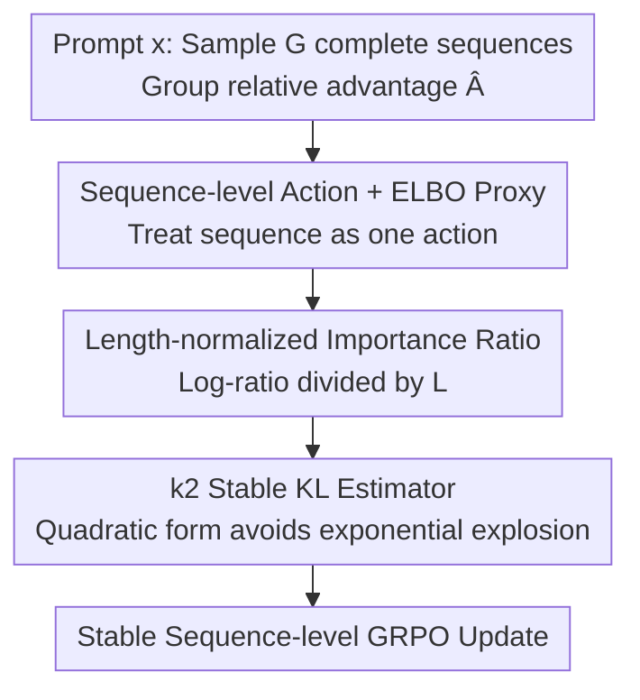

# Principled RL for Diffusion LLMs Emerges from a Sequence-Level Perspective

**Conference**: ICLR 2026  
**OpenReview**: [https://openreview.net/forum?id=S5YeC9llIL](https://openreview.net/forum?id=S5YeC9llIL)  
**Code**: https://github.com/ML-GSAI/ESPO  
**Area**: Reinforcement Learning / Diffusion LLMs  
**Keywords**: Diffusion LLM, Sequence-level RL, ELBO, GRPO, KL Estimation

## TL;DR
Addressing the fundamental contradiction where diffusion large language models (dLLMs) generate non-autoregressively and lack token-level conditional probabilities (rendering GRPO directly inapplicable), this paper proposes ESPO. By treating "generating the entire sequence" as an atomic action and using ELBO as a computable proxy for sequence log-likelihood, combined with length-normalized importance ratios and a k2 KL estimator for stability, ESPO significantly outperforms token-level RL baselines on math, code, and planning tasks (gains of 20–40 or even 60+ points on Countdown/Sudoku).

## Background & Motivation
**Background**: Reinforcement learning (especially the value-network-free GRPO) has become a primary tool for post-training and verifiable reward reasoning in autoregressive LLMs. Simultaneously, diffusion language models (dLLMs, essentially Masked Diffusion Models or MDMs) have matured as an alternative generative paradigm, relying on iterative denoising. They naturally support long contexts, multi-modality, and fast parallel inference. The obvious next step is: how can RL be applied to dLLMs?

**Limitations of Prior Work**: Algorithms like GRPO inherently assume that sequence likelihood can be factored from left to right as $\pi_\theta(y|x)=\prod_{k=1}^L \pi_\theta(y_k|x,y_{<k})$, defining per-token actions and importance ratios $\rho_k=\frac{\pi_\theta(y_k|x,y_{<k})}{\pi_{\theta_{old}}(y_k|x,y_{<k})}$. However, dLLMs are non-autoregressive—they iteratively denoise the entire sequence at once, meaning $\pi_\theta(y_k|x,y_{<k})$ is either ill-defined or computationally prohibitive.

**Key Challenge**: Existing works have focused on "finding a token-level proxy": d1 uses mean-field approximations for $\log p_\theta(y_k|x)$ (ignoring context from other tokens in the sequence, thus inaccurate); UniGRPO and Coupled-GRPO further use "per-token ELBO contributions" $\mathcal{L}^k_\theta(y|x)$. But the critical issue is: ELBO is only a valid lower bound for $\log\pi_\theta(y|x)$ at the **entire sequence level**. Its individual token components $\mathcal{L}^k_\theta$ **lack any probabilistic meaning as conditional likelihoods**, and forcing them into the GRPO objective introduces ill-defined inconsistencies.

**Goal / Key Insight**: The authors' central judgment is that the problem isn't the lack of a better token-level proxy, but rather that "token-level decomposition itself is unsuitable for dLLMs." Forcing dLLMs into an autoregressive token-level framework is a flawed premise.

**Core Idea**: Instead of modifying the model to fit specific algorithms, the algorithm should be modified to respect the "holistic generation" nature of dLLMs—treating the entire sequence as a single action, performing RL at the **sequence level**, and using ELBO as a computable proxy for sequence likelihood.

## Method

### Overall Architecture
ESPO (ELBO-based Sequence-level Policy Optimization) shifts GRPO from the token level to the sequence level: for a prompt $x$, a group of $G$ complete completions $\{y^{(i)}\}$ is sampled using the old policy. Within-group relative advantages $\hat A^{(i)}=R(x,y^{(i)})-\frac{1}{G}\sum_j R(x,y^{(j)})$ are calculated—this remains identical to GRPO. The actual changes are twofold: (1) eliminating the per-token summation to yield a single **sequence-level importance ratio** where log-likelihood is replaced by ELBO; (2) since the raw ELBO difference grows linearly with sequence length (leading to explosion or vanishing after exponentiation), **length normalization** is applied. Additionally, a quadratic **k2 KL estimator** is used instead of the exponential k3 estimator to maintain stability. These three components are essential: sequence-level actions set the direction, ELBO ensures computability, and normalization + k2 ensure stable large-scale training.

### Key Designs

**1. Sequence-level Action + ELBO Proxy: Fundamentally bypassing the invalidity of token decomposition**

This design directly addresses the "unsuitability of token-level decomposition for dLLMs." The authors no longer treat each token as an independent action; instead, the generation of the entire sequence $y$ is treated as an atomic action. Consequently, the inner per-token summation in the GRPO objective is eliminated, leaving only a sequence-level importance ratio $\frac{\pi_\theta(y^{(i)}|x)}{\pi_{\theta_{old}}(y^{(i)}|x)}$. Since $\log\pi_\theta(y|x)$ is intractable in dLLMs, the authors replace it with the ELBO $\mathcal{L_\theta}(y|x)$ (a standard lower bound for masked diffusion, proven to be a tight and practical proxy):

$$\rho^{(i)}_{seq}=\frac{\exp \mathcal{L}_\theta(y^{(i)}|x)}{\exp \mathcal{L}_{\theta_{old}}(y^{(i)}|x)}=\exp\!\big(\mathcal{L}_\theta(y^{(i)}|x)-\mathcal{L}_{\theta_{old}}(y^{(i)}|x)\big).$$

Crucially, because ELBO is a valid lower bound only for the sequence as a whole, it **must be used at the sequence level**. This naturally aligns with the "sequence-as-one-action" perspective, entirely avoiding the inconsistency found in UniGRPO/Coupled-GRPO where ELBO was split into token-wise components lacking probabilistic meaning. In Sudoku ablations, "Sequence-level + ELBO" was the only combination that was fast, stable, and converged to the highest reward, while token-level + ELBO failed quickly, confirming the cost of breaking ELBO integrity.

**2. Length-normalized Importance Ratio: Mapping raw ELBO differences back to per-token scales**

Directly training with $\rho_{seq}$ from Design 1 is practically impossible: the raw ELBO difference $\mathcal{L}_\theta-\mathcal{L}_{\theta_{old}}$ scales linearly with sequence length $L$. Once exponentiated, this leads to astronomical or infinitesimal values, causing optimization to fail. Drawing from GSPO, the authors divide the log-ratio by length $L$ to obtain a stabilized ratio:

$$\rho^{(i)}_{seq}=\exp\!\Big(\tfrac{1}{L}\big(\mathcal{L}_\theta(y^{(i)}|x)-\mathcal{L}_{\theta_{old}}(y^{(i)}|x)\big)\Big)=\exp\!\Big(\tfrac{1}{L}\sum_{k=1}^L\big(\mathcal{L}^k_\theta(y^{(i)}|x)-\mathcal{L}^k_{\theta_{old}}(y^{(i)}|x)\big)\Big).$$

This step transforms "divergent raw log-likelihood differences" into a stable "average per-token scale." This ensures importance ratios for sequences of varying lengths fall within a controlled magnitude, enabling the sequence-level objective $J_{seq}$ to be trained effectively. Note that the summation here is purely for computing the total ELBO; it does **not** signify a return to token-level actions—the action remains the entire sequence.

**3. k2 KL Estimator: Avoiding the exponential terms that reintroduce instability**

The full GRPO objective includes a KL term to prevent the policy from deviating too far from the reference policy. The k3 estimator commonly used in autoregressive models takes the form $\widehat{\mathrm{KL}}_{k3}=\exp(\mathcal{L}_{ref}-\mathcal{L}_\theta)-1-(\mathcal{L}_{ref}-\mathcal{L}_\theta)$ when using ELBO. The exponential term in this estimator would reintroduce the explosion issues solved in Design 2. The authors adopt the more robust k2 estimator, which is proven to provide correct KL gradients:

$$\widehat{\mathrm{KL}}_{k2}=\tfrac{1}{2}\big(\mathcal{L}_\theta(y^{(i)}|x)-\mathcal{L}_{ref}(y^{(i)}|x)\big)^2.$$

Being a pure quadratic function of the ELBO difference, it lacks exponential terms, ensuring stable gradients even for long sequences. Ablations on Sudoku are compelling: k3 (no learning), k1 (violent oscillation followed by collapse) both failed, while k2 remained stable and efficient.

### Loss & Training
The final objective substitutes the stable ratio from Design 2 into the sequence-level clipped objective $J_{seq}(\pi_\theta)=\mathbb{E}\big[\frac{1}{G}\sum_i \min(\rho^{(i)}_{seq}\hat A^{(i)},\,\mathrm{clip}(\rho^{(i)}_{seq},1-\epsilon,1+\epsilon)\hat A^{(i)})\big]$, minus $\beta\,\widehat{\mathrm{KL}}_{k2}$. Training is applied directly to pre-trained dLLMs without task-specific SFT. To reduce variance, two standard techniques are used: antithetic sampling (sharing noise levels and mask positions when estimating ELBO differences) and coupled-sampling; all experiments use 2 Monte Carlo samples and a policy update value $\mu=8$. Note that ELBO utilizes a low-variance variant $\mathcal{L}'_\theta$ based on discrete mask counts $l$.

## Key Experimental Results

### Main Results
The base models are LLaDA-8B-Instruct and Dream-7B-Instruct, covering math (GSM8K, MATH), code (HumanEval, MBPP and their Plus versions), and planning (Countdown, Sudoku). Evaluation involves lengths 128/256/512 (training only on 256). The table below shows average results on LLaDA (Avg. across three lengths):

| Task | LLaDA | +d1(diffu-GRPO) | +wd1 | +ESPO | ESPO Gain Δ |
|------|-------|-----------------|------|-------|-----------|
| GSM8K | 75.9 | 78.0 | 80.1 | **82.0** | +6.1 |
| MATH | 37.0 | 37.7 | 36.9 | **39.5** | +2.5 |
| Countdown | 18.7 | 33.9 | 48.3 | **81.0** | +62.3 |
| Sudoku | 15.7 | 22.2 | 23.1 | **86.0** | +70.3 |

Similar leads are observed on the Dream base: Countdown 11.2→66.8 (+55.6), Sudoku 8.5→71.8 (+63.3), GSM8K 79.3→81.3, MATH 44.0→46.0. ESPO also consistently improves code tasks, even matching LLaDA-1.5 which was trained on larger private datasets.

### Ablation Study
Ablations on Sudoku validate the three core designs:

| Configuration | Results | Explanation |
|------|------|------|
| Token-level + Mean-field | No learning | Mean-field is fundamentally mismatched with denoising |
| Token-level + ELBO | Early gain then collapse | Breaking ELBO integrity leads to inconsistency |
| Sequence-level + Mean-field | No learning | Similarly hindered by mean-field limitations |
| **Sequence-level + ELBO (ESPO)** | Fast, stable, highest reward | Correct pairing of action space and ELBO proxy |
| KL using k3 | Stagnation | Exponential term leads to instability |
| KL using k1 | Oscillates to 0 | Highly unstable |
| **KL using k2** | Stable convergence | Quadratic form avoids exponential explosion |

### Key Findings
- **Correct Pairing**: Action space (sequence vs. token) and likelihood approximation (ELBO vs. mean-field) must be correctly paired. Only "Sequence-level + ELBO" is both stable and powerful; selecting wrongly in either dimension leads to failure, proving that ELBO's holistic nature must be preserved.
- **Planning Tasks**: Planning tasks (Countdown/Sudoku) see the most significant gains (60–74 points). These tasks require global consistency, which is naturally captured by the sequence-level perspective.
- **Length Generalization**: Trained only at length 256, but improvements are consistent at 128 and 512.
- **KL Estimator Stability**: The exponential-bearing k3 and high-variance k1 both fail; only the quadratic k2 ensures stability.

## Highlights & Insights
- **"Algorithm for Model" rather than vice versa**: The most core insight is not a specific trick, but recognizing that token-level decomposition is a false premise for dLLMs. Elevating the action space to the sequence level transforms the conceptual framework into a clean derivation.
- **Seriousness regarding ELBO's validity**: The paper explicitly points out that ELBO is a valid lower bound only at the sequence level and that individual token components lack probabilistic meaning. This distinction explains why token-level + ELBO approaches collapse.
- **Stability as a Systematic Effort**: While sequence-level actions introduce astronomical ratios, the combination of length normalization and the k2 KL estimator serves as the "engineering" bridge that makes the principled framework trainable. This is transferable to other RL scenarios where sequence lengths are long and likelihood is intractable.

## Limitations & Future Work
- **Task Scope**: Experiments focus on reasoning tasks with **verifiable rewards** (math/code/planning). Effectiveness in open-ended generation or dialogue alignment without clear rewards remains unverified.
- **Estimation Variance**: ELBO remains just a lower bound and relies on Monte Carlo + antithetic/coupled sampling. The boundary of how estimation variance and sampling costs affect performance is not fully characterized.
- **Model Scalability**: Validated only on LLaDA-8B and Dream-7B. Scalability to larger or different dLLM architectures is yet to be examined.
- **Normalization Choice**: While $\frac{1}{L}$ was chosen for length normalization following GSPO, alternative scaling methods (e.g., based on effective mask counts) could be more optimal.

## Related Work & Insights
- **vs d1 (diffu-GRPO)**: d1 uses mean-field $\log p_\theta(y_k|x)$ as a token-level conditional proxy, ignoring sequence context. ESPO uses sequence-level + ELBO, raising Countdown performance from 33.9 to 81.0.
- **vs UniGRPO / Coupled-GRPO**: These uses "per-token ELBO contributions" $\mathcal{L}^k_\theta$. However, the lack of probabilistic meaning in single components causes training collapse. ESPO persists in using ELBO only at the sequence level, eliminating inconsistency.
- **vs GSPO (Autoregressive Sequence-level RL)**: ESPO borrows the idea of length-normalizing the log-ratio but adapts it to dLLM's ELBO proxy and k2 KL setting, solving the unique challenge of intractable non-autoregressive likelihoods.
- **vs Trajectory-level Methods**: Such methods are computationally heavy; ESPO offers a more practical compromise through a single sequence-level ELBO proxy.

## Rating
- Novelty: ⭐⭐⭐⭐⭐ Reclassifies "token-level decomposition is unsuitable for dLLMs" as a principled judgment, delivering a self-consistent sequence-level RL framework.
- Experimental Thoroughness: ⭐⭐⭐⭐ Two bases, three task categories, three lengths, and critical ablations, though focused on verifiable-reward tasks.
- Writing Quality: ⭐⭐⭐⭐⭐ Clear logical chain from contradiction analysis to method derivation; ablation comparisons are convincing.
- Value: ⭐⭐⭐⭐⭐ Establishes a principled and empirically effective sequence-level paradigm for dLLM post-training.

<!-- RELATED:START -->

## Related Papers

- [\[ICLR 2026\] Do Not Let Low-Probability Tokens Over-Dominate in RL for LLMs](do_not_let_low-probability_tokens_over-dominate_in_rl_for_llms.md)
- [\[ICLR 2026\] TIPS: Turn-Level Information-Potential Reward Shaping for Search-Augmented LLMs](tips_turn-level_information-potential_reward_shaping_for_search-augmented_llms.md)
- [\[ICLR 2026\] From $f(x)$ and $g(x)$ to $f(g(x))$: LLMs Learn New Skills in RL by Composing Old Ones](from_fx_and_gx_to_fgx_llms_learn_new_skills_in_rl_by_composing_old_ones.md)
- [\[ICLR 2026\] DEAS: DEtached value learning with Action Sequence for Scalable Offline RL](deas_detached_value_learning_with_action_sequence_for_scalable_offline_rl.md)
- [\[ICLR 2026\] SSVPO: Toward Effective Step-level Credit Assignment for Language Model RL Training](ssvpo_effective_step-level_credit_assignment_for_rl_training_of_language_models.md)

<!-- RELATED:END -->
