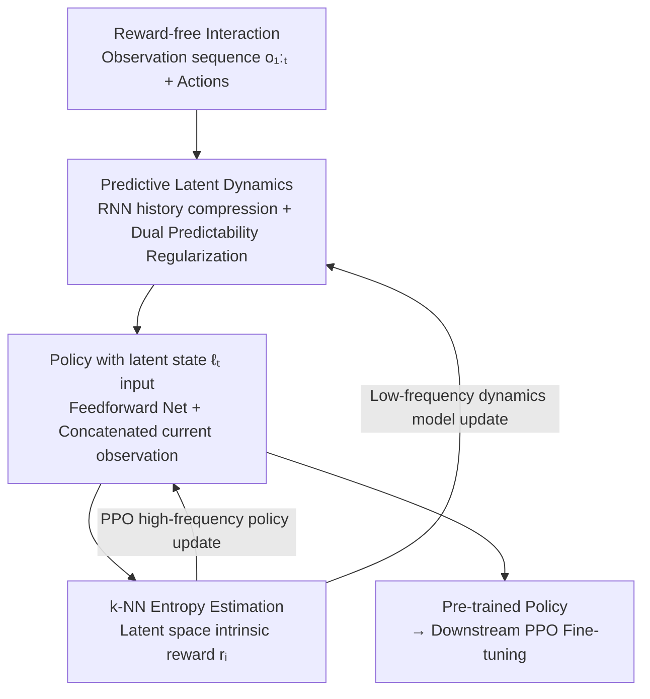

# Probing in the Dark: State Entropy Maximization for POMDPs

**Conference**: ICLR 2026  
**OpenReview**: [https://openreview.net/forum?id=kxzYGDL4fY](https://openreview.net/forum?id=kxzYGDL4fY)  
**Code**: [https://github.com/JonathanAshlag/LatEnt](https://github.com/JonathanAshlag/LatEnt)  
**Area**: Reinforcement Learning / Unsupervised Pre-training / POMDP  
**Keywords**: Maximum State Entropy, Partially Observable, Information State, Predictive Latent, Reward-free Pre-training

## TL;DR
Addressing the POMDP challenge where true states are unobservable, this paper proposes maximizing the **entropy of a predictive latent** as a proxy objective. It introduces the LatEnt algorithm, which concurrently learns latent dynamics and policies. On the custom PROBE benchmark, it induces true state entropy close to the "oracle" view, enabling downstream PPO to solve sparse-reward tasks that are unlearnable from scratch.

## Background & Motivation
**Background**: In reinforcement learning, "reward-free pre-training followed by downstream fine-tuning" is a primary approach to alleviate sample efficiency bottlenecks. A classic pre-training objective is **maximum state entropy** proposed by Hazan et al. (2019): maximizing the entropy $H(d^\pi(s))$ of the state visitation distribution $d^\pi(s)$ induced by a policy. Ideally, a policy uniformly covering all states provides a worst-case optimal initialization for any unknown downstream task, as rewards are typically functions of states.

**Limitations of Prior Work**: This conclusion relies on the full observability assumption. Real-world scenarios are predominantly **Partially Observable (POMDP)**—agents receive observations $o$ and cannot see states $s$, making it impossible to estimate $H(d^\pi(s))$. Previous POMDP approaches (Seo et al. 2021; Yarats et al. 2021; Zamboni et al. 2024) mostly **naively apply** fully observable methods by directly maximizing observation entropy $H(d^\pi(o))$, which only works in "mildly partially observable" scenarios (e.g., where stacking few frames recovers the state).

**Key Challenge**: Theorem 4.1 in Zamboni et al. (2024b) formalizes that maximizing observation entropy is equivalent to maximizing state entropy only when both the maximum singular value of the emission matrix $O$, $\sigma_{\max}(O)$, and that of its Hadamard inverse $O^{\circ-1}$ ($O^{\circ-1}_{ij}=1/O_{ij}$), $\sigma_{\max}(O^{\circ-1})$, are **very small**. If $\sigma_{\max}(O)$ is large (one state emits many observations) or $\sigma_{\max}(O^{\circ-1})$ is large (one observation originates from many states), observation entropy significantly misaligns with state entropy, causing naive methods to fail. For instance, when observations contain noise, policies maximizing observation entropy might "deliberately sample noise" instead of exploring states.

**Goal**: In a general POMDP where transitions $P$ and emissions $O$ are unknown and only $O(1)$ access to true states is permitted (Assumption 1), find a **proxy objective estimable solely from observations** that approximates the pre-training effect of true state entropy.

**Key Insight**: The authors leverage **Information State (IS)** theory from control theory—a sufficient statistic of history. Existing IS theory targets reward maximization (Subramanian et al. 2022); whether IS properties transfer to "convex functions of $d^\pi(s)$" like state entropy is non-obvious. This paper first extends IS theory to convex objectives and then designs a compact, learnable statistic to replace the true state.

**Core Idea**: Replace the unobservable state entropy $H(d^\pi(s))$ with the entropy of a "compact latent variable sufficient for predicting future observations" $H(d^\pi_L(\ell))$ as the proxy for unsupervised pre-training in POMDPs.

## Method

### Overall Architecture
The paper seeks to construct a "state-like" statistic in POMDPs and maximize its entropy. The logic operates across two layers: the **theoretical layer** demonstrates what constitutes a valid proxy (Information State → Predictive Latent), and the **algorithmic layer** introduces LatEnt to learn this proxy and the policy online.

The theoretical chain is: ① Theorem 1 proves that an information state satisfying Definition 1 (sufficient for any reward) is also an IS for convex-objective POMDPs (including state entropy); ② Definition 2 introduces **predictive latents**—requiring only "recursive evolution IS2a + observation prediction IS2b," as reward feedback IS1 is unavailable in reward-free settings; ③ The objective is shifted from "state entropy" to "latent entropy" (Eq. 3), and Theorem 2 proves that predictive latents support a wider class of downstream rewards than observations, making their pre-training more "universal."

LatEnt instantiates this latent as a **latent dynamics model** optimized **alternately** with the policy. The dynamics model compresses observation history into a latent state $\ell_t$, and the policy uses $\ell_t$ as input to maximize latent entropy via PPO (using k-NN non-parametric estimation as intrinsic rewards). A two-stage scheme—warmup followed by low-frequency model updates and high-frequency policy updates—stabilizes training despite the shifting latent space.

### Key Designs

**1. Replacing State Entropy with "Information State Entropy": Using sufficient statistics**

The fundamental pain point is that $s$ in $H(d^\pi(s))$ is unobservable. The authors break this by moving the objective to a statistic constructed from observations. Theorem 1 proves that if an IS is sufficient for **any** reward $R:S\times A\to\mathbb{R}$ simultaneously, it is also an IS for the convex-objective POMDP. The proof leverages Hazan et al. (2019): convex objectives can be decomposed into a mixture of reward maximization sub-problems. This legally converts "maximizing state entropy" into "maximizing the entropy of an information state."

**2. Predictive Latent: Retaining compact representations for prediction**

History is a trivial IS, but its space $|H|=|O|^T|A|^{T-1}$ grows exponentially, making entropy estimation impossible. The authors define **predictive latents** (Definition 2): a mapping $L:H\to\mathcal{L}\subseteq\mathbb{R}^d$ satisfying IS2a (recursion $\ell_{t+1}=\phi(o_{t+1},\ell_t,a_t)$) and IS2b (observation prediction). The learning signal comes **entirely from predicting future observations**. The proxy objective is:

$$\text{Max Latent Entropy:}\quad \max_{\pi\in\Pi}\; H(d^\pi_L(\ell)),\qquad d^\pi_L(\ell):=\sum_{t\in[T]}P(\ell_t=\ell\mid\pi,L)/T.$$

Theorem 2 proves that predictive latents satisfy IS1 for a **broader class of rewards** than observations, allowing the pre-trained policy to adapt to more downstream tasks.

**3. Compactness via "Dual Predictability Regularization"**

To prevent the latent from expanding into the history space, the authors use a latent dynamics model (intentionally **deterministic** to avoid inflating latent entropy with model stochasticity). The RNN outputs $\ell_t=f_\theta(o_t,a_{t-1},\ell_{t-1})$. The training loss combines "observation prediction" with "latent space regularization":

$$\min_\theta\; \mathcal{L}(\theta)=\sum_{i=1}^{T}\big(p_\theta(\ell_t,a_t)-o_{t+1}\big)^2+\alpha\big(g_\theta(\ell_t,a_t)-\mathrm{sg}(\ell_{t+1})\big)^2+\beta\big(\ell_{t+1}-\mathrm{sg}(g_\theta(\ell_t,a_t))\big)^2,$$

where $p_\theta$ is an observation decoder and $g_\theta$ predicts the next latent state. The latter terms are **bidirectional predictability regularizers** (inspired by KL balancing): pulling the true $\ell_{t+1}$ and its prediction $\hat\ell_{t+1}$ together. This forces the model to **discard redundant information** that cannot be predicted, favoring compact representations.

**4. k-NN Entropy Estimation and Two-Stage Training**

The entropy is estimated via a non-parametric method (Singh et al. 2003): $\hat H^k_N(Z)\propto\sum_i\log\lVert z_i-z_i^{k\text{-NN}}\rVert_2$, converted into an intrinsic reward:

$$r_i(z_i):=\log\big(\lVert z-z_i^{k\text{-NN}}\rVert_2+c\big).$$

The policy uses PPO with a large batch size. Since Markovian policies are sufficient for maximizing state entropy, the policy uses a feedforward network on $\ell_t$ without additional recurrent layers. Stability is maintained by a warmup phase followed by **low-frequency model updates** (via the encoder update ratio in Algorithm 1) to prevent latent space jitter from destabilizing the policy.

### Loss & Training
The core objective includes the dynamics loss (Eq. 5: MSE prediction + dual regularization) and the policy objective (PPO with k-NN latent entropy in Eq. 6). Algorithm 1 alternates between sampling $N$ trajectories, calculating latent entropy rewards, and updating the policy and model based on the encoder update ratio.

## Key Experimental Results

Experiments address: (Q1) Can LatEnt induce higher true state entropy than observation entropy? (Q2) Does it enable faster downstream adaptation? (Q3) Which components are critical? Results are reported on the **PROBE** benchmark with 10 seeds.

### PROBE Benchmark & Main Results

PROBE targets scenarios where observation entropy fails due to high $\sigma_{\max}(O)$ or $\sigma_{\max}(O^{\circ-1})$:

| Environment | Partially Observable Design | Hardness Property | Scale |
|------|----------------|----------|------|
| Masked Pendulum | Upper semicircle masked + hidden velocity | High $\sigma_{\max}(O)$ | 3D state / 2D obs |
| Vertically Blind Ant | Z-axis masked + external force hidden | High $\sigma_{\max}(O)$ | 105D state / 27D obs |
| Delusional Pusher | 3D Gaussian noise added to puck position | High $\sigma_{\max}(O^{\circ-1})$ | 20D state / 20D obs |

**Q1 (State Entropy Comparison)**: Using k-NN to estimate entropy on unobservable true states, LatEnt induces higher true state entropy than maximizing observation entropy in **all** environments, approaching the oracle limit. In Delusional Pusher, observation entropy policies move the arm **away from the puck** to sample noise, while LatEnt manipulates the puck.

| Pre-training Objective | Requires True State | Induced True State Entropy |
|------------|----------------|----------------|
| Max State Entropy (Oracle) | Yes | Maximum (Ceiling) |
| **LatEnt (Ours)** | No | Near-Oracle, outperforms Obs Entropy |
| Max Observation Entropy | No | Significantly lower, $\approx 0$ on Pusher |

### Main Results: Downstream Fine-tuning (Q2)

Downstream tasks involve sparse-reward skills (navigation/jumping).

| Initializer / Method | Tasks Solved | Note |
|-------------------|--------------|------|
| **LatEnt Pre-training → PPO** | All (Near Oracle) | Non-zero returns from the start |
| Max State Entropy Oracle → PPO | Near All | Ideal reference |
| Max Obs Entropy → PPO | 1/6 | Fails to find rewards on Pusher |
| PPO from scratch | Mostly fails | Demonstrates task difficulty |
| DreamerV3 | Mostly fails | SOTA model-based method fails |

### Ablation Study (Q3)

| Configuration | Induced True State Entropy | Note |
|------|------------------------|------|
| LatEnt (Full) | Highest | Compact latent + Dual regularization |
| + history encoding | Lower | Rebuilding history leads to non-compact space |
| w/o Predictive Regularization | Significant Drop (Pusher) | Critical in noisy/redundant environments |

### Key Findings
- **Compactness is vital**: Forcing the latent to reconstruct the entire history expands the latent space exponentially, degrading state entropy correlation. This effect is more pronounced over longer horizons.
- **Benefits of predictability regularization are environment-dependent**: In masked environments with little redundancy, benefits are limited. In noisy environments like Delusional Pusher, it is critical for discarding redundant components.
- **Failure of observation entropy is structural**: When $\sigma_{\max}(O)$ or $\sigma_{\max}(O^{\circ-1})$ is large, observation entropy and state entropy are fundamentally misaligned; policies are "fooled" by noise.

## Highlights & Insights
- **Theoretical Proxy Legality**: Extending IS theory to convex objectives (Theorem 1) provides a formal basis for using predictive latents (Theorem 2).
- **Transferable Compactness**: The use of "stop-gradient + bidirectional alignment" to discard unpredictable components is a powerful inductive bias for latent representation learning.
- **Deterministic Dynamics Choice**: Intentionally using a deterministic model avoids "fake entropy" inflation, a clever design reflecting the objective.
- **PROBE Benchmark Integrity**: Specifically constructed to highlight the mathematical failure modes of observation entropy.

## Limitations & Future Work
- **Oracle Evaluation**: While reward-free, evaluating the "induced true state entropy" still relies on oracle states.
- **Continuous/Gaussian Constraints**: MSE loss assumes Gaussian observation distributions; discrete/multimodal observations would require VAE extensions.
- **Computational Cost**: Large-batch on-policy PPO is computationally expensive.
- **Hyperparameter Sensitivity**: The encoder update ratio and $\alpha, \beta$ coefficients require tuning.

## Related Work & Insights
- **vs. Max Observation Entropy (Seo et al. 2021)**: LatEnt succeeds where obs-entropy fails by inferring hidden dimensions through temporal patterns.
- **vs. Zamboni et al. (2024a) Belief Entropy**: They maximize entropy of "synthetic states" from belief sequences, but require known $P, O$; LatEnt is model-free regarding transitions/emissions.
- **vs. DreamerV3 (Hafner et al.)**: Dreamer uses stochastic latents; LatEnt uses deterministic ones to prevent entropy pollution.
- **vs. History Encoding (Zintgraf et al. 2019)**: History reconstruction leads to non-compact spaces; LatEnt proves that for entropy maximization, compactness is the superior inductive bias over full reconstruction.

## Rating
- Novelty: ⭐⭐⭐⭐⭐ First proxy objective for state entropy in general POMDPs with theoretical and algorithmic support.
- Experimental Thoroughness: ⭐⭐⭐⭐ Solid results in continuous control, though lacking discrete or image-based visual POMDP verification.
- Writing Quality: ⭐⭐⭐⭐⭐ Clear progression from theory to method to experiments.
- Value: ⭐⭐⭐⭐⭐ Directly addresses open problems in POMDP unsupervised pre-training and provides the PROBE benchmark.

<!-- RELATED:START -->

## Related Papers

- [\[ICLR 2026\] The State of Reinforcement Finetuning for Transformer-based Agents](the_state_of_reinforcement_finetuning_for_transformer-based_agents.md)
- [\[ICLR 2026\] Relative Entropy Pathwise Policy Optimization](relative_entropy_pathwise_policy_optimization.md)
- [\[ICLR 2026\] Entropy Regularizing Activation: Boosting Continuous Control, Large Language Models, and Image Classification with Activation as Entropy Constraints](entropy_regularizing_activation_boosting_continuous_control_large_language_model.md)
- [\[ICLR 2026\] Entropy-Preserving Reinforcement Learning (REPO / ADAPO)](entropy-preserving_reinforcement_learning.md)
- [\[ICLR 2026\] SUSD: Structured Unsupervised Skill Discovery through State Factorization](susd_structured_unsupervised_skill_discovery_through_state_factorization.md)

<!-- RELATED:END -->
