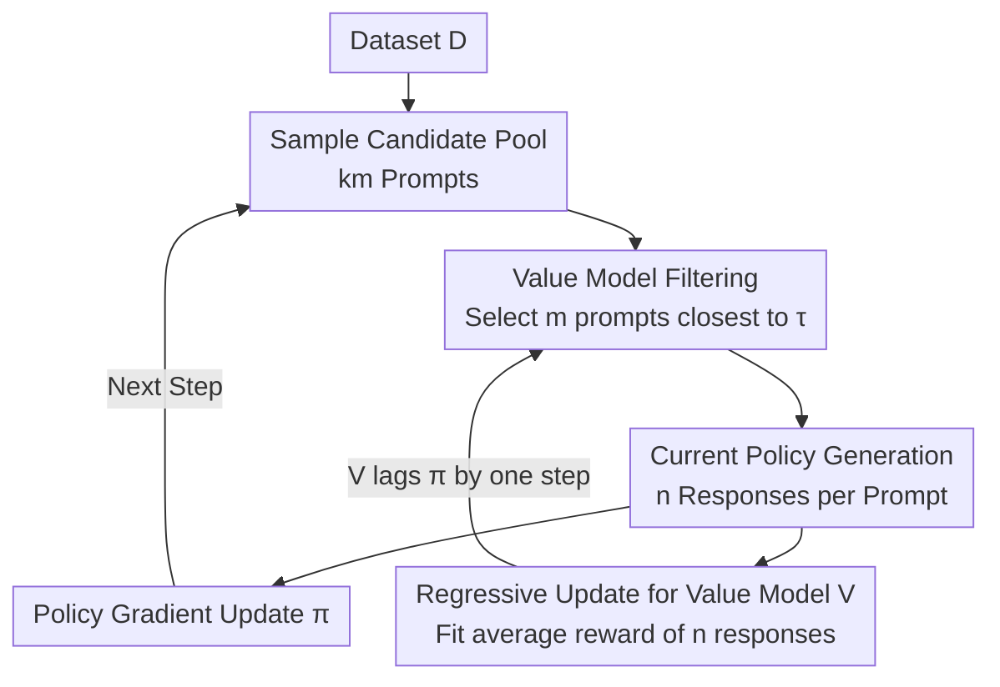

# Prompt Curriculum Learning for Efficient LLM Post-Training

**Conference**: ICLR 2026  
**OpenReview**: [https://openreview.net/forum?id=zqOCacBD3P](https://openreview.net/forum?id=zqOCacBD3P)  
**Code**: To be confirmed  
**Area**: Reinforcement Learning / LLM Post-Training  
**Keywords**: RLVR, Curriculum Learning, Value Model, Prompt Difficulty, Batch Size

## TL;DR
This paper systematically investigates how "batch size" and "prompt difficulty" jointly affect convergence during the RL post-training of LLMs. It discovers the existence of an optimal batch size and identifies that medium-difficulty prompts (with a success rate of approximately 50%) are the most efficient. Based on these findings, the authors propose PCL, a lightweight algorithm that employs an online-learned value model to predict prompt difficulty in a single forward pass to filter for medium-difficulty prompts. On mathematical reasoning benchmarks, PCL either achieves state-of-the-art performance or significantly reduces training time, with prompt filtering being 12.1×–16.9× faster than rollout-based methods.

## Background & Motivation
**Background**: Post-training LLMs using reinforcement learning with rule-based rewards (RLVR, such as PPO or GRPO) to enable models to self-explore and iteratively improve on verifiable tasks like mathematics and coding has become a key method for developing strong reasoning models like o1 and DeepSeek-R1. Recent works (DAPO, SPEED, GRESO, etc.) have repeatedly observed a pattern: training on "medium-difficulty" prompts (neither too easy nor too hard for the current policy) significantly improves data efficiency.

**Limitations of Prior Work**: Existing methods for identifying medium-difficulty prompts have significant drawbacks. One category relies on actual rollouts from the current model to estimate the success rate of each prompt, but online generation is extremely expensive, and resources spent on filtered prompts are wasted. Another category uses a dictionary to record average rewards from historical epochs; when the dataset is large and an epoch cannot be completed in a single iteration, historical estimates become severely off-policy and fail to reflect the current model's capability. Furthermore, existing research focuses almost exclusively on prompt difficulty, while hyperparameters like batch size—which also profoundly affect convergence—have not been systematically studied.

**Key Challenge**: Convergence in RL post-training is governed by two conflicting factors: shorter generation times lead to more frequent updates, but larger batch sizes with more diverse prompts and a higher ratio of effective gradients lead to lower gradient noise. These are coupled through "batch size," "number of prompts $m$," and "responses per prompt $n$," creating a natural trade-off that has not been previously quantified.

**Goal**: (1) Clarify how batch configuration and prompt selection **jointly** affect convergence to identify the optimal batch size and its decomposition. (2) Design a **computationally efficient** curriculum algorithm that consistently focuses on medium-difficulty prompts without the high cost of rollout-based filtering.

**Key Insight**: The authors performed large-scale ablations totaling approximately 100,000 A100 GPU hours. They explicitly defined "convergence" as the final reward achieved under a fixed compute and time budget, then disassembled three pathways: generation time, prompt diversity, and effective gradient ratio. The value of this perspective lies in the realization that focusing on "medium-difficulty prompts allows for a high effective ratio with a smaller $n$," freeing up the budget to increase $m$ for better diversity.

**Core Idea**: Use an online-trained value model $V(x)$ to predict prompt difficulty in a single forward pass, greedily selecting medium-difficulty prompts whose predicted difficulty is closest to 0.5. This **replaces an entire round of rollouts with a single forward pass** for curriculum filtering.

## Method

### Overall Architecture
PCL (Prompt Curriculum Learning) aims to focus training on the most informative medium-difficulty prompts at every step without wasting generation compute. The overall system is an online cycle running in parallel with policy training: at each step, a **larger candidate pool** ($km$ prompts) is sampled from the dataset. A value model predicts the expected reward $V(x)\approx p_\pi(x)$ for each prompt via a single forward pass, and $m$ prompts with predicted values closest to the threshold $\tau$ (default 0.5) are greedily selected. The current policy generates $n$ responses for each of these $m$ prompts for a standard policy gradient update. Finally, the value model is updated via regression using the actual generated responses (rather than extra rollouts). The extra overhead of this process is minimal, consisting only of one forward pass and one small regression update, as prompts are typically under 1K tokens.

### Key Designs

**1. Optimal Batch Size: Finding the Inflection Point between Generation Time and Gradient Noise**

This addresses the conflict where larger batches provide stable gradients but slower generation. The authors decompose batch size $b$ into the number of prompts $m$ and responses per prompt $n$ ($b=m\times n$). They observe a key phenomenon: as batch size increases, generation time grows **sublinearly at first, then linearly**. At small batch sizes, generation time is dominated by the longest response in the batch; at large sizes, it is dominated by hardware utilization. The optimal batch size occurs at the inflection point from sublinear to linear growth. In experiments, this point is around 8K and remains consistent regardless of the decomposition—whether $(m,n)=(512,16)$, $(256,32)$, or $(128,64)$. The authors verified the robustness of this **fixed optimal batch size** across different architectures, scales, datasets, and rollout engines.

**2. Efficiency of Medium Difficulty: $p(x)\approx0.5$ as the Sweet Spot for Effective Ratio and Diversity**

This explains "why a curriculum is needed." The effective ratio is defined as the proportion of samples in a batch with a **non-zero advantage**. Under the on-policy GRPO objective, if $n$ responses for a prompt are all correct or all incorrect, the advantage $A(x,y)=r(x,y)-p_\pi(x)$ becomes zero, causing gradient vanishing. The authors found that while increasing $n$ improves the effective ratio, prompts with $p(x)=0.5$ maintain the highest effective ratio even at small $n$ (e.g., $n=16$ at $p=0.5$ outperforms other difficulties at $n=128$). Since an optimal batch size exists, focusing on $p(x)=0.5$ allows using a smaller $n$ to accommodate a larger $m$, increasing diversity while maintaining a high effective ratio.

**3. Online Value Model Filtering: Single Forward Pass instead of Rollouts**

This is the core of PCL, solving the issues of expensive rollouts and off-policy dictionaries. At step $t$, $km$ candidate prompts are sampled, and the value model predicts the expected reward. The algorithm greedily solves:
$$\mathcal{D}_m=\underset{S\subseteq\mathcal{D}_{km},\,|S|=m}{\arg\min}\sum_{x\in S}\big|V^{\pi_{t-1}}(x)-\tau\big|$$
The $m$ prompts closest to threshold $\tau$ are selected. After policy updates using $n$ responses per prompt, the value model is updated by minimizing:
$$\sum_{i=1}^{m}\Big(V(x_i)-\frac{1}{n}\sum_{j=1}^{n}r(x_i,y_{i,j})\Big)^2$$
**No additional rollouts are required.** Since the value model only processes prompts, training and inference overhead are negligible. Although $V$ lags the policy $\pi$ by one step ($V^{\pi_{t-1}}$), the small per-step updates make this acceptable. Compared to rollout filtering, PCL is 12.1× and 16.9× faster on MATH and DeepScaleR, respectively.

### Loss & Training
The policy side uses a pure on-policy GRPO variant, removing KL regularization and standard-deviation-based advantage normalization to maximize:
$$\mathbb{E}_{x\sim D,\,y\sim\pi_t(\cdot|x)}\Big[\frac{1}{|y|}\sum_{l=1}^{|y|}\frac{\pi(y_l|x,y_{<l})}{\pi_t(y_l|x,y_{<l})}A(x,y)\Big]$$
This is analyzed cleanly by stripping away auxiliary components. The value model is updated online via the regression loss in Equation (2). Main experiments fix $m=512$, $n=16$, $\tau=0.5$, and $k=4$.

## Key Experimental Results

### Main Results
Models include Qwen3-Base (1.7B/4B/8B) and Llama3.2-3B-it on MATH and DeepScaleR datasets. Evaluations use MATH500, Olympiad-Bench, Minerva, AMC23, and AIME24/25. "Time" represents total duration to reach peak performance.

| Dataset/Model | Metric | PCL | Second Best | Note |
|--------|------|------|----------|------|
| MATH / Qwen3-8B-Base | MATH500 | **88.2** | DS 87.8 | Highest Accuracy |
| MATH / Qwen3-4B-Base | MATH500 / Time | 83.4 / **14.0h** | GRPO 83.0 / 29.2h | ~Half Time for same accuracy |
| MATH / Llama3.2-3B-it | MATH500 | **57.8** | SPEED-class 56.8 | Highest Accuracy |
| DeepScaleR / Qwen3-8B-Base | Avg / Time | **52.0** / 41.8h | DS 51.5 / 69.5h | ~39.8% faster than DS |

PCL achieved the highest MATH500 accuracy across four models on MATH and significantly shortened convergence time on DeepScaleR. Baselines like DS are slow due to $n$ generations for all $km$ prompts, while SPEED suffered from off-policy issues and crashes.

### Ablation Study

| Configuration | Key Finding |
|------|---------|
| Value Model Accuracy | Explained variance ≈ estimation using 3 rollouts. Value model is 12x-16x faster. |
| Threshold $\tau$ | $\tau=0.5$ yields the highest accuracy. Performance drops as it deviates from 0.5. |
| Difficulty Drift | PCL gradually focuses on harder prompts as the policy improves, keeping $V(x) \approx 0.5$. |

### Key Findings
- **The value model is accurate and efficient**: An online-trained linear head reaches an explained variance comparable to 3 real rollouts while reducing filtering time to mere seconds.
- **$\tau=0.5$ is the sweet spot**: It covers the midpoint of binary rewards and captures diverse signals. It also implicitly rebalances data if the policy's average reward deviates from 0.5.
- **Adaptive Difficulty Tracking**: Methods using filtering (DS/PCL) select prompts with decreasing rewards relative to a reference policy $\pi_{ref}$, meaning they track the moving target of difficulty.
- **Effective Ratio vs. Generation Time**: PCL maintains a higher effective ratio than GRPO while avoiding the excessive generation time of DS/SPEED.

## Highlights & Insights
- **Turning difficulty filtering from a generation problem into a prediction problem**: The core insight is that prompt utility can be learned online by a lightweight model, replacing "one round of rollouts" with "one forward pass."
- **Decoupling of optimal batch size and decomposition**: The finding that the 8K optimal batch size is independent of $(m, n)$ is a highly reusable practical conclusion.
- **Dual role of $\tau=0.5$**: It is both the sweet spot for sample efficiency and the point where the value model learns best (due to implicit data rebalancing).
- **Transferability**: This approach can be applied to any RL post-training scenario where rollouts are expensive and sample difficulty distribution matters, such as coding or Agent tasks.

## Limitations & Future Work
- Experiments focused on mathematical reasoning with binary verifiable rewards; effectiveness on non-binary, dense, or subjective rewards is unverified.
- The one-step lag of the value model depends on small per-step policy updates; this might fail with aggressive learning rates.
- The theoretical reason why $\tau=0.5$ makes value model training so effective (beyond basic data rebalancing) requires further formal characterization.

## Related Work & Insights
- **vs Dynamic-Sampling (DS)**: DS uses $n$ rollouts to estimate difficulty for all candidates, achieving an effective ratio of 1 but more than doubling generation time. PCL provides similar accuracy with an order-of-magnitude speedup.
- **vs SPEED**: SPEED uses rollouts from an old policy, introducing severe off-policy bias that causes training to crash; PCL uses current policy data.
- **vs GRESO (Dictionary)**: GRESO relies on historical reward dictionaries which become outdated for large datasets; PCL is adaptive and does not rely on cross-epoch history.
- **vs Pre-filter**: Pre-filter excludes hard problems once and do not revisit them; PCL's dynamic threshold automatically tracks difficulty drift as the policy improves.

## Rating
- Novelty: ⭐⭐⭐⭐ Uses an online value model for prompt difficulty curriculum—simple yet effective for RLVR efficiency.
- Experimental Thoroughness: ⭐⭐⭐⭐⭐ ~100k GPU hours across models, scales, and hardware with comprehensive baselines.
- Writing Quality: ⭐⭐⭐⭐ Clear logic from phenomenon to mechanism to algorithm, well-supported by figures.
- Value: ⭐⭐⭐⭐⭐ Practical conclusions on batch size and medium difficulty are highly instructive; PCL is plug-and-play with negligible overhead.

<!-- RELATED:START -->

## Related Papers

- [\[ICML 2026\] Provable Benefit of Curriculum in Transformer Tree-Reasoning Post-Training](../../ICML2026/reinforcement_learning/provable_benefit_of_curriculum_in_transformer_tree-reasoning_post-training.md)
- [\[ICLR 2026\] Scheduling Your LLM Reinforcement Learning with Reasoning Trees](scheduling_your_llm_reinforcement_learning_with_reasoning_trees.md)
- [\[ICLR 2026\] Representation-Based Exploration for Language Models: From Test-Time to Post-Training](representation-based_exploration_for_language_models_from_test-time_to_post-trai.md)
- [\[ACL 2026\] Scaling Behaviors of LLM Reinforcement Learning Post-Training: An Empirical Study](../../ACL2026/reinforcement_learning/scaling_behaviors_of_llm_reinforcement_learning_post-training_an_empirical_study.md)
- [\[ICLR 2026\] Post-training Large Language Models for Diverse High-Quality Responses](post-training_large_language_models_for_diverse_high-quality_responses.md)

<!-- RELATED:END -->
