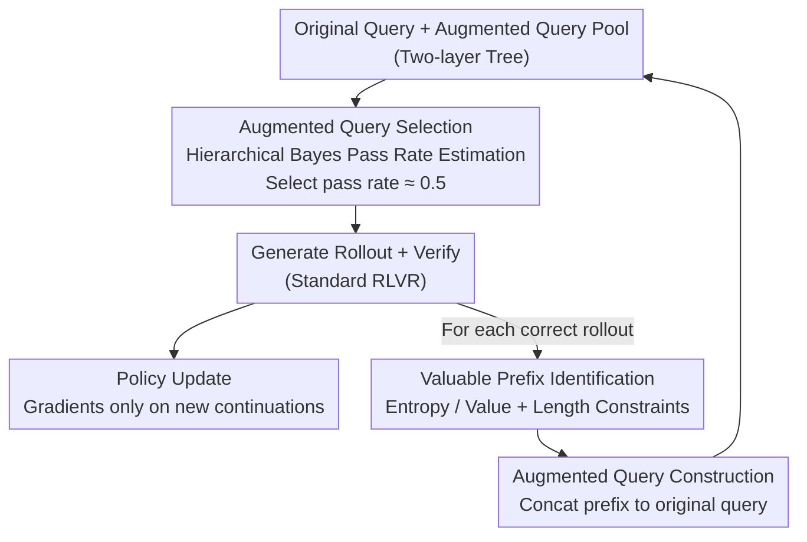

# PROS: Towards Compute-Efficient RLVR via Rollout Prefix Reuse

**Conference**: ICLR 2026  
**OpenReview**: [https://openreview.net/forum?id=lz1SRTcnUb](https://openreview.net/forum?id=lz1SRTcnUb)  
**Code**: To be confirmed  
**Area**: LLM Inference / Reinforcement Learning / RLVR Efficiency  
**Keywords**: RLVR, Prefix Reuse, Augmented Query, Hierarchical Bayes, Training Efficiency

## TL;DR
PROS identifies that multiple rollouts for the same query are highly redundant in early reasoning steps. It constructs "Augmented Queries" by concatenating original queries with "valuable prefixes" from historical rollouts for reuse in subsequent iterations. This eliminates redundant compute and employs a hierarchical Bayesian model to estimate pass rates, prioritizing samples with pass rates near 0.5. PROS achieves higher accuracy than PPO/GRPO on AIME24/AMC23 with less wall-clock time.

## Background & Motivation

**Background**: Training Large Reasoning Models (LRMs) using Reinforcement Learning with Verifiable Rewards (RLVR) has become a mainstream path for enhancing complex reasoning. The model acts as a policy to generate a Chain-of-Thought (CoT), a deterministic verifier provides binary rewards for the final answer, and policy gradient methods like PPO/GRPO update the parameters. Each iteration includes: "select query → generate rollout → verify → update."

**Limitations of Prior Work**: RLVR depends heavily on on-policy rollout generation, the cost of which scales rapidly with CoT length and model size. Empirical measurements (Figure 2a) show that as the maximum rollout length increases, generation time accounts for a surging proportion of total training time. For 100B+ models with 100k+ tokens, rollout generation becomes the primary training bottleneck.

**Key Challenge**: By organizing trajectories sampled across different iterations for the same query into a tree (Figure 1), the authors observe two types of redundancy. First, **near-duplicates in early steps**: different rollouts often share similar initial setups (e.g., analyzing the base case) and only diverge later. Measuring prefix similarity via normalized edit distance and Rouge-L on DAPO-Train confirms that shorter prefixes have higher similarity, signifying wasted compute. Second, **waste in early dead-ends**: correct trajectories are sparse; naive multi-sampling may enter incorrect branches early (e.g., iterations 10–30 in Figure 1), yet still generates long suffixes that contribute negligible training value.

**Goal**: To reduce redundant early-stage computation and reallocate compute to more meaningful later-stage exploration without altering the core RL algorithm logic.

**Core Idea**: Construct "Augmented Queries" by concatenating original queries with high-value prefixes from the model's own historical rollouts. This avoids regenerating early steps (saving compute) and allows the policy to start from high-quality mid-points, bypassing early dead-ends (cross-iteration search pruning).

## Method

### Overall Architecture
PROS (Prefix Reuse for On-policy Sampling) acts as a plugin for standard RLVR pipelines. The standard "query selection → generation → verification → update" remains, augmented by two low-overhead modules: **Augmented Query Construction** (Section 3) and **Augmented Query Selection** (Section 4).

In each iteration: For every **correct** rollout, PROS identifies the most valuable prefix $y[:t^*]$ using token-level entropy (and critic values for actor-critic models). This is concatenated with the original query to form an augmented query $q' = \text{concat}(q, y[:t^*])$, which is added to the training set. The dataset evolves into a **two-layer tree**: original queries are parent nodes, and derived augmented queries are children. Augmented queries are treated like regular queries: the policy continues generation given the "historical prefix + original query." RL updates perform credit assignment and gradients **only on the newly generated continuation**; reused prefixes carry no gradients to prevent overfitting. To manage the exploding number of augmented queries, a hierarchical Bayesian model estimates the pass rate for each, prioritizing those with pass rates near 0.5 for training batches.

Crucially, augmented queries provide only **partial** reasoning steps from the policy itself without leaking final answers, maintaining on-policy characteristics unlike offline experience replay.

### Key Designs

**1. Augmented Query Construction: Cross-Iteration Reuse of High-Value Prefixes**

To address redundant early-step generation, PROS avoids caching full trajectories for offline replay. Instead, it extracts **prefixes** and concatenates them with the original query $q' = \text{concat}(q, y[:t^*])$. This offers two benefits: first, the policy starts from a verified intermediate state, saving compute; second, it implements cross-iteration search pruning by encouraging the policy to reuse high-quality starts and bypass dead-ends. RL updates are performed **only on the new continuation**, ensuring the policy does not overfit to its past steps. Since no labels are leaked, it remains on-policy, differing fundamentally from distribution-shifting experience replay.

**2. Valuable Prefix Identification: Locating Cutoff Points via Entropy and Value Signals**

PROS uses two near-zero-cost signals to select the prefix cutoff. The **uncertainty signal** uses token-level entropy; since RLVR calculates log-probs during the forward pass, entropy is readily available. High entropy indicates the policy is uncertain about the next step, identifying unexplored, information-dense regions. The **value signal** utilizes the learner's critic value (in actor-critic frameworks like PPO); prefixes with higher values are more likely to lead to correct answers. Practically, $t^* = \arg\max_{t\in[0,T)} \text{Entropy}(\pi(\cdot|y_{<t}, q))$ is selected from correct rollouts; if using actor-critic, $t^*$ is constrained to the top 10% of timesteps by predicted value. A **length constraint** $t^* \in [\tfrac{1}{4}T, \tfrac{3}{4}T)$ is added to ensure nontrivial compute savings while leaving sufficient space for exploration.

**3. Hierarchical Bayesian Selection: Prioritizing Samples Near 0.5 Pass Rate**

To select training batches from the expanding pool of augmented queries, PROS follows the principle that queries with pass rates near 0.5 provide the strongest learning signal. Unlike "Dynamic Sampling" which requires expensive online generation to calibrate pass rates, PROS **estimates pass rates from historical reward statistics** using Bayesian inference. It leverages the tree structure via a **two-layer logit-normal model**: let pass rate $\theta = \text{sigmoid}(\psi)$, where parent log-odds $\psi_{par} \sim \mathcal{N}(\mu, \tau^2)$ and child log-odds $\psi_i | \psi_{par} \sim \mathcal{N}(\psi_{par}, \sigma^2)$. Binary rewards are $r \sim \text{Bern}(\theta)$. This prior encodes the inductive bias that an augmented query's pass rate is correlated with its parent's. By introducing **Pólya-Gamma auxiliary variables**, the non-conjugate posterior becomes Gaussian, allowing Gibbs sampling (Propositions 4.1/4.2) to estimate $\tilde{\theta} = \sigma(\tilde{\psi})$. Queries with $\tilde{\theta}$ closest to 0.5 are selected.

**4. Exponential Forgetting: Adapting to Policy Drift**

As the policy evolves, historical pass rate statistics become stale. PROS applies a forgetting factor $\lambda \in (0,1)$ to historical counts $s_i$ and $n_i$ before merging with new observations. This ensures recent rewards have a higher influence, allowing the sampler to track the non-stationary environment.

### Mechanism Example
Referencing Figure 3: A batch includes $q_2, q_4, q_5$ (selected for $\tilde{\theta} \approx 0.5$) → generate rollouts $y_i$ → verify for rewards $r_i$ → update policy. For a correct rollout (e.g., $y_3$ from $q_3$), a cutoff $t^*$ is identified based on entropy within $[\tfrac{1}{4} T, \tfrac{3}{4} T)$ to construct $q' = \text{concat}(q_3, y_3[:t^*])$. In the next selection cycle, the hierarchical Bayesian model estimates the pass rate for $q'$ based on $q_3$'s history and $q'$'s own observations, potentially selecting it for the next batch.

### Loss & Training
PROS maintains the standard PPO/GRPO objective $\max_\theta \mathbb{E}_{q;y\sim\pi_\theta(\cdot|q)}[R(q,y)]$. It only modifies the starting points (queries/prefixes), with gradients restricted to new continuations. Main experiments used Qwen3-8B with PPO and GRPO, 400 iterations on DAPO-Train and 300 on AIME-Old, 8 rollouts per query, batch size 512, and max sequence length 6144.

## Key Experimental Results

### Main Results
Using Qwen3-8B, PROS as a plugin for PPO/GRPO outperforms strong baselines (Pass@1) across two training sets and two benchmarks:

| Training Set / Algorithm | AIME24 | AMC23 | #Time (min/iter) | Note |
|------|------|------|------|------|
| PPO (DAPO-Train) | 28.23 | 73.63 | 9.17 | Vanilla |
| PPO + Dynamic Sampling | 28.85 | 66.69 | 17.62 | Strong but 2-4x slower |
| PPO + PROS | **33.23** | **78.20** | 9.77 | Best accuracy, time near vanilla |
| GRPO (DAPO-Train) | 29.58 | 73.40 | 6.58 | Vanilla |
| GRPO + PROS | **34.17** | **78.28** | 7.57 | Strong improvement |

The average gains for PPO/GRPO with PROS are +3.96 and +6.21 points, respectively. Similar trends hold for Qwen3-4B (AIME-Old): PROS scores 27.40/62.12, outperforming vanilla (21.25/52.59) and Dynamic Sampling (10.83 min per iter).

### Ablation Study

| Configuration | AIME24 | AMC23 | Conclusion |
|------|------|------|------|
| PROS-ablation (Prefix Reuse + Random) | 31.35 | 73.93 | Prefix reuse alone improves efficiency and performance |
| PROS (Prefix Reuse + Bayesian Selection) | 33.23 | 78.20 | Selection mechanism provides further gains |

Hyperparameter ablations (GRPO/AIME-Old, $\sigma$ and $\lambda$) show PROS is robustly better than vanilla. Pass rate estimation error decreases as training progresses.

### Key Findings
- **Prefix reuse is the primary source of gain**: PROS-ablation already outperforms vanilla, validating the core mechanism of "reuse + continuation-only gradients."
- **Efficiency reflected in wall-clock time**: While Dynamic Sampling can achieve high scores via rejection sampling, it is 2–4× slower. PROS provides better performance with near-vanilla time (Figure 5).
- **No length collapse**: While vanilla PPO/GRPO and replay variants suffer from length collapse on AIME-Old, PROS maintains growing rollout lengths, preserving test-time scaling potential (Figure 6).

## Highlights & Insights
- **Transforming compute waste into data augmentation**: Rather than just compressing generation, PROS transforms historical rollouts into new training samples.
- **Gradient design**: Restricting gradients to newly generated tokens prevents the model from collapsing into imitation of its past self, distinguishing PROS from experience replay.
- **Pólya-Gamma trick**: Applying this to a Bernoulli-Gaussian hierarchical model enables efficient Gibbs sampling for online query selection, a technique transferable to other "active data selection" contexts.
- **Cost-free signals**: Using token-level entropy as a value signal leverages computation that is already required during the forward pass.

## Limitations & Future Work
- The construction of augmented queries relies on simple heuristics (entropy/value signals); more principled identification criteria or integration with adaptive uncertainty estimation could be explored.
- Experiments are restricted to mathematical reasoning (AIME/AMC) and Qwen3-4B/8B models; generalization to code or 100B+ models is yet to be verified.
- PROS's wall-clock advantage is partially offset by its tendency to explore longer CoTs; the efficiency gain is "better performance in the same time" rather than "same performance in significantly less time."
- Pass rate estimation depends on the hierarchical prior; the assumption of correlation between parent and child queries may be challenged if an augmented query significantly alters problem difficulty.

## Related Work & Insights
- **vs. Experience Replay**: Replay uses full trajectories, risking overfitting and entropy collapse. PROS reuses only prefixes and excludes them from gradients, maintaining on-policy benefits.
- **vs. Hint-based Methods**: Hint-based methods require human-labeled partial solutions. PROS uses self-generated prefixes, which is more scalable.
- **vs. Dynamic Sampling**: Methods like DAPO require online rollout generation to calculate pass rates. PROS uses Bayesian estimation from historical records, reducing overhead while maintaining a hierarchical structure.

## Rating
- Novelty: ⭐⭐⭐⭐⭐ Transforming redundancy into data augmentation via hierarchical Bayesian selection is highly novel.
- Experimental Thoroughness: ⭐⭐⭐⭐ Coverage of PPO/GRPO across multiple datasets/benchmarks is strong, though limited to math.
- Writing Quality: ⭐⭐⭐⭐⭐ Well-supported motivation (tree redundancy analysis) and clear mathematical derivation.
- Value: ⭐⭐⭐⭐⭐ Plug-and-play with minimal overhead; directly addresses the generation bottleneck in RLVR scaling.

<!-- RELATED:START -->

- **[DeepSeek-V3]** DeepSeek-V3 Technical Report. (RLVR foundation).
- **[DAPO]** Dynamic Sampling in Policy Optimization for Reasoning. (Comparison target for selection).
- **[PPO-Replay]** On the tradeoff between sample and compute efficiency in RL.

<!-- RELATED:END -->

## Related Papers

- [\[ICLR 2026\] Parameter-Efficient Reinforcement Learning using Prefix Optimization](parameter-efficient_reinforcement_learning_using_prefix_optimization.md)
- [\[ICML 2026\] Single-Rollout Hidden-State Dynamics for Training-Free RLVR Data Selection](../../ICML2026/reinforcement_learning/single-rollout_hidden-state_dynamics_for_training-free_rlvr_data_selection.md)
- [\[ICLR 2026\] The Art of Scaling Reinforcement Learning Compute for LLMs](the_art_of_scaling_reinforcement_learning_compute_for_llms.md)
- [\[ICLR 2026\] Generalization of RLVR Using Causal Reasoning as a Testbed](generalization_of_rlvr_using_causal_reasoning_as_a_testbed.md)
- [\[ICLR 2026\] Controllable Exploration in Hybrid-Policy RLVR for Multi-Modal Reasoning](controllable_exploration_in_hybrid-policy_rlvr_for_multi-modal_reasoning.md)

<!-- RELATED:END -->
