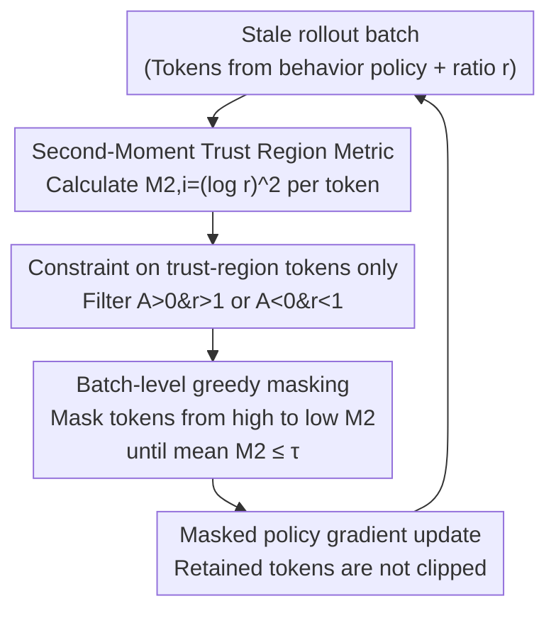

# Prosperity before Collapse: How Far Can Off-Policy RL Reach with Stale Data on LLMs?

**Conference**: ICLR 2026  
**OpenReview**: [https://openreview.net/forum?id=IIgl5MWelz](https://openreview.net/forum?id=IIgl5MWelz)  
**Code**: https://github.com/Infini-AI-Lab/M2PO/  
**Area**: LLM Reasoning / Reinforcement Learning / Asynchronous off-policy RL  
**Keywords**: RLVR, Stale data, Trust region, Second moment, Importance sampling

## TL;DR
Addressing the issue where severe staleness of rollout data in asynchronous RL training for LLMs leads to performance degradation or training collapse, this paper first reveals the "Prosperity before Collapse" phenomenon—stale data is as informative as on-policy data, and the key lies in its utilization. The authors propose M2PO, which uses the second moment $M_2$ of importance weights instead of $\epsilon$-clipping to constrain the trust region. By masking only extreme outlier tokens and retaining most useful updates, M2PO stabilizes training even with data stale by 256 updates, matching on-policy performance across six models ranging from 1.7B to 32B.

## Background & Motivation

**Background**: Reinforcement Learning with Verifiable Rewards (RLVR) is the mainstream approach for training LLM reasoning capabilities (e.g., o1, DeepSeek-R1). Most algorithms like PPO and GRPO are designed for on-policy settings, requiring fresh rollouts sampled by the current policy for each parameter update to ensure stability and reliability.

**Limitations of Prior Work**: The "fresh rollout for every step" requirement in on-policy RL is extremely costly for complex reasoning or agentic tasks. For instance, a single rollout in SWE-bench with OpenHands involves multiple tool calls and code executions, with end-to-end latency reaching hundreds of minutes. While asynchronous RL systems decouple rollout generation from training to improve efficiency, they require algorithms to tolerate "stale" data (where the behavior policy lags behind the current policy by many updates). Existing algorithms under high staleness either remain stable but lose performance (PPO, GRPO, GSPO) or achieve performance but suffer from training collapse (AREAL, CISPO, GPPO, etc.).

**Key Challenge**: Through control experiments removing the trust region ($\epsilon=\infty$), the authors discovered a counter-intuitive "Prosperity before Collapse" phenomenon: with data at staleness $s=256$, training without clipping is initially stronger than GRPO with $\epsilon$-clipping, sometimes even matching on-policy performance, before eventually collapsing due to uncontrolled variance. This suggests that **stale data itself is not deficient in information; the problem lies in how the algorithm utilizes it**. Further analysis of 90 million training tokens revealed that $\epsilon$-clipping rates rise sharply under staleness, specifically discarding tokens with high $|r-1|$ and high entropy—which are both the most informative signals and the primary source of off-policy instability, creating a dilemma.

**Goal**: Design a trust region policy that retains learning signals from high-entropy tokens without causing training collapse, thereby achieving "prosperity without collapse" under high staleness.

**Core Idea**: Abandon token-wise $\epsilon$-clipping in favor of using the **second moment** $M_2 = \frac{1}{N}\sum_i(\log r_i)^2$ of the batch importance weights as a measure of distributional divergence. Mask only extreme outlier tokens that cause $M_2$ to exceed a threshold, while retaining all other updates.

## Method

### Overall Architecture

M2PO (Second-Moment Trust Policy Optimization) is built upon GRPO, replacing only the trust region constraint mechanism. GRPO uses group-relative advantage $A_{i,t}=\frac{r_i-\text{mean}(\{R\})}{\text{std}(\{R\})}$ with an importance ratio $r_i=\frac{\pi_\theta(o_i|q)}{\pi_{\text{behav}}(o_i|q)}$ for policy gradients, typically relying on $\epsilon$-clipping to keep $r$ within $[1-\epsilon, 1+\epsilon]$. M2PO's approach is: upon receiving a batch of stale rollouts, calculate the second-moment contribution of each token $\hat M_{2,i}=(\log r_i)^2$. Constraints are applied only to "trust-region tokens" affected by PPO clipping. Tokens are greedily masked from largest $\hat M_{2,i}$ to smallest until the batch mean $\bar M_2$ falls below a threshold $\tau_{M_2}$. Finally, a standard policy gradient update is performed using these masked tokens without further ratio clipping.

### Key Designs

**1. Second-Moment Trust Region Metric: Replacing token-wise clipping and batch KL with $(\log r)^2$**

Off-policy instability stems from the distribution mismatch between behavior and current policies; larger mismatches lead to higher importance sampling variance and noisier gradients. A natural metric is batch KL $\hat{\text{KL}}=-\frac{1}{N}\sum_i\log r_i$, but it has two flaws: first, in single-sample estimates, $\hat{\text{KL}}_i$ can be positive or negative, allowing large values to cancel out and yield a "physically small" but misleading KL; second, for tokens where $r_i>1$, $\hat{\text{KL}}_i$ is negative, reducing the total estimate and failing to constrain tokens that might cause instability. M2PO uses the second moment of the log-ratio $\hat M_2=\frac{1}{N}\sum_i(\log r_i)^2$: each token's contribution is non-negative, and it reliably constrains cases where $r>1$. While KL only reflects mean shift, $M_2$ also captures the variance of importance weights, making it more sensitive to extreme outliers. Theoretically (Theorem 1), under the assumption $1/R\le r\le R$, $M_2$ provides an upper bound for the Pearson $\chi^2$ divergence $\chi^2(\pi_{\text{new}}\|\pi_{\text{behav}})=\mathbb{E}[(r-1)^2]$ as $\chi^2\le R^2 M_2$.

**2. Batch-level Greedy Masking: Trimming extreme outliers while retaining high-entropy updates**

With the $M_2$ metric, M2PO shifts from token-wise rigid clipping to **batch-level** constraints. Tokens are sorted by $\hat M_{2,i}$ ($O(N\log N)$), and the algorithm masks tokens starting from the highest $M_2$ value until the remaining tokens satisfy $\bar M_2\le\tau_{M_2}$ (Algorithm 1). This removes only the few extreme tokens that drive up batch variance, preserving the majority of high-entropy, informative signals. Empirically, while $\epsilon$-clipping masks 1.22% of tokens for Qwen-2.5-32B at $s=256$, M2PO masks only 0.06%—a magnitude lower while precisely targeting high-variance tokens. The threshold $\tau_{M_2}$ is fixed at $0.04$ throughout, showing low sensitivity.

**3. Trust-Region Tokens Only: Aligning with PPO clipping semantics**

PPO/GRPO applies the $\min$ operator, meaning clipping only effectively occurs when "$A>0$ and $r>1$" or "$A<0$ and $r<1$". M2PO adopts this logic, applying $M_2$ constraints only to these trust-region tokens. This prevents unnecessary constraints on tokens that would not trigger out-of-bounds updates, ensuring M2PO aligns with PPO-style clipping where it matters most. The final objective is:

$$J_{\text{M2PO}}(\theta)=\frac{1}{\sum_{i}|o_i|}\sum_{i=1}^{G}\sum_{t=1}^{|o_i|} M_{i,t}\,\frac{\pi_\theta(o_i|q)}{\pi_{\theta_{\text{behav}}}(o_i|q)}A_{i,t},\quad M_{i,t}\in\{0,1\}$$

where $M_{i,t}$ is the mask from greedy masking. The loss is averaged over all tokens to remain close to PPO behavior.

### Loss & Training
Advantages $A_{i,t}$ are computed using GRPO's group-relative normalization. Training is implemented via verl + vLLM, using DeepScaleR for math data. Staleness is handled via a "stale-k" mechanism: at step $t-k$, the current policy generates rollouts into a buffer, which are consumed at step $t$ after $k$ updates. Each training step includes 4 model updates, so $s=0$ indicates staleness of 0-3, and $s=256$ indicates 256-259. GRPO uses $\epsilon=0.2$, and M2PO uses $\tau_{M_2}=0.04$.

## Key Experimental Results

### Main Results
Evaluation across six models (1.7B to 32B) and eight math benchmarks (Math500, AIME24/25, AMC23/24, Minerva, Gaokao, Olympiad) compared GRPO, GSPO, and M2PO at staleness $s=256$, with on-policy GRPO ($s=0$) as a reference. The table shows average accuracy (%) across eight benchmarks:

| Model | GRPO (s=0) | GRPO (s=256) | GSPO (s=256) | M2PO (s=256) |
|------|-----------|--------------|--------------|--------------|
| Llama-3.2-3B-Instruct | 25.2 | 22.5 | 22.6 | **25.3** |
| Qwen2.5-Math-7B | 49.3 | 45.7 | 44.7 | **48.8** |
| Qwen3-Base-1.7B | 33.0 | 30.4 | 30.1 | **36.6** |
| Qwen3-Base-4B | 50.7 | 40.1 | 43.2 | **51.3** |
| Qwen3-Base-8B | 53.6 | 46.7 | — | **55.1** |
| Qwen2.5-32B | 51.6 | 47.0 | — | **52.6** |

M2PO at $s=256$ consistently matches or exceeds on-policy GRPO ($s=0$). For Qwen3-Base-4B, it improves accuracy from 40.1% to 51.3% compared to GRPO at the same staleness. Interestingly, on Qwen3-Base-1.7B, M2PO ($s=256$, 36.6%) outperforms GRPO ($s=0$, 33.0%); this is attributed to M2PO's lower clipping rate even compared to the slight 0-3 staleness in "on-policy" setups. M2PO also excels in coding tasks, proving generalized utility beyond math.

### Ablation Study

| Comparison (Qwen-2.5-32B, Avg. Clipping Rate) | Clip Rate | Note |
|------|--------|------|
| GRPO (s=256) | 1.22% | Frequent clipping on stale data hurts signals |
| GRPO (s=0) | 0.05% | Near-zero clipping in on-policy settings |
| M2PO (s=256) | 0.06% | Matches on-policy levels, reduced by 10x |

The clipping rate acts as a proxy for performance: M2PO reduces clipping to on-policy levels, explaining its superior performance. Ablation of $\tau_{M_2}$ thresholds shows stability across a wide range, with performance only dropping at extreme values (too restrictive or leading to collapse).

### Key Findings
- **Clipping rate as a proxy**: M2PO reduces the clipping rate to the same order of magnitude as on-policy training, directly corresponding to its ability to match on-policy performance.
- **Removing trust regions causes "Prosperity before Collapse"**: High early performance without clipping confirms that stale data is informative, but eventual collapse necessitates a smarter trust region.
- **Baseline instability**: AREAL, CISPO, TOPR, and GPPO generally suffer from training instability at $s=256$, as they were designed for moderate staleness.

## Highlights & Insights
- **The "Prosperity before Collapse" observation is pivotal**: It debunks the idea that stale data is useless and redirects the research focus toward designing better trust regions rather than simply filtering data.
- **Second moment $M_2$ as a robust metric**: It solves KL's cancellation issues, handles $r>1$, is variance-sensitive, and bounds $\chi^2$ divergence with a single global threshold.
- **Batch-level masking over token-wise clipping**: Switching from "cutting every outlier" to "ensuring batch-level variance" preserves informative signals while removing extreme noise.
- **Parameter robustness**: $\tau_{M_2}=0.04$ works across all experiments, facilitating easy engineering deployment without per-model tuning.

## Limitations & Future Work
- Experiments primarily focus on math and one coding task; agentic or long-horizon tool-use scenarios were not validated end-to-end.
- Theoretical $\chi^2$ bounds depend on $r$ being bounded; behavior over extremely long sequences was not explored.
- The method addresses trust regions but not the off-policy bias inherent in advantage estimation within the GRPO framework.
- The loss average includes masked tokens as an approximation of PPO behavior; if masking rates were higher, this could become problematic.

## Related Work & Insights
- **vs. GRPO**: Both use group-relative advantages, but GRPO's token-wise clipping over-masks high-entropy tokens under staleness; M2PO's $M_2$ masking reduces this by an order of magnitude.
- **vs. GSPO**: GSPO uses sequence-level clipping, providing stability under high staleness but losing significant performance compared to M2PO.
- **vs. AREAL / CISPO / GPPO**: These methods target moderate staleness and often collapse at $s=256$.
- **vs. Batch KL**: M2PO avoids the cancellation and $r>1$ issues of KL by using the squared log-ratio.

## Rating
- Novelty: ⭐⭐⭐⭐⭐ "Prosperity before Collapse" observation + $M_2$ trust region provides a clean, theoretically-backed perspective.
- Experimental Thoroughness: ⭐⭐⭐⭐⭐ Six models, extensive benchmarks, and detailed ablations up to 32B.
- Writing Quality: ⭐⭐⭐⭐⭐ Clear logical flow from phenomenon to analysis to method and verification.
- Value: ⭐⭐⭐⭐⭐ Directly improves efficiency for large-scale/agentic RL by making asynchronous off-policy RL viable under extreme staleness.

<!-- RELATED:START -->

## Related Papers

- [\[ICLR 2026\] How Far Can Unsupervised RLVR Scale LLM Training?](how_far_can_unsupervised_rlvr_scale_llm_training.md)
- [\[ICLR 2026\] RL Grokking Recipe: How Does RL Unlock and Transfer New Algorithms in LLMs?](rl_grokking_recipe_how_does_rl_unlock_and_transfer_new_algorithms_in_llms.md)
- [\[ACL 2026\] RL-PLUS: Countering Capability Boundary Collapse of LLMs in Reinforcement Learning with Hybrid-policy Optimization](../../ACL2026/reinforcement_learning/rl-plus_countering_capability_boundary_collapse_of_llms_in_reinforcement_learnin.md)
- [\[ICLR 2026\] BAPO: Stabilizing Off-Policy Reinforcement Learning for LLMs via Balanced Policy Optimization with Adaptive Clipping](bapo_stabilizing_off-policy_reinforcement_learning_for_llms_via_balanced_policy_.md)
- [\[ICLR 2026\] RL Squeezes, SFT Expands: A Comparative Study of Reasoning LLMs](rl_squeezes_sft_expands_a_comparative_study_of_reasoning_llms.md)

<!-- RELATED:END -->
