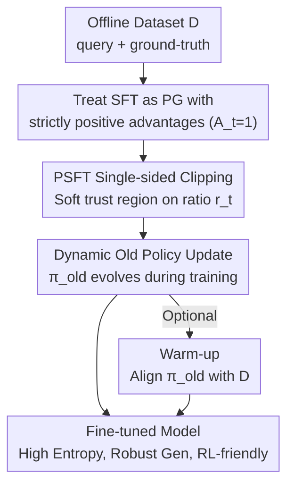

# Proximal Supervised Fine-Tuning

**Conference**: ICLR 2026  
**OpenReview**: [https://openreview.net/forum?id=hQtwQqYikp](https://openreview.net/forum?id=hQtwQqYikp)  
**Code**: Implemented based on the open-source verl framework (provided with supplementary materials)  
**Area**: Alignment RLHF / LLM Post-training / Supervised Fine-Tuning  
**Keywords**: Supervised Fine-Tuning, Trust Region, PPO Clipping, Entropy Collapse, Generalization

## TL;DR
PSFT reinterprets standard SFT as "policy gradient with strictly positive advantages" and borrows the clipped trust region mechanism from PPO to impose a soft constraint on SFT updates. This preserves target task performance while significantly mitigating entropy collapse, maintaining general capabilities, and providing greater optimization space for subsequent RL/DPO stages.

## Background & Motivation

**Background**: In the post-training pipeline of Large Language Models (LLMs), SFT is typically the first step—using expert trajectories (e.g., distilled long CoT data) for supervised fine-tuning. It is efficient, simple, and far less complex than directly applying RL. Many community efforts rely on SFT to "distill" reasoning capabilities from strong models into target models.

**Limitations of Prior Work**: SFT is essentially behavior cloning. When fine-tuning data is suboptimal or mismatched with the pre-training distribution, it leads to two chronic issues. First, **poor generalization**: the model performs well in the target domain, but out-of-domain (OOD) capabilities (scientific reasoning, instruction following) degrade significantly, often referred to as the "alignment tax." Second, **entropy collapse**: the output distribution becomes overly concentrated, causing diversity to vanish. When used as a cold-start model for RL, its exploration capability is locked, preventing further gains during RL.

**Key Challenge**: The cross-entropy loss indiscriminately pushes up the probability of every ground-truth token without any constraint on the "update magnitude." From a policy optimization perspective, this is equivalent to repeated, uncontrolled large policy updates, which leads to overfitting training data and pushing the distribution too far from the reference policy, damaging both generalization and exploration.

**Goal**: To allow SFT to achieve better generalization and exploration (high entropy) without sacrificing target task performance, serving as a high-quality starting point for subsequent RL.

**Key Insight**: The authors noted that TRPO/PPO in RL solved the problem of "how to limit the magnitude of a single policy update" using trust region constraints. Since SFT can be rewritten as a special case of policy gradient, can the PPO clipping mechanism be directly transferred to the supervised setting?

**Core Idea**: Treat SFT as "policy gradient where the advantage is always 1," then replace cross-entropy with the PPO clipped surrogate objective. This adds a soft trust region to supervised updates, constraining the probability ratio between the new and old policies to prevent excessive policy drift.

## Method

### Overall Architecture

PSFT addresses the fact that "SFT updates lack any magnitude constraints." The overall approach is to theoretically align SFT with policy gradient, then migrate the PPO trust region clipping mechanism to derive a supervised fine-tuning loss that can directly replace cross-entropy.

Specifically: The input is an offline dataset $\mathcal{D}$ (query + ground-truth response). First, the authors prove that SFT is a special case of policy gradient where sampling is fixed on the offline data and the advantage of all ground-truth tokens is fixed at $\hat{A}_t=1$. Second, since it is formally equivalent to policy gradient with positive advantages, PPO can be applied: a probability ratio $r_t(\theta)=\pi_\theta(a_t\mid s_t)/\pi_{\theta_{\text{old}}}(a_t\mid s_t)$ is introduced and clipped to obtain the PSFT loss. Third, the old policy $\pi_{\theta_{\text{old}}}$ evolves dynamically during training (rather than remaining fixed as the initial model), with an optional warm-up phase to align the old policy with the data distribution. The output is a fine-tuned model with target domain performance comparable to SFT, smooth entropy without collapse, stronger OOD generalization, and a higher performance ceiling for RL/DPO cold starts.

### Key Designs

**1. Viewing SFT as Policy Gradient with "Constant Positive Advantage"**

This is the theoretical anchor of the method, intended to connect "supervised learning" and "policy optimization" to justify using PPO tools. Standard SFT minimizes cross-entropy $\mathcal{L}_{\text{SFT}}(\theta)=-\hat{\mathbb{E}}_{(s_t,a_t^*)\sim\mathcal{D}}[\log\pi_\theta(a_t^* \mid s_t)]$, while policy gradient maximizes $\mathcal{L}_{\text{PG}}(\theta)=\hat{\mathbb{E}}_{(s_t,a_t)\sim\pi_\theta}[\log\pi_\theta(a_t \mid s_t)\,\hat{A}_t]$, where $\hat{A}_t$ is the advantage function. The authors point out that by switching the sampling from "online interaction" to the "fixed offline dataset $\mathcal{D}$" and setting the advantage to $\hat{A}_t=1$ (assuming actions in the dataset are "correct"), policy gradient reduces to maximizing the likelihood of ground-truth tokens, which is SFT. The value of this equivalence is that it exposes SFT's problem as the same issue faced by policy gradient—lack of update magnitude constraints—meaning trust region tools from RL can be directly applied.

**2. PSFT Single-sided Clipping: Adding a Soft Trust Region to Supervised Updates**

To address the pain point of "unconstrained SFT leading to large drifts," PSFT adopts the PPO clipped surrogate objective into the supervised setting. Since the advantage is always positive ($\hat{A}_t=1$), the objective simplifies to clipping the probability ratio:

$$\mathcal{L}_{\text{PSFT}}(\theta)=\mathbb{E}_{(s_t,a_t)\sim\mathcal{D}}\left[\min\!\left(r_t(\theta),\ \text{clip}(r_t(\theta),1-\epsilon,1+\epsilon)\right)\right],\quad r_t(\theta)=\frac{\pi_\theta(a_t\mid s_t)}{\pi_{\theta_{\text{old}}}(a_t\mid s_t)}.$$

While it resembles PPO, it is **fundamentally different**: PPO is an RL method optimizing expected return using online trajectories and advantage estimation, whereas PSFT is a purely supervised offline objective where the clipping ratio acts as a regularizer to limit excessive changes in token probabilities and reweight gradients. Crucially, due to the positive advantage, only the upper bound clipping is triggered:

$$\nabla_\theta\mathcal{L}_{\text{PSFT}}(\theta)=\mathbb{E}_{(s_t,a_t)\sim\mathcal{D}}\left[r_t(\theta)\cdot \mathbb{I}_{\text{trust}}(r_t(\theta))\cdot\nabla_\theta\log\pi_\theta(a_t\mid s_t)\right],\quad \mathbb{I}_{\text{trust}}(r_t)=\begin{cases}0 & r_t>1+\epsilon\\ 1 & \text{otherwise}\end{cases}.$$

Intuitively, if the offline distribution of a token deviates too far from the current model distribution ($r_{t} > 1+\epsilon$, often for tokens that disrupt general capabilities), its gradient is zeroed out. This prevents large policy updates, suppresses entropy collapse, and preserves generalization, leaving room for sustainable progress in subsequent RL. The paper finds $\epsilon = 0.2$ or $0.28$ to be optimal.

**3. Dynamic Old Policy Update: Centering the Trust Region on Data**

If the old policy $\pi_{\theta_{\text{old}}}$ is fixed as the initial reference model $\pi_{\theta_{\text{ref}}}$, optimization is trapped within a trust region centered on the reference, blocking knowledge that could be learned from the offline data. PSFT's Mechanism allows $\pi_{\theta_{\text{old}}}$ to **evolve dynamically** during training—synchronizing every few steps—allowing the trust region center to move forward with the model, achieving "gradual and stable" learning from the dataset. Ablations show update frequency is critical: no updates (no upd) is only slightly better than the base; updating every 4 steps yields maximum on-domain gains (AIME-24 from 13.0 to 22.5), but frequent updates with small batches and high learning rates may sacrifice some generalization.

**4. Warm-up: Aligning the Old Policy with the Data Distribution**

In PSFT, $(s_t, a_t)$ are sampled from offline data $\mathcal{D}$, but in the first few steps, $\pi_{\theta_{\text{old}}}$ might not be aligned with $\mathcal{D}$, causing bias in the expectation of the ratio $r_t(\theta)$. While dynamic evolution mitigates this, an optional short phase of standard SFT as a warm-up can align the initial old policy with the dataset, further boosting target domain performance. Experiments show that warm-up PSFT consistently outperforms both raw PSFT and standard SFT on on-domain tasks, with longer warm-ups providing more on-domain gains at the cost of slight generalization decreases.

### Loss & Training
The core loss is $\mathcal{L}_{\text{PSFT}}$ as defined above. The default clipping threshold $\epsilon$ is 0.28. The old policy is synchronized every 4–16 steps (the main setup uses mini-batches to trigger updates). Baselines include standard SFT and SFT-KL (SFT with a KL penalty, coefficient 0.5). Implementation cost is nearly zero—one simply replaces rollouts with SFT demonstrations and sets constant advantages in a standard RL framework.

## Key Experimental Results

Experiments cover three major scenarios: Mathematical reasoning (Qwen2.5-7B-Instruct / Llama3.1-8B-Instruct, OpenR1-Math long CoT data), Human preference alignment (Qwen3-4B-Base + UltraFeedback + DPO), and Multimodal (Qwen2.5-VL).

### Main Results (SFT Stage, Qwen2.5-7B-Instruct)

| Dimension | Metric | Base | SFT | SFT-KL | PSFT |
|------|------|------|-----|--------|------|
| On-domain Avg | 6 Math benchmarks | 37.98 | 47.99 | 47.08 | 46.98 |
| OOD Avg | 7 General benchmarks | 59.85 | 57.90 | 57.38 | **61.26** |
| Instruction Following | IFEval (loose) | 73.94 | 54.42 | 55.44 | **73.03** |

Key comparison: SFT improves on-domain scores (37.98→47.99) but **regresses** OOD to 57.90, with IFEval crashing from 73.94 to 54.42. PSFT maintains on-domain performance comparable to SFT while OOD scores rise to 61.26 and IFEval remains stable. The gap is even more pronounced on Llama3.1-8B (OOD PSFT 59.25 vs SFT 50.49).

### RL Phase (PSFT as Cold Start, Qwen2.5-7B-Instruct)

| Pipeline | On-domain Avg | OOD Avg |
|------|---------|---------|
| SFT → GRPO | 52.40 | 59.90 |
| PSFT → GRPO | **53.31** | **64.06** |

While PSFT is slightly lower on-domain during the SFT stage, it **surpasses** SFT after GRPO (On-domain 53.31 > 52.40, OOD 64.06 > 59.90), confirming that PSFT preserves higher entropy and exploration space for RL.

### Ablation Study

| Configuration | AIME-24 | TruthfulQA | IFEval | Description |
|------|---------|------------|--------|------|
| PSFT (No Update) | 13.02 | 66.61 | 76.46 | Slightly better than base, poor on-domain |
| PSFT (Upd every 8) | 19.38 | 67.16 | 73.03 | Main setting |
| PSFT (Upd every 4) | 22.50 | 66.72 | 72.08 | Best on-domain, slight gen drop |
| PSFT (No Clip) | — | — | — | High entropy but high gradient norm; unstable |

### Key Findings
- **Entropy preservation is the core selling point**: SFT/SFT-KL entropy drops sharply after each epoch (sawtooth pattern, a signal of overfitting). PSFT's entropy curve is smooth, allowing for fine-grained training without collapse.
- **Dynamic old policy is the primary contributor**: Without updates, on-domain performance is poor (AIME-24 at 13.0); updating every 4 steps raises it to 22.5. This is the prerequisite for PSFT to actually learn.
- **Clipping provides stability**: Removing clipping preserves entropy but results in large gradient norms and highly volatile downstream results; $\epsilon \approx 0.28$ provides the best trade-off.
- **Interpretation of clipped tokens**: Clipping weights are concentrated on "thought pattern" tokens like "wait" or "alternatively," suggesting PSFT smoothly injects reasoning patterns while minimizing disruption to general capabilities.
- **Validated in alignment scenarios**: For DPO, PSFT cold start achieves an AlpacaEval2 LC of 23.29 (vs 16.96 for SFT→DPO), as SFT overfits to chosen data and produces fewer negative samples, limiting learning from reward signals.

## Highlights & Insights
- **The perspective of "SFT is PG with $A=1$" is an "Aha!" moment**: Once connected to policy gradient, twenty years of RL tools (trust regions, clipping) become available with minimal changes.
- **Clear physical meaning of single-sided clipping**: Since advantages are positive, only tokens whose probabilities are being pushed too hard have their gradients cut. This effectively "brakes" dangerous updates that might destroy general capabilities.
- **Repositioning SFT as an "RL Cold Start" rather than an "End State"**: SFT should not just be evaluated on on-domain scores, but on how much entropy and exploration space it leaves for subsequent RL/DPO. This evaluation lens is transferable to any post-training pipeline.
- **Nearly zero implementation cost**: In existing RL frameworks, one just changes the rollout source and sets constant advantages.

## Limitations & Future Work
- **Ours** acknowledges that further validation on more diverse, industrial-scale datasets and models is needed.
- Introduction of new hyperparameters ($\epsilon$ and update frequency) creates a trade-off between on-domain performance and generalization that requires scene-specific tuning.
- On-domain scores are sometimes slightly lower than standard SFT ("slow start"), only overtaking after subsequent RL—in pure SFT deployments without RL, PSFT benefits generalization and stability rather than peak on-domain performance.
- The constant advantage assumption ($A=1$) relies on "correctness" of offline data; its robustness to noisy or suboptimal samples requires further analysis.

## Related Work & Insights
- **vs iw-SFT**: iw-SFT views SFT as a loose lower bound of the RL objective and uses importance reweighting to tighten it; PSFT focuses on preventing entropy collapse and preserving generalization via trust regions.
- **vs DFT**: DFT treats SFT as a flawed policy gradient and uses probability-based reweighting; PSFT also uses the PG perspective but aims to "constrain update magnitude" rather than just boosting target scores.
- **vs SFT-KL**: Direct KL constraints (hard centering on reference) are less effective than PSFT—KL is a global soft constraint, while PSFT's per-token single-sided clipping precisely targets dangerous updates.
- **vs LUFFY / HPT**: These hybrid methods mix offline SFT and online RL losses in one batch; PSFT is a pure offline supervised objective and can serve as a superior cold-start base for them.

## Rating
- Novelty: ⭐⭐⭐⭐ Elegantly transfers PPO trust regions to supervised settings; clear perspective.
- Experimental Thoroughness: ⭐⭐⭐⭐⭐ Covers math/alignment/multimodal domains with full SFT→RL/DPO pipelines.
- Writing Quality: ⭐⭐⭐⭐ Theoretical derivations and findings are well-organized.
- Value: ⭐⭐⭐⭐⭐ A nearly zero-cost SFT alternative addressing entropy collapse and alignment tax.

<!-- RELATED:START -->

## Related Papers

- [\[ICLR 2026\] SRFT: A Single-Stage Method with Supervised and Reinforcement Fine-Tuning for Reasoning](srft_a_single-stage_method_with_supervised_and_reinforcement_fine-tuning_for_rea.md)
- [\[ICLR 2026\] On-Policy RL Meets Off-Policy Experts: Harmonizing Supervised Fine-Tuning and Reinforcement Learning via Dynamic Weighting](on-policy_rl_meets_off-policy_experts_harmonizing_supervised_fine-tuning_and_rei.md)
- [\[ICLR 2026\] Fine-tuning Behavioral Cloning Policies with Preference-Based Reinforcement Learning](fine-tuning_behavioral_cloning_policies_with_preferencebased_reinforcement_learn.md)
- [\[ICLR 2026\] Escaping Policy Contraction: Contraction-Aware PPO (CaPPO) for Stable Language Model Fine-Tuning](escaping_policy_contraction_contraction-aware_ppo_cappo_for_stable_language_mode.md)
- [\[ICLR 2026\] Sparse but Critical: A Token-Level Analysis of Distributional Shifts in RLVR Fine-Tuning of LLMs](sparse_but_critical_a_token-level_analysis_of_distributional_shifts_in_rlvr_fine.md)

<!-- RELATED:END -->
