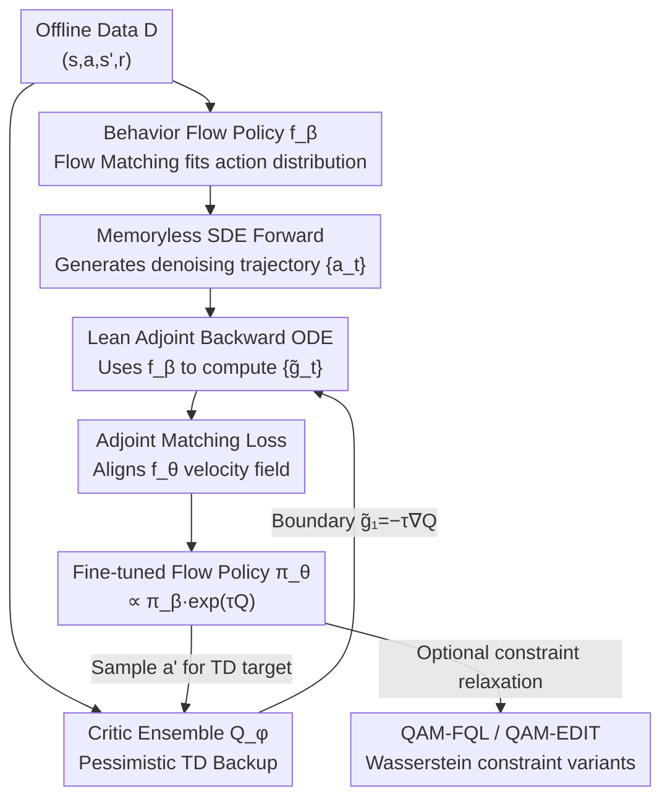

# Q-Learning with Adjoint Matching

**Conference**: ICLR 2026  
**OpenReview**: [https://openreview.net/forum?id=vd4eNAdtO6](https://openreview.net/forum?id=vd4eNAdtO6)  
**Code**: https://github.com/ColinQiyangLi/qam  
**Area**: Reinforcement Learning / Diffusion & Flow Policies / Offline RL  
**Keywords**: Offline RL, Flow Matching, Adjoint Matching, Policy Extraction, TD Learning

## TL;DR
QAM incorporates adjoint matching techniques from generative modeling into Q-learning. It uses gradients from the critic on "clean actions" as direct step-by-step supervision to fine-tune multi-step flow policies. This approach preserves the expressivity of flow policies while avoiding numerical instability from backpropagating through denoising chains, achieving an aggregate score of 44/46 across 50 sparse-reward tasks in OGBench and surpassing all existing baselines.

## Background & Motivation

**Background**: Continuous action RL (especially in offline and offline-to-online settings) constantly struggles with the trade-off between "policy expressivity" and "optimizability relative to the critic." Single-step Gaussian policies are easy to optimize—gradient-based policy improvement can be performed directly via the reparameterization trick using the critic's action gradient $\nabla_a Q(s,a)$. However, they have poor expressivity and fail to capture multi-modal or complex action distributions. While diffusion or flow policies generate actions through multi-step denoising and offer high expressivity, they struggle to utilize first-order critic information directly.

**Limitations of Prior Work**: Directly optimizing flow policies with critic action gradients usually involves "backpropagating through the entire denoising chain," which is long and prone to numerical instability (ill-conditioned intermediate gradients accumulate and amplify). Existing approaches to bypass this have costs: (1) **Discarding action gradients entirely** and using only scalar critic values (e.g., advantage weighting, rejection sampling), which is sample-inefficient and often underperforms gradient-based methods; (2) **Distilling multi-step flow policies into single-step noise-conditioned approximations**, which sacrifices expressivity. Another category uses the critic as classifier guidance directly on "noisy intermediate actions," but this relies on the fragile assumption that the critic's gradient on noisy actions can proxy its gradient on clean actions. When offline data coverage is narrow, the critic is only well-trained on a narrow distribution of clean actions, making gradients on OOD intermediate noisy actions unreliable.

**Key Challenge**: A structural trade-off exists between expressivity (multi-step flow policies) and optimization stability (using first-order critic information)—the former requires unstable backpropagation through long chains, while stability often necessitates sacrificing expressivity or gradients.

**Goal**: Can the full expressivity of flow policies be maintained while directly injecting critic action gradients into the denoising process without introducing backpropagation instability?

**Key Insight**: The authors noted the recently proposed **adjoint matching** (Domingo-Enrich et al., 2025) in generative modeling. It can fine-tune a base flow model $f_\beta$ into a flow model $f_\theta$ that generates a "tilted distribution" $p_\theta(X_1)\propto p_\beta(X_1)e^{Q(X_1)}$. Crucially, its objective function avoids backpropagating through the denoising chain while keeping the optimal solution unchanged. The "behavior-constrained optimal policy" in RL, $\pi^\star(a\mid s)\propto\pi_\beta(a\mid s)e^{\tau(s)Q(s,a)}$, is exactly such a tilted distribution.

**Core Idea**: Reformulate policy extraction as a Stochastic Optimal Control (SOC) problem and solve it using the "lean adjoint" objective from adjoint matching. By using critic gradients on clean actions and transforming them into step-by-step velocity field supervision via a behavior flow model—which is "independent of the optimized model"—the optimal behavior-constrained policy is recovered without bias and with full expressivity, paired with standard TD backups to learn the critic.

## Method

### Overall Architecture

QAM is a TD-based actor-critic algorithm that replaces the critic-based policy fine-tuning step with adjoint matching. It cyclically performs three operations in offline and offline-to-online settings: (1) Learning a behavior flow policy $f_\beta$ via flow matching to approximate the action distribution in the data; (2) Fine-tuning another flow policy $f_\theta$ using the adjoint matching objective to become the behavior-constrained optimal policy $\pi_\theta\propto\pi_\beta e^{\tau Q}$; (3) Learning a critic ensemble $Q_\phi$ using standard TD backups, where subsequent actions are sampled from the current $f_\theta$. These processes alternate ($f_\beta, f_\theta, Q_\phi$ are trained simultaneously without independent stages).

When fine-tuning the flow policy, QAM does not directly solve the SOC objective (which is equivalent to backpropagating through the SDE and is unstable). Instead: it first rolls out a denoising trajectory $\{a_t\}_t$ using a "memoryless" SDE. It then uses the **behavior flow model $f_\beta$** (not the model $f_\theta$ being optimized) to compute lean adjoint states $\{\tilde g_t\}_t$ via a backward ODE (with boundary condition $\tilde g_1=-\tau\nabla_{a_1}Q_\phi$). Finally, it aligns the difference between the velocity fields of $f_\theta$ and $f_\beta$ with these adjoint states, forming a square loss that requires no backpropagation through time.

### Key Designs

**1. Adjoint Matching Policy Extraction: Constructing backprop-free supervision using clean action gradients**

This is the core of QAM, addressing the challenge of backpropagation instability and the loss of expressivity. By defining the behavior-constrained optimal policy as the solution under KL-constraint $\pi^\star(a\mid s)\propto\pi_\beta(a\mid s)e^{\tau(s)Q_\phi(s,a)}$, the authors reformulate it as an SOC objective:

$$\mathcal{L}(\theta)=\mathbb{E}_{s\sim D,\,a_t}\left[\int_0^1 \frac{2}{\sigma_t^2}\lVert f_\theta(s,a_t,t)-f_\beta(s,a_t,t)\rVert_2^2 - \tau(s)Q_\phi(s,a_1)\,dt\right],$$

where $a_t$ is defined by a "memoryless" SDE $da_t=(2f_\theta-a_t/t)dt+\sqrt{2(1-t)/t}\,dB_t$. Since solving this directly is equivalent to backpropagating through the SDE, QAM uses the adjoint matching objective:

$$\mathcal{L}_{\mathrm{AM}}(\theta)=\mathbb{E}_{s,\{a_t\}}\left[\int_0^1\big\lVert 2(f_\theta-f_\beta)/\sigma_t+\sigma_t\tilde g_t\big\rVert_2^2\,dt\right],$$

which uses the "critic gradient on clean actions" (hidden in the boundary condition of $\tilde g_t$) as the target signal for intermediate velocity fields. Crucially, the lean adjoint states $\tilde g_t$ are calculated via the backward ODE $d\tilde g_t=-\nabla_{a_t}[2f_\beta(s,a_t,t)-a_t/t]\tilde g_t\,dt$, which **only uses the behavior flow model $f_\beta$ and never touches the optimized $f_\theta$**. This is vital: in naive backpropagation, the ill-conditioned action gradients $\nabla_a f_\theta$ from $f_\theta$ itself would amplify along the chain, polluting the gradient for parameters $\theta$. In adjoint matching, the action gradient of $f_\theta$ contributes nothing to the total gradient, making optimization significantly more stable.

**2. Lean Adjoint: Eliminating terms that are zero at the optimum for stability**

The standard continuous adjoint method (Basic Adjoint Matching, BAM) satisfies an ODE containing $f_\theta$, making its gradient equivalent to backpropagating through the denoising chain. Following Domingo-Enrich et al. (2025), the "lean" trick removes all terms in the adjoint state that are identically zero at the optimal solution. This removal does not change the optimal solution for $f_\theta$ but results in a cleaner ODE (Eq. 13/22) that only requires $f_\beta$ and vector-Jacobian products (VJPs). The authors used BAM as a baseline: it is identical to QAM except it uses the basic objective (Eq. 12) instead of the lean one (Eq. 14). BAM's aggregate score was 35 compared to QAM's 44, quantifying the stability gains of lean adjoints over $f_\theta$-dependent backpropagation.

**3. Pessimistic Critic Ensemble + TD Backup: Stabilizing value estimation offline**

To ensure reliable value estimation, QAM uses an ensemble of $K=10$ critic functions with pessimistic backup: the regression target for each $\phi_j$ is $r+\gamma(\bar Q_{\mathrm{mean}}(s',a')-\rho\,\bar Q_{\mathrm{std}}(s',a'))$. This penalizes value estimates for high-variance (often OOD) actions, mitigating overestimation in offline RL (default $\rho=0.5$). The next action $a'$ is sampled from the current fine-tuned flow policy $f_\theta$ via ODE, creating a closed loop between actor and critic.

**4. Variants for Relaxing Behavior Constraints: QAM-FQL and QAM-EDIT**

While QAM converges to $\propto\pi_\beta e^{\tau Q}$, it may struggle with support mismatch when the optimal action is highly improbable under the behavior distribution. The authors relaxed the constraint from pure KL to a "KL + Wasserstein" combination.
- **QAM-FQL** ($q{=}2$, Euclidean metric): Uses FQL to learn a single-step noise-conditioned policy $\mu_\omega$ with loss $-Q_\phi(s, \mu_\omega(s,z)) + \alpha \lVert \mu_\omega(s,z) - \text{ODE}(f_\theta(s,\cdot,\cdot), z) \rVert_2^2$.
- **QAM-EDIT** ($q{=}1$, $L_\infty$ metric): Learns an edit policy $\pi_\omega(\Delta a\mid s,a)$ that modifies actions from $\pi_\theta$ within a range $\sigma_a$. It includes an automatic entropy term to encourage diversity for online exploration.

### Loss & Training
- Behavior Policy: Standard flow matching loss $\mathcal{L}_{\mathrm{FM}}(\beta)=\mathbb{E}\lVert f_\beta(s,(1{-}t)z{+}.ta,t)-a+z\rVert_2^2$.
- Policy Extraction: Adjoint matching loss $\mathcal{L}_{\mathrm{AM}}(\theta)$ (Eq. 21) with lean adjoint from backward ODE (Eq. 22).
- Critic: Pessimistic ensemble TD loss (Eq. 26) with $K=10$, $\rho=0.5$, and Target EMA $\lambda=0.005$.
- Simultaneous training of $f_\beta$, $f_\theta$, and $Q_\phi$. In the online phase, the replay buffer mixes offline and online data without reweighting.

## Key Experimental Results

### Main Results (Offline RL, OGBench 50-task aggregate score)

| Method | Category | Aggregate Score (Max ~50) |
|------|------|------|
| **QAM-E** | Ours | **46** |
| **QAM-F** | Ours | **45** |
| **QAM** | Ours | **44** |
| ReBRAC | Gaussian | 40 |
| QSM | guidance | 39 |
| DSRL | post-proc | 38 |
| CGQL-L | guidance | 37 |
| FQL / DAC | backprop / guidance | 36 |
| BAM | backprop (ablation) | 35 |
| CGQL-M | guidance | 35 |
| IFQL | post-proc | 34 |
| FEdit | post-proc | 33 |
| CGQL | guidance | 30 |
| FBRAC | backprop | 11 |
| FAWAC | adv-weighted | 8 |

QAM outscored all 13 baselines with 44; variants QAM-F/QAM-E further improved to 45/46.

### Ablation Study

| Configuration | Aggregate Score | Description |
|------|--------|------|
| QAM (lean adjoint) | 44 | Complete method |
| BAM (basic adjoint) | 35 | Replaced lean with basic (backprop through SDE), lost 9 points |
| FAWAC | 8 | Discards action gradients, using only values |
| FBRAC | 11 | Direct backprop through flow policy chain (BPTT), highly unstable |

### Key Findings
- **The use of critic action gradients is a watershed**: Both FAWAC and QAM converge to the same distribution, but FAWAC discards gradients. The gap (8 vs 44) demonstrates that first-order information is critical for extraction efficiency.
- **Lean vs. Basic quantifies stability gains**: The difference between BAM and QAM (35 vs 44) highlights the benefit of lean adjoints. The much lower score of FBRAC (11) shows that the SOC formulation itself is superior to naive BPTT, but lean adjoints are necessary for full stability.
- **Constraint relaxation helps with support mismatch**: QAM-FQL/EDIT use Wasserstein constraints to permit actions "near" the behavior distribution, improving scores to 45/46.

## Highlights & Insights
- **Cross-domain application of Adjoint Matching**: The key insight that "behavior-constrained optimal policies" are "tilted distributions" allows the seamless transfer of SOC and lean adjoint mechanisms to RL with convergence guarantees.
- **Using $f_\beta$ instead of $f_\theta$ for gradients**: This effectively severs the path of pathological gradient amplification from the optimized model, providing a clean explanation for stability rather than relying on engineering tricks.
- **Robust Ablation Design**: By comparing BAM and QAM with only one change, the authors isolated the stability gains of the proposed method from other confounding factors.

## Limitations & Future Work
- **Support Mismatch Issues**: QAM strictly converges to $\propto\pi_\beta e^{\tau Q}$. If the optimal action is extremely unlikely under the behavior distribution, QAM fails to express it, necessitating Wasserstein variants (which introduce additional hyperparameters like $\sigma_a, \alpha, q$).
- **Computational Overhead**: Each policy update requires a forward SDE and a backward adjoint ODE (a sequence of VJPs), alongside a 10-critic ensemble, making it more expensive than single-step Gaussian policies.
- **Scope of Evaluation**: Experiments were primarily on long-horizon sparse-reward OGBench tasks. Performance in pure online RL, real-world robotics, or high-dimensional pixel inputs remains to be fully explored.

## Related Work & Insights
- **vs. Backprop methods (FBRAC / FQL)**: These either backpropagate through the denoising chain (FBRAC, unstable, 11 points) or distill into single-step policies (FQL, loses expressivity, 36 points). QAM avoids both, staying expressive and stable (44 points).
- **vs. Advantage Weighting (FAWAC)**: Discards gradients, leading to inefficiency (8 points).
- **vs. Classifier Guidance (CGQL/QSM/DAC)**: These rely on the assumption that gradients of noisy actions approximate those of clean actions. QAM only uses gradients at the clean action $a_1$ and has convergence guarantees.

## Rating
- Novelty: ⭐⭐⭐⭐⭐ High. Ingeniously adapts adjoint matching to RL with theoretical backing.
- Experimental Thoroughness: ⭐⭐⭐⭐⭐ Solid. Extensive 50-task evaluation with multiple strong baselines and precise ablations.
- Writing Quality: ⭐⭐⭐⭐ Good. Rigorous derivations, though the SOC/adjoint sections require significant background knowledge.
- Value: ⭐⭐⭐⭐⭐ Provides a stable and guaranteed solution for the long-standing challenge of "flow policy + first-order critic information."

<!-- RELATED:START -->

## Related Papers

- [\[ICLR 2026\] floq: Training Critics via Flow-Matching for Scaling Compute in Value-Based RL](floq_training_critics_via_flow-matching_for_scaling_compute_in_value-based_rl.md)
- [\[ICLR 2026\] Bridging Successor Measure and Online Policy Learning with Flow Matching-Based Representations](bridging_successor_measure_and_online_policy_learning_with_flow_matching-based_r.md)
- [\[ICML 2026\] Adaptive Bandit Algorithms for Contextual Matching Markets](../../ICML2026/reinforcement_learning/adaptive_bandit_algorithms_for_contextual_matching_markets.md)
- [\[ICML 2026\] Reverse Flow Matching: A Unified Framework for Online Reinforcement Learning with Diffusion and Flow Policies](../../ICML2026/reinforcement_learning/reverse_flow_matching_a_unified_framework_for_online_reinforcement_learning_with.md)
- [\[ICLR 2026\] In-Context Compositional Q-Learning for Offline Reinforcement Learning](in-context_compositional_q-learning_for_offline_reinforcement_learning.md)

<!-- RELATED:END -->
