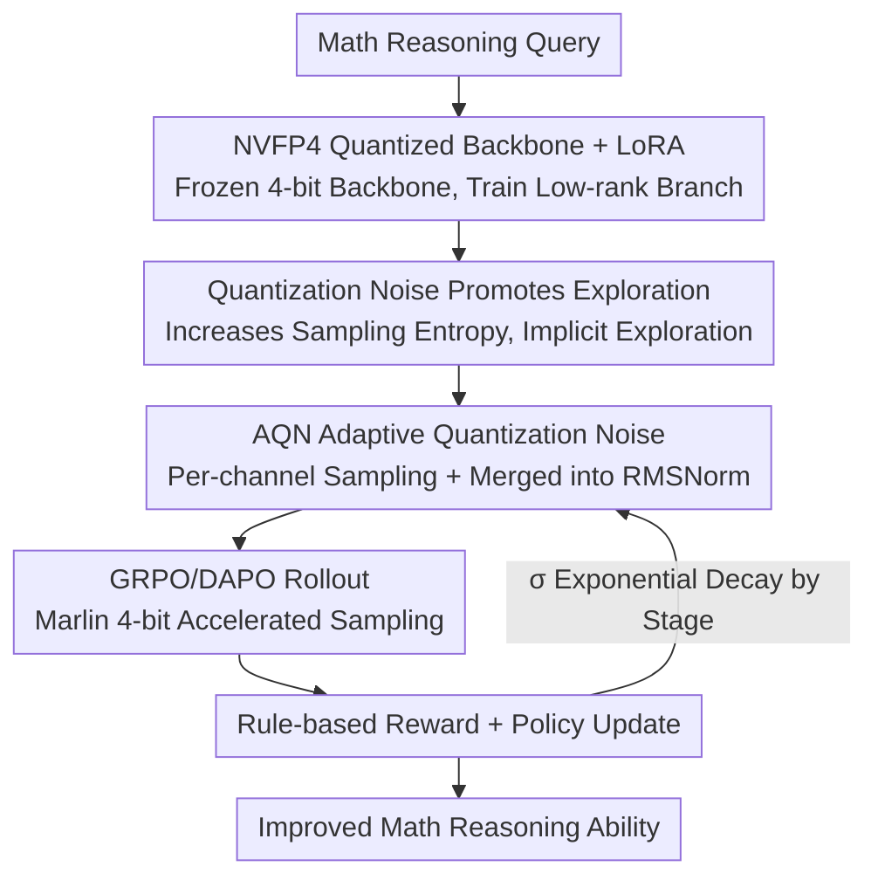

# QeRL: Quantization-enhanced Low-rank Reinforcement Learning for LLMs

**Conference**: ICLR 2026  
**OpenReview**: [https://openreview.net/forum?id=zw8zxMJJlm](https://openreview.net/forum?id=zw8zxMJJlm)  
**Code**: https://github.com/NVlabs/QeRL  
**Area**: Reinforcement Learning / LLM Inference / Model Compression  
**Keywords**: Quantization, RL, LoRA, NVFP4, Exploration

## TL;DR
QeRL combines NVFP4 quantization with LoRA to train the reasoning capabilities of LLMs. It unexpectedly discovers that quantization noise can increase policy entropy and enhance RL exploration. By incorporating a schedulable Adaptive Quantization Noise (AQN) mechanism, 4-bit models achieve higher accuracy in mathematical reasoning than 16-bit LoRA while being significantly faster (1.5× rollout speedup, 1.8× end-to-end). This work also marks the first time RL for a 32B model has been successfully executed on a single H100 80GB GPU.

## Background & Motivation
**Background**: RL (policy optimization based on verifiable rewards such as GRPO/DAPO) has become a key method for enhancing the multi-step reasoning capabilities of LLMs. However, it is extremely resource-intensive—the policy and reference models must reside in VRAM simultaneously, and the repeated sampling (rollout) of long sequences is particularly slow. To reduce costs, one approach is to use parameter-efficient fine-tuning like LoRA (e.g., Tina), and another is to use quantized models for rollout (e.g., FlashRL, QuaRL).

**Limitations of Prior Work**: LoRA only reduces trainable parameters and does not address the rollout speed bottleneck. Conversely, "quantized rollout + full-precision policy" methods require maintaining both low-precision and high-precision versions of the model, which fails to significantly reduce VRAM and introduces train–inference precision inconsistency, necessitating importance sampling for correction. Furthermore, directly applying QLoRA to RL slows down rollout by 1.5–2× because the NF4 format requires unpacking and table lookups to map back to floating point before matrix multiplication.

**Key Challenge**: The desire for "lower VRAM + faster rollout" naturally suggests aggressive low-bit quantization. However, the consensus from the SFT era is that quantization noise harms training, leading to the assumption that quantization is a compromise where efficiency is traded for performance.

**Goal**: To find a quantization scheme that achieves no model duplication, low VRAM usage, and fast rollout, while ensuring training performance does not degrade or even improves.

**Key Insight**: The authors analyze the impact of quantization noise on sampling behavior and find that it is not harmful as in SFT. Quantization errors "flatten" the output probability distribution and increase sampling entropy, which serves as an implicit exploration incentive in RL, similar to classic RL works that inject noise into the parameter space to encourage exploration.

**Core Idea**: Replace NF4 with high-performance NVFP4 quantization to accelerate rollout and transform quantization noise from a "static byproduct" into a "dynamically schedulable exploration mechanism" (AQN). This allows 4-bit RL to surpass 16-bit LoRA in both efficiency and performance.

## Method

### Overall Architecture
The goal of QeRL is to perform RL training (using GRPO / DAPO) faster and more effectively through quantization. The overall process involves: quantizing the backbone LLM weights to NVFP4 and freezing them, while only the LoRA low-rank branches remain trainable. During the rollout and prefill stages, Marlin kernels are used for 4-bit execution to achieve acceleration, while gradients are propagated through the LoRA layers. In training, AQN injects per-channel sampled, exponentially decaying Gaussian noise into the weights, upgrading quantization noise into a dynamic exploration signal. This noise is integrated into the RMSNorm of each block with zero additional parameters. Finally, rule-based rewards are used to calculate advantages and update the policy, with $\sigma$ decreasing over training stages to transition from exploration to exploitation.

### Key Designs

**1. NVFP4 Quantization + LoRA: Reducing Rollout Bottlenecks and VRAM Together**

Addressing the pain points where LoRA fails to help rollout and QLoRA is slowed by NF4 lookups, QeRL adopts the NVFP4 format natively supported by the Blackwell architecture. NVFP4 uses dual-layer scaling: a global FP32 coarse-grained scaling factor $S_{FP32}$ and a set of FP8 (E4M3) fine-grained scaling factors $S_{E4M3}$ for 16-element blocks. Dequantization is defined as $\hat{W} = S_{FP32}\cdot(S_{E4M3}\odot\tilde{W})$, which is finer than the 32-element blocks of MXFP4. Backbone weights are frozen after quantization, and only the LoRA low-rank matrices $W+\Delta W = W + BA$ (where $r\ll\min(d,k)$) are optimized. Crucially, NVFP4 can directly use Marlin kernels for NVFP4×BF16 matrix multiplication, accelerating both rollout and prefill without unpacking lookups or maintaining dual models. Consequently, a 7B model trains only ~1% of parameters, uses 40%–50% of the VRAM of vanilla LoRA, and achieves 1.5× faster rollout than QLoRA and 1.3× faster than BF16 LoRA.

**2. Quantization Noise Promotes Exploration: Reinterpreting "Harmful Noise" as Implicit Exploration**

This is the most counter-intuitive finding of the paper. Quantization introduces small, systematic errors in the forward pass, which can be modeled as static network noise. This noise propagates through layers and perturbs the logits before the softmax, causing the output distribution over the vocabulary $\pi_\theta(\cdot|q)$ to become "flatter" and less peaked, thereby increasing the sampling entropy $H(\pi(\cdot|q))=-\sum_{o_t\in V}\pi(o_t|q)\log\pi(o_t|q)$. In RL, this is beneficial: it mitigates overconfidence in a single "optimal" token and redistributes probability more reasonably among candidate actions. This is equivalent to noise injection into the parameter space for exploration, expressed as $Q(\theta)-\theta=\Delta\epsilon$ (where $\Delta\epsilon$ is quantization noise). This contradicts SFT, where noise is harmful as the goal is to faithfully mimic a target distribution. In RL, noise helps discover new high-reward outputs. Experiments confirm that the initial entropy and reward growth of NVFP4/MXFP4-LoRA are significantly higher than that of 16-bit LoRA.

**3. AQN Adaptive Quantization Noise: Transforming Static Noise into Schedulable Exploration Signals**

While quantization noise is beneficial, it is deterministic and static, failing to match the dynamic "exploration-exploitation" trade-off required in RL. AQN samples a noise vector $Z_{noisy}\in\mathbb{R}^{1\times d}$ for each quantized linear layer, re-sampling during each forward pass: $Z_{noisy}=\epsilon$, where $\epsilon\sim\mathcal{N}(0,\sigma^2 I)$. This is superimposed on the quantization noise to obtain dynamic noise $\Delta\epsilon' = Z_{noisy}+(\hat W - W)$. The noise scale $\sigma$ decays exponentially: $\sigma(k)=\sigma_{start}\cdot(\sigma_{end}/\sigma_{start})^{(k-1)/(K-1)}$ (where $k$ is the current stage and $K$ is the total number of stages), enabling more exploration in early stages and more exploitation later.

The challenge lies in the fact that adding high-precision noise vectors per layer is parameter-expensive and breaks compatibility with NVFP4×BF16 inference kernels. The authors use a clever identity: $X(Z_{noisy}+\hat W)=X\cdot Z_{noisy}+X\cdot\hat W$. Thus, the noise is merged into the subsequent RMSNorm scaling parameter: $\text{RMSNorm}_{noise}(x)=w_{noise}\odot x/\sqrt{\frac1N\sum x_i^2+\delta}$, where $w_{noise}=Z_{noise}+w$. Consequently, additive channel-wise noise is converted into multiplicative row-wise noise on the weights $Z_{noise}/w + I$, achieving zero parameter overhead. As RL is more sensitive to multiplicative noise, $\sigma_{start}=10^{-2}$ is used for stability. This mechanism is applied to $W_q,W_k,W_v,W_{gate},W_{up}$, which interact directly with normalized activations.

### Loss & Training
QeRL does not change the RL objective itself, directly utilizing GRPO / DAPO. GRPO samples a group of outputs $\{o_1,...,o_G\}$ for each query and calculates normalized advantages $A_i$ within the group using rule-based rewards. The objective includes a clipping term $(1-\alpha, 1+\alpha)$ and a KL penalty $\beta D_{KL}(\pi_\theta\|\pi_{ref})$. DAPO removes the KL penalty, raises the clipping upper bound, and uses token-level policy gradients to further encourage exploration. The AQN noise scheduling is applied on top: for GSM8K, about 600 steps are divided into 10 segments, starting from quantization noise and decaying $\sigma$ from $\sigma_{start}$ to $\sigma_{end}$ (with a range of 5e-2 to 5e-4).

## Key Experimental Results

### Main Results
GRPO training Qwen2.5 on GSM8K (3B/7B), data from Table 1:

| Model | Config | GSM8K | Gain vs BF16 |
|------|------|-------|-----------|
| Qwen2.5-3B | BF16 Full | 84.4 | +23.2 |
| Qwen2.5-3B | BF16 LoRA | 76.1 | +14.9 |
| Qwen2.5-3B | NF4 LoRA (QLoRA) | 76.1 | +14.9 |
| Qwen2.5-3B | **Ours** (NVFP4 + AQN) | **83.7** | +22.6 |
| Qwen2.5-7B | BF16 Full | 91.2 | +14.9 |
| Qwen2.5-7B | BF16 LoRA | 88.1 | +11.8 |
| Qwen2.5-7B | NF4 LoRA (QLoRA) | 85.0 | +8.7 |
| Qwen2.5-7B | **Ours** (NVFP4 + AQN) | **90.8** | +13.5 |

DAPO training BigMath (7/14/32B) across four math benchmarks (Table 2): 7B improved from a quantization baseline of 25.7 to 36.4 (vanilla LoRA 35.7); for 14B on AMC 23, **Ours** achieved 57.5, surpassing the full-parameter result of 55.0; the 32B model averaged 45.6, close to the full-parameter 46.2 and far exceeding NVFP4 LoRA's 41.4.

### Ablation Study

| Model | Method | W# | VRAM | E2E Speedup (bs=8) |
|------|------|-----|------|------------------|
| 7B | BF16 LoRA | BF16 | 15.2 GB | — |
| 7B | QLoRA | NF4 | 5.7 GB | ×0.7 ↓ |
| 7B | **Ours** | NVFP4 | 5.9 GB | ×1.2 ↑ |
| 14B | QLoRA | NF4 | 10.2 GB | ×0.7 ↓ |
| 14B | **Ours** | NVFP4 | 10.6 GB | ×1.2 ↑ |

Per-stage timing (Table 4, 7B, seconds per step): **Ours** rollout took only 4.00s, compared to 9.48s for QLoRA and 6.28s for BF16 LoRA; total time was 4.75s vs 10.43s for QLoRA, approximately a 1.8× end-to-end speedup.

| Config | Key Finding |
|------|---------|
| w/o AQN | Slower reward growth; relies only on static quantization noise. |
| w AQN | Faster and higher rewards; dynamic scheduling of exploration. |
| Noise Scheduler | Exponential decay is optimal; outperformed linear/cosine/logarithmic. |
| LoRA rank | rank=32 is sufficient; limited gains for 64 or 128. |

### Key Findings
- In terms of quantization formats, the reward growth for NVFP4 and MXFP4 is superior to NF4. Mentally, MXFP4 starts strong, but NVFP4 converges better, making it the overall best format.
- AQN is the critical module for performance: removing it significantly slows down and lowers the reward curve, showing that dynamic noise scheduling is more effective than static quantization noise.
- The reward curve of **Ours** rises rapidly within 200 steps, whereas vanilla LoRA takes over 500 steps to catch up, validating that "quantization-enhanced exploration" accelerates convergence.
- Exponential decay in the noise scheduler outperforms linear, cosine, or logarithmic decay, aligning with the intuition of "heavy exploration early, heavy exploitation later."

## Highlights & Insights
- The most significant "aha" moment is the reinterpretation of quantization noise—traditionally seen as harmful in SFT—as a free exploration incentive in RL. Changing the task objective results in a complete reversal of the conclusion, which is a highly inspired reframing.
- Noise Merging uses a simple identity to convert additive channel noise into multiplicative noise on RMSNorm, achieving zero parameter overhead without breaking 4-bit inference kernels. This is a very clean engineering trick.
- The tradeoff between "efficiency and performance" is empirically challenged: low-bit quantization is no longer just a cost-saving compromise but can actually improve results through noise, a concept transferable to other RL fine-tuning scenarios requiring exploration.

## Limitations & Future Work
- Experiments were concentrated on the Qwen2.5 series and mathematical reasoning; it remains to be fully verified whether these findings hold for code, general reasoning, or other backbones.
- The explanation of quantization noise promoting exploration is largely empirical/intuitive (entropy increase → exploration) and lacks rigorous theoretical characterization. Hyperparameters such as noise scale $\sigma$ and stage count $K$ are sensitive and require tuning based on data scale.
- AQN relies on hardware/kernel support for NVFP4 (Hopper/Blackwell + Marlin); benefits would be significantly diminished on hardware without FP4 support.
- Cross-scale and cross-task comparisons require caution: the magnitude of improvement varies across different models and data difficulties, and benchmarks with small sample sizes like AIME 25 exhibit high variance.

## Related Work & Insights
- **vs QLoRA / NF4**: Both use 4-bit + LoRA, but NF4 requires unpacking/lookups resulting in slower rollouts, and its noise is seen as harmful; QeRL uses NVFP4 + Marlin for acceleration and actively utilizes noise for exploration, achieving a win-win in efficiency and performance.
- **vs FlashRL / QuaRL**: These use quantized models for rollout but still require full-precision weights for policy optimization, leading to train–inference inconsistency and higher VRAM usage. QeRL does not duplicate the model; the backbone is always the same quantized weights.
- **vs Tina (LoRA RL)**: Both use PEFT to save trainable parameters, but LoRA cannot solve the rollout bottleneck; QeRL accelerates at the rollout/prefill level.
- **vs Parameter Space Noise Exploration (Plappert et al.)**: The philosophy is similar, but QeRL's exploration noise comes as a "free byproduct" of quantization, transformed into a schedulable version via AQN, rather than being explicitly injected.

## Rating
- **Novelty**: ⭐⭐⭐⭐⭐ (Reframing quantization noise as RL exploration incentive)
- **Experimental Thoroughness**: ⭐⭐⭐⭐ (Covers 3B–32B, GRPO/DAPO, multiple benchmarks, but limited to Qwen + Math)
- **Writing Quality**: ⭐⭐⭐⭐⭐ (Clear motivation derivation, natural flow between methods and findings)
- **Value**: ⭐⭐⭐⭐⭐ (First to run 32B RL on a single H100 card, practical high efficiency and performance)

<!-- RELATED:START -->

## Related Papers

- [\[ICLR 2026\] Online Minimization of Polarization and Disagreement via Low-Rank Matrix Bandits](online_minimization_of_polarization_and_disagreement_via_low-rank_matrix_bandits.md)
- [\[ICLR 2026\] Do Not Let Low-Probability Tokens Over-Dominate in RL for LLMs](do_not_let_low-probability_tokens_over-dominate_in_rl_for_llms.md)
- [\[ACL 2026\] GeoRA: Geometry-Aware Low-Rank Adaptation for RLVR](../../ACL2026/reinforcement_learning/geora_geometry-aware_low-rank_adaptation_for_rlvr.md)
- [\[ICLR 2026\] QuRL: Low-Precision Reinforcement Learning for Efficient Reasoning](qurl_low-precision_reinforcement_learning_for_efficient_reasoning.md)
- [\[NeurIPS 2025\] Shift Before You Learn: Enabling Low-Rank Representations in Reinforcement Learning](../../NeurIPS2025/reinforcement_learning/shift_before_you_learn_enabling_low-rank_representations_in_reinforcement_learni.md)

<!-- RELATED:END -->
