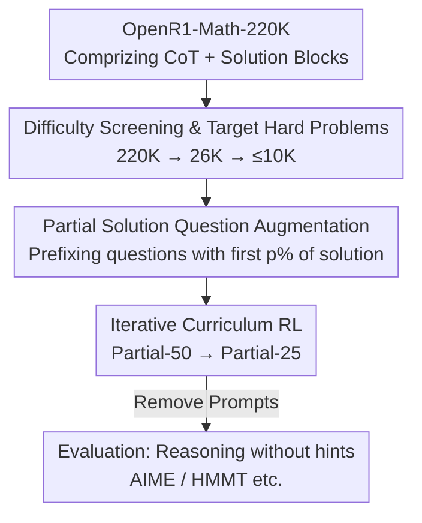

# QuestA: Expanding Reasoning Capacity in LLMs via Question Augmentation

**Conference**: ICLR 2026  
**OpenReview**: [https://openreview.net/forum?id=3MifB0f7qR](https://openreview.net/forum?id=3MifB0f7qR)  
**Code**: https://github.com/foreverlasting1202/QuestA  
**Area**: LLM Reasoning / Reinforcement Learning  
**Keywords**: RLVR, Question Augmentation, Partial Solution Prompting, Curriculum Learning, Mathematical Reasoning

## TL;DR
To address the issue of sparse rewards and learning difficulties in RLVR on hard problems, QuestA prepends "partial solutions" to difficult questions during training as hints to reduce difficulty and densify reward signals. Combined with a curriculum that reduces the hint proportion from 50% to 25%, a 1.5B small model achieves new SOTA results on mathematical competition benchmarks such as AIME24/25 and HMMT25 (AIME24 72.5%, AIME25 62.3%).

## Background & Motivation

**Background**: RLVR (Reinforcement Learning with Verifiable Rewards, such as GRPO and DAPO) has become the mainstream paradigm for training LLM reasoning capabilities—using automatically verifiable binary signals like "is the answer correct" to reinforce high-reward trajectories. This avoids the difficulty of reward modeling in traditional RL and shows significant effects in tasks such as mathematics, code, and logic.

**Limitations of Prior Work**: The community debates whether RLVR "expands" the reasoning capacity of the model or merely "squeezes" existing knowledge from the base model. Several recent works (Yue et al. 2025; Liu et al. 2025) found that while RLVR improves pass@1, it is almost powerless on high-difficulty problems that the base model could hardly solve, and pass@k may even decrease at large $k$—meaning output diversity is sacrificed.

**Key Challenge**: The authors conducted controlled experiments by splitting OpenR1 problems into "easy" and "hard" groups based on base model success rates for RL training, resulting in a contradictory phenomenon: training on **easy problems** causes the model to overfit to familiar solution patterns, leading to entropy collapse and a decrease in pass@k as $k$ increases, which harms reasoning ability. Training on **hard problems** indeed expands capacity, but the rewards are extremely sparse, sample efficiency is low, and training is incredibly slow (the hard-only curve in Figure 3 remains stagnant for a long time). Easy problems dilute capacity while hard problems stall training; this is the core tension.

**Goal**: To maintain the capacity expansion gains brought by "training on hard problems" while eliminating the inefficiency caused by sparse rewards—specifically, how to make hard problems "learnable" without changing the reward function or the optimization algorithm.

**Key Insight**: The authors start from the observation that the real bottleneck in RL progress is the difficulty of sampling a successful trajectory within a limited sampling budget. If the probability of sampling a correct trajectory can be artificially increased, hard problems become discoverable.

**Core Idea**: Manipulate the input layer—take the first p% of the original solution as a "partial solution prompt" and prepend it to the question. This decomposes a large problem into "given part + part to be completed," densifying the reward signal. The hint proportion is gradually reduced during training, and ultimately, no hints are provided during evaluation.

## Method

### Overall Architecture
QuestA is an **input-layer** data augmentation framework: it does not modify the reward function or the update rules of GRPO/DAPO. It only replaces the original rollout dataset with an "augmented dataset," allowing it to be integrated into any RLVR pipeline as a plug-and-play component. The pipeline starts from the OpenR1-Math-220K SFT corpus containing complete reasoning trajectories. It filters the most difficult problems, prefixes each hard problem with a partial solution, performs a second difficulty screening, runs RL with a two-stage curriculum of decreasing hint proportions, and finally evaluates under **no-hint** conditions to verify if the model has truly learned the hard problems.

### Key Designs

**1. Partial Solution Question Augmentation: Rewriting Hard Problems into Variations with Denser Rewards**

This is the core of the method. For a question $x$ with an $n$-step solution trajectory $y=(y_1,\dots,y_n)$, QuestA constructs an augmented prompt $\tilde{x}^{(p)}$: the first $p$ steps of the original solution (calculated by token percentage, e.g., $p=50\%$ or $25\%$) are taken as a prefix and prepended to the original question, letting the model continue reasoning from there. A key detail is that the first p% of the **final solution block** generated by DeepSeek-R1 in OpenR1 is prepended, rather than the lengthy Chain-of-Thought (CoT). CoT contains many errors and speculations, which are too noisy as prompts; the solution block is a clean derivation skeleton. For example, in a functional equation problem, the prompt might directly state "$f$ must be an involution, fixing all odd numbers, and even numbers are either fixed or swapped in pairs," and the model only needs to complete the remaining case analysis.

The theoretical reason for effectiveness: The bottleneck of RL is the inability to sample a correct trajectory within a budget. The authors formalize the "model capacity set" $C(q,\delta_p)$ (the set of most likely trajectories with probability mass $1-\delta_p$) and the "solution set" $S(q)$, pointing out that if $C(q,\delta_p)\cap S(q)=\varnothing$ for all problems, RL has a constant probability of not updating at all under a budget of $TB=\Theta(1/\delta_p)$ (Theorem 4.4, since Assumption 4.3: gradients are zero at all-zero rewards). Given a hint $h_q$, if a solution can be split into two steps, each generated with probability $\delta_p' = \delta_p^{1/2-\epsilon}$, the budget to sample a complete correct solution drops from $\Theta(1/\delta_p)$ to approximately $O(1/\delta_p')\approx O(1/\sqrt{\delta_p})$ (Theorem 4.6)—the hint breaks a joint low-probability event of "getting two steps right simultaneously" into two independently reachable sub-events, which is a square-root level efficiency gain.

**2. Hard Problem Targeting and Two-Stage Difficulty Screening: Concentrating Augmentation Resources on the Most Necessary Problems**

QuestA only performs augmentation on problems where the "base model success rate is nearly zero"—adding hints to problems already solved is wasteful. Screening occurs in two stages: first, a lightweight heuristic filter narrows 220K problems down to 26K hardest candidates (using DeepSeek-R1-Distill-1.5B as a weak selection model in practice); second, a second round of difficulty identification is performed on the augmented prompts—the initial model about to participate in RL (Nemotron-1.5B or DeepScaleR-1.5B) samples each augmented prompt 8 times, and only samples with a pass count between 0–4 (high variance, strong signal) are retained, resulting in a final pool of no more than 10K. This design of "coarse screening hard problems, then fine screening based on augmented difficulty" ensures that what is augmented is exactly where the base model needs scaffolding most and remains challenging even with hints, avoiding wasting compute on extremes that are too easy with hints or still impossible.

**3. Iterative Curriculum RL: Hint Proportion Decreasing from 50% to 25% to Align with Evaluation Distribution**

A single hint proportion is not optimal. Since the model is eventually evaluated on a **no-hint** distribution, the training should gradually reduce dependence on hints, smoothly transitioning the policy from "scaffolded reasoning" to "autonomous reasoning." QuestA designs a two-stage curriculum: first, use Partial-50 (given 50% of the solution) for RL until performance saturates, then drop to Partial-25 (given only 25%) to continue training until convergence, with difficulty screening re-performed at each stage. In practice, the first stage switches after only 100 steps—because entropy begins to drop after training Partial-50 for more than 100 steps (Figure 11), timely switching to Partial-25 prevents overconfidence and maintains training stability. Extending to Partial-0 yielded no additional benefit and response length stopped growing, so the process ends at Partial-25. The entire RL uses the AReaL framework to run GRPO (without KL loss), following DAPO to dynamically filter out prompts with all-correct or all-incorrect rollouts.

### Loss & Training
RL uses GRPO (no KL loss), sampling $n=16$ responses per prompt. Maximum prompt length is 8192, maximum generation length is 24000, sampling temperature is 1.0, and clipping is $\varepsilon_{low}=\varepsilon_{high}=0.2$. Batch size is 128 with a mini-batch of 1 (meaning each rollout step corresponds to 128 gradient updates). AdamW optimizer with a constant learning rate of $2\times10^{-5}$ is used on 8 H800 (80GB) nodes. Pass@1 (Avg@32) is reported for evaluation with temperature 0.7 and top-p 0.95, and **no partial solutions** are provided during evaluation.

## Key Experimental Results

### Main Results
Pass@1 (Avg@32) of 1.5B models on mathematical competition benchmarks:

| Model | AIME24 | AIME25 | HMMT FEB25 | Olympiad | BRUMO25 | Avg |
|------|--------|--------|------------|----------|---------|-----|
| Nemotron-1.5B (baseline) | 61.77 | 49.50 | 31.56 | 64.62 | 58.23 | 53.14 |
| DeepSeek-R1-Distill-1.5B | 28.7 | 22.3 | 12.0 | 52.4 | 31.8 | 29.44 |
| Qwen3-1.7B | 48.3 | 36.8 | 22.19 | 56.13 | 44.06 | 41.50 |
| **QuestA-Nemotron-1.5B** | **72.50** | **62.29** | **41.67** | **70.36** | **69.48** | **63.26** |
| DeepSeek-R1-Distill-32B (Ref) | 72.6 | 51.8 | 33 | 65.0 | 68 | 58.08 |

QuestA improves Nemotron-1.5B by approximately 10 points on average (+12.8 on AIME25) and **matches or exceeds the 20x larger DeepSeek-R1-Distill-32B** on multiple benchmarks (exceeding it by ~11 points on AIME25).

### Ablation Study
Ablation of curriculum design (under the same 2000-step budget):

| Configuration | AIME24 | AIME25 | HMMT25 | Olympiad | BRUMO25 | Avg |
|------|--------|--------|--------|----------|---------|-----|
| Nemotron-1.5B (baseline) | 61.77 | 49.50 | 31.56 | 64.62 | 58.23 | 53.14 |
| QuestA-50 (Partial-50 only) | 67.18 | 59.38 | 39.17 | 69.41 | 66.15 | 60.26 |
| QuestA (Partial-50→25 curriculum) | 72.50 | 62.29 | 41.67 | 70.36 | 69.48 | 63.26 |

| Data Source Comparison | AIME24 | AIME25 | Avg |
|------------|--------|--------|-----|
| QuestA-50 (OpenMathReasoning) | 66.46 | 58.54 | 58.11 |
| QuestA-50 (OpenR1) | 67.18 | 59.38 | 60.26 |

### Key Findings
- **Curriculum is stronger than a single ratio**: Within a 2000-step budget, the Partial-50→25 curriculum is about 3 points higher than pure Partial-50 on average; the entropy begins to collapse after 100 steps in the Partial-50 stage, making timely switching critical for training stability.
- **Learning without hints is possible**: The training set pass rate distribution shifts significantly from the 0/8–1/8 bins to the right (mean 0.572→0.757). Unsolved problems in AIME24 Pass@32 dropped from 5 to 2, and from 6 to 3 in AIME25—proving the improvement is not "peeking at hints during evaluation" but truly expanding independent reasoning ability.
- **Maintaining pass@k and diversity**: Contrary to recent findings that RL drops at large $k$, QuestA maintains or slightly increases pass@k at various $k$, and entropy rises rather than collapses during training, indicating it improves solution quality and diversity rather than overfitting a single optimal trajectory.
- **Simple problems are harmful, hard problems are inefficient**: Controlled experiments confirmed that RL on simple problems causes pass@k to decrease as $k$ increases, and pure hard-problem RL learns extremely slowly; both motivated the partial solution scaffolding.

## Highlights & Insights
- **Difficulty control at the input layer rather than reward/algorithm layer**: QuestA is orthogonal to the underlying RL algorithm. Integration requires only replacing the rollout dataset with the augmented version, leaving reward functions and update rules unchanged—this "plug-and-play" attribute allows it to be directly stacked onto any existing RLVR pipeline.
- **Square-root level sampling efficiency theory**: Decomposing the joint low probability of "sampling the entire hard solution correctly" into two reachable sub-events via hints reduces the budget from $\Theta(1/\delta_p)$ to approximately $O(1/\sqrt{\delta_p})$. This provides a clean theoretical explanation for why partial solutions accelerate learning, rather than purely empirical tuning.
- **Prepending solution blocks instead of CoT**: A subtle but critical engineering choice—using a clean solution skeleton rather than a trial-and-error-filled CoT avoids misleading noise. This is a transferable insight for other prompt-based training methods.
- **Curriculum aligning with evaluation distribution**: The decreasing hint proportion gradually moves the training distribution towards the no-hint evaluation distribution. This "fading scaffolding" idea is transferable to any scenario where assistance is available during training but not during inference.

## Limitations & Future Work
- **Dependency on high-quality solution corpora**: The method requires SFT data with complete reasoning trajectories like OpenR1 to cut out partial solutions, making it difficult to apply directly to tasks without ready-made solutions (e.g., open-ended reasoning, domains without standard solutions).
- **Concentrated on mathematical reasoning + small models**: The method has only been verified on 1.5B models and mathematical competition benchmarks. Whether it scales to larger models or transfers to other verifiable tasks like code, logic, or scientific reasoning has not been fully tested.
- **Empirical prompt proportions and switching points**: The choice of $p=50\%\to 25\%$ and the 100-step switching point depend on empirical observations of entropy curves (Appendix B.6). There is no automated mechanism for determining the optimal hint curriculum; the lack of extra gains from Partial-0 suggests the curriculum lower bound needs manual control.
- **Cost of second screening**: Sampling each augmented prompt 8 times for difficulty identification adds sampling overhead as the data scale increases.

## Related Work & Insights
- **vs Standard RLVR (GRPO/DAPO)**: These methods stall on hard problems due to sparse rewards and suffer from entropy collapse/pass@k damage on simple problems. QuestA does not change their rewards or updates but injects partial solution scaffolding at the input layer, maintaining capacity expansion while removing the inefficiency of sparse rewards.
- **vs Sample Diversity in SFT**: While mixing problems of different difficulties is beneficial in SFT, mixing simple problems in RLVR is harmful. QuestA "lowers difficulty in place" for hard problems using partial solutions rather than introducing simple problems, avoiding this contradiction.
- **vs Modification of Reward/Optimization for Hard Problems**: Most works that accelerate RL on hard problems change reward shaping or sampling strategies. QuestA chooses the simplest path—only changing the data—making it orthogonal to and non-invasive for any RL algorithm.

## Rating
- Novelty: ⭐⭐⭐⭐ "Input-layer partial solution injection + hint-decreasing curriculum" is simple yet targets the RLVR hard problem pain point, supported by square-root level theory.
- Experimental Thoroughness: ⭐⭐⭐⭐ Multiple benchmark SOTAs + curriculum/data source ablations + no-hint generalization and pass@k analysis are relatively complete, though limited to 1.5B and the mathematics domain.
- Writing Quality: ⭐⭐⭐⭐ Clear logic from motivation to theory, method, and experiments; controlled experiments provide a solid foundation.
- Value: ⭐⭐⭐⭐⭐ Plug-and-play, open-sourced process, allowing a 1.5B model to match 32B models; high practical value.

<!-- RELATED:START -->

## Related Papers

- [\[ICLR 2026\] QuRL: Rubrics As Judge For Open-Ended Question Answering](qurl_rubrics_as_judge_for_open-ended_question_answering.md)
- [\[ICLR 2026\] RL Squeezes, SFT Expands: A Comparative Study of Reasoning LLMs](rl_squeezes_sft_expands_a_comparative_study_of_reasoning_llms.md)
- [\[ICLR 2026\] Reasoning Boosts Opinion Alignment in LLMs](reasoning_boosts_opinion_alignment_in_llms.md)
- [\[ICLR 2026\] Reinforcement Learning with Verifiable Rewards Implicitly Incentivizes Correct Reasoning in Base LLMs](reinforcement_learning_with_verifiable_rewards_implicitly_incentivizes_correct_r.md)
- [\[ICLR 2026\] AbstRaL: Augmenting LLMs' Reasoning by Reinforcing Abstract Thinking](abstral_augmenting_llms_reasoning_by_reinforcing_abstract_thinking.md)

<!-- RELATED:END -->
