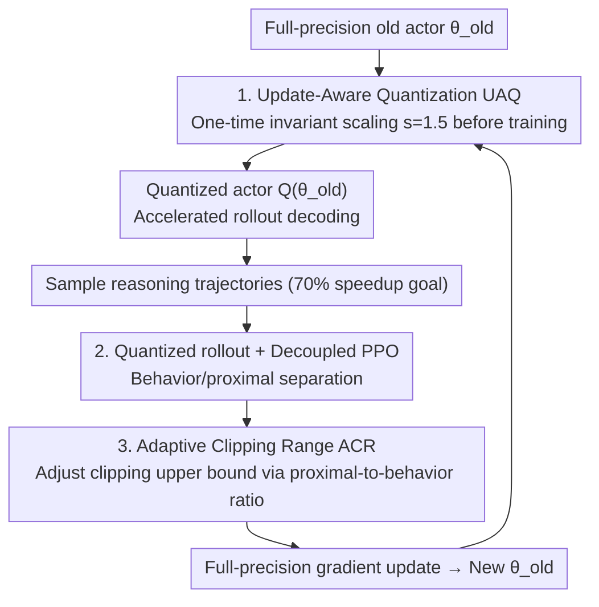

# QuRL: Low-Precision Reinforcement Learning for Efficient Reasoning

**Conference**: ICLR 2026  
**OpenReview**: [https://openreview.net/forum?id=eG0bpCwdKn](https://openreview.net/forum?id=eG0bpCwdKn)  
**Code**: To be confirmed  
**Area**: LLM Reasoning / Reinforcement Learning / Model Compression  
**Keywords**: RLVR, Quantized rollout, Decoupled PPO, Adaptive Clipping, Reasoning LLMs

## TL;DR
QuRL eliminates the 70% training time bottleneck in RLVR by using a **quantized actor for rollout decoding**. By introducing Adaptive Clipping Range (ACR) and Update-Aware Quantization (UAQ), it stabilizes the off-policy bias introduced by quantization, achieving 20%–80% speedup in INT8/FP8 rollout with almost no performance degradation.

## Background & Motivation

**Background**: Reinforcement Learning with Verifiable Rewards (RLVR) has become the dominant paradigm for training large reasoning models (such as OpenAI-o1 and DeepSeek-R1). A standard RL step consists of three phases: actor rollout for generating responses, a forward pass to calculate output probabilities, and a backward pass for policy gradient updates.

**Limitations of Prior Work**: Due to the nature of auto-regressive decoding in LLMs, each token in the rollout phase must be generated serially. This process is constrained by the memory bandwidth of weights and KV cache, making parallelism nearly impossible. Consequently, rollout consumes approximately **70% of the total training time**, a bottleneck further amplified by the long CoT trajectories required for reasoning tasks.

**Key Challenge**: The root cause of slow rollout is the "heavy memory access of full-precision auto-regressive decoding." An intuitive acceleration method is to quantize the actor (INT8/FP8) before rollout, as quantization directly speeds up matrix multiplication and memory access. However, this creates a scenario where sampling is performed by a quantized actor while gradient updates are applied to full-precision parameters, turning **on-policy into off-policy** learning. This requires correction via importance sampling and trust regions; yet, naively integrating quantization into PPO/GRPO typically results in training collapse.

**Goal**: To make the "quantized actor rollout + full-precision parameter update" configuration both fast and stable. This is decomposed into two sub-problems: (1) how to prevent clipping/importance sampling from collapsing over long training steps; and (2) how to ensure that infinitesimal RL weight updates are not "swallowed" by quantization errors.

**Key Insight**: The authors position QuRL between PTQ and QAT—the actor undergoes one-time quantization before rollout (like PTQ), but the parameters are implicitly influenced by gradients calculated from the quantized model's output (like QAT). This dual identity requires quantization to be simple enough to avoid complex calibration while remaining expressive enough to preserve learning dynamics.

**Core Idea**: Accelerate rollout using quantized actors, then suppress long-range divergence using decoupled PPO + Adaptive Clipping Range (ACR), and use Update-Aware Quantization (UAQ) to amplify weight updates beyond the quantization granularity, achieving "speedup without performance loss."

## Method

### Overall Architecture
The QuRL training loop is as follows: in each step, the full-precision old actor $\theta_{old}$ is first quantized into $\hat{\theta}_{old}=Q(\theta_{old},b)$ (using channel-wise scales for weights and token-wise scales for activations) to perform accelerated rollout sampling. Then, policy updates are performed using a **decoupled PPO** objective—separating the "behavior policy used for sampling" from the "proximal policy used for clipping." The behavior policy is set as the quantized old actor, and the proximal policy is set as the full-precision old actor. Updates continue in the full-precision parameter space to obtain a new $\theta$ for the next step. Two potential failure points in this setup are addressed by two designs: the continuous increase of KL between behavior and proximal policies during long-term training leads to biased gradient estimation, solved by **ACR**; and RL weight updates being significantly smaller than quantization errors, solved by **UAQ** (a one-time invariant scaling before training).

### Key Designs

**1. Quantized Rollout + Decoupled PPO: Recovering Stability from Off-policy Bias**

A naive approach would be to replace the importance sampling denominator in the GRPO objective with the quantized old actor: $\hat{R}_{i,t}=\frac{\pi_\theta(o_{i,t}|q_i)}{\pi_{\hat\theta_{old}}(o_{i,t}|q_i)}$ (Eq 3). Empirical results show this leads to reward collapse after a few RL steps: the token clipping ratio spikes to 1.5% and then drops to zero, indicating that $\hat{R}_{i,t}$ combined with clipping is highly unstable. While using the full-precision old actor in the denominator (Eq 1) is stable, it shows a significant gap compared to BF16 after 800 steps.

QuRL adopts **Decoupled PPO** (Eq 4): separating the behavior policy $\pi_{\theta_{behav}}$ (responsible for token sampling) and the proximal policy $\pi_{\theta_{prox}}$ (responsible for clipping), where the importance ratio is $R_{i,t}=\frac{\pi_\theta(o_{i,t})}{\pi_{\theta_{prox}}(o_{i,t})}$. In QuRL, $\pi_{\theta_{behav}}=\pi_{\hat\theta_{old}}$ (quantized old actor) and $\pi_{\theta_{prox}}=\pi_{\theta_{old}}$ (full-precision old actor). Compared to letting the quantized actor directly determine clipping via $\hat{R}_{i,t}$, this allows more tokens to be trained through correct importance sampling, significantly improving stability. Additionally, drawing from Truncated Importance Sampling (TIS, Eq 5) in FlashRL, an upper bound $C$ is used to limit the proximal-to-behavior ratio, mitigating implementation differences between training (HuggingFace/Megatron) and inference engines (vLLM/SGLang).

**2. Adaptive Clipping Range (ACR): Solving Gradient Bias from Truncated Behavior Policy**

Decoupled PPO + TIS performs well within 500 steps, but beyond 1000 steps, the KL divergence $D_{KL}(\pi_{\theta_{behav}}\|\pi_{\theta_{prox}})$ grows from 0.002 to 0.025 (a 12x increase). Simultaneously, the maximum proximal-to-behavior ratio can soar to $10^5$, leading to biased gradient estimation and eventual collapse. Rewriting TIS into the decoupled PPO form (Eq 7) reveals that its gradient is scaled by a factor $r_{i,t}=\pi_{\theta_{behav}}/\pi_{\theta_{behav}}^{trunc}$, which **implicitly contracts the clipping range**: $r_{i,t}\,\text{clip}(R_{i,t},1-\epsilon,1+\epsilon)=\text{clip}(r_{i,t}R_{i,t},r_{i,t}(1-\epsilon),r_{i,t}(1+\epsilon))$ (Eq 8). This compresses the upper bound for tokens with positive advantages, unintentionally clipping tokens that should have been updated.

ACR modifies the clipping upper bound to a **fixed $(1+\epsilon)/r_{i,t}$** (Eq 9): for tokens where $\frac{\pi_{\theta_{prox}}}{\pi_{\theta_{behav}}}>C$, $r_{i,t}<1$ **amplifies the upper bound**, allowing more positive-advantage tokens to be updated. In other cases, it reverts to standard TIS. This dynamically scales the clipping range to prevent collapse caused by over-clipping in long-term training.

**3. Update-Aware Quantization (UAQ): Preventing Weight Updates from being Swallowed**

Another risk in QuRL is the mismatch between the magnitude of weight updates and quantization errors. Quantization error is approximately $\frac{|\theta_{old}|}{2^b}$, while a single RL weight update is roughly $\alpha G$ (Eq 10). In a typical setting where $G\in[0.1,1.0]$ and $\alpha=10^{-6}$, the update magnitude is only $10^{-7}\sim10^{-6}$, which is far smaller than the quantization error. Consequently, quantization "freezes" the model by wiping out almost all weight updates, causing the quantized model to lose track of the training dynamics (Fig. 4 confirms that $\pi_{\hat\theta_{old}}$ and $\pi_{\theta_{old}}$ remain almost unchanged).

UAQ is a one-time weight adjustment performed before training begins, utilizing the **invariant scaling** of Transformer linear layers: for weight $W$ and input activation $X$, $WX=(W/s)\cdot(sX)$ (Eq 11). The activation scaling can be absorbed into the preceding layer (e.g., LayerNorm). Unlike standard PTQ which selects $s$ to minimize quantization error, UAQ intentionally chooses $s>1$. This results in a quantization error of $\frac{|\theta_{old}|}{s\cdot 2^b}$ and a weight update of $s\cdot\alpha G$ (Eq 12)—effectively reducing quantization error by $s$ times and amplifying the weight update by $s$ times (since the gradient $\nabla_W L=(\nabla_Y L)X^\top$ includes $X$ which was multiplied by $s$). The ratio between the two improves by a factor of $s^2$. The authors found $s=1.5$ to be the most stable for both INT8 and FP8; higher $s$ or simply increasing the learning rate leads to excessive clipping and RL instability.

### Loss & Training
The final objective follows Eq 9 for ACR Decoupled PPO. In the GRPO setting, KL regularization against a reference model is maintained (using the k3 estimator with a coefficient of $10^{-3}$). Quantization utilizes INT8/FP8 with channel-wise weight scaling and token-wise activation scaling, accelerated by vLLM's kernels. FP8 KV cache was not enabled due to implementation maturity. UAQ is performed once before training with $s=1.5$.

## Key Experimental Results

The framework is based on VeRL and validated across three RL configurations: PPO@GSM8K, DAPO@AIME 2024, and GRPO@DeepScaleR, using INT8 and FP8 quantization.

### Main Results

| Dataset | Config | Metric | RL(BF16) | FlashRL | QuRL |
|--------|------|------|----------|---------|------|
| GSM8K | INT8 | Accuracy | 55.35 | 51.40 | **53.55** |
| GSM8K | FP8 | Accuracy | 55.35 | 53.60 | **54.28** |
| AIME24 | INT8 | Avg@32 | 31.67 | 30.29 | **31.25** |
| AIME24 | FP8 | Avg@32 | 31.67 | 32.60 | **33.27** |
| DeepScaleR | INT8 | Avg (5 Tasks) | 56.40 | 53.80 | **55.48** |

Naive INT8/FP8 RL scores near 0 on AIME 2024 (collapse due to importance sampling bias); FP8 naive RL also scores zero on GSM8K. QuRL reduces the INT8 gap on GSM8K from 4% (FlashRL) to ~2% and the FP8 gap to ~1%. On DeepScaleR, INT8 RL lags 4.1% behind BF16, while QuRL w/ UAQ improves INT8 average accuracy by ~3% over vanilla INT8 RL, nearing BF16 levels.

### Ablation Study

| Config | Avg@32 | Note |
|------|--------|------|
| $s=1.5,\ \alpha=10^{-6}$ | **31.25** | Best UAQ setting |
| $s=1,\ \alpha=10^{-6}$ | 30.63 | No UAQ scaling |
| $s=2,\ \alpha=10^{-6}$ | 29.15 | Scaling too high, excessive clipping |
| $s=1,\ \alpha=1.5\times10^{-6}$ | 29.06 | Increasing lr is less effective |
| $s=1,\ \alpha=2\times10^{-6}$ | 26.66 | Further lr increase causes instability |

Throughput: INT8 provides 20%–30% speedup on 7B models, ~30%–56% on 14B, and up to +70% on A100 / +90% (~1.83×) on H100 for 32B models. Gains increase with model size as they become more compute-bound rather than I/O-bound.

### Key Findings
- **ACR is the anchor for long-term stability**: Whether ACR is used after 1000 steps determines if KL remains stable or spirals out of control (0.025). Fig. 3 confirms that removing ACR leads to training collapse.
- **UAQ is meaningful at low learning rates ($10^{-6}$)**: For GSM8K using a learning rate of $10^{-5}$, the updates were inherently large enough, and UAQ was disabled.
- **Increasing learning rate is not a substitute for UAQ**: Amplifying $s$ simultaneously reduces quantization noise. Increasing lr only amplifies the update without reducing noise, making $s=1.5$ superior to an equivalent lr hike.

## Highlights & Insights
- **Framework as an Off-policy RL problem**: Treating "quantized rollout" as an off-policy issue and using behavior/proximal separation in Decoupled PPO is a clever mapping that leverages mature trust region tools.
- **ACR Insight**: The derivation shows that truncating the behavior policy implicitly contracts the clipping range. Modifying the upper bound to $(1+\epsilon)/r_{i,t}$ cancels this contraction effect—a structural solution rather than an arbitrary hyperparameter.
- **UAQ $s^2$ Leverage**: A simple invariant scaling reduces quantization noise and amplifies updates simultaneously, yielding an $s^2$ net improvement. This cost-free trick (pre-training only) can be applied to any low-precision training where updates are "drowned out" by quantization noise.

## Limitations & Future Work
- Only validated down to 8-bit (INT8/FP8); stability of ACR/UAQ at 4-bit (NVFP4) remains unknown.
- FP8 KV cache was excluded due to vLLM maturity, leaving potential rollout speedups on the table.
- $s=1.5$ is an empirical value; the lack of a theoretical derivation for the optimal $s$ across different models/tasks remains a question.
- Future directions: Making UAQ scaling learnable or layer-wise adaptive, or combining it with other compression methods like weight pruning.

## Related Work & Insights
- **vs FlashRL (TIS)**: FlashRL uses TIS to mitigate training/inference engine differences but is only stable for ~500 steps. QuRL identifies that TIS collapses over long durations due to gradient bias from behavior truncation, fixes it with ACR, and adds UAQ to address the orthogonal issue of updates being swallowed by quantization.
- **vs PTQ/QAT**: Regular PTQ recalibration is too costly per step; QAT exacerbates engine differences and importance sampling bias. QuRL follows a middle path—one-time quantization with implicit gradient influence.
- **vs Naive "RL + Quantized Rollout"**: Direct application of GRPO fails (near 0 score on AIME). The QuRL triad (Decoupled Objective + ACR + UAQ) restores performance to near-BF16 levels.

## Rating
- **Novelty**: ⭐⭐⭐⭐ Systematizing quantized rollout as off-policy RL is insightful; ACR is derived structurally, and UAQ's $s^2$ leverage is clever.
- **Experimental Thoroughness**: ⭐⭐⭐⭐ Covers three RL algorithms across multiple GPU types and models;主 experiments, ablations, and throughput are comprehensive, though limited to 8-bit.
- **Writing Quality**: ⭐⭐⭐⭐ Clear chain of logic from problem to failure cases to solution; formulas and figures are well-coordinated.
- **Value**: ⭐⭐⭐⭐ Directly addresses the 70% rollout bottleneck in RLVR with 20%–80% speedup and minimal loss; high engineering value.

<!-- RELATED:START -->

## Related Papers

- [\[ICLR 2026\] QuRL: Rubrics As Judge For Open-Ended Question Answering](qurl_rubrics_as_judge_for_open-ended_question_answering.md)
- [\[ICLR 2026\] QeRL: Quantization-enhanced Low-rank Reinforcement Learning for LLMs](qerl_beyond_efficiency_-_quantization-enhanced_reinforcement_learning_for_llms.md)
- [\[ICLR 2026\] REA-RL: Reflection-Aware Online Reinforcement Learning for Efficient Reasoning](rea-rl_reflection-aware_online_reinforcement_learning_for_efficient_reasoning.md)
- [\[ICLR 2026\] Parameter-Efficient Reinforcement Learning using Prefix Optimization](parameter-efficient_reinforcement_learning_using_prefix_optimization.md)
- [\[ICLR 2026\] Stop Unnecessary Reflection: Training LRMs for Efficient Reasoning with Adaptive Reflection and Length Coordinated Penalty](stop_unnecessary_reflection_training_lrms_for_efficient_reasoning_with_adaptive_.md)

<!-- RELATED:END -->
