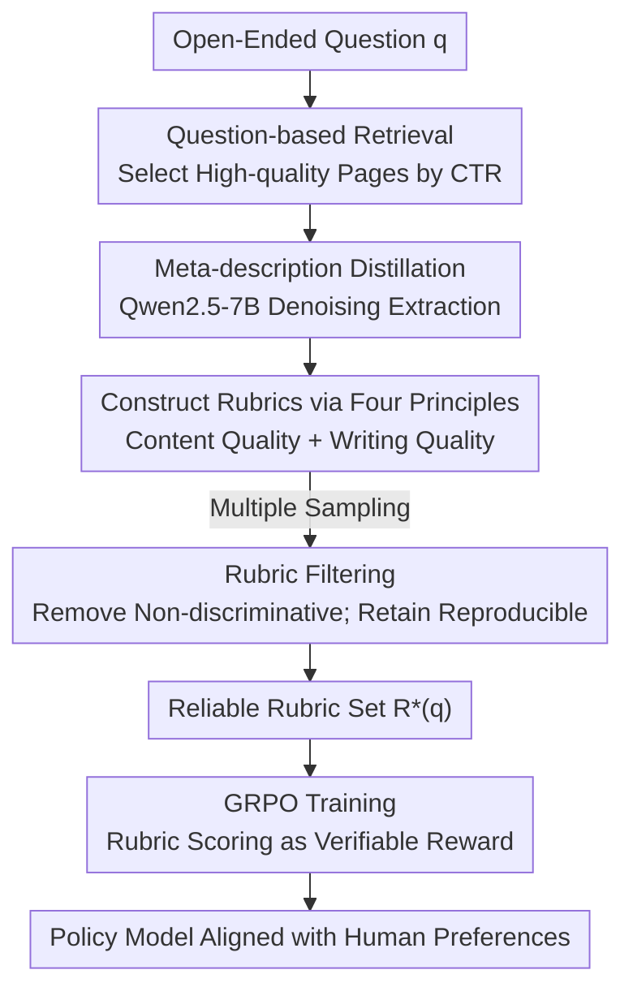

# QuRL: Rubrics As Judge For Open-Ended Question Answering

**Conference**: ICLR 2026  
**OpenReview**: [https://openreview.net/forum?id=DrhWTuhtYq](https://openreview.net/forum?id=DrhWTuhtYq)  
**Code**: TBD  
**Area**: Reinforcement Learning / LLM Alignment  
**Keywords**: RLVR, Open-Ended QA, Rubrics, GRPO, Reward Modeling

## TL;DR
QuRL transforms the challenge of "lacking gold standard answers" in open-ended QA into a task of automatically mining case-wise rubrics from web articles to serve as verifiable rewards. Using the GRPO training strategy, it improves Qwen2.5-7B by an average of +17.0 points compared to the SFT baseline.

## Background & Motivation
**Background**: Reinforcement Learning from Verifiable Rewards (RLVR), represented by DeepSeek-R1 and OpenAI o-series, has shown remarkable results in tasks with "gold standard answers" like code and math—because rewards come from deterministic, rule-verifiable signals. However, most real-world tasks lack a single correct answer. Open-Ended Question Answering (QA) is typical: answers must be factually correct, fluent, and engaging, where human preference is the factual gold standard.

**Limitations of Prior Work**: Current open-ended QA mainly relies on RLHF—where annotators provide pairwise or scalar preferences to distill a scalar reward model for supervising RL. This approach of "parameterizing scoring rules into a reward model" has two major drawbacks: poor cross-domain generalization and susceptibility to reward hacking, as actual scoring rules are implicitly entangled in model parameters, making them neither interpretable nor stable. Another path is using LLM-as-Judge with a fixed checklist (e.g., HelloBench), but experiments show fixed checklists lack discriminative power to distinguish answer quality.

**Key Challenge**: The authors' insight is that annotators evaluate answers using implicit mental rubrics, and RLHF reward models are merely statistical approximations of these rules. Why not make these implicit rules explicit? Designing specific, interpretable rubrics for each question as evaluation references would combine the benefits of aligning with human preferences from RLHF with the "verifiable reward" paradigm of RLVR.

**Key Insight**: Hand-writing rubrics is prohibitively expensive. However, the internet is filled with human-written articles and discussions related to open-ended questions, which naturally serve as "coarse-grained rubrics" or inspiration for rubric construction. A pilot study with 50 questions showed that providing relevant web articles to an LLM-as-Judge significantly increased correlation with human scoring (Spearman's $\rho$ rose from 0.139 to 0.209), surpassing the trained scalar reward model internlm2-7b-reward (0.210). However, directly inputting raw webpages is problematic: they often exceed 100k tokens, leading to explosive computational costs.

**Core Idea**: Distill noisy web articles into information-dense, case-wise rubrics that resemble scoring sheets, then use these rubrics as structured rewards for GRPO. Replacing scalar reward models with rubrics ensures interpretability and scalability, pushing RLVR into the open-ended domain.

## Method

### Overall Architecture
QuRL consists of two main components: **Offline Rubric Construction** (mining case-wise rubrics for each question from web data) and **Online RL Training** (running GRPO using these rubrics as rewards). Given an open-ended question, it undergoes four steps—retrieval, distillation, construction, and filtering—to generate a reliable rubric set $R^*(q)$. During training, the policy model samples multiple answers for the same question; a judge LLM scores these answers point-by-point based on the rubrics to obtain scalar rewards, which are then used in GRPO for group-relative advantage calculation and policy updates. The authors constructed two datasets: QuRL-Train (800 Question–Rubric pairs) and the human-verified QuRL-Test (400 pairs).

### Key Designs

**1. CTR-based Question Retrieval: Using "Widespread Recognition" as a Quality Prior**

Open-ended questions lack gold standard answers, but the web contains vast human-written materials. QuRL constructs search queries from question keywords to obtain a webpage set $W=\{w_i\}$, **ranking them by click-through rate (CTR)**. The key is the ranking criterion: high CTR often implies content is widely recognized and of higher quality. Using this as a cheap prior for "which materials are worth referencing" is more effective for obtaining high-quality evidence than random scraping or pure relevance ranking.

**2. Meta-description Distillation: Compressing 100k Noisy Tokens into Dense References**

Feeding raw webpages directly to the judge can exceed the context window (often >100k tokens). QuRL uses a lightweight model (Qwen2.5-7B) to generate a concise **meta-description** for each page, defined as a distillation function $f_D: W \to D$, retaining only content directly relevant to the question—core arguments, background paragraphs, transitional reasoning, and excellent examples—while discarding ads and irrelevant details. The resulting $d_i$ is a compressed, high-density representation that preserves semantic value while removing noise, making subsequent construction and scoring affordable.

**3. Dual-dimension Rubric Construction + Variance Filtering: Ensuring Accurate and Discriminative Rewards**

This is the core of QuRL. The authors observed that meta-descriptions guide evaluation from two complementary perspectives: first, as **argument references** identifying core stances to be emphasized (content quality); second, as **writing style** examples reflecting human fluency and coherence (writing quality)—addressing the common LLM issues of being "informative but shallow, lacking transitions, or dull." Four principles are extracted: content focus, writing quality, case-specificity, and meta-description citation, defining $f_R:(q,D)\to R$. Each rubric includes levels and examples (e.g., "Clarity and Logical Flow (2 pts)" with good/bad examples). To handle randomness, **rubric filtering** is applied: after sampling candidates $R^{(1)},\dots,R^{(K)}$, the mechanism (i) discards rubric sets that lack discrimination across different answers and (ii) merges stable, reproducible rubrics to form $R^*(q)$. Ablation shows removing filtering drops the average score from 59.3 to 52.2, proving its criticality for reward reliability.

**4. Rubric-based GRPO Training: Turning Rubric Scoring into Verifiable Rewards**

With $R^*(q)$, each training tuple $(q_i, R^*(q_i))$ and policy-sampled answer $o$ are processed by a judge model to generate point-by-point evaluation text $y=\text{LLM}_{reward}(q_i,o,R^*(q_i))$. A deterministic parser $f$ extracts numerical scores, sums them, and normalizes them to $[0,1]$ to produce the reward $R(o\mid q_i,R^*(q_i))=f(y)$. The GRPO algorithm samples $N$ answers per question, calculates relative advantage $A_j=\frac{R_j-\text{mean}\{R\}}{\text{std}\{R\}}$, and updates the policy via the GRPO objective with clipping and KL penalty. Unlike scalar reward models in RLHF, rewards here are driven by explicit, case-wise rubrics, making them interpretable and resistant to reward hacking—effectively porting RLVR's "verifiable rewards" to the open-ended domain.

### Loss & Training
The training objective is standard GRPO:

$$J_{GRPO}(\theta)=\mathbb{E}\Big[\frac{1}{N}\sum_{j=1}^{N}\min\big(\frac{\pi_\theta(o_j|q)}{\pi_{\theta_{old}}(o_j|q)}A_j,\ \text{clip}(\frac{\pi_\theta(o_j|q)}{\pi_{\theta_{old}}(o_j|q)},1-\varepsilon,1+\varepsilon)A_j\big)-\beta D_{KL}(\pi_\theta\Vert\pi_{ref})\Big]$$

The process starts with a cold-start SFT: 64 instruction-response pairs distilled from DeepSeek-R1 to teach the `<think></think>`/`<answer></answer>` format (lr=1e-6, batch=16, 2 epochs). Subsequently, GRPO is trained for 2 epochs, lr=1e-6, 8 samples per question, global batch=32, on 8 A100 GPUs. The best performance across the two epochs is reported.

## Key Experimental Results

### Main Results
Evaluated on HelloBench, LongBench-Write, and QuRL-Test, with scores normalized following HelloBench. Qwen2.5-7B-QuRL, trained on only 800 items, achieves an average of 59.3, comparable to the nearly 700B DeepSeek-V3 (59.1).

| Model | Average | HelloBench | QuRL-Test | LB-Write |
|------|------|-----------|-----------|----------|
| GPT-4o | 64.7 | 46.0 | 80.8 | 67.2 |
| Gemini-2.5-Pro | 70.4 | 69.2 | 65.9 | 76.1 |
| DeepSeek-R1 | 62.4 | 32.8 | 80.4 | 74.0 |
| DeepSeek-V3 | 59.1 | 28.1 | 70.8 | 78.4 |
| Qwen2.5-7B-Instruct | 28.3 | 20.8 | 26.2 | 37.8 |
| Qwen2.5-7B-SFT | 42.3 | 38.0 | 41.6 | 47.2 |
| **Qwen2.5-7B-QuRL** | **59.3** | **56.4** | **62.4** | **59.2** |

Ours (QuRL) gains +17.0 over the SFT baseline and +11.6 over the RLHF reward model variant. Output length (916 words) is moderate, indicating scores are not gained by simply gaming length metrics.

### Ablation Study
All ablations are single-item removals based on Qwen2.5-7B-QuRL (Avg 59.3).

| Configuration | Avg Score | Description |
|------|--------|------|
| Full (QuRL) | 59.3 | Full framework |
| w/ rlhf reward model | 47.7 | Replacing rubrics with internlm2-7b-reward scalar reward, drops 11.6 |
| w/o rubrics filter | 52.2 | Removing discriminative filtering, drops 7.1 |
| w/o web information | 48.9 | Generating rubrics from scratch without web materials, drops 10.4 |
| w/o rubrics | 44.0 | Reverting to five-dimension checklist scoring, drops 15.3 |

### Key Findings
- **Rubrics are the primary engine**: Removing rubrics (reverting to fixed checklists) caused the largest drop (59.3 → 44.0), confirming that fixed checklists lack discriminative power and case-wise rubrics are essential for differentiation.
- **Web materials and filtering are both crucial**: Removing web info dropped scores to 48.9 (rubrics lose human arguments and style), while removing filtering dropped them to 52.2 (noisy rubrics reduce reward reliability).
- **Human Alignment**: Using GPT-4o as a judge on 200 HelloBench responses, QuRL rubrics showed a Spearman's $\rho = 0.31$ ($p=8.29e-6$) with human scoring, significantly higher than HelloBench checklists (0.20), LongWriter (0.11), InternLM2 reward model (0.22), and vanilla LLM-as-Judge (0.08).

## Highlights & Insights
- **Reinterpreting "Evaluation" as RLVR Verifiable Signals**: The authors identify that RLHF reward models are just statistical approximations of implicit rubrics. By externalizing these rules into explicit rubrics, they bring the stability and interpretability of RLVR to open-ended domains—a compelling perspective shift.
- **Using CTR as a Quality Prior**: Instead of relying on expensive manual annotations or training reward models, the method leverages "widespread recognition" signals from the internet to filter materials. This is an ingenious way to turn weak supervision into strong signals.
- **Ensuring Reward Discrimination through Variance Filtering**: Since rubric generation is stochastic, sampling multiple times to prune "rubrics that give similar scores to all answers" directly addresses the core RL requirement that rewards must distinguish quality. This is transferable to any LLM-as-Judge reward design.

## Limitations & Future Work
- **Dependence on Retrieval Quality and Availability**: The success relies on retrieving relevant, high-quality human articles. For niche, highly recent, or data-scarce topics, rubric quality may degrade.
- **Judge Model remains an LLM**: Rewards are ultimately scored by a judge LLM following the rubrics. While rubrics make the criteria explicit, the parsing and scoring stages might still introduce the judge's own biases. Whether this is completely immune to reward hacking requires larger-scale verification.
- **Limited Scale and Benchmarks**: Primarily verified on Qwen2.5-7B with a training set of only 800 items. Generalization across larger models and more diverse task types remains to be tested.

## Related Work & Insights
- **vs RLHF (Scalar Reward Model)**: RLHF entangles scoring rules implicitly in parameters, resulting in poor cross-domain performance and vulnerability to hacking. QuRL makes rules explicit via case-wise rubrics. In the main experiment, rubrics outperformed RLHF reward models by 11.6 points under the same framework while providing interpretability.
- **vs HelloBench (Fixed Checklist)**: HelloBench uses a fixed five-dimension checklist for all questions, which lacks discriminative power. QuRL tailors case-wise rubrics for each question, which ablation shows is the largest contributor to score gains (+15.3).
- **vs Generative Reward Models (Huang et al., 2025)**: Both construct rubrics, but Huang uses complex, non-open-source LLM-agent pipelines without utilizing the internet. QuRL mines rubrics directly from the web, making it lightweight, reproducible, and aligned with human data.

## Rating
- Novelty: ⭐⭐⭐⭐⭐ First to extend RLVR to open-ended QA using web-distilled case-wise rubrics; both perspective and implementation are novel.
- Experimental Thoroughness: ⭐⭐⭐⭐ Three benchmarks + complete ablation + human correlation, though limited in model variety and scale.
- Writing Quality: ⭐⭐⭐⭐ Clear motivation derivation, leading smoothly from pilot experiments to the methodology.
- Value: ⭐⭐⭐⭐⭐ Provides a cheap, reproducible path for applying RLVR to tasks without gold standards.

<!-- RELATED:START -->

## Related Papers

- [\[ICLR 2026\] A$^2$Search: Ambiguity-Aware Question Answering with Reinforcement Learning](a2search_ambiguity-aware_question_answering_with_reinforcement_learning.md)
- [\[ICLR 2026\] From Verifiable Dot to Reward Chain: Harnessing Verifiable Reference-based Rewards for RL of Open-ended Generation](from_verifiable_dot_to_reward_chain_harnessing_verifiable_reference-based_reward.md)
- [\[ICLR 2026\] Helix: Evolutionary Reinforcement Learning for Open-Ended Scientific Problem Solving](helix_evolutionary_reinforcement_learning_for_open-ended_scientific_problem_solv.md)
- [\[ICLR 2026\] Rubrics as Rewards: Reinforcement Learning Beyond Verifiable Domains](rubrics_as_rewards_reinforcement_learning_beyond_verifiable_domains.md)
- [\[ICLR 2026\] J1: Incentivizing Thinking in LLM-as-a-Judge via Reinforcement Learning](j1_incentivizing_thinking_in_llm-as-a-judge_via_reinforcement_learning.md)

<!-- RELATED:END -->
