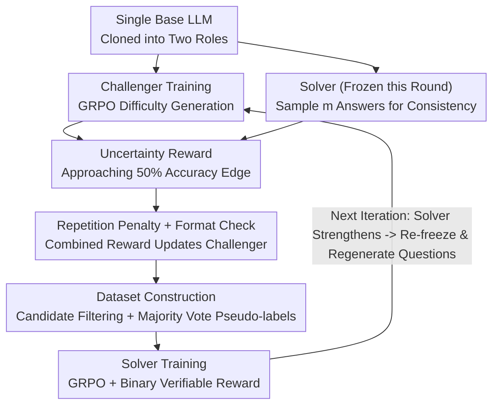

# R-Zero: Self-Evolving Reasoning LLM from Zero Data

**Conference**: ICLR 2026  
**OpenReview**: [https://openreview.net/forum?id=96apU6YzSO](https://openreview.net/forum?id=96apU6YzSO)  
**Code**: https://github.com/Chengsong-Huang/R-Zero  
**Area**: LLM Reasoning / Reinforcement Learning  
**Keywords**: Self-Evolution, Zero-Data, Challenger-Solver, Co-evolution, GRPO, Pseudo-labeling

## TL;DR
R-Zero initializes two roles, a "Challenger" and a "Solver," from a single base model. The Challenger is rewarded for generating difficult problems at the edge of the Solver's capability (accuracy $\approx 50\%$), while the Solver is rewarded for solving them. The two are trained alternately using GRPO in a co-evolutionary process. Without any human-authored questions or labels, this method improves the mathematical reasoning average of Qwen3-4B-Base by $+6.49$ and general reasoning by $+7.54$.

## Background & Motivation

**Background**: Enabling LLMs to "self-evolve"—generating their own experiences, distilling them, and learning from them—is considered a scalable path toward superintelligence. However, current mainstream approaches (SFT or RLVR with verifiable rewards) rely heavily on large amounts of carefully human-annotated tasks and answers as supervisory signals.

**Limitations of Prior Work**: Relying on humans to create questions and label answers is expensive and difficult to scale. More importantly, it imposes a **fundamental ceiling**: if the upper limit of AI capability is anchored to the level of human annotators, it can never surpass human intelligence. To escape this dependency, two existing paths exist but are incomplete: 1) **Label-free RL**, which extracts reward signals from the model's own output (e.g., sequence confidence, output entropy) but still requires a **pre-existing question bank**; 2) **Self-challenging**, where the model generates its own questions, yet many methods rely on external code executors to ensure feasibility and verifiability. In domains like open-ended reasoning where no **verification oracle** exists, the quality and correctness of self-generated data remain difficult to guarantee.

**Key Challenge**: True "zero-data self-evolution" requires neither a seed question bank nor external verifiers in domains like general mathematical reasoning—existing methods fail to satisfy both requirements simultaneously.

**Goal**: Construct a self-evolving reasoning training framework that starts from **zero external data**, requires no human questions/labels, and operates without code executors.

**Key Insight**: Drawing from self-play concepts, the authors decouple "question generation" and "problem solving" into two **independently optimized but coupled** roles. The key insight is that the most valuable training signals come from questions that the Solver **currently struggles with**—too easy provides no learning, while too difficult yields unreliable pseudo-labels. This "difficulty" can be measured without labels using the **self-consistency** of the Solver's multiple responses.

**Core Idea**: A Challenger trained via RL continuously generates questions at the edge of the Solver’s capability. The Solver is then trained using pseudo-labels generated via majority voting from its own outputs. The two roles are frozen alternately to co-evolve, forming an adaptive curriculum without human intervention.

## Method

### Overall Architecture

R-Zero takes a single base LLM as input and outputs a Solver with continuously enhanced reasoning capabilities. The framework is an **iterative loop**: In each round, the Solver is frozen while the Challenger is trained via GRPO to generate difficult questions. Then, the trained Challenger generates a batch of candidate questions, which are filtered and assigned pseudo-labels via majority voting. Finally, the Challenger is frozen while the Solver is trained on this dataset via GRPO. As the Solver strengthens, the Challenger seeks its new capability boundaries in the next round, creating a spiral of improvement. Both roles are initialized as clones of the **same base model**, remaining self-supervised with zero human intervention.

### Key Designs

**1. Challenger–Solver Co-evolution Loop: Turning Data Generation into a Game**

Instead of using a pre-existing question bank, R-Zero splits generation and solving into two **independently optimized but alternately frozen** policies: $Q_\theta$ (Challenger) and $S_\phi$ (Solver). They co-evolve via RL after initialization from the same base. Each round follows a rhythm: freeze $S_\phi \to$ train $Q_\theta$ using Solver feedback $\to$ freeze $Q_\theta \to$ train $S_\phi$ using generated questions. The fundamental benefit is transforming data generation from a "one-time human annotation" into an **adaptive, continuous curriculum generator** that chases the Solver's weaknesses. As the Solver improves, the Challenger is forced to explore new capability boundaries, ensuring the training signal remains in the most valuable difficulty zone.

**2. Uncertainty Reward: Quantifying "Question Quality" via Solver Self-Consistency**

This is the core mechanism enabling label-free operation. The Challenger aims for questions that are neither impossible (where pseudo-labels are noise) nor trivial (where nothing is learned), but rather questions the Solver **partially understands**. The authors formalize this as self-consistency: for a generated question $x$, $m$ answers are sampled from the frozen Solver. The most frequent answer is taken as the pseudo-label $\tilde{y}(x)$, and the empirical accuracy is calculated as $\hat{p}(x;S_\phi)=\frac{1}{m}\sum_{j=1}^{m}\mathbb{1}\{y_j=\tilde{y}(x)\}$. The uncertainty reward is defined as:

$$r_{\text{uncertainty}}(x;\phi)=1-2\left|\hat{p}(x;S_\phi)-\tfrac{1}{2}\right|$$

The reward is maximized when $\hat{p} \to 0.5$ and approaches zero when $\hat{p} \to 0$ or $1$. Thus, the Challenger is precisely driven toward questions that cause maximum uncertainty for the Solver. This metric is derived entirely from the Solver's samples without requiring external oracles, allowing it to be used for open-ended reasoning where verification environments are absent.

**3. Repetition Penalty + Format Check + Combined Reward: Ensuring Diverse and Structured Questions**

To prevent the Challenger from collapsing into repetitive questions, a **repetition penalty** is applied within each batch. Similarity is measured via BLEU: $d_{ij}=1-\text{BLEU}(x_i,x_j)$. Questions with $d_{ij}<\tau_{\text{BLEU}}$ are clustered into $C=\{C_1,\dots,C_K\}$. The penalty for each question $x_i$ in cluster $C_k$ is proportional to the cluster's relative size: $r_{\text{rep}}(x_i)=\lambda\frac{|C_k|}{B}$ (where $B$ is batch size, and experiments use $\lambda=1, \tau_{\text{BLEU}}=0.5$). Additionally, a **format check** ensures questions are correctly wrapped in `<question>...</question>` tags; non-compliant outputs receive a reward of 0. Finally, a combined reward is calculated for compliant questions: $r_i=\max\!\left(0,\ r_{\text{uncertainty}}(x_i;\phi)-r_{\text{rep}}(x_i)\right)$, which is used to compute advantages $\hat{A}_i$ for the GRPO update. Ablations show that removing the repetition penalty leads to a 3.3-point drop in math scores.

**4. Dataset Construction: Difficulty Filtering as Implicit Quality Control**

After the Challenger is trained, it acts as a curriculum generator to sample a large candidate pool ($N=8000$). For each question, the Solver samples $m=10$ answers to determine the pseudo-label $\tilde{y}_i$ and empirical accuracy $\hat{p}_i$. **Only questions falling within the most informative difficulty band** $|\hat{p}_i-\tfrac{1}{2}|\le\delta$ (where $\delta=0.25$, meaning 3–7 out of 10 answers match the majority) enter the training set $S$. While this appears to be filtering by difficulty, the authors emphasize it also provides **quality control**: extremely low empirical accuracy often implies the question is ambiguous or pathological. Filtering these low-consistency samples improves both data quality and difficulty calibration. Removing this filtering step leads to a drop of over 6 points in general reasoning performance.

### Loss & Training

Both stages utilize **GRPO (Group Relative Policy Optimization)**. In the Challenger stage, the combined reward $r_i$ is used to calculate group-relative advantages $\hat{A}_i$ to minimize $\mathcal{L}_{\text{GRPO}}(\theta)$. In the Solver stage, the reward is simpler and verifiable: for question $x_i \in S$ and its pseudo-label $\tilde{y}_i$, the Solver generates a batch of answers. Matches with the pseudo-label receive $r_j=1$, otherwise $0$. Advantages $\hat{A}_j$ are calculated to minimize $\mathcal{L}_{\text{GRPO}}(\phi)$. The framework is implemented based on EasyR1.

## Key Experimental Results

The backbones include Qwen3-4B/8B-Base and OctoThinker-3B/8B (continued training from Llama-3.1). Baselines include the Base models, Absolute Zero, and an R-Zero(challenger) control where the Solver is trained on questions from an **untrained** Challenger to isolate the effect of RL Challenger training.

### Main Results (Mathematical Reasoning, Avg Score)

| Model | Base | R-Zero(challenger) | Ours (R-Zero) | Gain over Base |
|------|------|--------------------|--------|----------------|
| Qwen3-4B-Base | 42.57 | 45.01 | **49.93** | +6.49 |
| Qwen3-8B-Base | 48.64 | 52.10 | **53.72** | +5.51 |
| OctoThinker-3B | 26.64 | 27.51 | **29.32** | +2.68 |
| OctoThinker-8B | 36.41 | 36.98 | **38.52** | +2.11 |

General reasoning (SuperGPQA / MMLU-Pro / BBEH) also shows broad improvements. For Qwen3-4B, the average rose from 26.34 to 31.15. This demonstrates that reasoning capabilities learned in math can **generalize across domains**. The significant jump from R-Zero(challenger) to the first round of R-Zero (+3.7 on Qwen3-4B) confirms that the RL-trained Challenger provides a curriculum far superior to an untrained one.

### Ablation Study (Qwen3-4B-Base)

| Configuration | Math AVG | General AVG | Notes |
|------|---------|---------|------|
| R-Zero (Full) | 49.07 | 31.15 | Full framework |
| w/o Repetition Penalty | 45.76 | 28.73 | Diversity loss, Math drops 3.31 |
| w/o Difficulty Filtering | 47.35 | 26.69 | General drops 6+, most significant |

### Key Findings
- **Difficulty filtering is the most critical component**: Removing it causes general reasoning to drop by over 6 points, as the Solver is forced to train on noisy data containing ambiguous or pathological questions.
- **Convergence and collapse are scale-dependent**: The 0.6B model peaks at round 1 (Step 15) and subsequently declines. The 1.7B model peaks later. The 4B model rises steadily for three rounds until Step 45, collapsing at Step 60. Larger models **delay** rather than avoid collapse.
- **Pseudo-labels degrade systematically**: As questions become more difficult, the actual accuracy of Solver majority voting (checked against a GPT-4o oracle) drops from 79.0% in the first round to 63.0% in the third. This represents the core trade-off limiting the framework's ceiling.
- **Applicable for mid-training**: Running R-Zero before SFT on human-annotated data yields better results (+2.35 for 4B, +3.69 for 8B) than SFT alone. The sequential "R-Zero then SFT" strategy outperforms mixing human data into R-Zero training.

## Highlights & Insights
- **Transforming uncertainty into an optimizable reward**: The $1-2|\hat{p}-1/2|$ term turns the vague intuition of "learning at the edge" into a differentiable training objective without labels. This is a key step in bringing self-play to domains without verifiers.
- **Two-in-one filtering**: The same $|\hat{p}-1/2|\le\delta$ threshold calibrates curriculum difficulty while simultaneously removing low-consistency pathological questions, eliminating the need for a separate cleaning module.
- **Honest disclosure of self-evolution boundaries**: Rather than only reporting gains, the paper systematically characterizes the internal contradiction: rising difficulty leads to pseudo-label degradation, eventually causing performance collapse. This identifies clear targets for future work.

## Limitations & Future Work
- **Performance Collapse**: Self-evolution cannot continue indefinitely. The decline in pseudo-label quality (79% $\to$ 63%) eventually drags down the Solver. Larger models only postpone this effect.
- **Domain Restriction**: The method relies on majority voting for pseudo-labels, currently focusing on math. Transferring to open-ended domains where voting is difficult (e.g., free-form writing or proofs) requires new mechanisms.
- **Lack of Root-Cause Solutions for Collapse**: While the paper diagnoses the scale-dependent collapse, it does not provide a training modification to prevent it.
- **Self-reinforcing Noise**: The Solver acts as both the pseudo-label source and the learner; errors may be cyclically amplified without a mechanism to escape local mistakes.

## Related Work & Insights
- **vs. Label-free RL (Conf/Entropy-based)**: Those methods remove explicit labels but still require a **pre-existing question bank**. R-Zero generates all training questions from scratch.
- **vs. Self-challenging / Code Self-play (Coder–Tester, Absolute Zero)**: Those typically rely on code executors/unit tests for validation. R-Zero replaces external verifiers with Solver self-consistency, extending self-play to reasoning domains without an oracle.
- **vs. RLVR**: Traditional RLVR requires human tasks or rule-based verifiers. R-Zero internalizes both the task and the verification signal, serving as an extension of RLVR in a zero-data setting.

## Rating
- **Novelty**: ⭐⭐⭐⭐⭐ True zero-data Challenger-Solver co-evolution without external verifiers.
- **Experimental Thoroughness**: ⭐⭐⭐⭐ Deep analysis across sizes, ablations, and collapse phenomena, though a solution for collapse is missing.
- **Writing Quality**: ⭐⭐⭐⭐⭐ Clear motivational chain and honest analysis of rewards.
- **Value**: ⭐⭐⭐⭐⭐ Provides a practical paradigm for self-evolution beyond human-labeled limits.

<!-- RELATED:START -->

## Related Papers

- [\[ICLR 2026\] SPIRAL: Self-Play on Zero-Sum Games Incentivizes Reasoning via Multi-Agent Multi-Turn Reinforcement Learning](spiral_self-play_on_zero-sum_games_incentivizes_reasoning_via_multi-agent_multi-.md)
- [\[ICML 2026\] MindZero: Learning Online Mental Reasoning with Zero Annotations](../../ICML2026/reinforcement_learning/mindzero_learning_online_mental_reasoning_with_zero_annotations.md)
- [\[ICLR 2026\] LongWriter-Zero: Mastering Ultra-Long Text Generation via Reinforcement Learning](longwriter-zero_mastering_ultra-long_text_generation_via_reinforcement_learning.md)
- [\[ICML 2026\] Unlocking Zero-Shot Geospatial Reasoning via Indirect Rewards](../../ICML2026/reinforcement_learning/unlocking_zero-shot_geospatial_reasoning_via_indirect_rewards.md)
- [\[ACL 2026\] Easy Samples Are All You Need: Self-Evolving LLMs via Data-Efficient Reinforcement Learning](../../ACL2026/reinforcement_learning/easy_samples_are_all_you_need_self-evolving_llms_via_data-efficient_reinforcemen.md)

<!-- RELATED:END -->
