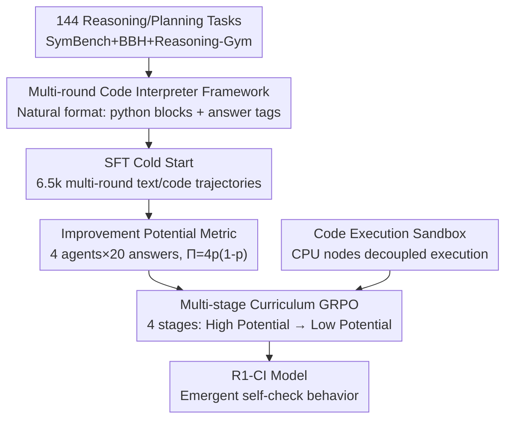

# R1-Code-Interpreter: LLMs Reason with Code via Supervised and Multi-stage Reinforcement Learning

**Conference**: ICLR 2026  
**OpenReview**: [https://openreview.net/forum?id=FNlNH0iFOx](https://openreview.net/forum?id=FNlNH0iFOx)  
**Code**: https://github.com/yongchao98/R1-Code-Interpreter  
**Area**: LLM Reasoning / Reinforcement Learning / Tool Use  
**Keywords**: Code Interpreter, Multi-stage Reinforcement Learning, Curriculum Learning, GRPO, Improvement Potential

## TL;DR
This paper employs SFT cold starting and multi-stage curriculum GRPO to train open-source LLMs into general-purpose Code Interpreters that autonomously decide when to write code versus performing text-based reasoning. The key innovation is sorting samples for curriculum learning based on "Improvement Potential" rather than task difficulty. This approach increases the average RL gain from +3.4% to +9.3% across 144 heterogeneous tasks. Ultimately, R1-CI-14B improves accuracy from 44.1% to 72.4% across 37 test tasks, surpassing GPT-4o (including its official Code Interpreter).

## Background & Motivation
**Background**: Text-based Chain-of-Thought (CoT) excels at semantics and common sense but often fails in precision calculations, symbolic manipulations, combinatorial optimization, and algorithmic searches. Equipping LLMs with the ability to generate and execute code (Code Interpreter) allows them to delegate these rigorous tasks to external tools (solvers, search algorithms), which is often superior to pure text reasoning. OpenAI's GPT series already features a built-in Code Interpreter capable of iteratively writing code, reading execution results, and continuing reasoning.

**Limitations of Prior Work**: A critical challenge is deciding "when to use text versus code"—most input problems do not explicitly hint at the better approach, and the solution spaces for both are vast. Research indicates that existing Code Interpreter implementations struggle to switch between text and code effectively, often wasting symbolic capabilities. LLM-generated code frequently degrades into "hard-coded pseudo-scripts," losing the benefits of symbolic computation. Furthermore, previous works using RL to train Code Interpreters (e.g., ToRL, ReTool) focus primarily on narrow domains like mathematics. While ToolRL teaches tool selection, its Code Interpreter only generates simple code. No systematic study has explored training Code Interpreters for robust, generalizable performance across hundreds of tasks.

**Key Challenge**: The authors applied standard DeepSeek-style GRPO to 144 heterogeneous tasks, but the gain was negligible (while a single task gained 27.4%, the 107-task joint training gained only 3.3%). There are two root causes: task heterogeneity dilutes reward signals, and effective samples are scarce—many tasks are either too difficult (mostly incorrect, sparse rewards) or provide no training signal for the current model. The authors theoretically prove that the magnitude of the GRPO policy gradient is proportional to $p(1-p)$ (where $p$ is the pass rate of a sample in a group). For "nearly all correct" or "nearly all incorrect" samples, the gradient tends toward zero, causing the update to be dominated by the KL term, which shrinks the policy toward the reference model and stagnates optimization.

**Goal**: ① Train a truly general-purpose Code Interpreter across multiple tasks and domains; ② Develop an RL recipe capable of continuous optimization in heterogeneous settings with scarce effective samples.

**Key Insight**: Since the usable gradient is proportional to $p(1-p)$ and peaks at $p=0.5$, samples should not be ordered by the traditional "easy-to-hard" curriculum. Instead, they should be ordered by "Improvement Potential," prioritizing samples where the model is "half-right, half-wrong" to provide the strongest training signal.

**Core Idea**: Use SFT cold starting to provide the model with multi-turn text/code interleaved reasoning capabilities, then employ "Multi-stage Curriculum GRPO based on Improvement Potential" to progress from high-potential to low-potential samples, overcoming bottlenecks in large-scale heterogeneous RL.

## Method

### Overall Architecture
R1-Code-Interpreter (R1-CI) is a Code Interpreter-enhanced reasoning model built on pure-text LLMs (Qwen2.5-3B/7B/14B) via "Multi-turn SFT + Multi-stage GRPO." During inference, the model autoregressively generates thoughts, inserts Python code blocks when needed, feeds system execution results back into the context, and continues reasoning until a final answer is produced—with a limit of 8 code calls. The training pipeline standardizes 144 reasoning/planning tasks, uses GPT-4o to synthesize 6.5k multi-turn trajectories for SFT cold starting, measures the "Improvement Potential" of each sample using four different agent frameworks, and performs multi-stage curriculum GRPO from high to low potential. A code execution sandbox deployed on CPU nodes decouples code execution from GPU gradient calculation, saving 39% of training time.



### Key Designs

**1. Multi-round Code Interpreter Framework and "Natural Format" Markers**

To address the difficulty of predicting whether to use text or code, the authors do not enforce a fixed mode. Instead, they allow the model to autonomously decide whether to write code during step-by-step reasoning. A simple head prompt organizes the output into an iterative structure: reasoning → optional Code Interpreter call → final answer. A key engineering decision is **avoiding artificial tags**: unlike many RL works that force `<think>`/`<answer>`/`<search>` tags, this work only uses the final answer marker `<<<answer context>>>`. Code blocks are identified using standard markdown ` ```python ` blocks already present in the LLM's pre-training distribution as implicit markers. The system extracts and executes these blocks, feeds back results with a `Code Execution Results:` prefix, and repeats until the 8-call limit is reached or the model outputs `<<<...>>>`. Empirical results show that this natural format, being closer to the model's original distribution, outperforms forced tags because it does not disrupt the natural learning dynamics during RL.

**2. SFT Cold Start: Synthesizing 6.5k Diverse Multi-turn Trajectories**

To mitigate the lack of effective samples for direct RL, the authors perform SFT for a warm start. GPT-4o generates multiple reasoning/execution trajectories per task, keeping only the correct ones. To enhance diversity and adaptability, various prompt formats are deliberately mixed (e.g., free reasoning vs. forced text/code switching), and the **proportion of multi-turn trajectories is increased**, especially those showing adaptive strategy adjustments (switching between code and text, iterative code correction). A maximum of 70 valid trajectories per task is maintained for balance, resulting in 6.5k high-quality samples trained for 3 epochs to prevent overfitting. Ablations show SFT is indispensable; without it, multi-stage GRPO yields minimal gains because the model lacks the initial capability to generate enough effective samples. This contradicts some RL studies suggesting SFT is optional, primarily because tool-enhanced reasoning imposes higher demands on base capabilities.

**3. Measuring Sample Value via "Improvement Potential"**

This is the core design addressing why vanilla GRPO fails on mixed data. Theoretical analysis shows that the upper bound of a sample's policy gradient magnitude is proportional to $p(1-p)$, which approaches 0 as $p \to 0$ or $p \to 1$. Thus, training should prioritize "half-right, half-wrong" samples. The metric is defined as follows: four preset agents (All Text CoT, All Code CoT-then-code, Code Agent autonomous CI, and CodeSteer guided agent) each sample 5 answers with different temperatures, yielding $N=20$ answers per problem. Given correctness labels $y_{i,j} \in \{0,1\}$, the empirical accuracy and improvement potential score are:

$$p_i = \frac{1}{N}\sum_{j=1}^{N} y_{i,j}, \qquad \Pi_i = 4\,p_i(1-p_i).$$

$\Pi_i \in [0,1]$ peaks at $p_i=0.5$ and is zero when $p_i \in \{0, 1\}$. Using multiple agent frameworks rather than a single policy is crucial because a Code Interpreter model can solve a problem through various paths (pure text, pure code, mixed); multi-framework sampling better captures the true potential for improvement by "switching strategies."

**4. Multi-stage Curriculum GRPO**

Training samples are sorted by $\Pi_i$ **sample-wise (not task-wise)** and divided into 4 equal groups (potential ranges approx. [0.64,1.00], [0.48,0.64], [0.32,0.48], [0.0,0.32]). Since difficulty varies within a single task, sample-wise grouping is essential. GRPO starts with the highest potential group for 150 steps, then progressively moves into lower-potential groups until the 4th stage covers all data. The GRPO objective incorporates external code execution $C$ into sampling. Furthermore, **tokens returned by code execution are masked**, ensuring the policy gradient is only calculated on tokens generated by the LLM. Rewards are rule-based: +1.0 for final correctness, +0.1 for correct formatting (otherwise -0.1), and -0.1 if generations exceed 6 turns. Test scores rise significantly in the first two stages, drop slightly when adding a new group before recovering, and plateau in the 4th stage (low potential), confirming theoretical expectations.

**5. Code Execution Sandbox: Decoupling Execution from Gradient Computation**

This system design makes large-scale RL feasible. In Code Interpreter training, code execution is time-consuming and risks reducing GPU utilization or causing out-of-memory (OOM) errors. The authors decouple gradient calculation from execution by deploying dedicated sandboxes on five 64-core CPU nodes. Code generated during batch inference is executed in parallel (60s timeout, max 8 calls per trajectory). This reduces overall RL training time by approximately 39%, from 4500 GPU hours to 1845 GPU hours.

### Mechanism: A Complete Example
Using the Blocksworld (planning) task: The model first states in text, "I will solve this step-by-step by writing a Python script to simulate stacks, validate moves, and search for a path." It generates and executes a DFS search block. The execution returns a move sequence, but one part triggers a `TimeoutExpired`. Seeing this, the model does not give up but notes, "The previous code found an effective sequence; let me write a checker script to verify it." It **autonomously generates a second verification script** to replay moves. Once the execution returns `Correct`, the model provides the final answer `<<< Move H from 3 to 1 ... >>>`. This "execute-explore-self-check" loop exemplifies the emergent self-verification behavior after training.

### Loss & Training
- **SFT**: 3 epochs, batch size 32, to avoid overfitting.
- **GRPO**: Learning rate 1e-6, 5 responses per prompt, KL penalty 0.001, batch size 128; Temperature 1.0 (train) / 0.6 (inference). Full-parameter fine-tuning on 16 H100s. To prevent training collapse, GRPO samples do not overlap with SFT data.
- **Reward**: Weighted sum of correctness (exact match for facts, constraint fulfillment for planning), format, and efficiency.

## Key Experimental Results

### Main Results
144 tasks from SymBench (33), Big-Bench-Hard (27), and Reasoning-Gym (84). After deduplication, 107 tasks for training and 37 for testing.

| Model / Config | Average Test Accuracy | Description |
| :--- | :--- | :--- |
| Baseline (CI wo Fine-tune) | 44.1% | 14B starting point |
| GPT-4o (Text-only) | 58.6% | Significantly larger model |
| GPT-4o + Official CI | 70.9% | Significantly larger model |
| **R1-CI-14B (Ours)** | **72.4%** | Surpasses GPT-4o |

Across 3B, 7B, and 14B sizes, R1-CI consistently improves by 36.4% on training tasks and 31.5% on test tasks. R1-CI-14B eventually outperformed the GPT-4o model used to synthesize its SFT data.

### Ablation Study

| Config | Effect | Description |
| :--- | :--- | :--- |
| R1-CI (Full) | Best | SFT + Multi-stage Curriculum GRPO + Improvement Potential |
| w/o CL (No Curriculum) | Significant Drop | Direct GRPO gain drops from +9.3% to ~+3.4% |
| w/o IP (Sorted by Difficulty) | Drop | Consistently worse across all three sizes |
| w/o GRPO (SFT only) | Drop | Lacks optimization beyond SFT |
| All Text / All Code (6.5k data) | Weaker on Test | Multi-round CI is more generalizable |
| w/ Wrong Data (In SFT) | Degradation | Increased variance and instability |
| w/o Varied Prompts | Drop | Prompt diversity is critical |
| w/o Multi-Turn Emphasis | Significant Drop | High-quality multi-turn data is critical |

Task-scaling experiments confirm the bottleneck: with 50 samples per task, the average gain decreases as task count increases (27.4% for one task, 3.3% for 107 tasks).

### Key Findings
- **Curriculum Learning + Improvement Potential are key**: They boosted average RL gain from +3.4% to +9.3%. Sorting by "Potential" consistently outperformed "Difficulty," validating the $\propto p(1-p)$ theory.
- **Low Potential samples are nearly useless**: Stage 4 (lowest potential) showed almost no gain, confirming that all-correct or all-wrong samples provide no gradient signal.
- **Emergent Self-Check behavior**: Following GRPO, the proportion of trajectories using code for self-verification increased significantly (as judged by GPT-4o).
- **Response length did not explode**: Contrary to most RL studies where answers become verbose, R1-CI lengths remained stable, likely because SFT already injected long-chain reasoning and multi-turn interaction decomposed the reasoning process.
- **OOD Generalization**: R1-CI-7B/14B significantly outperformed untrained versions on unseen tasks like GPQA and AIME 24&25.
- **Algorithm & Training Stability**: GRPO, PPO, and Reinforce++ showed comparable performance. Offline and online re-grouping gave similar results, though online was faster to converge but more costly.

## Highlights & Insights
- **Quantifying "should we train on this sample" as a scalar**: $\Pi=4p(1-p)$ directly represents the magnitude of the usable gradient in GRPO, which is more theoretically sound than heuristic "difficulty." This logic applies to any group-based RL (RLHF/RLVR) for data selection.
- **Multi-agent framework for potential estimation**: Since tool-augmented models have multiple solution paths, a single policy's accuracy understates the potential to "save the sample" by switching strategies.
- **"Natural Format" beats artificial tags**: Reusing standard ` ```python ` blocks and adding only one answer tag preserves the original distribution and is more RL-friendly.
- **System-level decoupling**: Moving code execution to a CPU sandbox and masking execution tokens are essential engineering prerequisites for large-scale heterogeneous RL, saving 39% in compute cost.

## Limitations & Future Work
- **Bounded by base model capability**: Some tasks remained near zero accuracy, indicating RL cannot surpass the fundamental knowledge/reasoning ceiling of the base LLM.
- **Measurement cost**: Estimating $\Pi$ via 4 agents $\times$ 20 samples per sample involves significant upfront overhead.
- **Rule-based rewards**: Correctness relies on exact match or constraint checking, which may not translate to open-ended tasks where rules are hard to define.
- **Future Directions**: Exploring lightweight online potential estimation, integrating potential metrics with reward shaping, or refining curriculum granularity (e.g., token-level signals).

## Related Work & Insights
- **vs ToRL / ReTool**: While they train reasoning models with CI, they focus on narrow domains like math. This work tackles 144 heterogeneous tasks and addresses the "vanilla GRPO failure on mixed tasks" problem.
- **vs ToolRL**: ToolRL selects among multiple tools; this work focuses on developing the Code Interpreter itself into a strong symbolic reasoning capability.
- **vs DeepSeek-style RL (e.g., R1)**: Those works often suggest SFT is optional. This work demonstrates that for general-purpose Tool-enhanced reasoning, SFT cold starting is indispensable to provide a baseline for RL to optimize from.
- **vs Traditional Curriculum Learning**: Traditional curriculum goes "easy-to-hard." This work orders by "Improvement Potential," which theoretically maps to the maximum available gradient.

## Rating
- Novelty: ⭐⭐⭐⭐⭐ "Curriculum based on Improvement Potential" is theoretically grounded and addresses the core bottleneck of multi-task tool RL.
- Experimental Thoroughness: ⭐⭐⭐⭐⭐ Covers three scales, 144 tasks, OOD benchmarks, ablations, and algorithm comparisons.
- Writing Quality: ⭐⭐⭐⭐ Clear chain from motivation and theory to method and results.
- Value: ⭐⭐⭐⭐⭐ Provides a reusable data selection and curriculum recipe for tool-enhanced reasoning and large-scale heterogeneous RL, with open-sourced data, code, and models.

<!-- RELATED:START -->

<div class="related-papers" markdown="1">

## Related Papers

- [\[ICLR 2026\] SRFT: A Single-Stage Method with Supervised and Reinforcement Fine-Tuning for Reasoning](srft_a_single-stage_method_with_supervised_and_reinforcement_fine-tuning_for_rea.md)
- [\[CVPR 2026\] CME-CAD: Heterogeneous Collaborative Multi-Expert Reinforcement Learning for CAD Code Generation](../../CVPR2026/reinforcement_learning/cme-cad_heterogeneous_collaborative_multi-expert_reinforcement_learning_for_cad_code_gen.md)
- [\[ICLR 2026\] Learning to Reason Efficiently with Discounted Reinforcement Learning](learning_to_reason_efficiently_with_discounted_reinforcement_learning.md)
- [\[ICLR 2026\] ExGRPO: Learning to Reason from Experience](exgrpo_learning_to_reason_from_experience.md)
- [\[ICLR 2026\] RewardMap: Tackling Sparse Rewards in Fine-grained Visual Reasoning via Multi-Stage Reinforcement Learning](rewardmap_tackling_sparse_rewards_in_fine-grained_visual_reasoning_via_multi-sta.md)

</div>

<!-- RELATED:END -->
