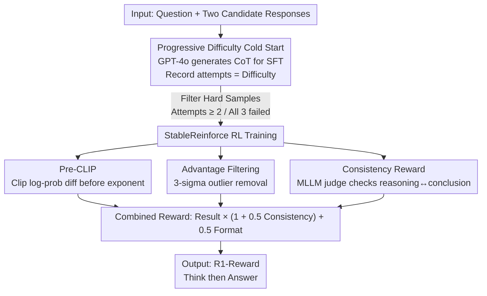

# R1-Reward: Training Multimodal Reward Model Through Stable Reinforcement Learning

**Conference**: ICLR 2026  
**OpenReview**: [https://openreview.net/forum?id=4Ewgw9M2xE](https://openreview.net/forum?id=4Ewgw9M2xE)  
**Code**: To be confirmed  
**Area**: Alignment RLHF / Multimodal VLM / Reinforcement Learning  
**Keywords**: Multimodal Reward Model, Reinforcement Learning, Training Stability, Long Chain of Thought, Test-time Scaling

## TL;DR
This paper reformulates the task of "judging which of two multimodal responses is better" as a rule-based RL task. To address the training collapse issues when directly applying Reinforce++, the authors propose the StableReinforce algorithm (Pre-CLIP + Advantage Filtering + Consistency Reward + Progressive Difficulty Cold Start). They trained a 7B reward model, R1-Reward, which improves upon previous SOTA by approximately 3.5%/13.5%/14.6% across three multimodal reward benchmarks and demonstrates further performance gains as sampling iterations increase.

## Background & Motivation
**Background**: Multimodal Reward Models (MRM) are critical components for training, data cleaning, test-time best-of-N selection, and automatic evaluation of Multimodal Large Language Models (MLLMs). Recent progress in MRM has focused on architectural modifications (e.g., generating a critic before a scalar score) and scaling training data, while the methodology remains largely centered on discriminative or scoring heads.

**Limitations of Prior Work**: Few studies have explored whether long chain-of-thought (CoT) reasoning capabilities are beneficial for reward modeling or how to activate them within an MRM. Traditional reward heads only output a scalar, lacking an interpretable reasoning process. While RL has been proven to induce long-range reasoning and improve generalization in domains like vision tasks, multimodal reasoning, and video understanding, reward modeling has rarely been trained using this paradigm.

**Key Challenge**: Reformulating reward modeling as rule-based RL (inputting a question and two responses, where the policy judges which is better and receives a reward for correctness) is intuitive. However, the authors observed that **directly training reward models with algorithms like Reinforce++ or PPO is highly prone to collapse** due to three root causes: (1) PPO relies on clipping the ratio for stability, but when the advantage is negative and the current policy deviates significantly from the reference policy, clipping fails to prevent numerical overflow and loss explosion in `exp(log_probs - old_log_probs)`. (2) Reward labels are binary (1 or 2) and easily learned; in later training stages, a batch might contain almost entirely positive rewards (e.g., 255 out of 256 samples). z-normalization of advantages then amplifies the advantage of the single 0-reward sample to an extreme value (e.g., -15.96), causing violent oscillations. (3) Scoring only the final result without supervising the reasoning process leads to reasoning-conclusion inconsistency (e.g., concluding response 2 is better in the reasoning but outputting 1) or reasoning collapsing into irrelevant noise.

**Goal**: Enable MRMs to perform long-range reasoning while ensuring stable RL training by systematically addressing the three aforementioned sources of collapse.

**Key Insight**: Building upon Reinforce++, three modifications are introduced: **Pre-CLIP the log-probability differences** before exponentiation to eliminate overflow, **filter outlier advantages using a 3-sigma rule** to prevent normalization spikes, and **introduce an MLLM judge for consistency rewards** to align reasoning with conclusions. This is coupled with a progressive training strategy involving "GPT-4o cold start + difficulty-based sample filtering."

## Method

### Overall Architecture
The objective of R1-Reward is to train a reward model capable of "analyzing first, then judging." Given a question and two candidate responses, the model outputs a point-by-point comparative analysis followed by a conclusion using the format `<think>...</think><answer>1/2</answer>`. The pipeline consists of two stages: first, GPT-4o generates CoT for 200,000 preference data points as a cold-start SFT, allowing the base model (QwenVL-2.5-7B-Instruct) to learn the task format and basic capabilities while recording the number of attempts GPT-4o needed as a "difficulty" metric. Second, difficult samples (where GPT-4o required multiple attempts or failed all attempts) are selected for RL using StableReinforce. The core of training stability lies in the three modifications within StableReinforce: Pre-CLIP, Advantage Filtering, and Consistency Reward. The final reward signal is a combination of formatting, result, and consistency rewards.

### Key Designs

**1. Pre-CLIP: Clipping log-probability differences before exponentiation to prevent numerical overflow**

To address the collapse in PPO/Reinforce++ where `exp(log_probs - old_log_probs)` overflows when ratios deviate significantly and negative advantages produce massive losses. Standard implementations clip the ratio after the `exp()` operation, but overflow occurs during the exponentiation itself. The authors move clipping before the exponent:

$$\frac{\pi_\theta(a_t|s_t)}{\pi_{\theta_{old}}(a_t|s_t)} \leftarrow \exp\!\left(\mathrm{clip}\!\left(\log\frac{\pi_\theta}{\pi_{\theta_{old}}},\ \log\delta_{min},\ \log\delta_{max}\right)\right)$$

Where $\delta_{min}=10^{-3}$ and $\delta_{max}=10^{3}$ bound the allowed probability ratio. This ensures that regardless of the policy divergence, the value entering `exp()` is constrained within $[\log 10^{-3}, \log 10^{3}]$, preventing overflow. This is particularly effective at preventing loss spikes when the advantage is negative and the current policy drifts far from the reference. The authors note that the $10^3$ threshold is insensitive to hyperparameters and primarily serves to mitigate the impact of noisy data.

**2. Advantage Filtering: Using the 3-sigma rule to eliminate outlier standardized advantages**

To address the issue where highly imbalanced rewards cause z-normalization to push specific advantages to extremes (e.g., ±16). The authors apply a filter to the standardized advantage $A_{standardized}=\frac{A-\mu_A}{\sigma_A+\epsilon}$, keeping only values within $[-3, 3]$ (i.e., within 3 standard deviations). Values outside this range are zeroed out:

$$\hat{A} = \begin{cases} A_{standardized} & |A_{standardized}| \le 3 \\ 0 & \text{otherwise} \end{cases}$$

Since the distribution after z-normalization is approximately standard normal, the 3-sigma threshold naturally targets extreme outliers. In the "255 rewards of 1, 1 reward of 0" scenario, this ensures that samples with 1-rewards are retained for updates while the extreme negative outlier (-15.96) is filtered, preventing it from destabilizing the training. The final objective remains a clipped surrogate using $\hat{A}$: $L_{StableReinforce}(\theta)=\frac{1}{|t|}\sum_t \min\!\big(\frac{\pi_\theta}{\pi_{\theta_{old}}}\hat{A}_t,\ \mathrm{clip}(\frac{\pi_\theta}{\pi_{\theta_{old}}}, 1-\epsilon, 1+\epsilon)\hat{A}_t\big)$.

**3. Consistency Reward: Utilizing an MLLM as a judge to align reasoning with conclusions**

To prevent "reasoning-answer decoupling" caused by only scoring the final result. Without such supervision, the model might find shortcuts, such as deducing that response 2 is better in its reasoning but outputting 1 as the final answer. The authors introduce Qwen2.5-VL-7B-Instruct as a supervisor to determine if the reasoning process is consistent with the final answer. However, simply adding this as an independent term could provide positive reinforcement for self-consistent but incorrect answers. Thus, the reward is designed as a **multiplicative gate**:

$$\text{Final Reward} = \text{Result Reward}\times(1+0.5\times\text{Consistency Reward}) + 0.5\times\text{Formatting Reward}$$

The consistency reward acts as a multiplier $(1+0.5\times\cdot)$ on the result reward, meaning it **only takes effect if the result is correct (non-zero Result Reward)**. Samples with incorrect results do not benefit from consistency, preventing the model from sacrificing accuracy for internal consistency.

**4. Progressive Difficulty Training: GPT-4o Cold Start + Filtering hard samples for RL**

To address the lack of prior training for MLLMs in reward modeling. The authors first use GPT-4o (temperature 0, up to 3 attempts) to generate CoT for 200,000 preference pairs, forming the R1-Reward-200K cold-start SFT dataset. Simultaneously, they **record the number of attempts GPT-4o needed to answer correctly as a difficulty label**. For RL, they prioritize "hard" samples—those requiring at least 2 attempts or failed all 3 by GPT-4o—as these distinguish subtle differences between responses. Data sources include MM-RLHF, RLAIF-V, VL-Feedback, POVID, and WildVision-Battle, shuffled to maintain a 1:1 ratio for answer options.

### Loss & Training
SFT and RL were conducted on 4×H800 (80G) GPUs. SFT ran for 1 epoch (~8 hours, LR 1e-5, batch 256). RL utilized the OpenRLHF framework for 5 epochs (~12 hours, training batch 128, rollout batch 256, LR 1e-6, initial KL coefficient 0). The base model is QwenVL-2.5-7B-Instruct. Three reward types (formatting, result, and consistency) are combined using the multiplicative formula.

## Key Experimental Results

### Main Results
R1-Reward (7B) outperforms both closed-source and open-source competitors across three multimodal reward benchmarks with high data efficiency (200K samples vs. 1M+ for IXC-2.5-Reward).

| Benchmark | Metric | R1-Reward | Prev. SOTA | Note |
|------|------|-----------|----------|------|
| VL Reward-Bench | Overall Acc | 71.92 | 67.20 (Gemini-1.5-Pro) / 65.80 (IXC-2.5-Reward) | ~+9.3% over best open source |
| VL Reward-Bench | Macro Acc | 71.44 | 70.00 (IXC-2.5-Reward) | — |
| Multimodal Reward Bench | Overall | 82.2 | 70.8 (GPT-4o) / 67.1 (MM-RLHF-Reward) | +14.3% over Prev. SOTA |

In the Hallucination dimension of VL Reward-Bench, R1-Reward reached 85.71 (improving further to 89.06 with Voting@15), compared to 62.50 for IXC-2.5-Reward. It achieved 99.6 in the Math dimension of Multimodal Reward Bench.

### Test-time Scaling / Training Stability

| Configuration | VL Reward-Bench Overall | Multimodal Reward Bench Overall |
|------|------|------|
| R1-Reward (Single) | 71.92 | 82.2 |
| Voting@15 (Majority Vote) | 76.46 | 83.3 |

Regarding training stability (Figure 2), Reinforce++ collapsed around step 150 (policy loss surge), while StableReinforce maintained smooth convergence. Additionally, RL yielded more efficient token usage, with average response length decreasing by ~15% compared to the base model.

### Key Findings
- **RL is the primary driver of performance**: At the same 200K data scale, traditional scalar reward heads performed poorly, followed by the "critic-then-score" approach. RL significantly led, likely because it allows for direct comparison between two responses.
- **Components are indispensable**: Ablations show that removing either Advantage Filtering, Pre-CLIP, or the Consistency Reward leads to performance drops or training collapse.
- **Reasoning quality is human-preferred**: In human evaluations, annotators preferred R1-Reward's reasoning process in 72.5% of cases.
- **Robustness to annotation quality**: Strong performance was maintained even when using Qwen2.5-VL-7B instead of GPT-4o for data construction.
- **Transferability**: Smaller MLLMs trained using R1-Reward showed consistent improvements across benchmarks.

## Highlights & Insights
- **Moving CLIP before the exponent is a simple yet critical engineering insight**: Since overflow occurs at the `exp` step, the traditional order of operations is ineffective. Swapping the order prevents loss explosion and is applicable to any ratio-based policy gradient method.
- **Multiplicative reward gating is ingenious**: By putting the $(1+0.5\times\text{Consistency})$ term on the result reward, it automatically ensures that "consistency is only rewarded if the result is correct," avoiding back-incentives and prioritizing accuracy over self-consistency.
- **Sampling attempts as difficulty labels** provides a virtually zero-cost curriculum learning signal.
- **Reward modeling as a rule-based RL task** elevates the reward model from a "scoring head" to a "reasoning judge," enabling training-free gains through test-time scaling (majority voting).

## Limitations & Future Work
- Improvement on the MM-RLHF Reward Bench is limited, indicating that base reward modeling capabilities still need strengthening.
- Test-time scaling was limited to simple majority voting; more advanced search or aggregation strategies could be explored.
- The consistency reward depends on an external MLLM judge (Qwen2.5-VL-7B), introducing inference overhead and potential judge bias.
- Experiments were confined to a 7B base and 200K data; marginal gains for larger models or data scales remain to be seen.

## Related Work & Insights
- **vs. Reinforce++ / GRPO**: While these rely on ratio clipping and z-normalization, this paper demonstrates their failure in reward modeling (simple labels, extreme batch imbalance) and replaces them with Pre-CLIP and 3-sigma filtering.
- **vs. DeepSeek-R1 style RL**: While both use result-based rewards to induce long reasoning, this paper addresses the resulting reasoning-conclusion decoupling by adding a consistency reward.
- **vs. MM-RLHF-Reward / IXC-2.5-Reward**: This paper outperforms these models (which use different architectures or 1M+ data) with a generative "think-then-answer" RL paradigm at 200K data, highlighting data efficiency.

## Rating
- Novelty: ⭐⭐⭐⭐ Systematic diagnosis and fix for collapse in a reformulated RL task; individual modifications are direct but robust when combined.
- Experimental Thoroughness: ⭐⭐⭐⭐ Comparison across three benchmarks, ablations, human evaluation, and downstream transfer.
- Writing Quality: ⭐⭐⭐⭐ Clear diagnosis of problems with numerical examples, logical derivation of methods.
- Value: ⭐⭐⭐⭐ High engineering value, providing a reproducible recipe and open data for training multimodal reward models with RL.

<!-- RELATED:START -->

## Related Papers

- [\[ICLR 2026\] RM-R1: Reward Modeling as Reasoning](rm-r1_reward_modeling_as_reasoning.md)
- [\[CVPR 2026\] MSRL: Scaling Generative Multimodal Reward Modeling via Multi-Stage Reinforcement Learning](../../CVPR2026/reinforcement_learning/msrl_scaling_generative_multimodal_reward_modeling.md)
- [\[ICLR 2026\] Exploration vs Exploitation: Rethinking RLVR through Clipping, Entropy, and Spurious Reward](exploration_vs_exploitation_rethinking_rlvr_through_clipping_entropy_and_spuriou.md)
- [\[ICLR 2026\] UME-R1: Exploring Reasoning-Driven Generative Multimodal Embeddings](ume-r1_exploring_reasoning-driven_generative_multimodal_embeddings.md)
- [\[ICLR 2026\] A Reward-Free Viewpoint on Multi-Objective Reinforcement Learning](a_reward-free_viewpoint_on_multi-objective_reinforcement_learning.md)

<!-- RELATED:END -->
