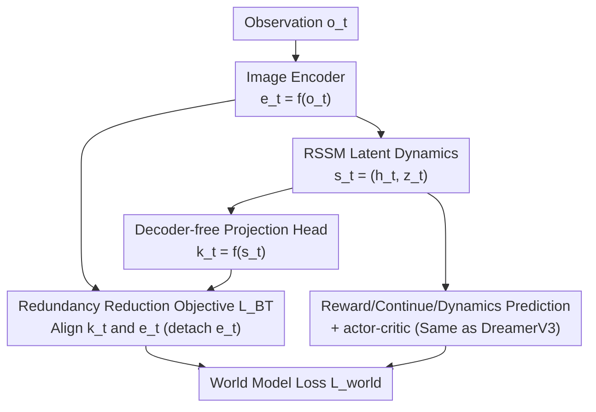

# R2-Dreamer: Redundancy-Reduced World Models without Decoders or Augmentation

**Conference**: ICLR 2026  
**OpenReview**: [https://openreview.net/forum?id=Je2QqXrcQq](https://openreview.net/forum?id=Je2QqXrcQq)  
**Code**: https://github.com/NM512/r2dreamer  
**Area**: Reinforcement Learning / World Models / Self-Supervised Representation Learning  
**Keywords**: Model-based Reinforcement Learning, World Models, Decoder-free, Redundancy Reduction, Barlow Twins

## TL;DR
Based on the DreamerV3 framework, R2-Dreamer replaces the "reconstruction decoder" with a Barlow Twins-inspired redundancy reduction self-supervised objective. It prevents representation collapse without decoders or data augmentation, performing on par with DreamerV3/TD-MPC2 on DMC and Meta-World while training 1.59× faster, and significantly outperforming baselines on the small-target benchmark DMC-Subtle.

## Background & Motivation

**Background**: Image-based model-based reinforcement learning (MBRL) centers on learning a latent representation that extracts "task-essential information" from high-dimensional pixels. Mainstream approaches like the Dreamer series use RSSM (Recurrent State Space Models) to model dynamics and learn representations via **pixel-level reconstruction**—decoding the latent state $s_t$ into an image $\hat o_t$ and using the reconstruction loss $L_{recon}$ to drive the encoder.

**Limitations of Prior Work**: Reconstruction objectives suffer from a fatal flaw: the learning signal is dominated by **spatially large but task-irrelevant** regions (e.g., backgrounds). The model is forced to refine these background details, wasting representation capacity and computation, while potentially ignoring small but critical objects (e.g., a tiny target point). Another path involves "decoder-free" methods that replace reconstruction with self-supervised losses (contrastive/predictive), but these **rely heavily on data augmentation (DA) as external regularization** to prevent representation collapse into trivial solutions.

**Key Challenge**: DA as an external regularizer is a double-edged sword and is task-dependent—random shifts might crop out small objects, and color jittering can be harmful when color is a critical feature. Consequently, decoder-free methods exchange instability for stability at the cost of generality, requiring strategy retuning for different tasks.

**Goal**: To find a stable anti-collapse representation learning objective for RSSM without introducing a decoder or DA, while maintaining performance comparable to strong baselines.

**Key Insight**: Starting from the information-theoretic principle of "Redundancy Reduction"—since positive pairs cannot be created via DA, the model uses **two naturally occurring internal signals** (the image encoding $e_t$ and the projection of the latent state $k_t$) as the two views. By aligning the diagonal of their cross-correlation matrix and de-redundantizing the off-diagonal elements, an **internal regularizer** is formed that does not depend on any external augmentation.

**Core Idea**: Replace the reconstruction loss $L_{recon}$ in DreamerV3 with a Barlow-Twins-style redundancy reduction loss $L_{BT}$, while keeping other components (RSSM, actor-critic, KL balancing) intact to cleanly isolate the contribution of the "representation learning objective" as a single variable.

## Method

### Overall Architecture
R2-Dreamer addresses "how to learn task-focused latent representations without pixel reconstruction or data augmentation." It adopts the DreamerV3 world model with one primary modification: **removing the image decoder, adding a lightweight linear projection head**, and replacing the reconstruction loss with the redundancy reduction loss $L_{BT}$.

Mechanism: Observation $o_t$ is encoded into embedding $e_t$. The RSSM maintains a deterministic state via a sequence model $h_t = f_\phi(s_{t-1}, a_{t-1})$, and a stochastic state is obtained via the representation model $z_t \sim q_\phi(z_t|h_t, e_t)$. Together, they form the latent state $s_t = (h_t, z_t)$ serving as the agent's "memory." Instead of decoding $\hat o_t$ from $s_t$, R2-Dreamer uses a projection head $k_t = f_\phi(s_t)$ to map the latent state into the embedding space, then applies $L_{BT}$ between $k_t$ and $e_t$. Reward/continue prediction, dynamics/representation KL terms, and actor-critic remain identical to DreamerV3—latent states are used to predict $\hat r_t$, $\hat c_t$, and to train the actor and critic in imagined rollouts.

### Key Designs

**1. Redundancy Reduction Objective replacing Reconstruction: Barlow Twins as Internal Regularization**

This design directly addresses the "capacity consumed by background" issue of reconstruction. The authors adopt the Barlow Twins loss form as the representation signal:

$$L_{BT} = \sum_i (1 - C_{ii})^2 + \alpha \sum_{i \neq j} C_{ij}^2$$

Where $C$ is the cross-correlation matrix calculated over a mini-batch (totaling $B \times T$ samples) after standardizing projection outputs $k_t$ and image embeddings $e_t$ along the batch dimension; $i, j$ are feature dimension indices. The first term (invariance) forces the diagonal $C_{ii}$ to approach 1, ensuring correlation for each feature dimension; the second term (redundancy) pushes the off-diagonal $C_{ij}$ toward 0, removing redundancy between features. The entire loss is controlled by a single hyperparameter $\alpha$ for the redundancy term weight.

Its effectiveness lies in **no longer learning representations by "restoring pixels," but by "statistical alignment of two internal signals."** Large irrelevant background areas do not dominate the signal simply because they "occupy more pixels"; instead, the model is guided to learn compact, de-redundantized, and task-sensitive representations. Barlow Twins was chosen over contrastive learning (e.g., InfoNCE) or VICReg due to its simpler implementation and fewer hyperparameters.

**2. Internal Signal Pairs replacing Data Augmentation: Embedding vs. Projected Latent State**

Decoder-free methods typically rely on DA to create positive pairs for anti-collapse, which is the bottleneck for generality. R2-Dreamer's key observation is that **two natural "views" already exist inside the model**: the encoder output $e_t$ and the projection $k_t$ of the latent state back into the embedding space. They describe the same observation at the same time but through different computational paths, forming a positive pair without manual augmentation.

Applying redundancy reduction to these internal signals yields an **internal regularizer that completely replaces DA**. This avoids side effects like "DA cropping out small targets" or "color jittering destroying key color information" while maintaining anti-collapse capabilities. For stability, the target $e_t$ is detached (gradient-stopped, similar to TD-MPC2), though the encoder still receives gradients via the projection head and RSSM, supplemented by task-related supervision from reward, continue, dynamics, and value functions.

**3. Minimal Intervention: Replacing only the Loss, Keeping Others Intact**

To ensure "performance changes are attributable only to the representation objective," authors kept modifications minimal. The world model loss is changed from DreamerV3's:

$$L_{DreamerV3} = \mathbb{E}_{q_\phi}\Big[\sum_t L_{recon}(t) + L_{pred}(t) + \beta_{dyn} L_{dyn}(t) + \beta_{rep} L_{rep}(t)\Big]$$

to

$$L_{world} = \mathbb{E}_{q_\phi}\Big[\beta_{BT} L_{BT} + \sum_t L_{pred}(t) + \beta_{dyn} L_{dyn}(t) + \beta_{rep} L_{rep}(t)\Big]$$

Only $L_{recon}$ is replaced by $\beta_{BT} L_{BT}$. KL balancing, free bits, and coefficients $\beta_{dyn}=1, \beta_{rep}=0.1$ are all retained from DreamerV3. The actor-critic (critic learning the $\lambda$-return distribution, actor using REINFORCE with entropy regularization and robust return normalization) is also kept as is. This "single-point replacement" allows for clean ablation conclusions: any improvement can be directly attributed to the new representation objective.

### Loss & Training
The world model is trained using $L_{world}$ (including $\beta_{BT} L_{BT}$, prediction losses, and two KL terms). The critic maximizes the log-likelihood of the $\lambda$-return on both imagined and replay trajectories. The actor is trained only on imagined trajectories using REINFORCE estimates paired with entropy regularization (fixed scale $\eta$) and robust return normalization $S$ based on 5–95 percentile EMA. All experiments use unified hyperparameters, 5 random seeds, and 10 evaluation episodes per seed.

## Key Experimental Results

### Main Results
On standard benchmarks like DMC (20 tasks) and Meta-World MT1 (50 tasks), R2-Dreamer is **on par on average** with decoder-based (DreamerV3), decoder-free (DreamerPro, TD-MPC2), and model-free (DrQ-v2) baselines. However, it **significantly leads** on the newly proposed DMC-Subtle.

| Benchmark | Baselines | R2-Dreamer Performance |
|------|---------|----------------|
| DMC (20 tasks) | DreamerV3 / TD-MPC2 / DrQ-v2 / DreamerPro | Average mean/median on par; no decoder or DA needed |
| Meta-World (50 tasks) | Same as above | Average success rate on par; includes small-object contact tasks |
| DMC-Subtle (5 tasks, small target) | Same as above | Significantly outperforms all baselines |

| Method | DMC Walker Walk Training Time (hrs, 1M steps) | Relative Speedup |
|------|------|------|
| **R2-Dreamer** | 4.4 | — |
| Dreamer (Our PyTorch reproduction) | 7.0 | 1.59× |
| DreamerPro | 10.4 | 2.36× |
| DreamerV3 (Official JAX, highly optimized) | 6.6 | — |

### Ablation Study
On 20 DMC tasks comparing 6 variants, focusing on "Redundancy Reduction vs. Data Augmentation":

| Configuration | Key Observation | Explanation |
|------|---------|------|
| R2-Dreamer (Full) | Baseline Performance | Internal redundancy reduction regularization |
| R2-Dreamer + DA | Marginal improvement only | DA provides almost no benefit; internal regularization suffices |
| R2-Dreamer (Half batch, B=8) | No significant drop | Consistent with Barlow Twins' batch robustness |
| DreamerPro | Normal | Baseline dependent on DA |
| DreamerPro (w/o DA) | Performance collapse | Degrades to near "unsupervised decoder-free" |
| Dreamer (w/o Reconstruction) | Worst | No visual representation objective |

On DMC-Subtle, which requires high precision, **adding DA to R2-Dreamer significantly hurts performance**, confirming that DA destroys small but critical visual information.

### Key Findings
- **DA is not essential; internal regularization is enough**: Adding DA to R2-Dreamer yields marginal gains, while DreamerPro collapses without it—proving redundancy reduction can independently handle anti-collapse.
- **DA is harmful for fine-grained tasks**: On DMC-Subtle, adding DA reduces performance, indicating external augmentation can distort task-critical information; the DA-free internal mechanism is more robust.
- **More focused representations**: Saliency maps based on occlusion show R2-Dreamer's attention is sharply concentrated on targets, whereas baselines are more diffuse, qualitatively confirming more compact and relevant representations.
- **Batch Robustness**: Half batch sizes (B=8 vs 16) do not show significant drops, easing concerns about SSL objective sensitivity to correlation estimation.

## Highlights & Insights
- **Clever use of "internal signal pairs"**: Instead of creating artificial views, it uses $e_t$ and $k_t$ as a positive pair, moving "anti-collapse" from external augmentation to internal modeling, naturally avoiding augmentation side effects.
- **Clean experimental design via single-point replacement**: Swapping only one loss term and freezing others makes "performance attribution" indisputable—a model approach for evaluating representation objective contributions.
- **Value of the DMC-Subtle benchmark**: Shrinking task-critical objects specifically exposes both "reconstruction dominated by background" and "DA cropping small targets." This targeted stress test is reusable for other representation learning studies.
- **Portability**: Redundancy reduction as an internal regularizer can be easily integrated into existing frameworks. The logic of replacing DA with information-theoretic principles provides valuable insights for other self-supervised RL methods.

## Limitations & Future Work
- Authors acknowledge that they have not yet verified the method under **dynamically irrelevant backgrounds** (e.g., Distracting Control Suite), assuming internal redundancy reduction also resists dynamic distractor but without empirical proof.
- Not yet extended to **high-dimensional tasks like Humanoid**; scalability is a clear future direction.
- Observation: The method is essentially a "loss swap" and remains heavily dependent on the RSSM architecture; the cross-task generality of hyperparameters $\alpha$ and $\beta_{BT}$ under extreme visual distributions requires further exploration.
- Detaching target $e_t$ is an empirical stability trick; the theoretical cost compared to "full bidirectional gradients" has not been deeply analyzed.

## Related Work & Insights
- **vs. DreamerV3 (Decoder-based)**: DreamerV3 relies on reconstruction, which consumes capacity on backgrounds and requires pixels generation computation; R2-Dreamer removes the decoder, trains 1.59× faster, and excels in small-target tasks while staying "on par" in standard tasks.
- **vs. DreamerPro (Decoder-free but DA-dependent)**: DreamerPro uses SwAV spatial loss + EMA temporal loss and requires consistency constraints on augmented views; R2-Dreamer replaces DA with internal signal pairs, remaining stable without DA whereas DreamerPro collapses.
- **vs. TD-MPC2**: Also a decoder-free baseline using DA as an external regularizer; R2-Dreamer adopts its detach strategy for stability but completely eliminates DA via redundancy reduction.
- **vs. Dreamer-InfoNCE**: Contrastive learning's performance is limited without DA; R2-Dreamer uses a non-contrastive Barlow Twins objective, which is simpler to implement and more robust to batch sizes.

## Rating
- Novelty: ⭐⭐⭐⭐ Migrating redundancy reduction from CV to RSSM representation learning and replacing DA with internal signals is a clear and theoretically grounded approach.
- Experimental Thoroughness: ⭐⭐⭐⭐ Three major benchmarks + 6-variant ablation + saliency visualization + efficiency comparison, plus the self-developed DMC-Subtle stress test.
- Writing Quality: ⭐⭐⭐⭐ Clear chain of logic (Motivation—Contradiction—Method); well-articulated experimental design.
- Value: ⭐⭐⭐⭐ Provides a general and efficient new baseline for decoder-free MBRL through "DA-free internal regularization," with clear engineering significance.

<!-- RELATED:START -->

## Related Papers

- [\[ICLR 2026\] From Observations to Events: Event-Aware World Models for Reinforcement Learning](from_observations_to_events_event-aware_world_models_for_reinforcement_learning.md)
- [\[ICLR 2026\] Learning to Be Uncertainty: Pre-training World Models with Horizon-Calibrated Uncertainty](learning_to_be_uncertain_pre-training_world_models_with_horizon-calibrated_uncer.md)
- [\[ICLR 2026\] Learning Massively Multitask World Models for Continuous Control](learning_massively_multitask_world_models_for_continuous_control.md)
- [\[ICLR 2026\] Efficient Reinforcement Learning by Guiding World Models with Non-Curated Data](efficient_reinforcement_learning_by_guiding_world_models_with_non-curated_data.md)
- [\[ICLR 2026\] Context and Diversity Matter: The Emergence of In-Context Learning in World Models](context_and_diversity_matter_the_emergence_of_in-context_learning_in_world_model.md)

<!-- RELATED:END -->
