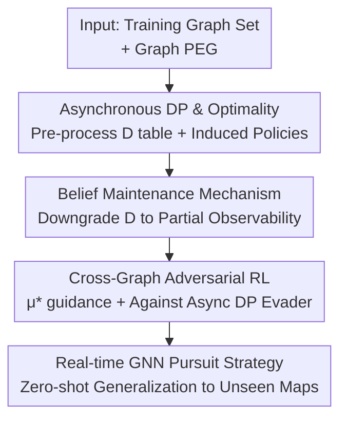

# R2PS: Worst-Case Robust Real-Time Pursuit Strategies under Partial Observability

**Conference**: ICLR 2026  
**OpenReview**: [https://openreview.net/forum?id=zqA7Q9Q21L](https://openreview.net/forum?id=zqA7Q9Q21L)  
**Code**: https://github.com/Cahemgco/EPG_code  
**Area**: Reinforcement Learning / Game Theory / Pursuit-Evasion Games  
**Keywords**: Pursuit-evasion games, partial observability, belief maintenance, cross-graph generalization, worst-case robustness

## TL;DR
This paper addresses Pursuit-Evasion Games (PEG) on graphs in the most challenging scenario where the evader predicts pursuer moves (asynchronous movement) and the pursuer has only partial observability. By extending optimal strategies from dynamic programming (DP) through a belief maintenance mechanism and cross-graph adversarial reinforcement learning, a GNN-based pursuit strategy is trained. It achieves real-time (sub-second) zero-shot generalization to unseen real city maps, significantly outperforming PSRO baselines trained directly on test graphs in worst-case scenarios.

## Background & Motivation
**Background**: Pursuit-evasion game (PEG) is a classic problem in robotics and security, where a team of pursuers aims to capture an evader on a graph $G=\langle V,E\rangle$. Agents move to adjacent vertices or stay put at each discrete step. A core goal is finding worst-case robust strategies.

**Limitations of Prior Work**: Solving graph PEGs precisely is computationally expensive. Any change in graph structure requires recalculating the worst-case strategy, hindering real-time deployment. Traditional mathematical programming (LP/MIP) fails here. While RL can learn generalized strategies, existing methods like MT-PSRO and Grasper only offer few-shot generalization to unseen opponents and initial conditions. The recent EPG (Equilibrium Policy Generalization) achieved zero-shot generalization across graph structures but was limited to **full-information** scenarios.

**Key Challenge**: Real-world security imposes two hard constraints: pursuit teams often have **partial observability** (losing contact when the intruder exits sensor range), which elevates the problem to PSPACE-hard; and the worst-case evader may have **superior observation** (asynchronous movement), deciding its move after predicting the pursuer's action. Existing works often assume full information or synchronous moves, leading to over-optimistic strategies.

**Goal**: Find a pursuit strategy (R2PS) that is both worst-case robust and capable of real-time operation under the setting of "evader predictability + pursuer partial observability."

**Key Insight**: The authors found that the "distance table" $D$ calculated by a DP algorithm for Markov PEG contains the optimal structure of worst-case pursuit steps. By proving that $D$ remains optimal under asynchronous movement and projecting it onto a partial observability setting via belief maintenance, one can reuse this optimal information without solving POSGs from scratch (which involves exponential state expansion).

**Core Idea**: Use "DP distance tables + belief maintenance" to transfer full-information optimal pursuit strategies to partial observability, then embed this as a guidance signal in cross-graph RL to train a real-time, zero-shot generalized GNN pursuit strategy.

## Method

### Overall Architecture
The method links four stages: first, DP is used as a pre-processing step on training graphs to obtain distance table $D$ and induced optimal strategies; second, $D$ is theoretically extended to asynchronous movement settings; third, belief maintenance "downgrades" the full-information strategy to one dependent only on local observation history; finally, the downgraded strategy guides cross-graph adversarial RL in EPG, training a GNN against the "strongest asynchronous DP evader."

### Key Designs

**1. DP Optimality under Asynchronous Movement**

In the worst-case, the evader predicts the pursuer's move—this is asynchronous movement. This work reuses a DP algorithm (Algorithm 1) designed for Markov PEG: starting from "captured" states ($D=0$), it fills table $D$ via BFS. $D(s)$ represents time-to-capture from state $s=(s_p,s_e)$. The key contribution is extending this to asynchrony. When the evader knows the pursuer's target $n_p$, its policy simplifies to $\nu^*(s_p,s_e,n_p)=\arg\max_{n_e} D(n_p,n_e)$. Theorem 2/3 proves that the same $D$ provides strictly optimal strategies even against stronger asynchronous evaders, forming the foundation for policy transfer.

**2. Belief Maintenance Mechanism**

To handle the exponential state space of POSGs, two layers are used. First, the "possible positions set" $Pos$ tracks all potential evader locations. Second, a "belief" $belief$, a probability distribution over $Pos$, is used to weight pursuit decisions:
$$\mu(s_p,belief)=\arg\min_{n_p}\frac{\sum_{s_e} belief(s_e)\max_{n_e} D(n_p,n_e)}{\sum_{s_e} belief(s_e)}$$
This weighted average prevents the pursuer from becoming overly "pessimistic" when $Pos$ is large, which often occurs in pure minimax approaches. Proposition 1 ensures that if $Pos$ is a singleton (full information), the policy reverts to the optimal $\mu^*$. Maintenance cost is only $\tilde{O}(|V|)$ per step.

**3. Cross-Graph Adversarial Reinforcement Learning**

Instead of recalculating DP (which is $\tilde{O}(n^{m+1})$), the authors deploy the EPG framework. For each sampled training graph $G_i$, the optimal strategy $\mu_i^*$ serves as a **reference policy**, while the asynchronous DP evader $\nu_i^*$ acts as the **opponent**. The loss function adds a KL divergence term to guide the RL agent toward the reference action $a^*=\mu^*(s)$:
$$L(\theta\mid s)=J_\pi(\theta\mid s)-\beta\log\pi_\theta(s,a^*)$$
In partial observability training, input $(s_p,Pos,belief)$ is used. This allows the GNN to abstract high-level pursuit logic across different graph structures.

### Loss & Training
The backbone uses SAC with parameter sharing and a decentralized architecture. The GNN uses multi-head self-attention with adjacency matrix masks to encode graph states, followed by a pointer network for action output. Inference complexity is $O(n^2m)$, significantly lower than the $\tilde{O}(n^{m+1})$ required for DP recalculation.

## Key Experimental Results

Setting: 2 pursuers ($m=2$) vs 1 evader on planar graphs and real landmarks (Times Square, Eiffel Tower, etc.) with observation range 2.

### Main Results

Success rates of extended DP pursuers (vs optimal asynchronous DP evader):

| Map | Shortest Path | DP$_{Pos}$ | DP$_{belief}$ |
|------|------|------|------|
| Grid Map | 0.00 | 0.59 | **0.78** |
| Downtown Map | 0.02 | 0.73 | **0.90** |
| Eiffel Tower | 0.29 | 0.69 | **0.94** |
| Sydney Opera House | 0.05 | 0.47 | **0.87** |
| Hollywood Walk of Fame | 0.01 | 0.25 | **0.48** |

Belief-weighted DP performs consistently better than pure minimax DP.

Zero-shot comparison: Cross-graph RL vs PSRO:

| Map | DP$_{async}$·Ours | DP$_{async}$·PSRO | BR$_{async}$·Ours |
|------|------|------|------|
| Scotland-Yard Map | **0.76** | 0.00 | 0.73 |
| Times Square | **0.95** | 0.04 | 0.27 |
| Eiffel Tower | **1.00** | 0.52 | 0.55 |
| Sydney Opera House | **0.95** | 0.11 | 0.31 |

Ours demonstrates robust zero-shot performance, whereas PSRO (trained directly on these maps) collapses against the strongest DP evaders.

### Ablation Study

| Config | Key Finding |
|------|---------|
| $\beta=0.1$ vs $\beta=0$ | DP guidance significantly improves training efficiency. |
| DP$_{belief}$ vs DP$_{Pos}$ | Belief weighting is consistently superior to conservative minimax. |
| Belief Update Frequency | Performance drops if updates are not performed every step. |
| Observation Range 2→5+ | Success rate monotonically increases to 100% as range improves. |

### Key Findings
- **Belief weighting is the main driver**: Replacing minimax with weighted averages over $Pos$ prevents pursuers from stagnating due to extreme values in large uncertainty sets.
- **Asynchronous evaders are significantly stronger**: PSRO fails against DP$_{async}$, highlighting the necessity of training against the strongest possible opponent.
- **Real-time advantage**: RL inference takes <0.01s on GPUs, while DP recalculation takes minutes on large graphs.
- **Observability transfer**: Models trained with range 2 improve monotonically when provided with better sensors during deployment.

## Highlights & Insights
- **The "Three-Stage" Paradigm**: Establishing optimality, downgrading via belief, and distilling into RL provides a solid theoretical foundation for zero-shot generalization.
- **Belief vs. Minimax**: Contrary to intuition that minimax is always "safer" for worst-case robustness, soft weighting via probability distributions prevents "pessimistic paralysis."
- **Distillation as a Bridge**: Using computationally expensive optimal solutions as "teachers" for real-time GNNs is a powerful paradigm for deploying robust solutions in dynamic environments.

## Limitations & Future Work
- Complexity for multiple evaders and larger teams (more than $m=2$) remains limited by the DP pre-processing bottleneck.
- Belief updates assume uniform random movement when no prior is available; accuracy drops if the evader's actual strategy deviates significantly.
- Continuous space and dynamic obstacle avoidance were not modeled.

## Related Work & Insights
- **vs EPG**: Expands EPG from full info/synchronous to partial info/asynchronous settings.
- **vs PSRO**: While PSRO specializes on single graphs, Ours learns a "generalist" that generalizes to unseen structures through cross-graph abstraction.
- **vs POSG**: Avoids exponential history tracking by using structured $Pos$ and $belief$ abstractions, keeping maintenance complexity at $\tilde{O}(|V|)$.

## Rating
- Novelty: ⭐⭐⭐⭐⭐ 
- Experimental Thoroughness: ⭐⭐⭐⭐ 
- Writing Quality: ⭐⭐⭐⭐ 
- Value: ⭐⭐⭐⭐⭐ 

<!-- RELATED:START -->

## Related Papers

- [\[ICLR 2026\] Guided Policy Optimization under Partial Observability](guided_policy_optimization_under_partial_observability.md)
- [\[ICLR 2026\] Information-based Value Iteration Networks for Decision Making Under Uncertainty](information-based_value_iteration_networks_for_decision_making_under_uncertainty.md)
- [\[ICLR 2026\] Robustness in the Face of Partial Identifiability in Reward Learning](robustness_in_the_face_of_partial_identifiability_in_reward_learning.md)
- [\[ICLR 2026\] DR-SAC: Distributionally Robust Soft Actor-Critic for Reinforcement Learning under Uncertainty](dr-sac_distributionally_robust_soft_actor-critic_for_reinforcement_learning_unde.md)
- [\[ICLR 2026\] Representation-Based Exploration for Language Models: From Test-Time to Post-Training](representation-based_exploration_for_language_models_from_test-time_to_post-trai.md)

<!-- RELATED:END -->
