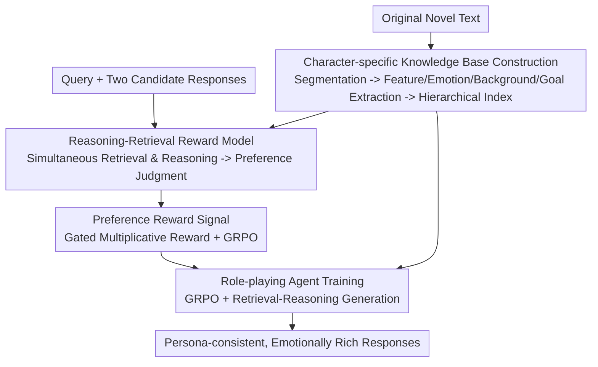

# R4: Nested Reasoning-Retrieval for Reward Modeling in Role-Playing Agents

**Conference**: ICLR 2026  
**OpenReview**: [https://openreview.net/forum?id=sWQSbVsPEz](https://openreview.net/forum?id=sWQSbVsPEz)  
**Code**: TBD  
**Area**: Alignment RLHF / Role-playing Dialogue / Reinforcement Learning  
**Keywords**: Reward Modeling, Role-playing, Reasoning-Retrieval, GRPO, Preference Optimization

## TL;DR
R4 enables both the "Reward Model" and the "Role-playing Agent" to possess simultaneous **reasoning + retrieval** capabilities. The reward model rewrites the evaluation process into a structured reasoning chain with retrieval. Utilizing preference signals from this model, the dialogue agent is trained via GRPO, improving the character consistency of the 32B model on CharacterEval from 55.28 to 64.64, ranking first with a 68.2% win rate in human blind tests.

## Background & Motivation
**Background**: Role-playing dialogue requires LLMs to simultaneously maintain character persona, integrate background knowledge, and convey emotions. Mainstream approaches typically rely on RAG for injecting character knowledge or use RL with scalar rewards (e.g., Search-R1, ReSearch) for alignment.

**Limitations of Prior Work**: Although reasoning-focused models (DeepSeek-R1, o1) possess strong logic, their generated dialogues are often **overly direct, stylistically bland, and detached from character personas**—they optimize for "correctness," whereas role-playing demands expressiveness. Furthermore, standard one-pass RAG uses static queries that cannot dynamically adjust to the dialogue context.

**Key Challenge**: The primary bottleneck is that **reward signals themselves are unreliable**. The authors' systematic analysis identifies two structural biases in existing reward models: (1) **Role bias**—evaluation consistency depends heavily on character popularity; human consistency for protagonists is 0.87 (variance 2.1), while for supporting characters it drops to 0.61 (variance 14.0) due to a lack of pre-training priors for obscure roles. (2) **Reference bias**—scoring quality fluctuates significantly based on the availability of character background material (0.79 with reference vs. 0.70 without, variance 4.1 vs. 16.9). The root cause is that existing reward models score single responses **in isolation**, performing neither contextual reasoning nor integration of character knowledge.

**Goal**: To enable the reward model to "think before judging" using character backgrounds, similar to human annotators, thereby providing reliable supervision for RL; and to allow the dialogue agent to inherit the same reasoning-retrieval capabilities.

**Core Idea**: Equipping both the reward model and the agent **symmetrically with reasoning + retrieval**. Reward modeling is rewritten as a "structured reasoning task with retrieval," and this reward system is used to train a role-playing agent that also reasons and retrieves via RL.

## Method

### Overall Architecture
R4 (Reward + Role-playing + Reason + Retrieve) is a three-stage pipeline: First, **construct a character-specific knowledge base** from original novels to serve as external memory. Second, train a **reasoning-retrieval reward model** that, when presented with a "prompt + two candidate responses," does not directly score but instead generates multi-step reasoning while retrieving character knowledge, ultimately providing a preference judgment. Finally, use the preference signals from this reward model to **train the role-playing agent** via GRPO, enabling it to follow a retrieval-reasoning process during generation. The reward model and agent share the same knowledge base and retrieval backend, forming a reinforcement loop: "Better reward quality → Better supervision → Better agent reasoning → More effective retrieval."

### Key Designs

**1. Character-specific Knowledge Base Construction: Providing a Retrievable External Memory for Reasoning**

To liberate the reward model from "role bias" and "reference bias," it is essential to have stable, retrievable character knowledge; otherwise, the model relies on pre-training priors to guess obscure characters. R4 uses GPT-4o to segment original novels into semantically coherent plots and extracts four dimensions for character profiling: **Persona Traits** (personality, behavior patterns, catchphrases), **Emotional States** (explicit emotions + latent psychology), **Background Knowledge** (history, relationships, expertise), and **Narrative Goals** (short-term intentions + long-term arcs). These entries are organized into a hierarchical structure using multiple index keys (character ID, emotional context, relationship dynamics, narrative situ) and support multi-hop retrieval through semantic clustering. Additionally, a **Dynamic Expansion Mechanism** is employed: during training, actual retrieval queries are collected to identify knowledge gaps, which are then filled via GPT-4o synthesis and human annotation, ensuring quality through consistency checks and expert sampling. This knowledge base is **shared** by both the reward model and the agent, ensuring consistent character grounding across the system.

**2. Reasoning-Retrieval Reward Model: Rewriting "Scoring" as Structured Reasoning with Retrieval**

To address the two biases caused by isolated scoring, R4 no longer outputs a scalar from the reward model. Instead, it requires the model to produce a structured reasoning chain: using `<think>` for thought processes, `<search>...</search>` for retrieval queries, `<result>...</result>` for injecting retrieval results, and finally `<answer>` with `\boxed{}` for the preference judgment. Reasoning explicitly covers three dimensions: dialogue capability (fluency, coherence, consistency), character alignment (knowledge exposure/accuracy/hallucinations, persona faithfulness), and expressiveness (emotional authenticity, engagement, stylistic diversity). Training utilizes GRPO, guided by a **rule-based reward function** without supervising reasoning trajectories. A **gated multiplicative** form is adopted to prevent "correct answer but inconsistent logic" from reaching high scores:

$$r_{rm} = r_{ans} + \lambda_{fmt1}\,r_{fmt} + \lambda_{cons}\,(r_{ans}\cdot r_{cons}) - \mu(1-r_{ans})$$

where $r_{ans}\in\{0,1\}$ indicates preference prediction accuracy, $r_{fmt}\in\{0,1\}$ denotes format compliance, and $r_{cons}\in[0,1]$ is a "reasoning-conclusion consistency" score provided by an auxiliary verifier. Constants are $\lambda_{fmt1}=\lambda_{cons}=0.1$, and a penalty $\mu=0.05$ is applied if the answer is wrong. Crucially, the consistency term is multiplied by $r_{ans}$—**consistency only grants points if the answer is correct**, avoiding reward hacking. Retrieval results are inserted externally and masked during gradient calculation to ensure unbiased credit assignment. The reward model is based on Qwen2.5-32B-Instruct, trained for 2 epochs on 15K preference data, achieving 87% agreement with human preferences on the hold-out set.

**3. Role-playing Agent: Co-training with Reward Model Preference Signals via GRPO**

With a reliable reward, agent training bypasses expensive and hard-to-scale supervision from "human-annotated dialogue pairs." R4 requires only character profiles and user queries, allowing the agent to explore response strategies freely while receiving preference feedback from the reward model. Specifically, pairwise rewards are converted into relative preference scores: for each prompt, $G$ candidates $y_1,\dots,y_G$ are sampled, and the score for the $i$-th candidate is:

$$r_{prefer_i} = \frac{1}{G-1}\sum_{j\neq i}\mathbb{I}\big[RM(x,y_i,y_j)=y_i\big]$$

This represents the "win rate" against other candidates, normalized as the GRPO advantage. The final reward includes a format term $r_{agent}=r_{prefer}+\lambda_{fmt2}\,r_{fmt}$ ($\lambda_{fmt2}=0.1$). The agent (Qwen2.5-7B/32B-Instruct) accesses the **same knowledge base** as the reward model and is explicitly guided to retrieve and reason during generation, gradually learning to construct contextual queries and link persona, emotion, and narrative through self-reflection. The paper emphasizes that the reward and agent are **deliberately co-designed**: ablation shows that substituting a generic CharacterRM directly results in only 46.87, which is worse than R4 ablation variants—the benefit comes from the complementary reasoning-retrieval workflows rather than a single superior component.

### Loss & Training
Both stages utilize GRPO (Equation 2, including clipping and KL constraint $D_{KL}(\pi_\theta\Vert\pi_{\theta_{ref}})$). The reward model and agent share a `multilingual-e5-large` retriever and use FlashRAG for indexing, retrieving top-3 documents at each step. Initialization follows the Instruct version rather than the Base version to stabilize RL. The implementation is based on Verl + ReSearch and trained on 64 H100 GPUs.

## Key Experimental Results

### Main Results
On CharacterEval's 12 metrics (categorized into three groups, scaled to a 100-point system), R4-32B-Instruct leads significantly in character consistency and attractiveness:

| Metric Category | Metric | R4-32B | Best Baseline | Gain |
|-----------------|--------|--------|---------------|------|
| Character Consistency | Avg. | 64.64 | 55.28 (BC-NPC-Turbo) | +9.36 |
| Character Consistency | Persona Behavior | 68.00 | 58.20 | +9.8 |
| Character Consistency | Knowledge Accuracy | 68.80 | 59.28 | +9.52 |
| Attractiveness | Avg. | 64.93 | 58.93 | +6.00 |
| Attractiveness | Empathy | 69.60 | ~64.20 | +5.40 |
| Dialogue Capability | Avg. | 78.90 | 75.95 | +2.95 |

Even the 7B version (R4-7B) achieves an attractiveness score of 60.95, surpassing all baselines. In human blind tests (500 instances, 3 annotators), R4-32B **ranked first 68.2% of the time** (GPT-4o 21.6%, CharacterGLM-6B 10.2%, $p<0.01$). The advantage primarily stems from persona faithfulness and narrative coherence—the direct targets of the methodology.

### Ablation Study

| Configuration | Character Consistency | RM Accuracy | Description |
|---------------|-----------------------|-------------|-------------|
| R4 (Full) | 64.64 | 87.0 | Full Model |
| w/o Reasoning (Global) | 48.23 | 74.2 | Performance collapses without reasoning |
| RM w/o Reasoning | 49.87 | 76.3 | Reward model performance drops without reasoning |
| Agent w/o Reasoning | 56.94 | 87.0 | Agent remains relatively high without reasoning |
| RM w/o Retrieval | 58.31 | 82.4 | Performance drops without retrieval |
| RM w/o Consistency | 59.83 | 81.3 | RM accuracy declines without consistency reward |
| CharacterRM+Agent | 46.87 | 72.9 | Worse results after swapping with off-the-shelf RM |

### Key Findings
- **Reward quality is the foundation, agent capability is the ceiling**: Removing reasoning from the reward model causes a collapse (49.87, close to the global removal of 48.23), whereas removing it only from the agent maintains 56.94. This suggests that supervision quality fundamentally constrains the agent's potential; the relationship is **multiplicative rather than additive**.
- **Components cannot be substituted in isolation**: Swapping in CharacterRM yielded only 46.87, worse than any R4 ablation variant, proving that the reward and agent must be co-designed.
- **Scaling amplifies architectural advantages**: Baselines increased character consistency from 48.80 to 53.40 when moving from 7B to 32B, while R4 jumped from 55.74 to 64.64, indicating that the reasoning-retrieval framework benefits more from larger scales.
- **Training Dynamics**: Rewards rise steadily, response length increases without quality degradation (expressiveness rather than verbosity), and retrieval frequency increases before stabilizing (learning to ask more precise queries rather than more queries).

## Highlights & Insights
- **Gated Multiplicative Reward prevents hacking**: By multiplying the consistency term by $r_{ans}$, consistency bonus is denied if the answer is wrong. This simple design effectively blocks the reward hacking path of "fancy reasoning but wrong conclusion" and is transferable to any RL with auxiliary rewards.
- **Reward Modeling = Structured Reasoning Task**: Converting non-differentiable, subjective "role-playing quality" into a retrievable, verifiable reasoning chain makes 87% human consistency a trainable goal. This is the most profound perspective shift in the paper.
- **Symmetric Armament**: Equipping both the reward model and the agent with the same reasoning-retrieval capabilities forms a reinforcement loop. This "homomorphism between evaluator and evaluatee" concept can be transferred to fields like code or mathematics where reliable RMs are required.

## Limitations & Future Work
- Strong dependence on **high-quality character knowledge bases**; since these are extracted by GPT-4o with human completion, the construction cost and quality are uncertain when scaling to knowledge-scarce original characters.
- High training costs (64×H100, two-stage GRPO for both RM and Agent) present a significant barrier to entry.
- Evaluations are concentrated on Chinese literary characters in CharacterEval/ChatHaruhi; generalization to other languages or non-literary scenarios (such as real-time game NPC interaction) has not been fully verified.
- Consistency rewards rely on an auxiliary verifier, whose own reliability and bias have not been analyzed in depth. In cross-model comparisons, different baselines vary in difficulty/retrieval budgets, so absolute scores should be viewed with caution.

## Related Work & Insights
- **vs. Scalar/Generative Reward Models (ScalarRM / GenRM)**: These score in isolation, lack interpretable reasoning, and do not integrate external knowledge, leading to poor consistency in subjective character domains. R4 transforms scoring into structured reasoning with retrieval; in ablations, ScalarRM+Agent achieved only 43.89 and GenRM+Agent 45.34, much lower than R4's 64.64.
- **vs. Retrieval-based RL (Search-R1 / ReSearch)**: These integrate retrieval into RL primarily for factual grounding but lack persona alignment and emotional authenticity. R4 injects retrieval-reasoning into the reward side, specifically covering multi-dimensional role-playing standards.
- **vs. Dedicated Role-playing Models (CharacterGLM / BC-NPC-Turbo)**: These rely on supervised fine-tuning (SFT) on dialogue data; while attractive, they show weak character consistency (55.28). R4 uses RL + reasoning rewards to bypass the need for massive human dialogue annotation, resulting in higher consistency.

## Rating
- Novelty: ⭐⭐⭐⭐⭐ Transforming reward modeling into structured reasoning with retrieval and symmetrically equipping the RM and Agent is a fresh perspective.
- Experimental Thoroughness: ⭐⭐⭐⭐⭐ 12-metric main table + fine-grained ablations + human blind tests + training dynamics provide solid support for conclusions.
- Writing Quality: ⭐⭐⭐⭐ Bias analysis and ablations are clear, though some formula details require Cross-referencing the appendix.
- Value: ⭐⭐⭐⭐ Provides a paradigm for reliable RMs in subjective dialogue domains with high transferability, despite high engineering costs.

<!-- RELATED:START -->

## Related Papers

- [\[ICLR 2026\] RM-R1: Reward Modeling as Reasoning](rm-r1_reward_modeling_as_reasoning.md)
- [\[ACL 2026\] Understanding Generalization in Role-Playing Models via Information Theory](../../ACL2026/reinforcement_learning/understanding_generalization_in_role-playing_models_via_information_theory.md)
- [\[ICLR 2026\] RLVMR: Reinforcement Learning with Verifiable Meta-Reasoning Rewards for Robust Long-Horizon Agents](rlvmr_reinforcement_learning_with_verifiable_meta-reasoning_rewards_for_robust_l.md)
- [\[ICLR 2026\] VeriRole: Verifiable Role-Awareness through Hint-Guided Reinforcement Learning](verirole_verifiable_role-awareness_through_hint-guided_reinforcement_learning.md)
- [\[ICML 2026\] CAMEL: Confidence-Gated Reflection for Reward Modeling](../../ICML2026/reinforcement_learning/camel_confidence-gated_reflection_for_reward_modeling.md)

<!-- RELATED:END -->
