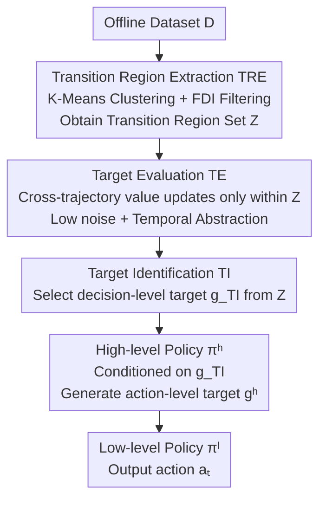

# RD-HRL: Generating Reliable Sub-Goals for Long-Horizon Sparse-Reward Tasks

**Conference**: ICLR 2026  
**OpenReview**: [https://openreview.net/forum?id=5E5sd3TWGD](https://openreview.net/forum?id=5E5sd3TWGD)  
**Code**: https://github.com/Looomo/RD-HRL-public  
**Area**: Reinforcement Learning / Hierarchical Reinforcement Learning / Offline RL  
**Keywords**: Hierarchical Reinforcement Learning, Sub-goal Planning, Offline Goal-Conditioned RL, Value Generalization Error, Long-Horizon Sparse Rewards

## TL;DR
Addressing the issue where high-level policies in offline hierarchical RL choose incorrect sub-goals due to value functions with generalization noise, this paper proposes RD-HRL. It extracts "transition regions" that connect multiple trajectories from offline data as a reliable decision space. A TI module then selects **decision-level targets** from these regions for the high-level policy, decoupling sub-goal selection from cross-trajectory value estimation. It achieves top-3% performance on 8 out of 9 long-horizon sparse-reward benchmarks including antmaze, Kitchen, and CALVIN.

## Background & Motivation
**Background**: Long-horizon sparse-reward tasks (e.g., goal-conditioned navigation, robotic manipulation) have always been challenging in offline RL because rewards only appear upon reaching distant goals, making credit assignment extremely difficult. The dominant solution is Hierarchical Reinforcement Learning (HRL): a high-level policy proposes intermediate sub-goals using a value function, while a low-level policy learns to reach these sub-goals, thereby shortening the effective planning horizon and mitigating long-range credit assignment issues.

**Limitations of Prior Work**: The value functions used by high-level policies to propose sub-goals often suffer from **generalization errors** in practice. The authors illustrate this with an intuitive example: from $s_t$ to goal $g$, the optimal path should pass through a sub-goal $s^1_{t+H}$. however, the value estimate of $s^1_{t+H}$ relies on **cross-trajectory Bellman backups** (i.e., generalized Bellman propagation). This generalization signal is often decayed or unreliable, causing the value of the optimal sub-goal to be underestimated. Consequently, the high-level policy selects a suboptimal sub-goal $s^2_{t+H}$, leading to a suboptimal trajectory.

**Key Challenge**: The reliability of a sub-goal essentially depends on which states the value function evaluates. Once the high-level policy is forced to compare candidate sub-goals whose "value signals are supported by generalization," the generalization noise directly contaminates the decision. The root of the problem lies not in the policy itself, but in the fact that it is forced to make decisions in a space that **requires generalization to compare values**.

**Goal**: Decompose unreliable sub-goal planning into two "reliable" sub-problems: (1) providing appropriate **decision-level targets**, and (2) generating reliable **action-level targets** (the original meaning of sub-goals) conditioned on the decision-level targets.

**Key Insight**: The authors observe that the impact of generalization error can be significantly reduced if the high-level policy is prevented from comparing candidates with unreliable value signals and its decision space is **restricted to local regions that do not require generalization**. Such regions exist in the data where multiple trajectories are close to each other and can be interconnected, which the authors call "transition regions."

**Core Idea**: Introduce a **reliability-driven decision mechanism** that selects decision-level targets for the high-level policy from transition regions. This restricts high-level decisions to regions without the need for generalization, thereby decoupling sub-goal selection from cross-trajectory value estimation.

## Method

### Overall Architecture
RD-HRL is built upon standard HRL (high-level policy $\pi^h$ + low-level policy $\pi^l$), with an additional reliability-driven decision mechanism consisting of three modules. The pipeline is: starting from the offline dataset, the **TRE module** first clusters states and filters a set of "transition regions" $Z$ as the reliable candidate decision space; the **TE module** performs value estimation only within these transition regions to provide low-noise values; the **TI module**, leveraging TE's evaluations, selects a transition region from $Z$ as the decision-level target $g_{TI}$ for the current state; the high-level policy then generates an action-level target $g^h$ conditioned on $g_{TI}$, and the low-level policy outputs the actual action $a_t$.

The decision chain can be formulated as:
$$g_{TI} \sim TI_{\theta_{TI}}(\cdot|s_t, g), \quad g^h \sim \pi^h_{\theta^h}(\cdot|s_t, g_{TI}), \quad a_t \sim \pi^l_{\theta^l}(\cdot|s_t, g^h)$$

Crucially, the high-level policy no longer compares sub-goal values across the entire state space but is constrained by $g_{TI}$ to a region that does not require generalization, effectively blocking generalization noise from the decision process.

### Key Designs

**1. Transition Region Extraction (TRE): Identifying the "Reliable Decision Space"**

This is the foundation of the method, targeting the pain point of "where the value signal is reliable." The authors define transition regions as state clusters where multiple trajectories are close and can be connected—intuitively, making decisions in these regions naturally allows cross-trajectory connections without relying on generalization. TRE is implemented in two steps: first, it performs K-Means clustering $C = \text{K-Means}(\{s|s\sim D\}, N)$ on the dataset to obtain $N$ clusters; then, it uses a **Future Diversity Index** (FDI) to quantify how many different futures each cluster can lead to, thereby identifying transition regions. For a cluster $c$, FDI is defined as:
$$FDI(c) = \frac{|\{c_{s_{t+1}} | s_t \in c, s_t \in \tau\}| - 2}{N}, \quad \tau \sim D$$
which is "how many different clusters the next step can land in," normalized by subtracting 2 (as any cluster has at least "leaving" and "staying" as two trivial futures). Transition regions that connect more trajectories naturally have more diverse future directions, hence a larger FDI. The authors take clusters with $FDI(c) > 0$ as the transition region set $Z = \{c | FDI(c) > 0\}$, where $N$ is determined by the Within-Cluster Sum of Squares (WCSS).

**2. Target Identification (TI): Restricting High-Level Decision Space**

The TI module $TI_{\theta_{TI}}(g_{TI}|s_t, g)$ is responsible for selecting a transition region $z$ from $Z$ as the decision-level target $g_{TI}$ for the high-level policy. It addresses the issue that "high-level policies are misled by noise when picking sub-goals in spaces requiring generalization"—once decision-level targets are restricted to transition regions, the high-level policy's decision space is naturally narrowed to local areas where generalization is not needed. TI is optimized using an AWR-style objective:
$$L_{\theta_{TI}} = \mathbb{E}_{z\in Z, s_z\in z}\big[\exp(\beta^{d(s_t,s_z)} \cdot A_{TI}(s_z, s_t, g)) \cdot \log TI_{\theta_{TI}}(s_z|s_t, g)\big]$$
where the advantage $A_{TI}(s_z, s_t, g) = TE_{\theta_{TE}}(s_z, g) - TE_{\theta_{TE}}(s_t, g)$ is provided entirely by the TE module, and $d(s_t, s_z)$ is the temporal distance. Notably, when learning TI, the authors specifically sample $s_z$ from $z$ that belongs to **the same trajectory** as $s_t$ to avoid decision-level uncertainty; since the temporal distance between $s_z$ and $s_t$ is not necessarily 1, the weight is raised to the power of $d(s_t, s_z)$. Ablation studies (RD-HRL-HP) show that $g_{TI}$ might still be "unreachable" for the low-level policy and requires the high-level policy to decompose it, so TI is not just a substitute for a "higher-level $\pi^h$."

**3. Target Evaluation (TE): Low-Noise Values via Cross-Trajectory Direct Updates and Temporal Abstraction**

For TI to select accurately, there must be a way to reliably score transition regions. The TE module $TE_{\theta_{TE}}(s, g)$ is dedicated to this and evaluates **only** states $s \in z, z\in Z$, rather than all $s\in D$. Its update objective is:
$$L_{\theta_{TE}} = \mathbb{E}_{\tau\sim D}\big[\|TE_{\theta_{TE}}(s_{t_1}, g) - (r_{t_1,t_2} + \gamma^{d(s_{t_1},s_{t_2})}TE_{\bar\theta_{TE}}(s_{t_2}, g))\|^2\big]$$
where $z_1, z_2$ are two adjacent transition regions on the trajectory skeleton $\hat\tau = \{\ldots, z_i, z_{i+1}, \ldots\}$, with $s_{t_1}\in z_1$ and $s_{t_2}\in z_2$. Its reliability stems from two points: first, $s_{t_1}$ and $s_{t_2}$ may come from **different trajectories**, so the value signal is **directly propagated across trajectories** rather than extrapolated via generalization, fundamentally avoiding generalization error; second, TE only updates on transition regions, abstracting fine-grained RL steps into a **macro-step** (temporal abstraction), which significantly reduces the number of value updates and suppresses cumulative error. The authors also provide a theoretical proof in the appendix that TE effectively reduces value noise in long-horizon sparse-reward scenarios.

**4. Coupling with HRL: Two-Stage Reliable Planning**

The reliability-driven decision mechanism is integrated back into HRL to form RD-HRL. The training order is: first learn TE using $Z$; then learn TI using the advantages provided by TE; the regular value function $V_{\theta_V}(s,g)$ is learned via standard TD targets; finally, the high-level policy $\pi^h_{\theta^h}(s_{t+H}|s_t, s_z)$ and low-level policy $\pi^l_{\theta^l}(a_t|s_t, s_{t+H})$ are learned using AWR objectives, but the high-level policy now replaces condition $g$ with the transition region state $s_z$. Consequently, the "all-in-one but unreliable" sub-goal planning is split into two reliable sub-problems: TI provides decision-level targets in transition regions without generalization, and the high-level policy then produces action-level targets that are immune to generalization noise for the low-level policy.

### Loss & Training
Training involves four components conducted sequentially based on dependencies: (1) Learn the TE module using transition regions $Z$ (Eq. 8, cross-trajectory direct update); (2) Learn the TI module using TE advantages via AWR (Eq. 10); (3) Learn the regular value function $V$ (Eq. 11, standard TD); (4) Learn high-level and low-level policies via AWR (Eq. 3, Eq. 4), replacing high-level condition $g$ with transition region state $s_z$. $\beta$ is the AWR temperature, $H$ is the waysteps hyperparameter, and $N$ (number of clusters) is selected by WCSS.

## Key Experimental Results

### Main Results
RD-HRL was compared against 9 HRL/planning baselines (HIQL, PlanDQ, MSCP, V-ADT, DTAMP, HD-DA, HILP, HILP-Plan, DiffuserLite) on 9 long-horizon sparse-reward benchmarks, with results averaged over 50 random seeds. RD-HRL reached the top-3% (≥0.97×MAX) in 8 out of 9 tasks.

| Dataset | HIQL (Backbone) | PlanDQ | DiffuserLite | RD-HRL |
|--------|------|--------|--------------|--------|
| antmaze-medium-diverse | 86.8 | 93.0 | 87.6 | **94.6** |
| antmaze-large-play | 86.1 | 85.3 | 69.4 | **95.3** |
| antmaze-ultra-diverse | 52.9 | 70.0 | 69.3 | **81.1** |
| antmaze-ultra-play | 39.2 | 71.5 | 63.7 | **72.9** |
| kitchen-mixed | 67.7 | 71.7 | 64.8 | **72.9** |
| CALVIN | 43.8 | 45.0 | 52.1 | **68.8** |

On the most complex antmaze-ultra-{play, diverse}, RD-HRL improved over the backbone HIQL by 85.9% and 53.3%, respectively. On the high-dimensional manipulation task CALVIN, it improved by 57% over HIQL, validating its effectiveness in high-dimensional spaces. The only task not reaching top-3% was kitchen-partial, which the authors attribute to the lack of complete trajectories across sub-tasks, preventing TRE from identifying transition regions.

### Ablation Study

| Configuration | ultra-diverse | ultra-play | Description |
|------|------|------|------|
| RD-HRL (Full) | 81.1 | 72.9 | Full Model |
| RD-HRL-TRE | 59.8 | 52.9 | TI uses $s_{t+2H}$ instead of $z\sim Z$ |
| RD-HRL-HP | 27.8 | 32.6 | Remove high-level policy, $g_{TI}$ goes directly to low-level |
| RD-HRL-TE | 35.3 | 57.8 | Replace TE module with $V$ |
| RD-HRL-CU | 68.1 | 66.0 | Remove cross-trajectory update from TE (keep temporal abstraction) |
| HIQL (Backbone) | 52.9 | 39.2 | — |

### Key Findings
- **Value of Transition Regions is more than "using a larger H"**: RD-HRL-TRE, which replaces $Z$ with $\{s_{t+2H}\}$, performs worse than the full model on all antmaze tasks, showing that the reliability brought by transition regions is key. However, it still outperforms HIQL in most tasks, indicating some gain from increasing $H$.
- **TI is not "a higher $\pi^h$"**: Removing the high-level policy and feeding $g_{TI}$ directly to the low-level (RD-HRL-HP) results in performance drops of 65.2% and 55.3% on ultra-diverse/play—decision-level targets are often "unreachable" for the low-level and must be decomposed by the high-level policy.
- **TE's gains come from two aspects**: Replacing with ordinary $V$ (RD-HRL-TE) leads to significant drops in complex environments. Removing only the cross-trajectory update while keeping temporal abstraction (RD-HRL-CU) drops performance by 16.1% on ultra-diverse but still consistently outperforms RD-HRL-TE, showing that both cross-trajectory updates and temporal abstraction contribute significantly.

## Highlights & Insights
- **Turning "Value Reliability" into a Spatial Decision Problem**: Instead of fixing the generalization error of the value function, this methodology restricts decisions to transition regions that don't need generalization—a clean change of perspective.
- **FDI Metric is Simple but Effective**: Quantifying how many trajectories a region connects by "how many clusters the next step can land in" provides a computable threshold for the abstract concept of "transition regions."
- **TE's Cross-Trajectory Direct Updates Avoid Bellman Generalization**: Propagating values directly between adjacent transition regions across different trajectories, rather than relying on global function approximation, is fundamental to noise reduction. Temporal abstraction further suppresses cumulative error.
- **Two-Stage Decomposition (Decision-Level / Action-Level Targets)**: This can be migrated to other offline tasks requiring long-horizon planning—first set anchors in reliable regions, then let the policy refine them hierarchically.

## Limitations & Future Work
- **Dependency on Transition Regions in Data**: The failure on kitchen-partial is due to the lack of cross-subtask trajectories; the method may degrade on datasets with sparse coverage or non-overlapping trajectories.
- **Dependency on Clustering and Hyperparameters**: The number of clusters $N$ (via WCSS), FDI threshold (set to 0), and waysteps $H$ all require configuration. Clustering quality affects transition region identification, and sensitivity analysis of these choices is not fully discussed.
- **Complex Pipeline**: Adding TRE/TI/TE modules and multi-stage training on top of standard HRL incurs non-trivial engineering and tuning costs. Exploring simplification (e.g., end-to-end learning of transition regions) would be valuable.
- **Verification on State Space = Goal Space**: The method has been mainly validated where state and goal spaces match. Further testing is needed for scenarios with high-dimensional observations (like images) or misaligned state-goal spaces.

## Related Work & Insights
- **vs. HIQL (Backbone)**: HIQL uses a single value function to pick a state $H$ steps away as the action-level target, suffering from generalization noise. RD-HRL inserts transition regions + TI/TE, decoupling selection from estimation, showing massive gains in ultra-level tasks.
- **vs. HILP / HILP-Plan**: These use median-based action-level target selection. RD-HRL shifts to learning decision-level targets from transition regions, avoiding the need for all-space value comparisons.
- **vs. DiffuserLite**: DiffuserLite uses a three-layer hierarchical planning design. RD-HRL uses a two-stage (decision $\to$ action) approach + transition regions, emphasizing "where to make decisions" over increasing hierarchy depth, yielding better performance on most antmaze and CALVIN tasks.

## Rating
- Novelty: ⭐⭐⭐⭐⭐ Reframing sub-goal reliability as a decision space selection problem using "transition regions + decision-level targets" is highly novel and theoretically supported.
- Experimental Thoroughness: ⭐⭐⭐⭐ 9 benchmarks with 50 seeds + four-group ablation, though hyperparameter/clustering sensitivity analysis is relatively sparse.
- Writing Quality: ⭐⭐⭐⭐ Motivation is clear with Figure 1, though the TRE/TI/TE module names are dense and require careful cross-referencing.
- Value: ⭐⭐⭐⭐ Provides a practical solution for generalization noise in offline HRL, with significant gains in the hardest ultra/CALVIN tasks.

<!-- RELATED:START -->

## Related Papers

- [\[ICLR 2026\] Strict Subgoal Execution: Reliable Long-Horizon Planning in Hierarchical Reinforcement Learning](strict_subgoal_execution_reliable_long-horizon_planning_in_hierarchical_reinforc.md)
- [\[ICLR 2026\] Preference-based Policy Optimization from Sparse-reward Offline Dataset](preference-based_policy_optimization_from_sparse-reward_offline_dataset.md)
- [\[ICLR 2026\] RLVMR: Reinforcement Learning with Verifiable Meta-Reasoning Rewards for Robust Long-Horizon Agents](rlvmr_reinforcement_learning_with_verifiable_meta-reasoning_rewards_for_robust_l.md)
- [\[ICLR 2026\] Kevin: Multi-Turn RL for Generating CUDA Kernels](kevin_multi-turn_rl_for_generating_cuda_kernels.md)
- [\[ACL 2026\] A Goal Without a Plan Is Just a Wish: Efficient and Effective Global Planner Training for Long-Horizon Agent Tasks (EAGLET)](../../ACL2026/reinforcement_learning/a_goal_without_a_plan_is_just_a_wish_efficient_and_effective_global_planner_trai.md)

<!-- RELATED:END -->
