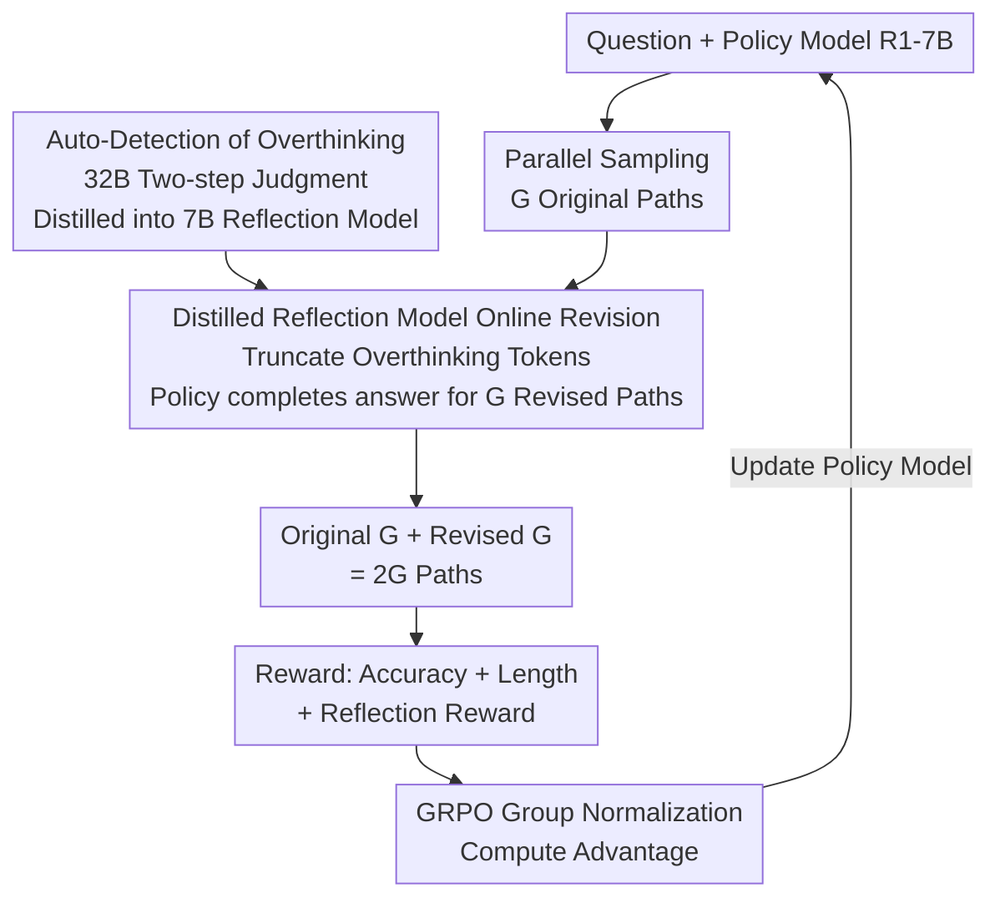

# REA-RL: Reflection-Aware Online Reinforcement Learning for Efficient Reasoning

**Conference**: ICLR 2026  
**arXiv**: [2505.19862](https://arxiv.org/abs/2505.19862)  
**Code**: [GitHub](https://github.com/hexuandeng/REA-RL)  
**Area**: Reinforcement Learning  
**Keywords**: Inference Overthinking, Reflection-Aware, Online RL, GRPO, Inference Efficiency

## TL;DR

The REA-RL framework is proposed to identify and truncate overthinking tokens online via a distilled small reflection model, generating revised paths. Combined with a reflection reward to prevent model degradation into naive Chain-of-Thought (CoT) during RL training, it achieves a 36% reduction in inference token overhead with zero accuracy loss on DeepSeek-R1-Distill-Qwen-7B.

## Background & Motivation

**Background**: Large Reasoning Models (LRMs) like DeepSeek-R1 and QwQ have achieved significant progress in complex tasks such as mathematical reasoning through the "deep thinking + self-reflection" paradigm. These models verify, reflect, and correct after generating answers, similar to human calculation. however, this capability introduces serious efficiency issues—models may reflect over 8 times even on simple elementary math problems, consuming thousands of tokens.

**Limitations of Prior Work**: Existing solutions to overthinking follow two main paths, each with fatal flaws. **Offline data methods** (e.g., SFT for short responses, Best-of-N sampling, or strong models for refined paths) suffer from data distribution shift: the gap between static datasets and evolving model policies increases during training. Moreover, data generation and filtering are computationally expensive. **Online RL + length reward methods** (e.g., length normalization in Kimi K1.5) solve distribution shift but cause models to lose reflection capabilities, degrading into naive CoT and leading to high error rates on complex problems.

**Key Challenge**: A fundamental conflict exists between length rewards and reflection quality. Reflection requires extra tokens ("wait", "but", "let me check"), while length rewards indiscriminately punish long outputs, failing to distinguish "valuable reflection" from "meaningless repetition." Without short yet correct responses as positive samples, models learn a crude "shorter is better" policy.

**Key Insight**: Two key observations are made: (1) Overthinking detection is not complex—it only requires identifying which segment contains the correct answer, a task a fine-tuned weak model can perform; (2) Parallel sampling + sequential revision is the computationally optimal test-time scaling strategy. This implies a low-cost small model can provide truncated revised paths online during training while specialized rewards protect reflection behavior.

**Core Idea**: Utilize a distilled 7B reflection model to truncate overthinking tokens online (solving the data issue), paired with a reflection keyword density reward to prevent degradation (solving the reward issue). These routes complement each other to balance efficiency and performance.

## Method

### Overall Architecture

REA-RL aims to prevent LRMs from reflecting excessively on simple problems without sacrificing necessary reflection on difficult ones. It adjusts two components within the standard GRPO framework. On the **data** side, after sampling $G$ paths in parallel, a small reflection model scans them to locate the first occurrence of the correct answer, truncates subsequent overthinking tokens, and lets the policy model complete a clean final answer. This creates $G$ revised paths, totaling $2G$ paths for optimization. On the **reward** side, a reflection reward is added to penalize responses with low reflection density, preventing the model from abandoning reflection to minimize length.

### Key Designs

**1. Automatic detection of overthinking: Defining redundancy as "parts after the first correct answer"**

To truncate overthinking, it must be defined. The "think" part is segmented into chunks, and Qwen2.5-32B-Instruct evaluates each chunk to see if it contains the correct answer. All content after the first chunk containing the answer is deemed overthinking. A two-step process (coarse screening followed by re-checking) is used to minimize misjudgment. After truncation, the "think" phase is forced to end, and the model provides a final answer with the "**Final Answer:**" prefix, limited to 16K tokens.

**2. Distilled reflection model: Compressing 32B two-step judgment into 7B one-step online revision**

The 32B model is too expensive for online RL. Instead, the 32B model labels chunks from R1-7B generated paths to create SFT data. This capability is distilled into Qwen2.5-7B-Instruct, which predicts chunk categories in a **single step**. During online training, the reflection model locates and truncates overthinking tokens (red) across $G$ paths, preserving valid reasoning (yellow), and completing the answer (blue) to produce revised paths $S^r$. This revision is **equivalent to applying a partial penalty to overthinking tokens**: if successful, length rewards ensure $a_i^r > a_i$, giving overthinking tokens a negative advantage. If the revision makes it incorrect, the path is discarded to avoid encouraging overthinking.

**3. Reflection reward: Protecting reflection against length reward erosion**

The reflection reward sets a "bottom line" rather than encouraging more reflection. Keyword density for reflection (e.g., "wait", "alternatively") is calculated:

$$D_i = N_{\text{Reflect}} / N_{\text{Token}}$$

Clusters of keywords are counted as one. Using the 0.2 quantile $D_{0.2}$ from training data as a threshold, the reward is:

$$R_{\text{Reflect}}(s_i) = \min(0,\ D_i / D_{0.2} - 1)$$

Only responses in the bottom 20% density are penalized. Additionally, the length reward from Kimi K1.5 is modified: incorrect answers receive 0 length reward (the original gave partial rewards, misleading models to prioritize shortness on difficult problems).

## Loss & Training

The total reward is the sum of three parts: $R = R_{\text{Acc}} + R_{\text{RLen}} + R_{\text{Reflect}}$. $R_{\text{Acc}}$ is the rule-based accuracy reward (1 for correct, 0 for incorrect); $R_{\text{RLen}}$ is the improved length reward ($\lambda = 1 - (len - min\_len)/(max\_len - min\_len)$ for correct answers, 0 otherwise); $R_{\text{Reflect}}$ is the reflection density reward. Advantages are computed via group normalization across $2G$ paths within GRPO. Training took ~120 hours on 3 NVIDIA A800 GPUs, adding ~50% time over standard GRPO due to sequential revision, though parallelized inference and training minimized idle time.

## Key Experimental Results

### Main Results (16K budget, comparison with baselines)

| Method | GSM8K↑ | Math500↑ | Gaokao23↑ | Amc23↑ | AIME24↑ | Avg Acc | Avg TR↓ |
|------|--------|----------|-----------|--------|---------|---------|---------|
| R1-7B (Original) | 91.66 | 92.00 | 81.82 | 88.12 | 48.33 | 80.39 | 100% |
| GRPO (Acc Reward Only) | 92.87 | 93.40 | 82.34 | 87.19 | 50.42 | 81.24 | 102% |
| GRPO + Kimi Length Reward | 85.97 | 88.40 | 72.21 | 87.81 | 50.00 | 76.88 | 57% |
| NoThink | 85.06 | 84.20 | 66.23 | 66.25 | 23.33 | 65.01 | 27% |
| ShorterBetter | 85.37 | 83.40 | 66.75 | 76.88 | 50.00 | 72.48 | 31% |
| DAST | 87.79 | 91.40 | 83.12 | 88.44 | 51.67 | 80.48 | 76% |
| Arora & Zanette | 90.45 | 93.20 | 77.14 | 86.88 | 48.33 | 79.20 | 71% |
| **REA-RL (Reflection Reward)** | **92.72** | **92.80** | **81.82** | **88.75** | **54.58** | **82.13** | **72%** |
| **REA-RL (Reflection Model)** | 89.23 | 92.40 | 79.74 | 88.12 | 47.92 | 79.48 | 52% |
| **REA-RL (Combined)** | 89.99 | 91.00 | 82.08 | 89.38 | 51.25 | **80.74** | **64%** |

### Ablation Study (Reflection model revision strategies, 16K budget)

| Revision Strategy | Avg Acc↑ | Avg TR↓ | Description |
|----------|----------|---------|------|
| Original R1-7B | 80.39 | 100% | No revision baseline |
| 7B Revise (Untrained) | 75.77 | 69.65% | Qwen-7B direct detection, 17% format errors |
| 32B Revise (No gold) | 80.61 | 75.65% | Qwen-32B two-step, good but high cost |
| Reflection Model-Weak | 80.95 | 88.03% | Truncate at 2nd correct answer, conservative |
| Reflection Model-Normal | 80.62 | 83.50% | Truncate at 1st correct answer, used in training |
| Reflection Model-Strong | 80.14 | 78.52% | Truncate when prob > 0.25, aggressive |
| Fixed Trunc (Proportional) | 76.86 | 79.68% | Fixed ratio truncation, significant drop |
| GRPO Gen8 (Parallel only) | 81.35 | 97.55% | 8-way parallel sampling, no efficiency gain |

### Key Findings

- **Length rewards are a double-edged sword**: Using Kimi K1.5 length rewards alone dropped average accuracy from 80.39 to 76.88. Performance plummeted on simple problems (GSM8K -5.69), showing models lost necessary reasoning steps.
- **Reflection density is a direct indicator of degradation**: After length reward training, the reflection interval on GSM8K surged from 105.48 to 813.96 tokens, meaning the model almost stopped reflecting. REA-RL (Combined) maintained it at 150.87.
- **Reflection models and rewards are complementary, not synergistic**: Reflection models excel at compression (TR 52%), while reflection rewards excel at maintaining performance (Max Acc 82.13). The combined approach balances both.
- **Difficulty Adaptability**: Ours reduced reflection frequency by 22% and increased efficiency by 45% on simple tasks but only reduced them by 4% and 27% on difficult tasks, learning a "think less for simple, think more for hard" strategy.
- **Online training significantly outperforms offline**: RPO (offline) saw accuracy drops on Amc23 and AIME24, whereas online REA-RL remained robust, confirming distribution shift as a bottleneck for offline methods.

## Highlights & Insights

- **Distilled Overthinking Detection**: Distilling 32B complex detection into a 7B step-one model makes online revision feasible. This "large model labels, small model executes" paradigm is superior to direct prompting of small models.
- **"Bottom-line Protection" Reward Design**: Using the 0.2 quantile as a threshold avoids the side effects of over-reflection. Any quantile $\leq 0.2$ works, allowing flexible tuning between efficiency and accuracy.
- **Theoretical Perspective on Revision**: Revision is equivalent to applying negative partial advantages to overthinking tokens and positive ones to revised ones. This explains why failed revisions must be discarded to avoid encouraging overthinking.
- **Training Dynamics**: Truncation causes an initial performance drop, but as the model learns to penalize only overthinking tokens, it recovers and surpasses the baseline. This suggests the method requires sufficient training steps to converge.

## Limitations & Future Work

- **Validated on Distilled 7B Only**: Not yet tested on full-scale native LRMs (like DeepSeek-R1 full), leaving its efficacy on massive models unconfirmed.
- **Dependency on LLM Judgment**: Detection relies on the LLM identifying correct answers, which might not be applicable to open-ended tasks (e.g., code generation) without redesigned criteria.
- **Keyword List Limitations**: Reflection rewards rely on English keywords, which may fail for multilingual models or different reasoning styles.
- **Non-Synergistic Gains**: The conflict between the reflection model (cutting overthinking) and the reward (preserving reflection) results in a compromise. Future work could explore dynamic weighting.

## Related Work & Insights

- **vs NoThink**: NoThink skips all reasoning (TR 27%) but accuracy drops to 65.01. Ours selectively retains valid reasoning.
- **vs DAST**: DAST uses difficulty-based length budgets but requires a difficulty estimator. Ours naturally emerges with difficulty-aware capabilities through RL.
- **vs ShorterBetter**: ShorterBetter uses the shortest correct response as a anchor, leading to over-compression (Acc 72.48). Ours is more moderate, only truncating post-answer redundancy.
- **vs Kimi K1.5 Length Reward**: Ours improves the reward by setting it to 0 for incorrect answers, avoiding the encouragement of short, wrong outputs on hard problems.

## Rating

- Novelty: ⭐⭐⭐⭐ Systematic two-dimensional solution, though components are not entirely new.
- Experimental Thoroughness: ⭐⭐⭐⭐⭐ 5 datasets, ablation studies, density analysis, and multiple baseline comparisons.
- Writing Quality: ⭐⭐⭐⭐⭐ Clear logic from Figure 1 cases to systematic failure analysis and final solution construction.
- Value: ⭐⭐⭐⭐⭐ High practical value with 36% efficiency gain at zero cost, plus transferable theoretical insights.

<!-- RELATED:START -->

## Related Papers

- [\[ICLR 2026\] Stop Unnecessary Reflection: Training LRMs for Efficient Reasoning with Adaptive Reflection and Length Coordinated Penalty](stop_unnecessary_reflection_training_lrms_for_efficient_reasoning_with_adaptive_.md)
- [\[ICLR 2026\] FAPO: Flawed-Aware Policy Optimization for Efficient and Reliable Reasoning](fapo_flawed-aware_policy_optimization_for_efficient_and_reliable_reasoning.md)
- [\[ICLR 2026\] RL for Reasoning by Adaptively Revealing Rationales](rl_for_reasoning_by_adaptively_revealing_rationales.md)
- [\[ICLR 2026\] QuRL: Low-Precision Reinforcement Learning for Efficient Reasoning](qurl_low-precision_reinforcement_learning_for_efficient_reasoning.md)
- [\[ICLR 2026\] A$^2$Search: Ambiguity-Aware Question Answering with Reinforcement Learning](a2search_ambiguity-aware_question_answering_with_reinforcement_learning.md)

<!-- RELATED:END -->
