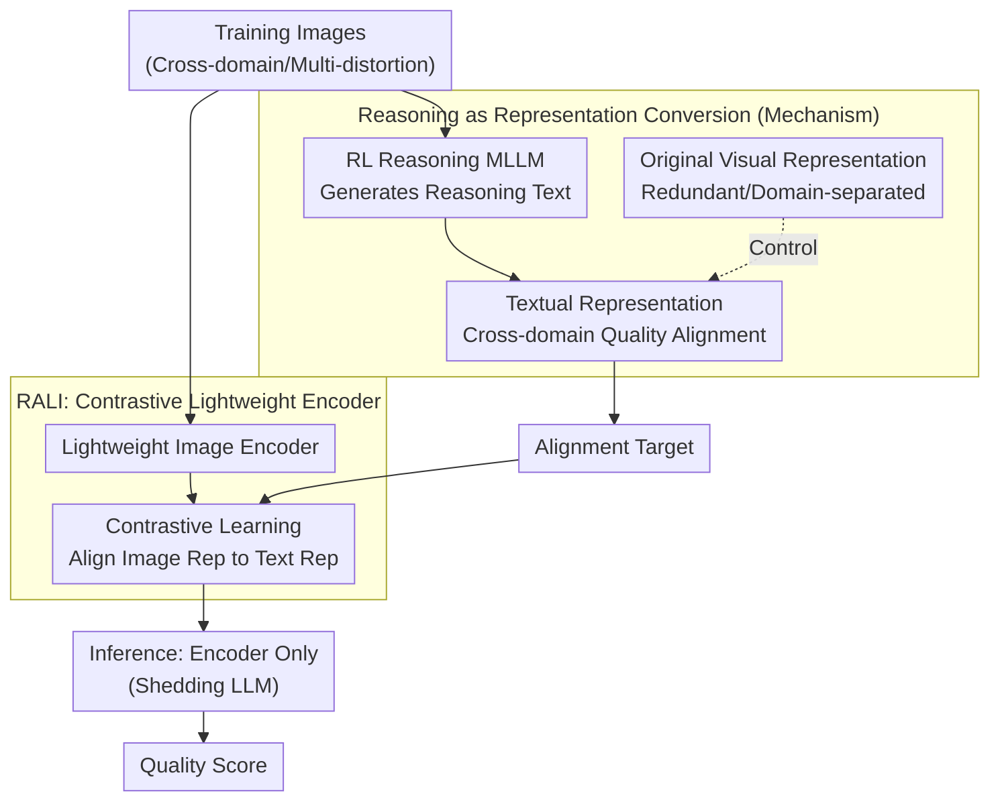

# Reasoning as Representation: Rethinking Visual Reinforcement Learning in Image Quality Assessment

**Conference**: ICLR 2026 (Oral)  
**arXiv**: [2510.11369](https://arxiv.org/abs/2510.11369)  
**Code**: None  
**Area**: Reinforcement Learning / Image Quality Assessment  
**Keywords**: Image Quality Assessment, Reinforcement Learning, Reasoning as Representation, Contrastive Learning, Cross-domain Generalization

## TL;DR

Systematic experiments reveal the underlying mechanism behind the generalization capability of RL-trained reasoning IQA models—the reasoning process essentially converts redundant visual representations into compact, cross-domain aligned textual representations. Based on this, the RALI algorithm is proposed, which directly aligns images with these textual representations via contrastive learning, achieving comparable generalization performance with less than 5% of the parameters and inference time.

## Background & Motivation

Image Quality Assessment (IQA) is a fundamental task in computer vision aimed at automatically evaluating the visual quality of images. Recently, reasoning-based IQA models trained via Reinforcement Learning (RL) using Multimodal Large Language Models (MLLMs) have demonstrated **superior generalization capabilities**, maintaining high performance across unseen distortion types and datasets.

However, two critical questions remain unresolved:

**Mechanism Ambiguity**: **Why** do these reasoning-based IQA models generalize? What is the specific link between the reasoning capability endowed by RL training and generalization? Existing research remains at the empirical level—knowing it is "effective" without knowing "why."

**Efficiency Bottleneck**: Despite superior performance, the inference cost of these models is extremely high—requiring the loading of full MLLMs and autoregressive text generation. The energy consumption and latency are **several orders of magnitude higher** than traditional IQA methods, severely limiting practical deployment.

The core motivation of this work is: **if the fundamental reason for the generalization of reasoning-based IQA models can be understood, it may be possible to retain that generalization capability while significantly reducing computational overhead.**

## Method

### Overall Architecture

The study aims to explain a phenomenon observed but not fully elucidated by prior work: **why** RL-trained reasoning IQA models maintain high performance on unseen distortions and datasets. The work proceeds in two steps. The first is **Diagnosis**—through a series of controlled experiments comparing pre- and post-RL training alongside textual and visual representation distributions across domains, the source of generalization is pinpointed to a specific mechanism: Reasoning-as-Representation-Conversion. The second is **Implementation**—having identified the mechanism, a lightweight alternative, RALI (Reasoning-Aligned Lightweight IQA), is designed to bypass the full MLLM. It uses a trained reasoning MLLM to generate cross-domain aligned textual representations once as targets, then employs contrastive learning to pull a lightweight image encoder toward these targets. At inference, only the encoder remains, inheriting cross-domain generalization with less than 5% of the parameters and time. Thus, the methodology is not just a new network, but a logical chain of "mechanism analysis first, efficiency conversion second."

### Key Designs

**1. Reasoning as Representation Conversion: Generalization stems from cross-domain alignment of textual representations rather than the reasoning content itself.**

The reason reasoning-based IQA models generalize has previously been limited to "empirical effectiveness." This paper provides a mechanistic answer: through RL training, the MLLM utilizes its reasoning capability to convert **redundant visual representations** into **compact, cross-domain aligned textual representations**. This conversion is the true source of generalization. Evidence is three-fold: original visual representations (e.g., ViT features) are high-dimensional and redundant, with features of different distortions and domains separated; the reasoning process "compresses" this visual information into textual representation space; and comparing pre- and post-RL training reveals that while SFT (Supervised Fine-Tuning) textual representations remain domain-separated, **image quality concepts from different domains align in the textual space only after RL training**. Similar quality levels across domains are mapped to proximal locations. This alignment allows the model to correctly judge quality in new domains. Counter-intuitively, it is not the literal content written in the reasoning chain that matters, but the restructuring of the representation space that occurs alongside it. This discovery provides the opportunity for efficiency—if reasoning is merely a "mode of representation conversion," it can be replaced by a more efficient method.

**2. RALI: Using contrastive learning to "weld" cross-domain alignment into a lightweight image encoder, completely discarding the LLM at inference.**

Following the insight that generalization stems from textual alignment, it is unnecessary to run the MLLM for every inference. Image representations can be directly aligned with the pre-aligned textual representations. RALI uses **contrastive learning** in three steps: First, a trained RL reasoning MLLM generates text and extracts its representation as the target for training images. Second, a lightweight image encoder is trained via contrastive learning to pull image representations toward these textual representations (pulling together cross-domain representations of identical quality and pushing away different ones). During inference, only this lightweight encoder is required, **eliminating the need for LLM loading and autoregressive text generation.**

Importantly, RALI is a specialized form of knowledge distillation, but it differs from conventional ones: while standard distillation aligns teacher predictions/logits, RALI aligns the **cross-domain alignment structure of the representation space** itself. The contrastive objective ensures the student learns not just "the score for an image," but the correspondence of quality concepts across domains—the exact mechanism for cross-domain transfer. Reasoning is treated as a one-time "intermediate tool" during training, and its output (aligned target representations) is solidified into the image encoder, reducing deployment cost from a full MLLM to a single lightweight forward pass.

### Loss & Training

- **Teacher Model**: RL-trained reasoning MLLM (e.g., Q-Instruct), used to generate cross-domain aligned textual representations as alignment targets.
- **Student Model**: Lightweight visual encoder with less than 5% of the teacher's parameters, aligned to the teacher's textual representations via contrastive learning.
- **Contrastive Objective**: Pull together representations of images with identical quality across domains and push apart those with different quality, allowing the student to inherit the cross-domain alignment structure.
- **LLM-free Inference**: The test phase requires only a single forward pass of the student encoder, completely eliminating LLM loading and text generation overhead.

## Key Experimental Results

### Main Results

Comparison of cross-domain generalization performance in image quality scoring tasks:

| Method | Generalization | Params | Inference Time | Description |
|------|---------|---------|---------|------|
| RL-based Reasoning MLLM | SOTA | 100% | 100% | Full model + Reasoning |
| RALI | **Comparable** | **<5%** | **<5%** | Visual encoder only |
| Traditional IQA | Poor | Small | Fast | Lacks generalization |
| Non-reasoning MLLM | Medium | Large | Medium | Lacks cross-domain alignment |

### Ablation Study

| Configuration | Key Metric | Description |
|------|---------|------|
| Visual Space Analysis | Domain-separated | Original visual features lack cross-domain alignment |
| Text Rep (Pre-RL) | Domain-separated | SFT phase text representations are not aligned |
| Text Rep (Post-RL) | Domain-aligned | RL training achieves cross-domain alignment |
| SFT-only Alignment | Poor Gen. | Proves RL-driven alignment is critical |
| RL Alignment (RALI) | High Gen. | Successfully inherits cross-domain generalization |
| W/O Contrastive Loss | Lower Gen. | Contrastive objective is key to alignment |

### Key Findings

1. **Reasoning's True Role is Representation Conversion**: The textual content in the reasoning chain is not the key to generalization; rather, it is the alignment across domains naturally produced in the textual representation space during the reasoning process. This challenges the intuition that "reasoning content = performance source."

2. **Unique Contribution of RL Training**: Comparing textual representations before and after RL shows that RL training significantly improves cross-domain alignment. While SFT representations are domain-separated, the RL phase realizes true cross-domain alignment.

3. **Massive Efficiency Gain**: RALI reduces model parameters and inference time to under 5% of the original while maintaining comparable generalization, making deployment in resource-constrained scenarios feasible.

4. **No LLM Required at Inference**: Completely avoids the overhead of LLM loading and text generation, simplifying the deployment pipeline to a single forward pass of a lightweight visual encoder.

## Highlights & Insights

1. **Profound Mechanistic Insight**: The greatest contribution is the "Reasoning as Representation Conversion" insight. This finding redefines the understanding of generalization in reasoning-based models—reasoning is a **means** rather than an **end**; what matters is the implicit restructuring of the representation space.

2. **Closed Loop from Theory to Algorithm**: The work establishes a theoretical understanding (why reasoning models generalize) and then designs an efficient alternative (RALI) based on that theory, forming a complete research loop. This paradigm is instructive for other fields.

3. **ICLR 2026 Oral Quality**: As an Oral paper, it provides an insight capable of shifting the research direction of the field—if reasoning is just representation conversion, then perhaps generalization in all reasoning models can be "distilled" similarly.

4. **New Understanding of RL Training**: RL's role in reasoning models is not just "teaching reasoning," but fundamentally "restructuring the representation space" to align cross-domain concepts. This offers a new perspective on the essence of RL training.

5. **Practical Deployment Value**: A >20x efficiency improvement enables IQA models to be deployed on edge devices, directly facilitating practical applications.

## Limitations & Future Work

1. **Task-Specific Validation**: The "Reasoning = Representation Conversion" insight is only validated on IQA. Whether this generalizes to more complex tasks (e.g., mathematical reasoning, code generation) is unknown. Reasoning may play a more substantive role in more complex tasks.

2. **Scoring vs. Description**: Current RALI focuses on quality scoring (regression). For scenarios requiring detailed quality descriptions, a full MLLM is still necessary.

3. **Teacher Model Dependency**: RALI's training depends on the quality of the RL-trained teacher MLLM. If the teacher is suboptimal, the student's generalization will be limited.

4. **Contrastive Learning Bottlenecks**: The effectiveness of contrastive learning depends on negative sample quality and diversity; cross-domain alignment quality may be influenced by the training data distribution.

5. **Loss of Interpretability**: By removing the reasoning process, RALI loses the interpretability advantage—it cannot provide textual evidence or reasons for the quality assessment.

## Related Work & Insights

- **Reasoning-based IQA**: Methods like Q-Instruct and Q-Boost that use MLLM reasoning for quality assessment.
- **Visual Reinforcement Learning**: Application of R1-style RL training in visual tasks.
- **Knowledge Distillation**: Transferring knowledge from large to small models; RALI can be viewed as the distillation of representation space structures.
- **Contrastive Learning**: Vision-language alignment methods like CLIP, specialized here for IQA scenarios.
- **Traditional IQA**: From handcrafted feature methods (NIQE, BRISQUE) to deep learning methods (MUSIQ, DBCNN).
- **Inspirational Direction**: The **"Reasoning as Representation Conversion"** insight may apply to understanding the success of other reasoning-based models and warrants validation across more domains.

## Rating

- Novelty: ⭐⭐⭐⭐⭐ (The "Reasoning as Representation Conversion" is a highly insightful discovery that shifts the paradigm for understanding reasoning models.)
- Experimental Thoroughness: ⭐⭐⭐⭐⭐ (The chain from mechanistic analysis to algorithmic design is complete and rigorous, warranting an Oral.)
- Writing Quality: ⭐⭐⭐⭐⭐ (The argumentation logic is clear, with a natural transition from insight to algorithm.)
- Value: ⭐⭐⭐⭐⭐ (Provides both profound theoretical contributions and massive practical value with >20x efficiency gains.)

<!-- RELATED:START -->

## Related Papers

- [\[ICLR 2026\] PreferThinker: Reasoning-based Personalized Image Preference Assessment](preferthinker_reasoning-based_personalized_image_preference_assessment.md)
- [\[ICLR 2026\] DiVE-k: Differential Visual Reasoning for Fine-grained Image Recognition](dive-k_differential_visual_reasoning_for_fine-grained_image_recognition.md)
- [\[CVPR 2026\] Saliency-Guided Representation with Consistency Policy Learning for Visual Unsupervised Reinforcement Learning](../../CVPR2026/reinforcement_learning/saliency-guided_representation_with_consistency_policy_learning_for_visual_unsup.md)
- [\[ICLR 2026\] GRACE: Generative Representation Learning via Contrastive Policy Optimization](grace_generative_representation_learning_via_contrastive_policy_optimization.md)
- [\[ICLR 2026\] Stackelberg Coupling of Online Representation Learning and Reinforcement Learning](stackelberg_coupling_of_online_representation_learning_and_reinforcement_learnin.md)

<!-- RELATED:END -->
