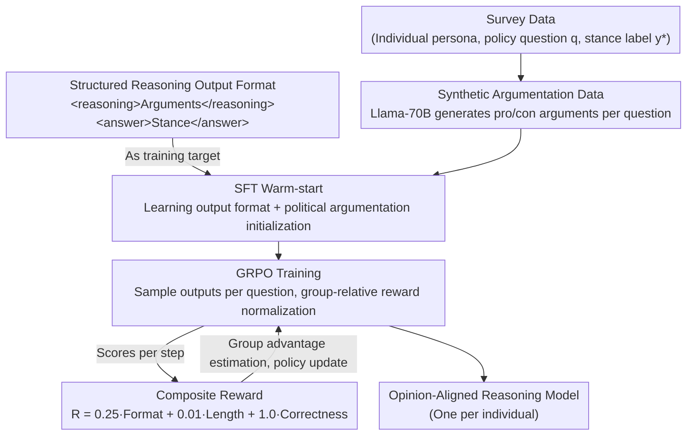

# Reasoning Boosts Opinion Alignment in LLMs

**Conference**: ICLR 2026  
**arXiv**: [2603.01214](https://arxiv.org/abs/2603.01214)  
**Code**: [GitHub](https://github.com/ETH-DISCO/reasoning-boosts-llm-alignment)  
**Area**: Reinforcement Learning  
**Keywords**: opinion alignment, GRPO, political reasoning, survey data, digital democracy

## TL;DR
LLMs are trained via GRPO reinforcement learning to align with individual political opinions through structured reasoning. SFT+GRPO consistently outperforms ICL and ORPO baselines on datasets from the US, Germany, and Switzerland, while systematically revealing fundamental difficulties in predicting neutral stances and right-wing biases.

## Background & Motivation

**Background**: Modeling political opinions is of significant value to digital democracy. While LLMs have been widely used to simulate group political tendencies, they primarily rely on demographic prompts (e.g., "You are a Democrat"), which suffer from three major defects: lack of representativeness, poor controllability, and low consistency.

**Limitations of Prior Work**: 1) Demographic prompts fail to simulate individual-level preferences due to high intra-group variance; 2) Interview transcript methods (Park et al. 2024) are accurate but incur prohibitive data collection costs; 3) Political survey data (ANES/VAA) is abundant but often contains only stance labels without reasoning chains, requiring models to learn the reasoning process autonomously.

**Key Challenge**: The tension between the statistical nature and limited causal understanding of LLMs versus the requirement to faithfully reflect diverse political opinions.

**Goal**: Can LLMs learn to "reason before answering" through RL training to improve individual-level political opinion alignment?

**Key Insight**: Treating opinion formation as a reasoning problem—drawing from the success of GRPO in mathematical reasoning and migrating it to political reasoning scenarios.

**Core Idea**: Political survey data + GRPO rewarding correct stances + SFT warm-start for reasoning formats = reasoning-based individual opinion alignment.

## Method

### Overall Architecture
The paper addresses whether LLMs can align with the political stance of a **specific individual** (e.g., a voter, a party, or a candidate) through explicit reasoning rather than relying on demographic prompts. It reframes "forming an opinion" as a reasoning problem where the model first generates arguments and then provides a stance, receiving rewards for correct stances. The pipeline consists of two stages: first, SFT is used to teach the model the "reason-then-answer" output format and initialize political argumentation capabilities; then, GRPO is applied using stance correctness as a reward signal to refine the quality of reasoning. A separate model is trained for each individual, with the system prompt containing only a country label and no explicit persona descriptions—individual preferences are implicitly encoded by correctly answering survey questions.

### Key Designs

**1. Structured Reasoning Output Format: Transforming Stance Judgment into an Optimizable Reasoning Process**

A challenge with survey data is the presence of stance labels without reasoning chains, leaving the model with no reasoning process to emulate. The authors force the model to output following the format `<reasoning>[reasoning text]</reasoning><answer>[stance]</answer>`, explicitly decoupling the reasoning process. Since no supervised labels exist for reasoning, its quality is indirectly optimized—the model explores which arguments lead to a correct `<answer>` under reward signals. This approach encourages the model to organize arguments explicitly rather than relying on intuitive pattern matching, which is a common source of ideological bias. This format serves as the optimization objective for both training stages.

**2. SFT Warm-start + Synthetic Argumentation Data: Initializing Format and Argumentation before RL**

Running GRPO from scratch requires the model to learn both the format and reasoning simultaneously, resulting in sparse rewards and slow convergence (experiments showed GRPO-only performs significantly worse than SFT+GRPO). The authors use Llama-70B to generate pro/con arguments for each policy question to create SFT data for warm-starting. This stage achieves two goals: ensuring the model masters the output format (reducing the optimization burden for GRPO) and providing a reasonable initialization for political reasoning, allowing subsequent GRPO to focus on refining stance correctness with more stable training dynamics.

**3. Composite Reward Function: Constraining Format, Length, and Correctness Simultaneously**

After warm-starting, GRPO uses a weighted composite reward to drive stance accuracy:

$$R = \alpha_1 R_{\text{format}} + \alpha_2 R_{\text{length}} + \alpha_3 R_{\text{correct}}$$

where $R_{\text{format}}$ checks for all four XML tags (max 4 points), $R_{\text{length}} = -|L - L^*|$ penalizes length deviations from target $L^*$, and $R_{\text{correct}} = \mathbb{1}[y_i = y_i^*]$ grants 1 point for alignment with the survey answer. Weights are set to $\alpha_1=0.25, \alpha_2=0.01, \alpha_3=1.0$, making correctness the primary objective while keeping format as a hard constraint and length as a minor adjustment.

### Loss & Training

GRPO (Group Relative Policy Optimization) samples a group of outputs for each prompt and estimates the advantage using group-relative reward normalization (subtracting the mean and dividing by the standard deviation), replacing the value function in traditional PPO. Fine-tuning uses LoRA ($r=32, \alpha=32$) with 4-bit quantization. The process involves 800 SFT steps followed by 800 GRPO steps, with a group size of 8, $\beta=0$, and temperature $T=1.0$.

## Key Experimental Results

### Main Results (Macro-F1 %, 8 runs, T=1.0)

| Method | smartvote (CH) | WoM (DE) | ANES (US) |
|------|:---:|:---:|:---:|
| SFT+GRPO (Magistral 24B) | **70.73** | **53.21** | **45.43** |
| SFT (Magistral 24B) | 67.63 | 51.86 | 39.15 |
| GRPO only (Magistral 24B) | 60.56 | 51.00 | 43.79 |
| SFT+GRPO (Llama 3.1 8B) | 66.88 | 52.53 | 40.66 |
| ICL (Magistral 24B) | 66.16 | 26.19 | 19.23 |
| ORPO | 23.31 | 24.73 | 24.25 |
| Random | 50.0 | 33.33 | 33.33 |

### Ablation Study — Ideological Bias Analysis

| Political Group | smartvote F1 | WoM F1 | ANES F1 | Description |
|----------|:---:|:---:|:---:|------|
| Left | High | High | Relatively High | Easiest for the model to align |
| Center | Medium | High | Medium | Intermediate level |
| Right | Low | Medium | Low | Systematically the worst |

### Key Findings
- **SFT+GRPO is Consistently Optimal**: It outperforms or matches SFT in 9/9 model-dataset combinations with statistical significance (Welch t-test + Bonferroni correction).
- **Neutral is a "Hard Nut to Crack"**: Neutral recall is lowest on ANES; the neutral base rate shows a significant negative correlation ($r=-0.59$) with F1. Right-wing groups respond with "Neutral" most often, leading to the greatest performance degradation.
- **Reasoning Flip Phenomenon**: Post-training models use similar arguments (e.g., "equal opportunity") to support opposite stances—the semantic content of reasoning is consistent, but the framing differs.
- **Answer Inversion Experiment**: Training after flipping all smartvote answers improved F1 for right-wing candidates but still failed to reach the original levels of the left-wing, suggesting left-wing preferences might be inherently easier to model.
- **PCA Space Shift**: After training, agents shift toward the center-right and conservative directions in the smartvote PCA space (contrary to the left-liberal bias reported in literature). This is a result of GRPO alignment rather than base model bias.
- **SFT Data Bias Impact**: SFT data with progressive bias severely harms performance for right-wing candidates but does not necessarily benefit the left, suggesting bias primarily hurts the disadvantaged side.

## Highlights & Insights
- **Reframing Political Opinion Alignment as a Reasoning Problem**: Moving beyond demographic proxies to let the model "understand" individual stances through reasoning—a conceptual paradigm shift.
- **Validation Across Three Countries and Systems**: Tested on smartvote (binary Yes/No), WoM (3-class + multi-election aggregation), and ANES (heterogeneous formats requiring recoding), demonstrating strong generalization.
- **Deep Insights into Ideological Asymmetry**: Right-wing preferences are systematically harder to learn, potentially due to pre-training corpus bias or a more complex statistical structure in right-wing stances.
- **Asymmetric Effects of SFT Data Bias**: Bias harms the disadvantaged side more than it benefits the advantaged side, offering a warning for the design of trustworthy AI systems.

## Limitations & Future Work
- Training a separate model for each individual results in $O(N)$ computational costs that do not scale; future work should explore persona-conditioned single-model architectures.
- The test sets are very small (12-30 questions), limiting statistical confidence.
- Simplifying to 3-class {Yes, Neutral, No} labels loses fine-grained information from original Likert scales.
- Result sensitivity to ANES recoding schemes (conservative vs. aggressive).
- The best F1 is only ~70%, indicating a significant gap remains before achieving "faithful digital twins."
- Zero-shot generalization from limited survey data to new policy issues remains unexplored.

## Related Work & Insights
- **vs. Santurkar et al. (2023) Demographic Prompting**: While they showed LLM default opinions do not represent the public, this work bypasses demographics to align with individuals using survey data.
- **vs. Park et al. (2024) Interview Transcript Modeling**: Their rich-text personas are accurate but expensive to obtain; this work provides a lightweight alternative using structured survey data.
- **vs. DeepSeek-R1 (2025) GRPO for Mathematical Reasoning**: GRPO's success in math is validated here for political reasoning, albeit with less pronounced effects.

## Rating
- Novelty: ⭐⭐⭐⭐ Applying GRPO to political reasoning is a novel application; the ideological bias analysis is profound.
- Experimental Thoroughness: ⭐⭐⭐⭐ 3 models × 3 datasets, ideological analysis, answer inversion, and SFT bias experiments are substantial.
- Writing Quality: ⭐⭐⭐⭐ Clear structure; PCA visualizations and reasoning examples are persuasive.
- Value: ⭐⭐⭐ Interesting direction, though scalability is questionable; the finding that right-wing preferences are harder to learn has social significance.

<!-- RELATED:START -->

## Related Papers

- [\[ICLR 2026\] Reinforcement Learning with Verifiable Rewards Implicitly Incentivizes Correct Reasoning in Base LLMs](reinforcement_learning_with_verifiable_rewards_implicitly_incentivizes_correct_r.md)
- [\[ICLR 2026\] AbstRaL: Augmenting LLMs' Reasoning by Reinforcing Abstract Thinking](abstral_augmenting_llms_reasoning_by_reinforcing_abstract_thinking.md)
- [\[ICLR 2026\] QuestA: Expanding Reasoning Capacity in LLMs via Question Augmentation](questa_expanding_reasoning_capacity_in_llms_via_question_augmentation.md)
- [\[ICLR 2026\] RL Squeezes, SFT Expands: A Comparative Study of Reasoning LLMs](rl_squeezes_sft_expands_a_comparative_study_of_reasoning_llms.md)
- [\[ICLR 2026\] Boosting Multi-Domain Reasoning of LLMs via Curvature-Guided Policy Optimization](boosting_multi-domain_reasoning_of_llms_via_curvature-guided_policy_optimization.md)

<!-- RELATED:END -->
