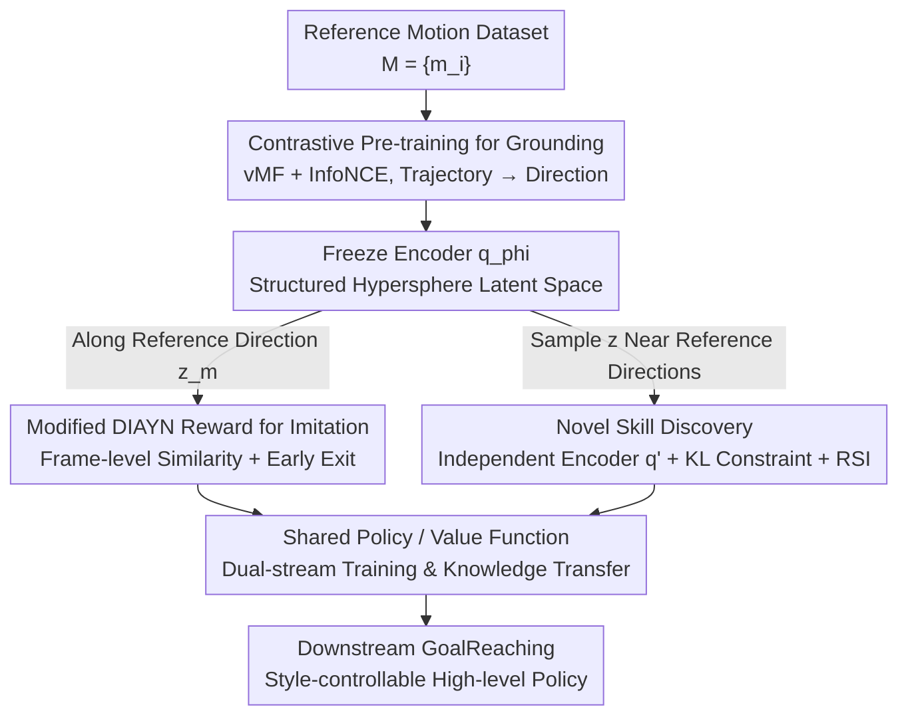

# Reference Grounded Skill Discovery

**Conference**: ICLR 2026  
**OpenReview**: [https://openreview.net/forum?id=IaGf8Eh5Uo](https://openreview.net/forum?id=IaGf8Eh5Uo)  
**Code**: TBD (Project page: seungeunrho.github.io/projects/RGSD)  
**Area**: Reinforcement Learning / Unsupervised Skill Discovery  
**Keywords**: Skill Discovery, High-DoF Control, Contrastive Learning, Imitation Learning, Humanoid Robots

## TL;DR
RGSD utilizes reference motion data to first "ground" the latent skill space onto a semantically meaningful unit hypersphere (via contrastive pre-training). It then performs simultaneous imitation and exploration within this structured space, successfully scaling unsupervised skill discovery to a 69-DoF SMPL humanoid. This enables the high-fidelity reproduction of walking, running, sidestepping, and punching, while discovering new style-consistent variants.

## Background & Motivation

**Background**: The goal of unsupervised skill discovery (USD) is to automatically learn a set of reusable skills $z$ in an environment without rewards, such that different latent variables $z$ induce distinct behaviors. Prevailing approaches maximize the mutual information $I(S;Z)$ between latent variables and visited states, exemplified by DIAYN and METRA (which uses Wasserstein Dependency Measure, WDM, to explicitly increase skill diversity). These methods perform well in low-DoF environments like HalfCheetah, quadrupeds, or simple robotic arms.

**Limitations of Prior Work**: USD typically fails when applied to high-DoF agents, such as a 69-DoF humanoid. As degrees of freedom increase, the exploration space expands exponentially, while the "semantically meaningful" skill manifold constitutes only a tiny fraction. The paper demonstrates that the SOTA method METRA, when applied to SMPL, learns "skills" that are merely unstructured random jittering of arms, legs, torso, and head—diverse, but useless for realistic tasks.

**Key Challenge**: High-quality skills must satisfy two conflicting requirements: **Diversity** (covering a broad range of downstream tasks) and **Semantic Meaningfulness** (as downstream tasks are described semantically, e.g., "turn left," "step back"). Relying purely on online exploration to find such skills in high-dimensional spaces is nearly impossible. Existing methods that inject semantics into USD (e.g., LGSD using LLMs, DoDont using video) only provide high-level weak guidance and still fail to scale to high-DoF systems.

**Goal / Key Insight**: The authors propose that to tame the curse of dimensionality, one must **apriori** construct a semantically meaningful latent skill space and kemudian constrain exploration within it. While standard USD follows the sequence of "explore first, then induce latent space," RGSD reverses this: it first grounds the latent space using reference motion data and then explores within it.

**Core Idea**: By using contrastive learning to map each reference trajectory to a unique direction on a hypersphere, sampling $z$ along a reference direction triggers imitation, while sampling $z$ between directions facilitates the discovery of new skills. This two-stage paradigm (self-supervised pre-training followed by RL fine-tuning) is likened by the authors to the training pipeline of Large Language Models (LLMs).

## Method

### Overall Architecture

RGSD divides skill discovery into two phases. **Phase 1 (Pre-training)**: Given a set of reference motion trajectories $M=\{m_i\}$, a contrastive encoder $q_\phi(z\mid s)$ is trained to map all states of a single trajectory to the same direction on a hypersphere, while mapping different trajectories to different directions. This step is entirely offline and interaction-free, resulting in a "grounded" latent space. **Phase 2 (Parallel Training)**: $q_\phi$ is frozen, and imitation and discovery processes are run concurrently. The imitation stream conditions the policy on the average embedding $z_m$ of a reference motion, using a reward derived from the DIAYN reward to force reproduction. The discovery stream samples $z$ near reference directions to explore semantically related novel behaviors. Both streams share the same policy, value function, and reward formulation, allowing for stable knowledge transfer.

### Key Designs

**1. Contrastive Pre-training to Ground the Latent Space on a Hypersphere**

This step addresses the difficulty of finding semantic manifolds through exploration. Instead of summarizing the latent space after exploration, the space is structured using data first. The encoder $q_\phi(z\mid s)$ maps states to a unit hypersphere $\mathcal{Z}=\{v\in\mathbb{R}^k:\|v\|_2=1\}$, modeled as a von Mises–Fisher (vMF) distribution $q_\phi(z\mid s)\propto\exp(\kappa\,\mu_\phi(s)^\top z)$, where $\mu_\phi(s)$ is the mean direction and $\kappa$ is a fixed concentration parameter. Training uses InfoNCE: positive pairs are states from the same trajectory, and negative pairs are from different trajectories:

$$\mathcal{L}_{\text{InfoNCE}} = -\log\frac{\exp(\mathrm{sim}(z_a,z_+)/T)}{\exp(\mathrm{sim}(z_a,z_+)/T)+\sum_j\exp(\mathrm{sim}(z_a,z_j^-)/T)}$$

where $\mathrm{sim}(z_i,z_j)=z_i^\top z_j$ is cosine similarity and $T=1/\kappa$. This pulls states within the same motion toward the same direction and pushes different motions apart. A critical property is **within-motion alignment**: after convergence, every state $s$ in a motion $m$ has an embedding pointing in the same direction (proven in Appendix C), which enables treating the reward as an imitation signal.

**2. Adapting DIAYN Reward into an Imitation Reward**

After freezing $q_\phi$, the imitation phase reuses the DIAYN reward $r_z=-\log p(z)+\log q_\phi(z\mid s)$ instead of a separate imitation loss. The embedding of a motion $m$ is defined as the mean of its state embeddings $z_m=\frac{1}{l}\sum_{s\in m}\mu_\phi(s)$. Due to within-motion alignment, $z_m$ should ideally align with the embedding of any single frame in that motion. Conditioning the policy on $z_m$ and substituting the vMF form, the reward simplifies to:

$$r(s,z_m) = -\log p(z) + \log q_\phi(z_m\mid s) = C + \kappa\,\mu_\phi(s)^\top z_m$$

where $C, \kappa, \phi$ are fixed. Intuitively, the reward depends on the cosine similarity between the current state embedding $\mu_\phi(s)$ and the target motion embedding $z_m$. This serves as **feature-level imitation in the learned latent space**, contrasting with methods like DeepMimic that calculate similarity at the joint level. The authors prove (Appendix D.1) that under the alignment assumption, this reward is maximized by the reference states and is locally quasi-concave. **Early Exit** is used to terminate episodes if Cartesian error exceeds a threshold, ensuring the reward acts as a valid imitation target.

**3. Discovering New Skills Between Reference Directions**

The discovery phase follows DIAYN but with three modifications for stability and semantic consistency. First, to protect the grounded space, an **independent encoder** $q'_\phi$ is copied from $q_\phi$ and trained, constrained by a KL divergence loss to prevent it from deviating too far. Second, **imitation and discovery are trained in parallel** with a shared policy and value function, allowing high-fidelity behavior knowledge to transfer to discovery. Third, **Reference State Initialization (RSI)** is used, where initial states are sampled from reference motions to ensure the imitation and discovery skill sets overlap in the state distribution. Sampling follows a ratio $p$: with probability $p$, an RSI-sampled motion embedding $\mu_\phi^-(m)$ is used (imitation); with probability $1-p$, normalized Gaussian noise $k/\|k\|,\ k\sim\mathcal{N}(0,I)$ is used (discovery). At test time, diversity can be controlled by adjusting the concentration $\kappa$.

## Key Experimental Results

Experiments used PPO in the Isaac Gym GPU simulator with a 69-DoF SMPL humanoid (359-dim observations). 20 reference motions from the ACCAD dataset were selected, categorized into walk, run, sidestep, backward, and punch.

### Main Results

Imitation fidelity was measured by Cartesian Error (ERR, lower is better) and Motion FID (lower is more natural).

| Method | Walk ERR | Run ERR | Sidestep ERR | Backward ERR | Punch ERR |
|------|----------|---------|--------------|--------------|-----------|
| DIAYN | 46.7 | 52.8 | 27.4 | 36.7 | 50.7 |
| METRA | 42.0 | 51.8 | 44.7 | 47.4 | 51.5 |
| ASE | 8.2 | 16.4 | 10.3 | 11.6 | 9.0 |
| CALM | 7.2 | 15.0 | 11.8 | 10.1 | 9.2 |
| Meta-Motivo | 10.9 | 15.4 | 11.8 | 8.6 | 8.1 |
| **RGSD (Ours)** | **7.4** | **7.7** | **6.7** | **6.7** | **7.7** |

RGSD achieved the lowest Cartesian error in 4 out of 5 tasks, significantly outperforming others in Run, Sidestep, and Backward (ERR nearly halved). Pure USD baselines (DIAYN/METRA) failed completely on the 69-DoF agent. Compared to Meta-Motivo, there is a trade-off: Meta-Motivo often has lower FID (smoother motion), but RGSD provides much higher trajectory fidelity due to its frame-level similarity reward.

### Key Findings
- **Hypersphere grounding is critical**: DIAYN without grounding (a degenerate version of RGSD) fails to learn any meaningful behavior on SMPL, with errors an order of magnitude higher than RGSD.
- **Parallel training is the source of stability**: The imitation stream feeds high-fidelity knowledge to the discovery stream, while RSI ensures overlapping state distributions, preventing the skill sets from diverging.
- **Controllable diversity via $\kappa$**: High $\kappa$ values stay close to the reference, while low $\kappa$ values allow for more divergent behaviors that still retain the core style.
- **Downstream Success**: In GoalReaching tasks (freestyle, sidestepping, backward), only RGSD successfully reached goals while consistently maintaining the commanded style. Even when the goal was in front, the RGSD agent would loop around to maintain a "backward" style command, whereas baselines often ignored the style.

## Highlights & Insights
- **"Reverse" Skill Discovery**: Standard USD explores then summarizes; RGSD grounds then explores. This identifies the bottleneck of high-dimensional USD as the "exploration space" rather than the "algorithm."
- **Dual-purpose Reward**: Using the same reward derived from DIAYN for both imitation and discovery eliminates the need for adversarial training (like GAIL) and provides theoretical guarantees of optimality and local quasi-concavity.
- **Geometric Exploitation**: Reference direction = imitation, between directions = discovery, $\kappa$ = diversity knob. This unifies imitation, exploration, and controllability within the geometry of a single latent space.

## Limitations & Future Work
- Currently limited to variants of single skills; it cannot yet perform **compositional behaviors** (e.g., "punch while walking") or principled interpolation between primitives.
- Cross-morphology and cross-dataset scaling have not yet been implemented.
- Dependency on a set of high-quality reference motions; it is not applicable to entirely new tasks without reference data.
- The backbone must be MI-based (DIAYN); WDM-based methods (METRA) are incompatible because repeating motions in local coordinates (e.g., walking cycles) cause WDM rewards to degenerate to zero.

## Related Work & Insights
- **vs DIAYN**: RGSD uses DIAYN as a backbone but adds contrastive grounding. DIAYN works for 3–6 DoF but fails at 69-DoF; RGSD proves "grounding" is the essential patch for scaling MI methods to high dimensions.
- **vs METRA**: METRA's explicit diversity objective leads to unstructured jittering in high-DoF. The paper explains why RGSD cannot be easily applied to METRA due to reward degeneration in cyclic motions.
- **vs ASE / CALM / Meta-Motivo**: These use GAIL-like adversarial rewards to match expert distributions. RGSD is fundamentally a **discovery** algorithm that explicitly encourages visiting out-of-distribution states, resulting in a broader set of skills and better style adherence during downstream tasks.

## Rating
- Novelty: ⭐⭐⭐⭐⭐ "Grounding before exploring" paradigm plus a unified reward is elegant and novel.
- Experimental Thoroughness: ⭐⭐⭐⭐ Covers imitation, discovery, and downstream tasks, but limited to a single morphology (SMPL).
- Writing Quality: ⭐⭐⭐⭐⭐ Clear motivation, strong intuition, and detailed analysis of compatibility with prior work.
- Value: ⭐⭐⭐⭐ Provides a practical recipe for high-DoF USD, with direct relevance to humanoid and robot control.

<!-- RELATED:START -->

## Related Papers

- [\[ICLR 2026\] SUSD: Structured Unsupervised Skill Discovery through State Factorization](susd_structured_unsupervised_skill_discovery_through_state_factorization.md)
- [\[ICLR 2026\] Master Skill Learning with Policy-Grounded Synergy of LLM-based Reward Shaping and Exploring](master_skill_learning_with_policy-grounded_synergy_of_llm-based_reward_shaping_a.md)
- [\[ICML 2026\] COLLIE: Guiding Skill Discovery in Semantically Coherent Latent Space](../../ICML2026/reinforcement_learning/collie_guiding_skill_discovery_in_semantically_coherent_latent_space.md)
- [\[ICLR 2026\] Self-Improving Skill Learning for Robust Skill-based Meta-Reinforcement Learning](self-improving_skill_learning_for_robust_skill-based_meta-reinforcement_learning.md)
- [\[ICLR 2026\] VerifyBench: Benchmarking Reference-based Reward Systems for Large Language Models](verifybench_benchmarking_reference-based_reward_systems_for_large_language_model.md)

<!-- RELATED:END -->
