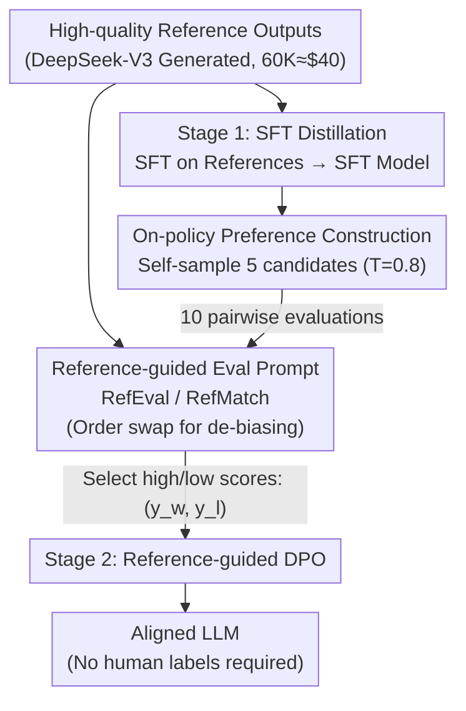

# References Improve LLM Alignment in Non-Verifiable Domains

**Conference**: ICLR 2026  
**arXiv**: [2602.16802](https://arxiv.org/abs/2602.16802)

**Code**: [GitHub](https://github.com/yale-nlp/RLRR)

**Area**: Reinforcement Learning  
**Keywords**: Reference-guided evaluation, non-verifiable domains, LLM-as-Judge, self-improvement, DPO

## TL;DR

This paper proposes RefEval, a reference-guided LLM-as-Judge method that uses high-quality reference outputs as "soft verifiers," improving LLM-judge accuracy by 6.8%. It further constructs a two-stage self-improvement pipeline (SFT distillation + reference-guided DPO) that outperforms SFT distillation by +19.2/+16.5 on AlpacaEval/Arena-Hard respectively, matching the performance of the fine-tuned reward model ArmoRM. This demonstrates efficient LLM alignment in non-verifiable domains without the need for human preference annotations.

## Background & Motivation

**Limitations of Prior Work**: Reinforcement Learning with Verifiable Rewards (RLVR) has shown significant results in reasoning tasks (math/code). However, alignment tasks (instruction following, summarization, creative writing) lack ground-truth verifiers, making RLVR difficult to apply directly.

**Background**: Current alignment post-training relies on RLHF or RLAIF. These require training specialized Reward Models (RM) using large amounts of human preference annotations or using LLM-as-Judge, which suffers from limited accuracy due to positional and verbosity biases.

**Key Insight**: Although preference annotations are expensive, high-quality reference outputs can often be obtained cheaply—for instance, generating 60K DeepSeek-V3 references costs approximately $40. This source of signal is currently underutilized.

**Key Challenge**: Existing works (LLMBar, HREF) that naiveley concatenate references into prompts without explicit guidance on how the judge should use them yield only marginal improvements. This suggests a need for carefully designed prompting strategies.

**Core Idea**: If a reference-guided LLM can act as its own judge to provide preference signals, "semi-self-improvement" can be achieved without external human or AI feedback, significantly reducing data and annotation requirements for alignment.

**Goal**: Systematically investigate whether reference-guided LLM evaluators can serve as soft verifiers to support LLM alignment RL without external supervision.

## Method

### Overall Architecture

The paper treats "high-quality reference outputs" as **soft verifiers** in non-verifiable domains. Since alignment tasks lack deterministic verifiers like those in math or code, references from frontier models serve as proxies. The approach covers two levels: first, designing specialized pairwise evaluation prompts (RefEval / RefMatch) to transform a standard LLM into a more accurate judge; second, integrating this judge as a preference signal source into a two-stage pipeline: "SFT Distillation → Reference-guided DPO." In this flow, preference pairs for DPO are constructed via on-policy self-sampling and RefEval-based all-pair scoring. The entire process requires no human preference labels.

### Key Designs

**1. Reference-guided Prompts: From "Giving References" to "Instructing Usage"**

Prior works often fail because they provide references without instructing the judge on how to use them. This work designs two instruction levels: RefEval asks the judge to evaluate which candidate is more consistent with the reference in quality and content while still fulfilling the original prompt; RefMatch explicitly positions the judge as a "semantic and style matcher" to determine similarity. Position bias is mitigated by swapping candidate order and averaging scores. This "explicit guidance + de-biasing" improves accuracy by 4–5 percentage points over simple concatenation and increases inter-judge agreement from 76.6% to 81.4%.

**2. Two-stage Self-improvement: Distillation followed by DPO**

To ensure stability, the first stage involves Supervised Fine-Tuning (SFT distillation) on high-quality references to transfer frontier model capabilities. SFT itself proves stronger than direct DPO with standalone RMs (53.9 vs 49.2 AlpacaEval). The second stage performs reference-guided DPO on the SFT model, optimizing the standard DPO loss:

$$\mathcal{L}_{\text{DPO}}(\pi_\theta; \pi_{\text{ref}}) = -\mathbb{E}_{(x, y_w, y_l) \sim D}\left[\log\sigma\left(\beta\log\frac{\pi_\theta(y_w|x)}{\pi_{\text{ref}}(y_w|x)} - \beta\log\frac{\pi_\theta(y_l|x)}{\pi_{\text{ref}}(y_l|x)}\right)\right]$$

The preference pairs $(y_w, y_l)$ are generated automatically by the RefEval judge rather than human annotators.

**3. On-policy Preference Construction: Self-sampling and All-pair Scoring**

All DPO preference data is generated on-policy by the model being tuned. For each instruction, 5 candidates are sampled (temp=0.8), and the RefEval judge performs $\binom{5}{2}=10$ pairwise comparisons. Win rates determine the highest and lowest quality candidates to form the $(y_w, y_l)$ pair. Processing 60K instructions results in approximately 600K judge calls, made cost-effective by using self-hosting or cheap frontier models.

## Key Experimental Results

### Table 1: LLM-Judge Evaluation Accuracy (Avg across 11 judges & 5 datasets)

| Method | Natural | Adversarial | MTBench | InstruSum | HREF | **Average** |
|------|---------|-------------|---------|-----------|------|---------|
| LLMBar-Base | 83.1 | 61.7 | 74.6 | 70.2 | 72.0 | 72.3 |
| CoT | 82.0 | 60.1 | 75.4 | 69.1 | 69.6 | 71.2 |
| HREF-Ref | 85.3 | 62.3 | 76.5 | 70.8 | 79.2 | 74.8 |
| RefMatch | 84.6 | 74.1 | 76.3 | 72.9 | 80.4 | 77.7 |
| **RefEval** | **86.8** | **74.9** | **76.7** | **74.5** | **82.7** | **79.1** |

→ RefEval is +6.8% higher than the no-reference baseline (LLMBar-Base) and +4.3% higher than the existing HREF-Ref method.

### Table 2: Self-improvement Training (AlpacaEval / Arena-Hard)

| Method | Llama-3 AE | Llama-3 AH | Qwen2.5 AE | Qwen2.5 AH |
|------|-----------|-----------|------------|------------|
| Base | 25.0 | 27.1 | 14.4 | 23.4 |
| DSV3-Distill (SFT) | 53.9 | 42.2 | 48.8 | 56.5 |
| ROUGE | 56.4 | 52.1 | 50.9 | 67.4 |
| BERTScore | 58.8 | 53.0 | 55.3 | 64.5 |
| RefFree | 67.5 | 53.8 | 65.1 | 71.8 |
| ArmoRM (Fine-tuned RM) | 73.9 | 58.6 | 66.8 | 72.2 |
| **RefEval** (Ours) | **73.1** | **58.7** | **70.0** | **74.1** |

→ RefEval matches or exceeds ArmoRM without needing a separate fine-tuned reward model.

### Table 3: Reference Quality Ablation (Llama-3-8B)

| Reference Source | Distill AE | RefFree AE | RefEval AE | RefEval AH |
|---------|-----------|-----------|-----------|-----------|
| DeepSeek-V3 (Strong) | 53.9 | 67.5 | 73.1 | 58.7 |
| GPT-4o-mini (Weak) | 28.7 | 42.6 | 44.4 | 58.3 |

→ Even with weak references, RefEval outperforms RefFree (+1.8/+16.6), showcasing the structural advantage of the reference-guided mechanism.

## Key Findings

1.  **Small Models Benefit Most**: Llama-3-8B sees a +17.4% accuracy gain via RefEval compared to LLMBar-Base, while larger models like Qwen-2.5-72B gain +5.2%. References compensate for knowledge gaps in smaller models.
2.  **Increased Inter-judge Consistency**: RefEval increases the average agreement rate between different judges from 76.6% to 81.4%, as references provide a shared decision anchor.
3.  **SFT Distillation > Direct DPO**: SFT on high-quality references outperforms DPO using ArmoRM (53.9 vs 49.2 AlpacaEval), proving good references are high-fidelity signals.
4.  **Major Gains in Coding & Math**: Guidance is most effective in structured tasks like Coding and Math; creative tasks show variant improvement based on the specific judge model.
5.  **Frontier Judges Can Be Enhanced**: Even GPT-4o shows gains on LLMBar-Adversarial when provided with human-edited "Oracle" references.

## Highlights & Insights

-   **"Reference = Soft Verifier" Conceptual Transfer**: Successfully translates the core advantage of RLVR (verifiable ground truth) to non-verifiable domains.
-   **Systematic Large-scale Experiments**: Covers 11 judges, 5 datasets, and multiple base models, providing high credibility.
-   **Prompt Engineering Insights**: Demonstrates that "how to use the reference" is more critical than simply "providing the reference."
-   **High Practicality**: Achieving competitive alignment with $40 worth of references and zero human labels significantly lowers the barrier for LLM alignment.

## Limitations & Future Work

1.  **Reference Quality Dependency**: Performance correlates strongly with the quality of the reference source.
2.  **Domain Focus**: Restricted to general instruction-following benchmarks; utility in specialized domains (medical, legal) is untested.
3.  **Pairwise Computational Cost**: Generating 600K judge calls for 60K instructions entails non-trivial inference costs.
4.  **Semi-self-improvement**: Still relies on external frontier models for references, rather than being entirely "self-contained."
5.  **Single-round Training**: Does not explore whether iterative cycles of SFT and DPO could yield further gains.

## Related Work & Insights

-   **vs HREF (Lyu et al., 2024)**: While HREF uses human references for evaluation, this work scales it significantly and extends its use as a training signal for DPO.
-   **vs RevisEval (Zhang et al., 2025)**: RevisEval focuses on improving static evaluation. This work integrates the evaluation improvement into a dynamic training pipeline.
-   **vs BLEUBERI (Chang et al., 2025)**: BLEUBERI uses BLEU as a reward. This work shows that LLM-judges are more flexible and effective "soft verifiers" than rigid metrics like ROUGE or BERTScore.

## Rating

-   **Novelty**: ⭐⭐⭐⭐ The system pipeline from reference-guided eval to self-improvement is new, though individual components are established.
-   **Experimental Thoroughness**: ⭐⭐⭐⭐⭐ Extremely comprehensive coverage across judges, benchmarks, and ablations.
-   **Writing Quality**: ⭐⭐⭐⭐⭐ Clear motivational chain and logical progression of experiments.
-   **Value**: ⭐⭐⭐⭐⭐ Offers direct, cost-effective guidance for alignment for teams with limited resources.

<!-- RELATED:START -->

## Related Papers

- [\[ICLR 2026\] Rubrics as Rewards: Reinforcement Learning Beyond Verifiable Domains](rubrics_as_rewards_reinforcement_learning_beyond_verifiable_domains.md)
- [\[ICLR 2026\] Erase to Improve: Erasable Reinforcement Learning for Search-Augmented LLMs](erase_to_improve_erasable_reinforcement_learning_for_search-augmented_llms.md)
- [\[ICLR 2026\] Leveraging Explanation to Improve Generalization of Meta Reinforcement Learning](leveraging_explanation_to_improve_generalization_of_meta_reinforcement_learning.md)
- [\[ICLR 2026\] Reasoning Boosts Opinion Alignment in LLMs](reasoning_boosts_opinion_alignment_in_llms.md)
- [\[ICLR 2026\] From Verifiable Dot to Reward Chain: Harnessing Verifiable Reference-based Rewards for RL of Open-ended Generation](from_verifiable_dot_to_reward_chain_harnessing_verifiable_reference-based_reward.md)

<!-- RELATED:END -->
