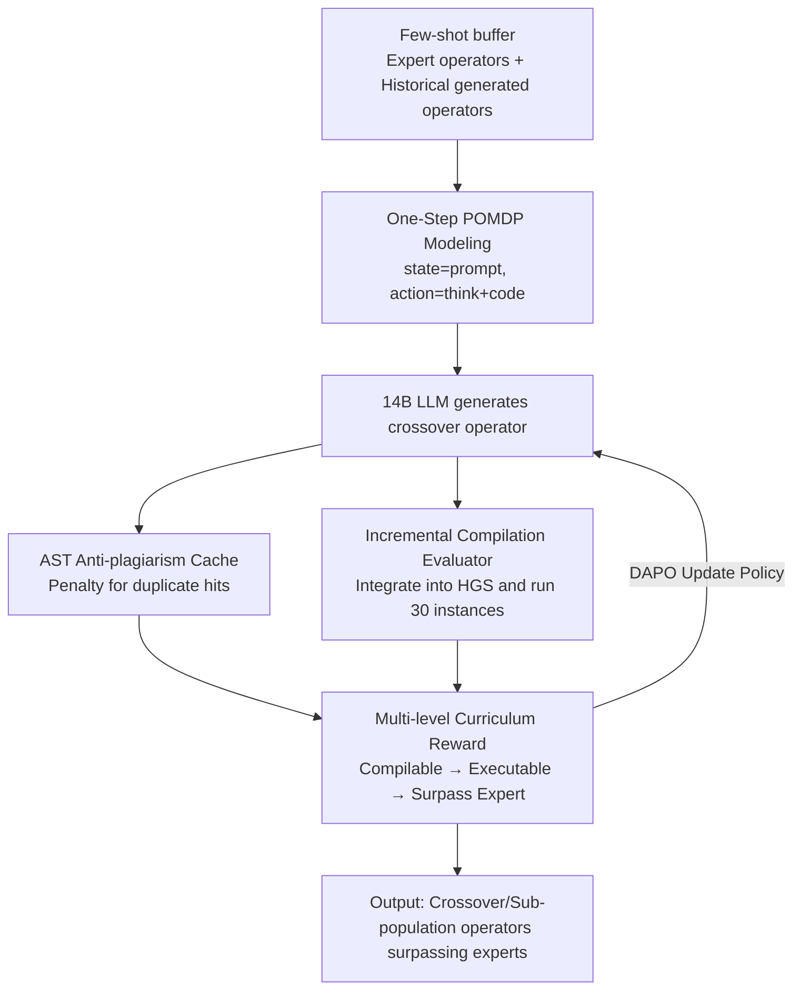

# Refining Hybrid Genetic Search for CVRP via Reinforcement Learning-Finetuned LLM

**Conference**: ICLR 2026  
**OpenReview**: [https://openreview.net/forum?id=aITKXFeivk](https://openreview.net/forum?id=aITKXFeivk)  
**Code**: None  
**Area**: Reinforcement Learning / Combinatorial Optimization / LLM Fine-tuning  
**Keywords**: CVRP, Hybrid Genetic Search, Operator Generation, Reinforcement Fine-tuning, Curriculum Reward

## TL;DR
This paper proposes RFTHGS, which fine-tunes a 14B small model using reinforcement learning to automatically generate crossover operators for the Hybrid Genetic Search (HGS) solver. The operators generated for CVRP outperform those manually designed by human experts and generalize stably to instances with up to 1000 nodes, surpassing trillion-parameter commercial models such as GPT-4o, o3, and o4-mini.

## Background & Motivation
**Background**: Solving the Vehicle Routing Problem (VRP) using LLMs is at the frontier of combinatorial optimization. The mainstream approach is to treat general-purpose large models like GPT-4 as "heuristic designers," either by generating solutions end-to-end or by serving as crossover/mutation operators in an evolutionary framework through in-context prompting (e.g., EoH, ReEvo, Hercules), refining LLM-generated heuristics through evolutionary iterations.

**Limitations of Prior Work**: End-to-end solution generation by LLMs often results in infeasible solutions or results significantly inferior to traditional or deep solvers due to "hallucinations." Prompting routes, while embedding LLMs into evolutionary loops, rely heavily on closed-source APIs, which are costly and uncontrollable. Furthermore, a significant performance gap remains compared to traditional/deep solvers, making it difficult to apply them directly to large-scale real-world instances.

**Key Challenge**: Real-world large-scale instances rely on mature advanced solvers like HGS, whose internal key operators are polished by human experts. A sharp question arises: Can a **small** LLM be fine-tuned to optimize the key components of an advanced solver to **exceed expert levels**, rather than building an independent LLM solver from scratch?

**Goal**: (1) Ensure operators generated by the small model are compilable and executable; (2) Ensure these operators truly outperform expert-designed crossover operators in HGS; (3) Generalize to instances far exceeding the training scale.

**Key Insight**: Instead of treating the LLM as a solver, it is treated as an "operator generator" within the HGS framework that can be continuously refined. The quality of solutions actually produced by HGS is used as a reinforcement learning reward signal to polish the LLM.

**Core Idea**: Fine-tune a 14B reasoning model using RL to generate HGS crossover operators, equipped with a multi-level curriculum reward ("Compilable $\rightarrow$ Executable $\rightarrow$ Surpass Expert") and an AST anti-plagiarism cache to prevent reward hacking.

## Method

### Overall Architecture
RFTHGS is a **closed-loop iterative** framework: in each step, the LLM is first fed a few-shot CoT prompt (containing operator optimization instructions + several existing operator examples) to generate new crossover operator code. The generated operator is integrated into the HGS library, recompiled using incremental compilation, and run on 30 fixed CVRP instances to obtain target values. A multi-level reward is then calculated to update the LLM policy using DAPO. Note that the LLM **only sees operator examples** and does not see specific CVRP instances or the entire solver codebase—this is why the task is modeled as "partially observable." The entire process is formalized as a **one-step POMDP**: the state is the prompt, and the action is the operator generated by the LLM in one go; the process terminates after generation, with no state transition.

### Key Designs

**1. One-Step POMDP Modeling and Few-shot Experience Buffer: Turning "Operator Writing" into a Learnable Single-Step Decision**

Directly asking an LLM to repeatedly modify an operator leads to context explosion and unstable multi-step credit assignment. This paper simplifies it into the cleanest form: the state $X$ is the tokenized prompt containing only the **target operator itself** (e.g., HGS crossover operator) rather than the entire library. This makes the environment naturally "partially observable" as the model only sees a subset of the full state space (the entire solver repository). The action $Y\sim p(\cdot|X)$ is a sequence of tokens, where reasoning is first written in `<think>...</think>` followed by the optimized operator code. The episode terminates after generation, implying no state transitions. To enhance diversity, a few-shot **buffer** is maintained, containing both LLM-generated operators from training and expert operators. Random samples are used to construct the prompt in each step, forcing the model to "improve its own history" and "improve expert operators," enriching the initial state distribution and suppressing overfitting.

**2. Multi-level Curriculum Reward: Breaking "Compilable $\rightarrow$ Executable $\rightarrow$ Surpass Expert" into Reachable Steps**

Instruction-tuned models often fail to write even syntactically correct code. If sparse rewards were only given for "surpassing experts," training would lack signal. The authors use curriculum learning to progress rewards in three stages. Given a generated operator $o$, and sets of compilable operators $C$, executable operators $E$, and plagiarized operators $P$:

$$r(o)=\begin{cases}-1 & o\notin C\\ -0.8 & o\in C,\ o\notin E\\ -0.9 & o\in C,\ o\in E,\ o\in P\\ \max\!\big(-0.7,\ [\phi^J_{HGS}(o_{expert})-\phi^J_{HGS}(o)]/\phi^J_{HGS}(o_{expert})\big) & o\in C,\ o\in E,\ o\notin P\end{cases}$$

Where $\phi^J_{HGS}(\cdot)$ is the average objective value of the operator on $J$ random CVRP instances. Being compilable gives $-0.8$ (encouraging exit from illegal code), being executable starts at $-0.7$, and the final stage linearly maps the "relative quality improvement over the expert operator" to the reward—positive for improvement and negative otherwise. Crucially, this is a **continuous** reward rather than a discrete $+1$ for improvement (as tested in the ablation FRTHGS$_d$). Continuous rewards provide feedback proportional to performance gains, supporting sustained refinement.

**3. AST Anti-plagiarism Cache: Preventing Reward Hacking through Copying Prompt Examples**

Since high-scoring operator examples are included in the prompt, the model could easily copy them to obtain high rewards (reward hacking), leading to no exploration or progress. The authors cache the **Abstract Syntax Trees (AST)** of all few-shot example operators. ASTs strip surface details like punctuation and formatting, retaining only the logical structure. The AST of each newly generated operator is compared with the cache. If a "substantial match" is detected as plagiarism, a reward penalty of $-0.9$ is applied (see the $o\in P$ branch). This drives the payoff for "copying" lower than "original but mediocre," forcing the model to explore structurally novel operators.

**4. Incremental Compilation Evaluator + DAPO Training: Solving Evaluation Bottlenecks and Long-chain Optimization**

Each evaluation requires inserting the operator back into the HGS library and recompiling. Full library compilation overhead is significant for large batches. The authors use **incremental compilation** to recompile only modified code fragments and their dependencies, reducing recompilation time to approximately 25% of full compilation. For reinforcement learning, **DAPO** (an improvement on GRPO) is used. Its Clip-Higher mechanism decouples the upper and lower clipping boundaries, encouraging exploration of low-probability but promising tokens to prevent entropy collapse. Token-level policy gradient loss treats each token in a long reasoning chain equally, while Overlong Reward Shaping softly penalizes excessively long but valid reasoning. Notably, DAPO's Dynamic Sampling (filtering all-correct/all-wrong prompt groups) is **discarded** as the reward here is continuous; all scenarios from "uncompilable" to "significantly surpassing expert" provide useful learning signals.

### Loss & Training
The policy is initialized with the Qwen-14B reasoning model. DAPO uses the optimal settings $\varepsilon_{high}=0.28, \varepsilon_{low}=0.2$. With a batch size of 16 and rollout group size of 16, $16\times16=256$ crossover operators are generated per step. Training rewards are calculated on 30 fixed instances sampled from CVRPLIB X (limited to $\leq 400$ nodes). During testing, the best of 16 sampled operators is used. The underlying objective follows the group-relative advantage of GRPO: $A_{\pi_k}(x,y_i)\simeq [r(x,y_i)-\mu(\{r_\ell\})]/\sqrt{\sigma^2(\{r_\ell\})+\varepsilon}$.

## Key Experimental Results

### Main Results
Evaluation was conducted on CVRPLIB X instances categorized by scale, using Gap% relative to the best-known solution (lower is better). RFTHGS was trained only on $n<400$, yet generalized to 1000 nodes.

| Scale Interval | HGS-PyVRP800 | OR-Tools | LKH | POMO | GPT-4o800 | RFTHGS800 |
|---------|-------------|----------|-----|------|-----------|-----------|
| $n\in[100,200)$ | 0.62 | 4.26 | 1.42 | 13.30 | 0.62 | **0.70** |
| $n\in[400,600)$ | 1.95 | 4.98 | 2.85 | 22.07 | 1.95 | **1.83** |
| $n\in[800,1000]$ | 2.32 | 4.65 | 3.31 | 41.23 | 2.32 | **2.24** |

Under higher compilation/iteration budgets (RFTHGS1200), the Gap for $n\in[100,200)$ further dropped to 0.46, comprehensively outperforming expert HGS and GPT variants. A key observation: crossover operators modified by GPT-4o/o3/o4-mini yielded performance almost **identical** to the "original unmodified operator," indicating their modifications were non-functional.

### Ablation Study

| Configuration | $n\in[100,200)$ Gap% | $n\in[800,1000]$ Gap% | Description |
|------|------|------|------|
| HGS (Expert Operator) | 0.62 | 2.32 | Baseline |
| FRTHGS$_d$ (Discrete Reward) | 0.83 | 2.30 | Inferior to expert on small scale |
| FRTHGS$_c$ (Continuous Reward, Full) | **0.70 / 0.46\*** | **2.24** | Sustained refinement via continuous reward |

| Model | Success Compilation Rate |
|------|-----------|
| GPT-4o | 3/16 |
| GPT-o3 | 9/16 |
| GPT-o4-mini | 3/16 |
| RFTHGS-14B | **16/16** |

### Key Findings
- **Continuous vs. Discrete Reward**: Discrete rewards (FRTHGS$_d$) performed worse than the expert on small scales (0.83 vs. 0.62). Continuous rewards provide feedback proportional to gains, supporting sustained superiority—this is the most significant contribution of the reward design.
- **Superior Compilation Rate**: The 14B fine-tuned model achieved a perfect 16/16 compilation rate, while trillion-parameter GPT models only achieved 3~9/16. Furthermore, even when they compiled, their modifications provided "no functional benefit."
- **Learning Curve Phase Transition**: A turning point occurred around step 200, where generated operators began to exceed the expert baseline. Reward distribution heatmaps showed a clear three-stage curriculum transition (syntax learning $\rightarrow$ execution learning $\rightarrow$ peak performance).
- **Double Generalization**: Models trained with an 800-iteration budget still outperformed experts at 1000/1200 budgets. Models trained only on $n<400$ generalized to $n=1000$.

## Highlights & Insights
- **Small Model + Specialized Tuning > General Large Model**: A 14B model, after task-specific RL fine-tuning, outperformed trillion-parameter GPTs in generating solver components, challenging the paradigm that "LLM heuristics for VRP must rely on GPT-4."
- **AST Anti-plagiarism as a fix for reward hacking**: When prompts contain high-scoring examples, copying is the easiest path to high rewards. Using AST structural comparison suppresses the reward for "copying" below that of mediocre originality, closing the cheating loophole.
- **Curriculum Reward + Incremental Compilation engineering loop**: Stepping from compilable to executable to expert-level, combined with incremental compilation that cuts evaluation costs to 25%, makes the expensive process of using real solution quality as a reward feasible.
- **Operator-level Intervention**: Optimizing a replaceable internal component (crossover/sub-population operator) preserves the mature mechanisms of HGS while injecting LLM innovation exactly where it is needed—this paradigm of "refining key parts within an expert framework" can be extended to other meta-heuristics.

## Limitations & Future Work
- **Narrow Task Scope**: Only validated on CVRP and HGS crossover (and sub-population in the appendix) operators. Generalization to more complex variants like TWVRP or PDP, or other solvers (LKH, OR-Tools), has not been fully tested.
- **Reward Evaluation Overhead**: Despite incremental compilation, evaluating 256 operators per step on 30 instances is computationally expensive; the choice of the 30 fixed instances might also bias the generalization direction.
- **Dependency on Strong Existing Solvers**: The ceiling of the method is locked by the HGS framework itself; it "refines expert components" rather than discovering entirely new algorithms that require restructuring the overall framework.
- **Limited Interpretability**: While the paper notes key modifications made by the LLM relative to expert operators, it lacks a mechanical explanation for "why these modifications are effective."

## Related Work & Insights
- **vs. EoH / ReEvo (Prompting + Evolution)**: These use closed-source models + evolutionary selection. They depend on APIs and show a gap with traditional solvers. Ours uses RL to **fine-tune a small model** to directly surpass expert operators; where ReEvo has Gaps of 100%+ on large scales, Ours remains stable in single digits.
- **vs. CALM (Nesting RL Fine-tuning in Evolutionary Loops)**: CALM co-evolves models and heuristics. This paper focuses on "refining key operators within the mature HGS solver" and stabilizes training with the one-step POMDP + curriculum reward + AST anti-plagiarism.
- **vs. Commercial GPT Series**: Trillion-parameter models have low compilation rates and produce non-functional modifications. This paper proves that task-specific fine-tuned 14B models are more reliable for generating effective solver components.

## Rating
- Novelty: ⭐⭐⭐⭐⭐ First to prove small model RL fine-tuning can generate advanced solver components surpassing experts. AST anti-plagiarism and continuous curriculum rewards are innovative.
- Experimental Thoroughness: ⭐⭐⭐⭐ Covers various scales, baselines, double generalization, and reward/compilation ablations, but limited to CVRP + HGS.
- Writing Quality: ⭐⭐⭐⭐ Clear POMDP modeling and reward formulas. Figure flow and curriculum learning descriptions are well-executed.
- Value: ⭐⭐⭐⭐⭐ The paradigm of "refining key parts within an expert framework" provides strong practical inspiration for both COP and LLM-for-OR communities.

<!-- RELATED:START -->

## Related Papers

- [\[ICLR 2026\] Multimodal LLM-assisted Evolutionary Search for Programmatic Control Policies](multimodal_llm-assisted_evolutionary_search_for_programmatic_control_policies.md)
- [\[ICLR 2026\] A$^2$Search: Ambiguity-Aware Question Answering with Reinforcement Learning](a2search_ambiguity-aware_question_answering_with_reinforcement_learning.md)
- [\[ICLR 2026\] Erase to Improve: Erasable Reinforcement Learning for Search-Augmented LLMs](erase_to_improve_erasable_reinforcement_learning_for_search-augmented_llms.md)
- [\[ACL 2025\] TreeRL: LLM Reinforcement Learning with On-Policy Tree Search](../../ACL2025/reinforcement_learning/treerl_tree_search_rl.md)
- [\[ICLR 2026\] J1: Incentivizing Thinking in LLM-as-a-Judge via Reinforcement Learning](j1_incentivizing_thinking_in_llm-as-a-judge_via_reinforcement_learning.md)

<!-- RELATED:END -->
