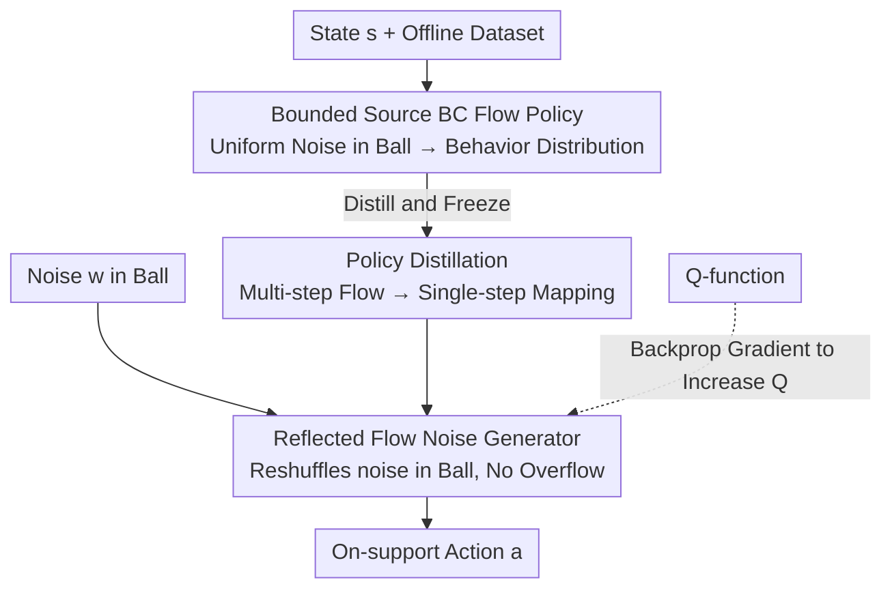

# ReFORM: Reflected Flows for On-support Offline RL via Noise Manipulation

**Conference**: ICLR 2026  
**arXiv**: [2602.05051](https://arxiv.org/abs/2602.05051)  
**Code**: [Project Page](https://mit-realm.github.io/reform/)  
**Area**: Reinforcement Learning  
**Keywords**: Offline RL, Flow Matching, Support Constraints, Reflected Flows, OOD Issues

## TL;DR

ReFORM is proposed to manipulate the source distribution of a behavior-cloning (BC) flow policy by learning a reflected flow noise generator. This achieve support constraints in a **constructive manner**, avoiding OOD (Out-Of-Distribution) issues while maintaining policy expressivity without hyperparameter tuning.

## Background & Motivation

Offline RL faces two core challenges: (1) **OOD Problems**—policies generate actions not present in the dataset, leading to over-optimistic Q-function estimations; (2) **Multi-modal Action Distributions**—traditional unimodal Gaussian policies cannot represent complex multi-modal behaviors in datasets.

Previous methods primarily constrain the learned policy to be close to the behavior policy by regularizing statistical distances (KL divergence, Wasserstein distance, etc.), but they have fundamental flaws:
- **KL divergence constraint is too strong** (Proposition 1): KL constraint provides sufficient but unnecessary conditions for support constraints, which may excessively limit the space for policy improvement.
- **Wasserstein distance constraint is insufficient** (Proposition 2): Wasserstein constraints cannot guarantee support constraints.
- Both introduce a hyperparameter $\alpha$ that requires tuning for different tasks and datasets.

The **Core Idea** of this paper is not to constrain statistical distance, but to ensure **support constraints** $\text{supp}(\pi_\theta(\cdot|s)) \subseteq \text{supp}(\pi_\beta(\cdot|s))$ directly through a **constructive method**. Specifically, optimization is performed within the bounded source noise space of a BC flow policy, naturally satisfying the constraints.

## Method

### Overall Architecture

The core problem ReFORM aims to solve is: how to ensure the learned policy only outputs "seen" actions (support constraints) without introducing regularization hyperparameters, while retaining multi-modal expressivity. The approach is to shift the constraint problem into the "noise space" to satisfy it constructively—as long as the source noise always falls within a bounded region, the output actions will naturally not exceed the boundaries after being mapped by a policy whose support is framed by that region.

The overall framework consists of two stages. In the first stage, a flow policy is learned using Behavior Cloning (BC) to map a **bounded** uniform noise distribution to the behavior distribution of the dataset; thus, the "reachable actions" of the BC policy are pinned to the bounded region of the noise. Meanwhile, this multi-step BC flow is distilled into a single-step mapping to shorten the subsequent backpropagation chain. In the second stage, the distilled BC policy is frozen, and an additional reflected flow noise generator is learned. It only redistributes noise within that bounded noise region to move noise towards areas that yield higher Q-values—since the generator's output still does not escape the bounded region, the actions output after being fed to the BC policy always remain within the support.

### Key Designs

**1. BC Flow Policy with Bounded Source Distribution: Pinning Support Constraints to a Bounded Noise Region**

Support constraints are difficult because unbounded noise like Gaussian can theoretically cover the entire action space after flow mapping, failing to guarantee boundaries. ReFORM instead uses a uniform distribution on the $d$-dimensional hypersphere as the source distribution $q_{BC} = \mathcal{U}(\mathcal{B}_l^d)$, whose support is the bounded ball $\text{supp}(q_{BC}) = \mathcal{B}_l^d = \{z \in \mathbb{R}^d \mid \|z\| \leq l\}$. The flow policy $\psi_{\theta_1}(t,z;s)$ is trained with standard linear flow matching loss:

$$\mathcal{L}_{BC}(\theta_1) = \mathbb{E}\big[\|v_{\theta_1}(t,x_t;s) - (a-z)\|^2\big]$$

The key is that since the source distribution is bounded, the image (range) of the BC flow is restricted to a range that approximates the support set of the behavior policy. This lays the foundation for constructive support constraints in the second stage—as long as the noise does not escape this ball, the output actions will not exit the support.

**2. Policy Distillation: Compressing Multi-step BC Flow into a Single-step Mapping**

The noise generator must be trained via gradient backpropagation through the Q-values of the BC policy. Since the BC flow involves multi-step integration, the backpropagation chain is long and computationally heavy. ReFORM first distills the multi-step BC flow policy into a single-step mapping $\hat{\mu}_{\hat{\theta}_1}$:

$$\mathcal{L}_{\text{Distill}}(\hat{\theta}_1) = \mathbb{E}\big[\|\mu_{\hat{\theta}_1}(z;s) - \mu_{\theta_1}(z;s)\|^2\big]$$

After distillation, gradients for the noise generator only pass through a one-step mapping, significantly shortening the BPTT chain, making training faster and more stable.

**3. Reflected Flow Noise Generator: Reshuffling Noise within a Bounded Ball**

In the second stage, noise within the ball must be moved to increase the Q-value. The difficulty is that the support of ordinary flow models is unbounded; using them directly to generate noise would cause it to escape the ball, violating support constraints. ReFORM uses a **Reflected Flow** to constrain this generator $\psi_{\theta_2}(t,w;s): \mathcal{B}_l^d \to \mathcal{B}_l^d$, remapping noise within the ball to a multi-modal distribution also within the ball. Reflection is achieved via an ODE with a reflection term:

$$d\psi_{\theta_2} = v_{\theta_2}\,dt + dL_t$$

Where the reflection term $dL_t$ compensates the velocity exceeding the boundary when a trajectory attempts to exit the spherical surface. Numerically, a Reflected Euler method is used for projection: when $\hat{z}_{k+1} \notin \mathcal{B}_l^d$ after one step of update, the overflowing normal component is subtracted to pull the point back into the ball. This theoretically guarantees support constraints (Theorem 1) while preserving multi-modal expressivity better than truncated Gaussian or tanh-warping—the latter two are either unimodal or suffer from vanishing gradients at boundaries.

### Loss & Training

The optimization objective of the noise generator is to directly maximize the Q-value of the composite policy, with no regularization terms in the objective:

$$\mathcal{L}_{NG}(\theta_2) = \mathbb{E}_{s,w}\big[-Q^{\mu_\theta}(s,\, \mu_{\theta_1}(\mu_{\theta_2}(w;s);s))\big]$$

Support constraints are entirely guaranteed constructively by the bounded source + reflected flow from the previous stages. Thus, no distance regularization like KL / Wasserstein is needed, eliminating the need for per-task weight hyperparameter $\alpha$.

## Key Experimental Results

### Main Results (40 OGBench tasks, Performance Profile)

| Method | Clean Dataset | Noisy Dataset | Hyperparam Tuning |
|------|-----------|-----------|---------|
| ReFORM | **Optimal** | **Optimal** | Fixed |
| FQL(M) | Second | Significant Drop | Manual |
| DSRL | Third | Significant Drop | Manual |
| FQL(S) | Moderate | Second | Manual |
| IFQL | Poor | Poor | - |

### Ablation Study

| Configuration | Normalized Score | Description |
|------|----------|------|
| ReFORM (Full) | Highest | Bounded Source + Reflected Flow + Distillation |
| ReFORM(U): Gaussian Source | Near Zero | Unbounded source leads to severe OOD |
| ReFORM(MLP): MLP Noise Gen | Significant Drop | Unable to represent multi-modality |
| ReFORM(tanh): tanh compression | Drop | Vanishing gradient issues |
| ReFORM(Gaussian): Truncated Gaussian | Drop | Unimodal limitation |
| ReFORM(NoDistill) | Slight Drop | Long BPTT chain is harmful |

### Key Findings
- ReFORM has the highest proportion in the region where the normalized score is close to 1.0, indicating it does not limit the ceiling for policy improvement.
- Toy examples clearly show: ReFORM can reach both peaks of the Q-value simultaneously without crossing boundaries, while DSRL collapses to a single mode.
- Bounded source distribution is the core design—performance collapses when switching to a Gaussian source.

## Highlights & Insights

- **Theoretically proved** that KL divergence constraints are too strong and Wasserstein constraints are insufficient; support constraint is a more reasonable intermediate choice.
- **Constructive method** completely eliminates the burden of tuning regularization hyperparameters—the same set of hyperparameters was used for all 40 tasks.
- **Reflected Flow** introduction not only solves the constraint problem but also maintains the multi-modal expressivity of flow models.

## Limitations & Future Work

- Training the noise generator still requires BPTT through the BC policy, which is computationally expensive.
- The quality of the support constraint depends on the accuracy of the support learned by the BC model.
- When the dataset contains expert policies, the learning speed is slower than statistical distance methods due to the lack of explicit regularization.

## Related Work & Insights

- Direct contrast with the DSRL method by Wagenmaker et al. (2025): both manipulate noise space, but ReFORM eliminates hyperparameter requirements using bounded source distributions.
- Reflected flows (Xie et al., 2024) are applied to constraint satisfaction in RL for the first time.
- The idea of noise manipulation can be extended to safety constraints in online RL and fine-tuning of diffusion policies.

## Rating
- Novelty: ⭐⭐⭐⭐⭐ The combination of Reflected Flow and bounded source distribution to achieve constructive support constraints is a highly original idea.
- Experimental Thoroughness: ⭐⭐⭐⭐⭐ 40 tasks × two dataset types, detailed ablations, and clear toy example visualizations.
- Writing Quality: ⭐⭐⭐⭐⭐ Logical progression from theory to methodology and experiments.
- Value: ⭐⭐⭐⭐⭐ Provides both a theoretically sound and practical solution to the OOD problem in offline RL.

<!-- RELATED:START -->

## Related Papers

- [\[ICLR 2026\] Value Flows](value_flows.md)
- [\[ICLR 2026\] Scalable Offline Model-Based RL with Action Chunks](scalable_offline_model-based_rl_with_action_chunks.md)
- [\[ICLR 2026\] Less is More: Clustered Cross-Covariance Control for Offline RL](less_is_more_clustered_cross-covariance_control_for_offline_rl.md)
- [\[ICLR 2026\] Sample Efficient Offline RL via T-Symmetry Enforced Latent State-Stitching](sample_efficient_offline_rl_via_t-symmetry_enforced_latent_state-stitching.md)
- [\[ICLR 2026\] One-Step Flow Q-Learning: Addressing the Diffusion Policy Bottleneck in Offline RL](one-step_flow_q-learning_addressing_the_diffusion_policy_bottleneck_in_offline_r.md)

<!-- RELATED:END -->
