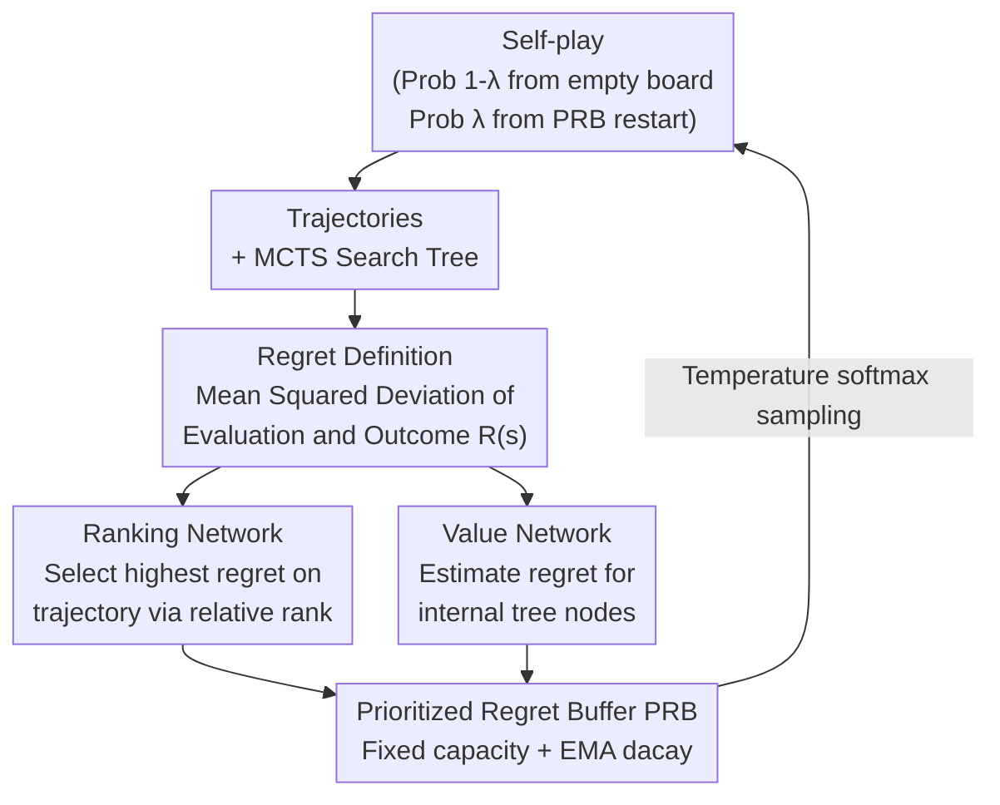

# Regret-Guided Search Control for Efficient Learning in AlphaZero

**Conference**: ICLR 2026  
**arXiv**: [2602.20809](https://arxiv.org/abs/2602.20809)  
**Code**: [Project Page](https://rlg.iis.sinica.edu.tw/papers/rgsc)  
**Area**: Reinforcement Learning  
**Keywords**: AlphaZero, search control, regret network, MCTS, board games

## TL;DR

The Regret-Guided Search Control (RGSC) framework is proposed to identify high-regret states by training a regret network and prioritize restarting self-play from these states. This simulates the human learning method of "repeatedly reviewing mistakes," outperforming AlphaZero by an average of 77 Elo in 9×9 Go, 10×10 Othello, and 11×11 Hex.

## Background & Motivation

**Learning Efficiency Gap**: AlphaZero requires millions of self-play games to reach superhuman levels, whereas human players achieve comparable strength with significantly fewer games. The key difference lies in the learning methodology.

**Human Learning Pattern**: Human players do not always play complete games from the beginning; instead, they repeatedly review critical positions (where they made mistakes) until weaknesses are corrected. AlphaZero, however, consistently starts from an empty board and updates all positions uniformly.

**Concept of Search Control**: This refers to the idea proposed by Sutton & Barto in the Dyna framework—selecting valuable states as starting points for simulated experience rather than always beginning from initial states.

**Limitations of Prior Work (Go-Exploit)**: Previous work Go-Exploit implemented restarting self-play from historical states but used uniform sampling, failing to distinguish the learning value of states. As training progresses, most states are mastered, and the efficiency of uniform sampling drops sharply.

**Key Challenge (Non-stationarity)**: Regret values of high-regret states decrease after being visited repeatedly. Directly predicting regret values faces dual difficulties: severe distribution imbalance and target non-stationarity.

## Method

### Overall Architecture

RGSC incorporates the human learning habit of "repeatedly reviewing mistakes" into the AlphaZero self-play loop. It defines a regret value for each game state to measure "how wrong the agent was," then trains a regret network (comprising a ranking head and a value head) to select high-regret states stored in a Prioritized Regret Buffer (PRB). Subsequent self-play does not always start from an empty board but has a probability of restarting from these high-regret states, concentrating training computation on unmastered weaknesses. The process is a closed loop: self-play produces trajectories and search trees $\rightarrow$ compute regret $\rightarrow$ ranking and value heads select high-regret states $\rightarrow$ enter PRB $\rightarrow$ next round of self-play restarts from PRB.

### Key Designs

**1. Regret Definition: Marking unmastered states using "deviation between evaluation and outcome"**

To let the agent know where to review, a signal quantifying "poor learning" is needed. RGSC defines the regret value of state $s_t$ as the mean squared deviation between the MCTS evaluation of the selected action and the final game outcome along the trajectory to the terminal state $s_T$: $R(s_t) = \frac{1}{T-t} \sum_{i=t}^{T-1} (V_{\text{selected}}(s_i) - z)^2$, where $z$ is the true outcome. When the agent's evaluations near a state consistently mismatch the outcome, the regret is high, corresponding to critical positions with the largest evaluation bias—these positions have the highest learning potential.

**2. Ranking Network: Replacing "regret prediction" with "relative ranking" to bypass non-stationary targets**

Direct regression of regret values is difficult: most states have near-zero regret, causing distribution imbalance, and high-regret states decrease in regret once corrected. RGSC instead learns a relative rank—the network outputs unnormalized ranking scores $\gamma_s$, converted to a restart distribution $\rho(s\mid S)$ via softmax. The objective is to assign high sampling probability to high-regret states, maximizing $J_{\text{rank}} = \sum_s \rho(s\mid S)\,R(s)$. The training uses a surrogate loss $L_{\text{rank}} = -\log \sum_s \exp\big(\log\text{softmax}(\gamma_s) + R(s)\big)$. Since it only needs to determine "which regret is relatively higher" rather than exact values, the ranking objective is insensitive to imbalance and non-stationarity.

**3. Value Network: Estimating regret for internal search tree nodes to increase diversity**

States on self-play trajectories have complete follow-throughs to calculate regret; however, internal nodes in the MCTS tree that were explored but not traversed lack complete trajectories. RGSC adds a value network specifically to estimate regret for these internal nodes. This ensures that restartable high-regret states are not limited to the actual path taken, covering potential weaknesses explored in the search tree and increasing diversity.

**4. Prioritized Regret Buffer (PRB): Simulating the process of "reviewing until understood" via EMA decay**

The PRB maintains a fixed capacity $K$ of high-regret states. After each game, the ranking network selects the highest-ranked state; it replaces the state with the lowest regret in the PRB only if its regret is higher. Restart sampling uses a temperature-controlled softmax $P(s_i) \propto R(s_i)^{1/\tau}$. Crucially, regret is not zeroed out after a state is replayed; instead, it is updated via Exponential Moving Average $R_{\text{new}} \leftarrow (1-\alpha)R_{\text{old}} + \alpha R$. Regret only decays as the agent masters the position through repeated practice, preventing premature disposal of unstable states.

### Loss & Training

Both the ranking and value heads are trained jointly as additional outputs of the AlphaZero backbone. Thus, the extra computational overhead is minimal and becomes negligible as the number of network blocks increases. The ranking head uses $L_{\text{rank}}$ to maintain ordering, while the value head uses standard MSE to fit regret values. During self-play, a probability $1-\lambda$ of starting from an empty board ensures game integrity, while a probability $\lambda$ of sampling from the PRB directs computation toward weaknesses.

## Key Experimental Results

### Main Results

**Elo Gains across three games (300 iterations, ~150 A6000 GPU hours each)**:

| Game | AlphaZero | Go-Exploit | RGSC | Gain vs AZ | Gain vs GE |
|------|-----------|-----------|------|-----------|-----------|
| 9×9 Go | 1000 (ref) | +Low | +76 Elo | +76 | +96 |
| 10×10 Othello | 1000 (ref) | +20 | +70 Elo | +70 | +50 |
| 11×11 Hex | 1000 (ref) | -38 | +84 Elo | +84 | +122 |

**Win rates against external strong programs**:

| Game | Adversary | AlphaZero | Go-Exploit | RGSC |
|------|-----------|-----------|------------|------|
| 9×9 Go | KataGo | 45.5% | 49.5% | **53.6%** |
| 10×10 Othello | Ludii α-β | 51.7% | 52.9% | **57.8%** |
| 11×11 Hex | MoHex | 83.6% | 89.2% | **91.1%** |

### Ablation Study

**State selection quality: Ranking Network vs. Value Network**:

| Method | 9×9 Go avg regret | 10×10 Othello avg regret | Effect |
|------|-------------------|-------------------------|------|
| Go-Exploit (Uniform) | Lowest | Lowest | Baseline |
| Regret Value Net | Medium | Medium | Suboptimal |
| **Regret Ranking Net** | **Highest** | **Highest** | **Optimal** |

**Continued training on pre-trained models (15-block, 9×9 Go, 40 iterations)**:

| Method | Win rate vs KataGo |
|------|---------------|
| Baseline (Pre-training) | 69.3% ± 2.6% |
| AlphaZero Continued | 70.2% ± 2.7% (Minimal gain) |
| Go-Exploit | 69.2% ± 2.7% (No gain) |
| **RGSC** | **78.2% ± 2.5%** (+8.9%) |

### Key Findings

1.  **Late-stage Failure of Go-Exploit**: Go-Exploit is effective early (many unmastered states), but as states are mastered, uniform sampling efficiency drops, sometimes falling below AlphaZero.
2.  **Ranking outperforms Regression**: The ranking network consistently chooses states with higher regret, validating that ranking objectives are superior to direct regression under non-stationary, unbalanced distributions.
3.  **Regret Decay in PRB**: In all games, the average regret of states entering the PRB is significantly higher than those being removed (Go: 0.655 $\rightarrow$ 0.296), proving that RGSC effectively corrects errors.
4.  **Improvement of Strong Models**: RGSC improved win rates by 8.9% on already well-trained models where AlphaZero and Go-Exploit plateaued.

## Highlights & Insights

1.  **Elegant Implementation of Human Learning**: The human approach of reviewing errors is naturally translated into regret-guided search control with clear motivation and simple implementation.
2.  **Clever Ranking Objective**: Avoids the difficulty of predicting non-stationary targets by only requiring relative order, significantly easing the learning task.
3.  **Utilization of Internal Nodes**: Not only utilizes states on the trajectory but also those unexplored but considered by MCTS, broadening the coverage of reviews.
4.  **Minimal Overhead**: The regret network consists of only two additional heads; overhead becomes negligible as the backbone grows.
5.  **Generalization Potential**: Preliminary experiments applying RGSC to MuZero (Pac-Man) suggest applicability to broader RL scenarios.

## Limitations & Future Work

1.  **Verified on Board Games Only**: These are deterministic, perfect-information games. The effectiveness of RGSC in stochastic or imperfect-information environments requires further validation.
2.  **Regret Definition Constraints**: The current definition relies on MCTS evaluation-outcome mismatch; new designs are needed for continuous control tasks.
3.  **Fixed PRB Capacity**: A fixed buffer size might be insufficient to cover all critical states in more complex games.
4.  **19×19 Go**: The study verified 9×9 Go; scalability to larger boards remains to be tested.

## Related Work & Insights

-   **Go-Exploit**: First systematic study of search control in AlphaZero, but its uniform sampling limitation is overcome by RGSC's prioritized sampling.
-   **KataGo**: Its random opening strategy inspired the idea of training from non-initial states.
-   **Prioritized Experience Replay (PER)**: PRB in RGSC is effectively an extension of PER principles to the search control layer.
-   **Insight**: The regret-guided philosophy can be extended to other scenarios requiring concentrated learning on hard samples, such as curriculum or active learning.

## Rating

-   **Novelty**: ⭐⭐⭐⭐ The regret ranking network design is novel and addresses non-stationary prediction cleverly; however, the general idea is a natural extension of PER to search control.
-   **Experimental Thoroughness**: ⭐⭐⭐⭐⭐ Comprehensive validation across three games, including win rates against strong engines, ablation studies, and continued training experiments.
-   **Writing Quality**: ⭐⭐⭐⭐ Clear motivation (intuitive human vs. ML comparison), complete methodological derivation, and clear presentation.
-   **Value**: ⭐⭐⭐⭐ Provides a simple and effective solution for AlphaZero efficiency with potential for broader RL application.

<!-- RELATED:START -->

## Related Papers

- [\[ICLR 2026\] Multimodal LLM-assisted Evolutionary Search for Programmatic Control Policies](multimodal_llm-assisted_evolutionary_search_for_programmatic_control_policies.md)
- [\[ICLR 2026\] GoldenStart: Q-Guided Priors and Entropy Control for Distilling Flow Policies](goldenstart_q-guided_priors_and_entropy_control_for_distilling_flow_policies.md)
- [\[ICLR 2026\] Efficient Morphology-Control Co-Design via Stackelberg Proximal Policy Optimization](efficient_morphology-control_co-design_via_stackelberg_proximal_policy_optimizat.md)
- [\[ICLR 2026\] WIMLE: Uncertainty-Aware World Models with IMLE for Sample-Efficient Continuous Control](wimle_uncertainty-aware_world_models_with_imle_for_sample-efficient_continuous_c.md)
- [\[ICLR 2026\] Q-Learning with Fine-Grained Gap-Dependent Regret](q-learning_with_fine-grained_gap-dependent_regret.md)

<!-- RELATED:END -->
