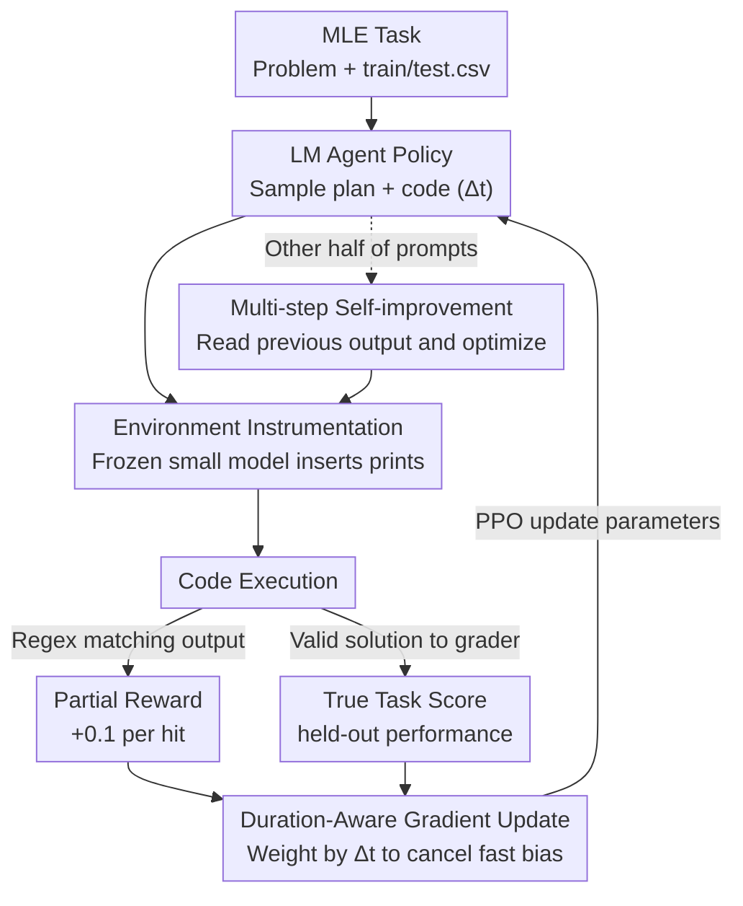

# Reinforcement Learning for Machine Learning Engineering Agents

**Conference**: ICLR 2026  
**OpenReview**: [https://openreview.net/forum?id=mfIbSouoaZ](https://openreview.net/forum?id=mfIbSouoaZ)  
**Code**: https://github.com/sherryy/rl4mle  
**Area**: Reinforcement Learning / Agent  
**Keywords**: ML Engineering Agent, Asynchronous RL, Duration-Aware Gradient, Environment Instrumentation, Partial Reward

## TL;DR
This paper identifies that in Machine Learning Engineering (MLE) tasks with reliable verifiers, updating the parameters of a small model (Qwen2.5-3B) via RL is more effective than repeatedly prompting a frozen large model. Given sufficient compute, the RL-adapted small model outperforms Claude-3.5-Sonnet driven by a SOTA scaffold (AIDE) by an average of 22% across 12 Kaggle tasks. To achieve this, the authors address two pain points in asynchronous RL: using "duration-aware gradients" to correct fast-action bias and "environment instrumentation" to convert sparse rewards into verifiable partial rewards.

## Background & Motivation

**Background**: Current mainstream MLE agents primarily use a "prompting frontier LLMs + agent scaffold" approach, improving performance by accessing past experiences in context (non-parametric accumulation). This is essentially the scaling of test-time compute through increased sampling, searching, and debugging.

**Limitations of Prior Work**: Without parameter updates, the fundamental behavior of the agent remains unchanged. The paper provides a striking observation: driving Claude-3.5-Sonnet with the strongest scaffold from MLEBench for several days only "slightly" improves the best solution. Valuable experiences from expensive ML experiments are wasted due to the lack of gradient updates.

**Key Challenge**: When a task includes a reliable verifier (e.g., performance on held-out data), using this signal only to "select" candidate solutions is far less efficient than using it to "train" model parameters. In other words, compute should be allocated not just to inference and interaction, but also to gradient updates.

**Goal**: To apply RL to MLE agents while overcoming two specific obstacles in agentic settings. **Obstacle 1**: Variable action execution duration (training different ML models takes vastly different times). In asynchronous distributed RL, this causes "fast actions" to be sampled more frequently and accumulate more gradients, biasing the policy toward "fast but inferior" solutions (e.g., simple linear logistic regression). **Obstacle 2**: Reward feedback based solely on held-out performance is too sparse—a "nearly correct" program (e.g., failing only to save results to the correct path) receives the same reward as a "completely broken" one (e.g., failing to load data), potentially encouraging speculative non-ML solutions (e.g., hard-coded Jaccard similarity searches).

**Core Idea**: Within a distributed asynchronous RL framework, use **duration-aware gradients** to counteract the frequency bias of fast actions and amplify "high-cost, high-reward" actions. Additionally, use a **frozen identical small model** to instrument agent code with print statements, providing **verifiable partial rewards** via regex matching to densify sparse signals.

## Method

### Overall Architecture

The MLE process is modeled as an MDP: the state $S$ consists of the agent's input (task description, dataset, experiment history); the action $A$ is the plan and code generated by the agent; the transition $P$ is the environment output after code execution (errors, training loss, etc., which is stochastic due to ML randomness); and the reward $R$ is the performance on held-out data. The RL objective is to maximize the expected return $J(\pi)=\mathbb{E}_{\pi,\mu,P}[\sum_{k=0}^{K} R(s_k,a_k)]$, optimized using PPO.

The pipeline is a closed loop: The **LM agent** samples plan+code actions → Passed to the **environment instrumentation** module (a frozen small model) to insert print statements → After **code execution**, terminal output is processed via regex matching to extract **partial rewards**, and valid solutions are sent to a grader for the **true task score** → Rewards and action duration $\Delta t$ are returned to the learner for policy updates using **duration-aware gradients**. Furthermore, the agent can either "solve from scratch" or be explicitly asked to "improve the previous version" (**multi-step self-improvement**), with each prompt type accounting for half of the samples.

### Key Designs

**1. Duration-Aware Gradient Update: Preventing slow but good actions from being submerged**

In asynchronous distributed RL, multiple actors run environments independently and send experience to the learner. The problem is that within a fixed duration $T$, a fast action $x$ will be sampled $n_x \approx \pi(x|s)\cdot T/\Delta t_x$ times, while a slow action $y$ is only sampled $n_y \approx \pi(y|s)\cdot T/\Delta t_y$ times. Consequently, their total gradient contributions $G_x \propto \frac{1}{\Delta t_x}$ and $G_y \propto \frac{1}{\Delta t_y}$ are inversely proportional to their durations. Faster actions contribute more, systematically pushing the policy toward fast, sub-optimal solutions (e.g., the agent converging to logistic regression in <1s while abandoning higher-scoring but slower solutions).

The authors address this by weighting each gradient by the action duration, effectively multiplying $\Delta t$ back: $G'_x \propto \pi(x|s)\cdot T$ and $G'_y \propto \pi(y|s)\cdot T$. This yields the duration-aware policy gradient:

$$\nabla_\theta J(\pi_\theta) = \mathbb{E}_{\pi,\mu,P}\left[\sum_{k=0}^{K} \Delta t_k \cdot \nabla_\theta \log \pi_\theta(a_k|s_k)\cdot \hat{A}(s_k,a_k)\right]$$

where $\Delta t_k$ is the execution duration of action $a_k$. In practice, $\Delta t_k$ is rescaled by the average execution time within a batch to prevent gradient explosion. This allows the agent to explore "more expensive but higher reward" actions like gradient boosting (PPO+DAG outperforms vanilla PPO by an average of 3.85%).

**2. Environment Instrumentation for Partial Rewards: Turning sparse signals into dense progress signals**

Relying only on final performance as a reward makes RL difficult, as it fails to distinguish between different levels of failure. The authors use a frozen version of the same small model (Qwen2.5-3B, without updates) to read the agent's code and insert statements like `print("loaded data")` at appropriate locations. After execution, regex matching identifies these prints in the terminal output, awarding +0.1 for each of the 7 potential hits.

**Using a frozen model** is crucial to prevent reward hacking; if the model being optimized generated the prints, it would likely learn to print the strings directly to trick the reward function. To further prevent hacking, partial rewards (+0.1) are kept at a much lower magnitude than total rewards (-10 for complete failure, versus scores between -1 and 1 for valid solutions). This ensures that producing a valid ML solution is much more profitable than hacking prints (PPO+EI outperforms vanilla PPO by 22.06%).

**3. Multi-step RL and Self-improvement Prompting**

To enable iterative optimization, the agent is trained on two types of prompts: "solving from scratch" and "improving the previous solution." During improvement, the previous terminal output (containing training/test metrics from instrumentation) is fed back to the agent. While self-debugging for failures was less effective for the 3B model, "improving valid solutions" provided a significant boost, improving performance in 10 out of 12 tasks by an average of 8%.

### Main Results (Key Experimental Results)

Evaluations were conducted on 12 tasks from MLEBench. The RL-adapted small model was compared against frontier models using the AIDE scaffold, taking the best of 128 samples:

| Task (↑ higher better / ↓ lower better) | Qwen2.5-3B | Claude3.5-Sonnet | GPT-4o-100hrs | Qwen2.5-3B RL |
|---|---|---|---|---|
| detecting-insults (↑) | 0.870 | N/A | N/A | **0.895** |
| random-acts-of-pizza (↑) | 0.589 | 0.627 | 0.638 | **0.663** |
| tweet-sentiment-extraction (↑) | 0.027 | 0.448 | 0.283 | **0.596** |
| tabular-may-2022 (↑) | 0.787 | 0.743 | 0.883 | **0.913** |
| leaf-classification (↓) | 0.884 | 0.436 | 0.846 | **0.124** |
| nomad2018 (↓) | 0.178 | 0.083 | 0.072 | **0.059** |
| spooky-author (↓) | 0.596 | 0.701 | 0.546 | **0.404** |
| lmsys-chatbot-arena (↓) | 11.48 | 2.211 | 1.451 | **1.081** |

The RL-trained Qwen2.5-3B achieved the best performance in 8 out of 12 tasks, with an average 22% Gain over Claude-3.5-Sonnet. Even extending the inference budget for GPT-4o (100hrs) did not yield comparable results, suggesting that merely scaling inference compute is insufficient.

### Ablation Study

| Configuration | Key Result | Description |
|---|---|---|
| Full (PPO+DAG+EI+Self-improve) | 8/12 SOTA | Complete method |
| w/o Duration-Aware Gradient (DAG) | -3.85% vs Full | Agent converges to fast but inferior solutions |
| w/o Env Instrumentation (EI) | -22.06% vs Full | Slower convergence; higher failure rate |
| w/o Self-improvement Prompt | 10/12 tasks worse | Removal of iterative optimization path |

### Key Findings
- **Environment Instrumentation** provides the largest gain (+22.06%). Addressing sparse rewards is the primary challenge in MLE-RL.
- **Duration-Aware Gradients** act as a directional correction, preventing the policy from being locked into fast actions and allowing it to explore high-reward, high-compute solutions.
- While small model RL starts below prompted frontier models, it eventually surpasses them through continuous gradient updates.

## Highlights & Insights
- **Upgrading Verifiers from Selectors to Training Signals**: The paper demonstrates that using held-out scores for parameter training is more efficient than using them merely to select candidates, offering a counter-narrative to test-time compute scaling.
- **Generic Duration-Aware Gradient**: The derivation is simple and applicable to any asynchronous agentic RL setting where action durations vary significantly.
- **Engineering Paradigm for Dense Rewards**: The combination of frozen model instrumentation and magnitude isolation is a robust framework for densifying rewards without encouraging hacking.

## Limitations & Future Work
- **High Cost**: Training per task takes 1–3 days on 8×A100; the solution does not yet generalize across tasks.
- **Model Capacity**: The 3B model is limited by a 1024 token limit and weak self-debugging capabilities.
- **Instrumentation Depth**: Partial rewards only cover 7 high-level steps and cannot perceive finer progress or intermediate metrics.

## Related Work & Insights
- **Scaffolds (AIDE, OpenHands, etc.)**: These rely on non-parametric experience and prompting. This paper proves that RL for small models is more reliable and less sensitive to the specific scaffold used.
- **General RL-for-LM**: Unlike standard RLHF which assumes uniform action length, this work addresses specific agentic pain points (variable duration and extreme sparsity) in a real-world asynchronous workflow.

## Rating
- **Novelty**: ⭐⭐⭐⭐ The argument for training small models over prompting large ones is strong; DAG and EI effectively target real agentic RL issues.
- **Experimental Thoroughness**: ⭐⭐⭐⭐ Covered 12 tasks and multiple scaffolds with detailed ablations.
- **Writing Quality**: ⭐⭐⭐⭐ The derivation from the toy example to the mechanism is clear.
- **Value**: ⭐⭐⭐⭐ Provides convincing empirical evidence on the allocation of compute between inference and gradient updates.

<!-- RELATED:START -->

## Related Papers

- [\[ICLR 2026\] RLVER: Reinforcement Learning with Verifiable Emotion Rewards for Empathetic Agents](rlver_reinforcement_learning_with_verifiable_emotion_rewards_for_empathetic_agen.md)
- [\[ICLR 2026\] Deconstructing Memory in Reinforcement Learning Agents: A Taxonomy and Evaluation Methodology](unraveling_the_complexity_of_memory_in_rl_agents_an_approach_for_classification_.md)
- [\[ICLR 2026\] Learning to Orchestrate Agents in Natural Language with the Conductor](learning_to_orchestrate_agents_in_natural_language_with_the_conductor.md)
- [\[ICLR 2026\] The State of Reinforcement Finetuning for Transformer-based Agents](the_state_of_reinforcement_finetuning_for_transformer-based_agents.md)
- [\[ICLR 2026\] RLVMR: Reinforcement Learning with Verifiable Meta-Reasoning Rewards for Robust Long-Horizon Agents](rlvmr_reinforcement_learning_with_verifiable_meta-reasoning_rewards_for_robust_l.md)

<!-- RELATED:END -->
