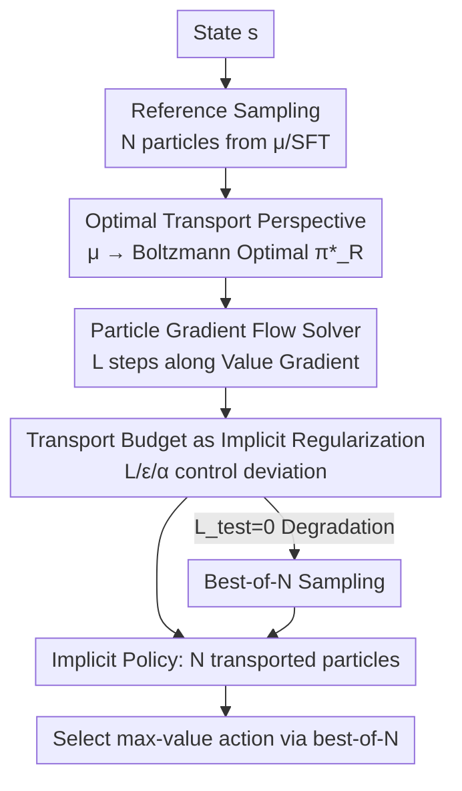

# Reinforcement Learning via Value Gradient Flow

**Conference**: ICLR 2026  
**OpenReview**: [https://openreview.net/forum?id=JLL4VNVhM9](https://openreview.net/forum?id=JLL4VNVhM9)  
**Code**: https://ryanxhr.github.io/vgf  
**Area**: Reinforcement Learning / Offline RL / RLHF  
**Keywords**: Behavior Regularization, Optimal Transport, Gradient Flow, Implicit Policy, Test-time Scaling  

## TL;DR
This paper proposes Value Gradient Flow (VGF), which reformulates "behavior-regularized RL" as an optimal transport problem from a reference distribution to a value-induced optimal distribution. By using particle gradient flow to transport initial actions along value gradients step-by-step, the method achieves implicit control over deviation through a "transport budget" without explicit policy parameterization or regularization terms. It achieves SOTA performance on D4RL, OGBench, and RLHF.

## Background & Motivation

**Background**: In both offline RL and RLHF for LLMs, policies cannot maximize value without constraints—out-of-distribution actions in offline RL lead to severe value overestimation, and deviating too far from the SFT model in RLHF causes "reward hacking." Therefore, the dominant paradigm is **behavior-regularized RL**: maximizing value while constraining the policy to remain close to a reference distribution (offline data $\pi_D$ or a pre-trained base model $\mu$). This is formalized as $\max_\pi \mathbb{E}_{a\sim\pi}[R(s,a)]\ \text{s.t.}\ \mathbb{E}[M(\pi,\mu)]\le\epsilon$.

**Limitations of Prior Work**: Existing approaches to implement this constraint have significant drawbacks. The first category involves **explicit penalties + reparameterized policy gradients**: the constraint is converted into a penalty term with coefficient $\beta$. However, using a single coefficient to regularize both "value learning" and "policy improvement"—which require different intensities—makes $\beta$ extremely difficult to tune. Furthermore, scaling to expressive generative policies like diffusion or flow requires backpropagation through multi-step sampling, which is unstable and expensive, while distillation into single steps sacrifices expressivity. The second category involves **rejection sampling / weighted BC under KL constraints** (e.g., best-of-N): while simple to implement, these can only amplify weak signals already present in the reference distribution and cannot learn new skills, remaining overly conservative and trapped within the behavioral support set.

**Key Challenge**: Loose constraints lead to value overestimation, while tight constraints result in excessive conservatism, both of which are tied to a single coefficient in existing methods. There is also a conflict between requiring expressive multimodal policies and ensuring scalable, stable training.

**Key Insight**: The authors observe that in max-entropy RL with entropy regularization, the optimal policy is precisely the Boltzmann distribution over the value function: $\pi^*_R(a|s)\propto\exp(R(s,a)/\alpha)$. Thus, "approaching the Boltzmann distribution from a reference distribution" is essentially an **optimal transport problem of moving probability mass**. How far and how frequently this mass is moved naturally constitutes an implicit constraint on deviation.

**Core Idea**: Instead of an explicit policy or penalty term, the method samples a set of particles from the reference distribution and uses value gradients to guide them through a finite number of "flow" steps to approximate the Boltzmann optimal distribution. This "transport budget" acts as the regularization and can be set independently for training and inference, supporting adaptive test-time scaling.

## Method

### Overall Architecture

VGF solves behavior-regularized RL without explicit parameterization or penalties by viewing it as **optimal transport**—transporting mass from the reference $\mu$ to the value-induced Boltzmann distribution $\pi^*_R$. The process starts by sampling $N$ particles as initial actions from the reference distribution (learned $\hat\mu$ in offline RL, or the SFT model in RLHF). Value gradients then serve as a velocity field to migrate each particle $L$ steps toward high-value regions (a discrete gradient flow). The resulting set of particles serves as the "implicit policy," requiring no policy network. Finally, best-of-N is used to select the highest-value action for execution. The value function $Q$ is trained via TD learning, with the target Q averaged over all particles. Crucially, the transport steps $L$, step size $\epsilon$, and temperature $\alpha$ form the "transport budget," where a smaller budget stays closer to the reference and a larger budget allows more exploration. Training and inference budgets can be decoupled.

### Key Designs

**1. Reformulating Behavior-Regularized RL as Optimal Transport: Replacing Explicit Penalties with "Transport Distance"**

To address the difficulty of tuning penalty coefficients and the coupling of value learning and policy improvement, VGF adopts a geometric perspective. Adding a policy entropy term to the reward maximization objective, $\mathbb{E}_{a\sim\pi}[R(s,a)]+\alpha H(\pi(\cdot|s))$, yields the Boltzmann distribution $\pi^*_R(a|s)=\frac{1}{Z_s}\exp(R(s,a)/\alpha)$ as the analytical optimum. Minimizing the distance to $\pi^*_R$ is equivalent to the gradient flow of the functional $F(q)=\mathrm{KL}(q\|\pi^*_R)$ under the Wasserstein metric. The advantage is that deviation is controlled implicitly by the "transport budget" (how far and how many steps to move). The authors theoretically prove that the MMD distance between initial and $L$-step particles is bounded: $\mathrm{MMD}^2(\mu,\pi^L_N)\le\frac{2\epsilon L}{\sigma\sqrt{e}}\left(\frac{c}{\alpha}+\frac{1}{\sigma\sqrt{e}}\right)$, ensuring strict constraint by the budget.

**2. Particle Gradient Flow Solver: Preserving Multi-modality via Value Gradients**

Continuous gradient flow $q_t$ is discretized using the JKO scheme: $q_{k+1}=\arg\min_q \mathrm{KL}(q\|\pi^*_R)+\frac{1}{2h}W_2^2(q,q_k)$. Approximating $q_k$ with the empirical measure of $N$ particles and restricting the velocity field to the unit ball of a vector-valued RKHS yields the update rule:
$$a^{(l+1)}_i=a^{(l)}_i+\epsilon\cdot\phi(a^{(l)}_i),\quad \phi(x)=\frac{1}{N}\sum_{j}k(a_j,x)\nabla_{a_j}R(s,a_j)$$
(Form shown for $\alpha\to0$). The first term pushes particles toward high-value regions, while the second (repulsive force based on kernel gradients in the max-entropy version) keeps particles dispersed to maintain multi-modality. Unlike BCQ, which learns a Gaussian residual on the reference policy, gradient flow naturally **preserves and sharpens multiple high-value modes** from the reference instead of collapsing to a single mode. To accelerate training, a network $f(s,a)$ is trained to fit $\nabla_a Q(s,a)$, with $N=5$ particles used in experiments.

**3. Implicit Regularization and "Breaking Support": Budget Tuning for Out-of-Distribution Discovery**

VGF differs from rejection sampling because weighted BC / best-of-N are restricted by KL constraints to the support of the reference: $\mathrm{supp}_\epsilon(\pi)\subseteq\mathrm{supp}_\epsilon(\mu)$. VGF uses first-order value gradients to actively push particles toward high-reward modes. The authors prove that $\mathrm{supp}_\epsilon(\pi^L_N)\not\subseteq\mathrm{supp}_\epsilon(\mu)$, meaning the implicit policy **can move outside the reference support** to discover new behaviors. Since regularization is implicit, the training and inference budgets can differ: setting the inference budget to 0 reduces VGF to best-of-N, while a larger inference budget enables test-time scaling gains.

**4. Gradient Flow in Continuous Proxy Space for LLM / RLHF**

Since tokens are discrete, gradient flow cannot be applied directly. VGF operates in a continuous proxy space and decodes back to discrete tokens only at the final step. Let $u$ be a differentiable representation of response $y$ (token-embedding matrix or latent vector $u=z$ in flow/diffusion models). Since reward models are differentiable with respect to input embeddings, response-level gradients are backpropagated via the chain rule: $\nabla_{u_i}\log\pi^*_R(y^{(l)}_i|x)=\frac{1}{\alpha}J_i^\top\nabla_y R(x,y^{(l)}_i)$, where $J_i=\partial\mathrm{Dec}(u_i)/\partial u_i$. This first-order guidance avoids the high variance of PPO while effectively "pushing" the already concentrated SFT policy toward higher rewards, achieving efficient test-time alignment.

### Loss & Training
In offline RL: A BC policy $\hat\mu$ is pre-trained as a reference sampler. The $Q$-function is trained via TD learning, where the target Q is averaged over $N$ particles after VGF transport. The simplified $\phi$ (with $\alpha\to0$) is used. An auxiliary $f(s,a)$ fits $\nabla_a Q$ for acceleration. Evaluation uses $L_{test}$ steps of VGF followed by best-of-N selection. Key hyperparameters include training steps $L_{train}$ (crucial for controlling deviation), step size $\epsilon$, and $N=5$ particles.

## Key Experimental Results

### Main Results

VGF outperforms baselines on most D4RL tasks, particularly challenging AntMaze navigation:

| Dataset | TD3+BC | IQL | Diffusion-QL | FQL | VGF (Ours) |
|--------|--------|-----|--------------|-----|-----------|
| hopper-m | 59.3 | 66.3 | 90.5 | 60.6 | **97.9** |
| walker2d-m-r | 81.8 | 76.1 | 95.5 | 38.8 | **97.8** |
| antmaze-u-d | 71.4 | 66.7 | 66.2 | 89 | **94.3** |
| antmaze-m-p | 10.6 | 72.2 | 76.6 | 78.0 | **89.4** |
| antmaze-l-d | 0.0 | 47.5 | 56.6 | 83.0 | **83.8** |

In OGBench, VGF shows significant advantages in hard tasks where others fail (success rates < 50%):

| Dataset | IQL | ReBRAC | IDQL | FQL | VGF (Ours) |
|--------|-----|--------|------|-----|-----------|
| humanoidmaze-medium | 33 | 22 | 1 | 58 | **72** |
| cube-double | 7 | 12 | 15 | 29 | **70** |
| puzzle-3x3 | 9 | 21 | 10 | 30 | **75** |
| puzzle-4x4 | 7 | 14 | 29 | 17 | **45** |

RLHF results (TL;DR + Anthropic-HH, GPT-4 win rate):

| Model | WR% (vs ref) | WR% (vs chosen) |
|------|--------------|-----------------|
| PPO | 57.3 | 45.5 |
| DPO | 61.2 | 51.5 |
| Best-of-N | 58.3 | 49.0 |
| VGF (Ours) | **68.1** | **59.0** |

### Ablation Study

| Configuration | Key Findings |
|------|---------|
| Varying $L_{train}$ | Optimal values vary per task; $L_{train}$ directly determines the deviation from the reference. |
| Varying $L_{test}$ | Scores increase with steps when the value function generalizes well (adaptive test-time scaling). |
| $L_{test}=0$ | Degrades to best-of-N, but still outperforms base policy due to TD learning of $Q$ for in-distribution generalization. |
| Online finetune | Higher starting point, faster adaptation, and higher final value compared to FQL. |

### Key Findings
- **$L_{train}$ is the most critical hyperparameter**: It represents how far the policy is allowed to deviate; too small is conservative, while too large may succumb to value extrapolation errors.
- **Dual nature of test-time scaling**: Increasing $L_{test}$ improves performance when the value function generalizes to OOD regions or data quality is low. If extrapolation error is high, setting $L_{test}=0$ (reverting to best-of-N) remains robust.
- **Toy case verification**: In a 2D bandit with bi-modal rewards, FlowQL is misled by reward errors and best-of-N is trapped in suboptimal support, while VGF particles successfully explore true high-reward regions.

## Highlights & Insights
- **From Additive Regularization to Geometry**: Replacing explicit KL/L2 penalties with an optimal transport "transport budget" converts a tuning problem into a geometric control problem with theoretical MMD bounds.
- **Multi-modality without Explicit Policy**: Particle gradient flow (SVGD-like) uses repulsive forces to keep particles dispersed, avoiding the collapse to a single mode or the expressivity loss of distillation.
- **Decoupled Budgets for Free Test-time Scaling**: The same value function allows the model to slide between "conservative best-of-N" and "aggressive exploration" by adjusting flow steps at inference, without retraining.
- **Unified Paradigm for RL and RLHF**: By transporting LLM tokens in a continuous proxy space, VGF provides a single framework that unifies these two communities.

## Limitations & Future Work
- VGF is limited if the reference distribution is severely biased toward suboptimal behavior (potential solution: distribution reweighting).
- Performance depends on the quality of the value function; high extrapolation error necessitates reverting to best-of-N. Stronger value functions for long-horizon tasks are needed.
- $L_{train}$ requires per-task tuning without an automated selection mechanism.
- Whether $N=5$ particles are sufficient for high-dimensional action spaces and the stability of proxy space flow in very large LLMs (beyond 2.8B) remains for further verification.

## Related Work & Insights
- **vs. Reparameterized Policy Gradients (FlowQL / Diffusion-QL)**: These require backpropagation through multi-step sampling which is unstable; VGF uses first-order gradients for particle guidance, making it more stable and flexible for scaling.
- **vs. Rejection Sampling / Best-of-N / Weighted BC**: These are locked within the reference support; VGF can break the support set and includes best-of-N as a special case ($L_{test}=0$).
- **vs. PA-RL / QAM**: PA-RL still uses explicit policies, limiting test-time scaling. QAM remains within the behavioral support, whereas VGF's implicit regularization encourages exploration beyond it.
- **vs. Optimal Transport in RL (PPL, etc.)**: PPL transports between states and partial action distributions, while VGF transports directly in the action space from the reference to the optimal distribution.

## Rating
- Novelty: ⭐⭐⭐⭐⭐ Reformulating RL as optimal transport plus particle gradient flow with the "transport budget as regularization" perspective is novel and theoretically grounded.
- Experimental Thoroughness: ⭐⭐⭐⭐ Broad coverage of D4RL/OGBench/RLHF, though RLHF model scales are relatively small.
- Writing Quality: ⭐⭐⭐⭐ Clear motivation and derivations; toy cases are intuitive.
- Value: ⭐⭐⭐⭐⭐ Strong utility in unifying offline RL and RLHF with built-in test-time scaling for generative policies.

<!-- RELATED:START -->

## Related Papers

- [\[ICLR 2026\] Guided Flow Policy: Learning from High-Value Actions in Offline Reinforcement Learning](guided_flow_policy_learning_from_high-value_actions_in_offline_reinforcement_lea.md)
- [\[ICLR 2026\] floq: Training Critics via Flow-Matching for Scaling Compute in Value-Based RL](floq_training_critics_via_flow-matching_for_scaling_compute_in_value-based_rl.md)
- [\[ICLR 2026\] Relative Value Learning](relative_value_learning.md)
- [\[ICLR 2026\] Flow Actor-Critic for Offline Reinforcement Learning (FAC)](flow_actor-critic_for_offline_reinforcement_learning.md)
- [\[ICLR 2026\] Convergence of an actor-critic gradient flow for entropy regularised MDPs in general spaces](convergence_of_an_actor-critic_gradient_flow_for_entropy_regularised_mdps_in_gen.md)

<!-- RELATED:END -->
