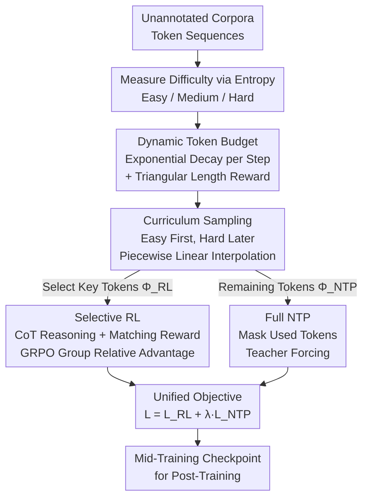

# Reinforcement Mid-Training

**Conference**: ICLR 2026  
**OpenReview**: [https://openreview.net/forum?id=uJUhi3FQNa](https://openreview.net/forum?id=uJUhi3FQNa)  
**Code**: TBD  
**Area**: LLM Reinforcement Learning / Mid-Training  
**Keywords**: Reinforcement Mid-Training, token budget, curriculum sampling, GRPO, next-token prediction

## TL;DR
This paper introduces Reinforcement Mid-Training (RMT) to fill the gap between pre-training and post-training. It utilizes unannotated pre-training corpora with next-token prediction as a verifiable reward for RL. The RMT framework employs dynamic token budgets, curriculum-based difficulty sampling, and a dual objective of "Selective RL + Full NTP," achieving up to +64.91% improvement in language modeling over the SOTA RPT while requiring only 21% of the inference length.

## Background & Motivation

**Background**: Large model training is typically understood as a two-stage process: pre-training (injecting world knowledge and linguistic abilities via next-token prediction on web-scale unannotated corpora) and post-training (aligning with human goals or downstream tasks using high-quality annotated data, including SFT and RLHF). Recently, a "mid-training" phase has emerged: it still uses unannotated pre-training data but employs more targeted objectives than general pre-training to systematically enhance complex abilities like mathematical reasoning. Reinforcement Pre-Training (RPT) was a pioneer in introducing RL to this stage, though it essentially operates during mid-training as its base model already possesses instruction-following and reasoning capabilities.

**Limitations of Prior Work**: The authors identify three unresolved issues in applying RL to mid-training. First is **inefficiency due to overthinking**: without constraints on the thinking process, models generate extremely long reasoning chains to predict a single token, slowing down both training and inference (e.g., RPT averages 872 tokens, Qwen3-14B reaches 1577 tokens), yet length does not guarantee accuracy. Second is **ignoring non-uniform token entropy distribution**: the entropy (uncertainty/learning difficulty) of different tokens varies significantly. Existing methods sample difficult tokens indiscriminately, failing to stabilize learning when the model lacks sufficient initial capacity. Third is **insufficient utilization of token information**: the vast majority of tokens in actual corpora are low-entropy, and current methods discard them to focus only on high-entropy tokens, leading to substantial information waste for unannotated corpora where every token contributes to language understanding.

**Key Challenge**: RL mid-training must balance the high computational cost of running RL on massive unannotated corpora with the need for concise, efficient reasoning that retains information from most tokens. RPT, the only major attempt, fails to truly address the cost problem of mid-training RL.

**Goal**: Formally define the Reinforcement Mid-Training problem and create an efficient, adaptive, and unified framework to overcome these three challenges.

**Key Insight & Core Idea**: Partition the sequence tokens into two disjoint subsets: a small set of "key tokens" $\Phi_{RL}$ for RL with CoT reasoning (using ground-truth hits as verifiable matching rewards), and the majority of low-entropy tokens $\Phi_{NTP}$ for standard next-token prediction, where $|\Phi_{NTP}| \gg |\Phi_{RL}|$. In summary: **use a unified objective of "Selective RL for hard tokens and Full NTP for all tokens," coupled with dynamic budgets to compress reasoning length and curriculum sampling to progress from easy to hard.**

## Method

### Overall Architecture
The input to RMT is a token sequence from unannotated pre-training corpora, and the output is a mid-trained checkpoint ready for post-training. The pipeline consists of four steps: 1. Measure token difficulty/uncertainty using **entropy**; 2. Allocate a **token budget** that decays over training steps to dynamically control generation length; 3. Use **curriculum sampling** to feed the model easy tokens early and difficult tokens later; 4. Perform RL with "length reward + verifiable matching reward" on sampled tokens while incorporating the majority of low-entropy tokens via NTP into a unified training objective.

### Key Designs

**1. Dynamic Token Budgeting: Constraining "Overthinking" via Decaying Budgets**

Addressing the "inefficiency of overthinking" pain point. The core is assigning a token budget $B_t$ for the reasoning process that **decays exponentially** as training progresses: $B_t = \max\left(B_{min},\ \lfloor B_0 \cdot \gamma^{t/T} \rfloor\right)$, where $B_0$ is the initial budget, $B_{min}\ge 1$ is the minimum budget (to prevent reasoning degradation), $\gamma \in (0,1)$ is the decay rate, and $t/T$ is the progress. Budget instructions like "Please use exactly $B_t$ tokens within `<think></think>`" are injected into the prompt. Furthermore, a **triangular length reward** $r_{len}(\ell; B_t)$ is introduced: reward increases linearly to a peak $r_{max}$ at $\ell=B_t$, decreases linearly to 0 at $(B_t, 2B_t]$, and is 0 beyond $2B_t$. This precisely encourages following the budget while penalizing both insufficient and excessive thinking. As model capacity grows and budgets tighten, reasoning becomes more refined—reducing response length to 21% of RPT and 12% of Qwen3-14B without performance loss.

**2. Curriculum-based Adaptive Sampling: Progressive Learning by Token Entropy**

Addressing the "non-uniform token entropy" pain point. Tokens are first categorized into easy, medium, and hard tiers based on entropy. Sampling during training follows a distribution that evolves over steps. Two transition points $0 < t_1 < t_2 < T$ define two distribution sets $p_{t_1}$ and $p_{t_2}$ (each normalized), with **piecewise linear interpolation** used for smooth transitions:

$$p_t = \begin{cases} p_{t_1}, & t < t_1 \\ (1-\tau)p_{t_1} + \tau p_{t_2}, & t_1 \le t < t_2,\ \tau=\frac{t-t_1}{t_2-t_1} \\ p_{t_2}, & t \ge t_2 \end{cases}$$

Sampling occurs in two steps: first selecting a difficulty tier $d \sim \text{Categorical}(p_t)$, then uniformly selecting a token from that tier to form the training set $C$. This creates three phases: early ($t<t_1$) focuses on easy/medium tokens for stability; transition ($t_1\le t<t_2$) increases exposure to medium/hard tokens; late ($t\ge t_2$) prioritizes high-entropy hard tokens for maximum performance. This prevents the model from being overwhelmed by difficult tokens early on.

**3. Unified Dual Objective: Selective RL + Full NTP**

Addressing "insufficient token utilization" and enabling practical RL mid-training. **Selective RL** is performed only on a few tokens in the sampled set $C$. For a token $\tau$ at position $pos$, the policy $\pi_\theta$ samples $G$ responses $o^i_{pos}=(c^i_{pos}, y^i_{pos})$ (CoT + final prediction) conditioned on prefix $\tau_{<pos}$. A **verifiable matching reward** $r^i_{pos}=\mathbb{1}[y^i_{pos}=\tau_{pos}]$ checks if the ground truth is hit, which is then combined with the length reward: $r^i=(1-w)\cdot r^i_{pos} + w\cdot r^i_{len}$. Optimization uses GRPO to calculate relative advantage $A_i$ within the group. **Full NTP** handles the remaining majority of low-entropy tokens: tokens used in RL are masked ($m_{pos}=\mathbb{1}[\tau_{pos}\notin C]$) to avoid duplicate training, followed by standard teacher-forcing: $L_{NTP}(\theta)=-\sum_S m_{pos}\log p_\theta(\tau_{pos}\mid\tau_{<pos})$. The final unified objective is $L = L_{RL}(\theta) + \lambda\cdot L_{NTP}(\theta)$. These objectives are complementary: RL enhances non-trivial reasoning on high-entropy tokens, while NTP covers language understanding.

### Loss & Training
The unified objective is $L = L_{RL} + \lambda L_{NTP}$ with $\lambda=0.1$. Key hyperparameters: batch size 128, epoch 10, learning rate 1e-6, initial budget $B_0=800$, $B_{min}=1$, decay factor $\gamma=0.2$, curriculum transition points $t_1/t_2$ at 30%/70% of total steps, GRPO rollout size $G=8$. Experiments were conducted on 16 H100 (80GB) GPUs.

## Key Experimental Results

### Main Results
Language modeling results on OmniMATH (4051 training / 200 evaluation), reporting accuracy by token difficulty. Base models: R1-Distill-Qwen-14B (RMT-R1) and Qwen3-14B (RMT-Q3); baselines include NTP, NTR (CoT generation before prediction), and RPT.

| Method | Easy | Medium | Hard | Average |
|------|------|--------|------|---------|
| R1-Distill-14B (NTP) | 42.04 | 31.71 | 19.64 | 31.13 |
| Qwen3-14B (NTP) | 47.89 | 34.61 | 25.01 | 35.84 |
| R1-Distill-14B (NTR) | 4.76 | 2.43 | 2.09 | 3.09 |
| Qwen3-14B (NTR) | 8.47 | 5.08 | 4.51 | 6.02 |
| RPT | 48.67 | 35.84 | 23.03 | 35.85 |
| **RMT-R1** | 62.50 | 43.96 | 34.14 | 46.87 (+30.74%) |
| **RMT-Q3** | 76.92 | 55.79 | 44.64 | 59.12 (+64.91%) |

NTR performs poorly across all difficulties, indicating no explicit reasoning during standard pre-training. RPT shows potential but does not significantly surpass the base. RMT achieves SOTA, with the stronger Qwen3 base amplifying the Gains. **Post-training** (continuing GRPO post-training on Skywork math data) validates transferability:

| Model | Before | After |
|------|--------|-------|
| R1-Distill-14B | 23.00 | 51.00 |
| Qwen3-14B | 12.84 | 54.17 |
| RPT | 23.17 | 48.50 |
| RMT-R1 | 24.08 | 54.67 |
| RMT-Q3 | 25.17 | 64.33 |

RMT-Q3 surged from 25.17 to 64.33 after post-training, outperforming the best baseline by +18.76%.

### Efficiency & Ablation
In terms of response length, RMT-R1/Q3 average only 188/186 tokens, roughly 21% of RPT (872) and 12% of Qwen3-14B (1577), without performance degradation. Ablation (removing DTB, CAS, NTP):

| Configuration | Easy | Medium | Hard | Average | Note |
|------|------|--------|------|---------|------|
| RMT-R1 (Full) | 62.50 | 43.96 | 34.14 | 46.87 | Full model |
| w/o DTB | 60.35 | 32.79 | 27.59 | 40.24 | Loss of 6.63 |
| w/o CAS | 59.32 | 42.66 | 27.68 | 43.22 | Loss of 3.65 |
| w/o NTP | 40.00 | 34.26 | 27.27 | 33.84 | Loss of 13.03 (largest) |

### Key Findings
- **Removing NTP causes the largest performance drop**, confirming the core claim that low-entropy token information must be utilized.
- **Stronger base models amplify gains**: RMT-Q3 consistently outperforms RMT-R1, showing the method scales with the base model.
- **Efficiency and performance are not contradictory**: Case studies show RMT-Q3 correctly answering with 165 tokens of concise reasoning, while RPT failed after 1376 tokens of vacillation.

## Highlights & Insights
- **Formalizes "Mid-Training" as a distinct stage**: Explicitly targets unannotated data using next-token hits as a natural verifiable reward, bypassing the "reward signal" hurdle in mid-training RL.
- **Elegant entropy-driven curriculum**: Using token entropy as a difficulty proxy with piecewise linear sampling offers a general template for curriculum learning.
- **Triangular reward + decaying budget**: Combines soft constraints with hard annealing to achieve both conciseness and accuracy in RL.
- **Masked Selective RL + Full NTP**: Splicing two objectives without overlap on the same sequence saves compute while maximizing data utility—a reusable design for mixing sparse fine-tuning with dense background learning.

## Limitations & Future Work
- Experiments focused on math corpora (OmniMATH / Skywork) and 14B models; generalization to other domains (code, dialogue) or larger scales is not fully explored.
- Numerous hyperparameters (thresholds, transition points, $B_0, \gamma, w, \lambda$) require tuning and sensitivity analysis.
- The assumption that token entropy equals learning difficulty is strong; high entropy may stem from noise rather than valuable complexity.
- Evaluation relies on next-token accuracy and downstream math tasks; broader reasoning capacity improvements remain evidenced indirectly.

## Related Work & Insights
- **vs RPT**: RPT pioneered RL at this stage but suffered from unrestricted reasoning and high compute costs on high-entropy tokens. RTM wins on performance and efficiency (+64.91% performance, 21% length).
- **vs RLHF / GRPO**: Standard RLHF depends on annotated/reward-tagged downstream data; RMT positions itself before this, preparing the model using unannotated data.
- **vs Curriculum Learning**: RMT applies curriculum at the token level rather than the sample/task level, using entropy as the difficulty metric.

## Rating
- Novelty: ⭐⭐⭐⭐⭐ Formalizes "Reinforcement Mid-Training" with self-consistent components.
- Experimental Thoroughness: ⭐⭐⭐⭐ Coverage of modeling, post-training, and efficiency, though limited to math and 14B size.
- Writing Quality: ⭐⭐⭐⭐ Clear definitions, complete formulas, and effective visuals.
- Value: ⭐⭐⭐⭐⭐ Provides a missing puzzle piece in the LLM training pipeline with a plug-and-play design.

<!-- RELATED:START -->

## Related Papers

- [\[ICLR 2026\] Learning to Reason as Action Abstractions with Scalable Mid-Training RL](learning_to_reason_as_action_abstractions_with_scalable_mid-training_rl.md)
- [\[ICLR 2026\] Representation-Based Exploration for Language Models: From Test-Time to Post-Training](representation-based_exploration_for_language_models_from_test-time_to_post-trai.md)
- [\[ICLR 2026\] Post-training Large Language Models for Diverse High-Quality Responses](post-training_large_language_models_for_diverse_high-quality_responses.md)
- [\[ICLR 2026\] R1-Reward: Training Multimodal Reward Model Through Stable Reinforcement Learning](r1-reward_training_multimodal_reward_model_through_stable_reinforcement_learning.md)
- [\[ICLR 2026\] Breaking Barriers: Do Reinforcement Post Training Gains Transfer To Unseen Domains?](breaking_barriers_do_reinforcement_post_training_gains_transfer_to_unseen_domain.md)

<!-- RELATED:END -->
