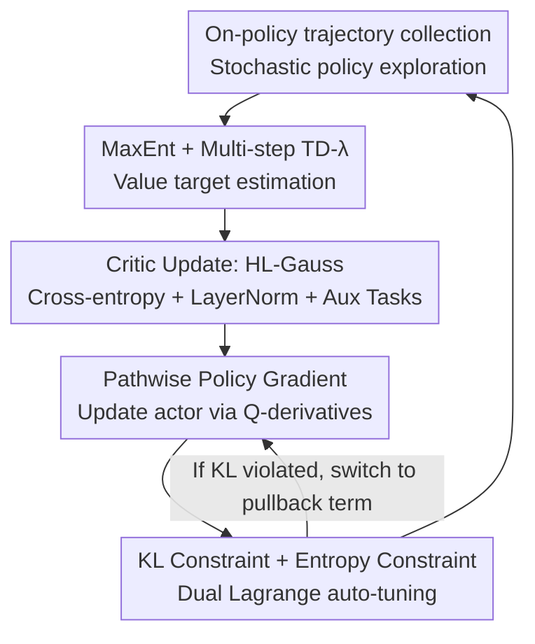

# Relative Entropy Pathwise Policy Optimization

**Conference**: ICLR 2026  
**OpenReview**: [https://openreview.net/forum?id=4vmm8mlHkS](https://openreview.net/forum?id=4vmm8mlHkS)  
**Code**: https://github.com/reppo-rl  
**Area**: Reinforcement Learning  
**Keywords**: on-policy RL, pathwise policy gradient, maximum entropy, KL constraint, value function learning  

## TL;DR
REPPO transitions "pathwise policy gradients" (updating policies via Q-function derivatives), typically reliant on large replay buffers in off-policy settings, into a purely on-policy framework. By learning a sufficiently accurate Q-function using only current policy trajectories, combined with maximum entropy exploration and auto-tuned KL constraints, it outperforms PPO with higher sample efficiency and lower memory usage, while matching the performance of off-policy FastTD3 on GPU-parallelized benchmarks.

## Background & Motivation

**Background**: Mainstream on-policy algorithms (TRPO, PPO) use **score-function gradient estimators**, i.e., the policy gradient theorem $\nabla_\theta J(\pi_\theta) = \mathbb{E}[Q^{\pi_\theta}(x,a)\nabla_\theta \log \pi_\theta(a|x)]$. While effective for robotics and LLM fine-tuning, they only require sampling for estimation.

**Limitations of Prior Work**: Score-based estimators suffer from **extremely high variance** (as established by Greensmith et al.), especially in high-dimensional continuous action spaces, leading to training instability. To reuse samples, importance sampling (IS) is often employed, which further amplifies variance—PPO’s clipping only prevents catastrophic collapse rather than fundamentally reducing variance.

**Key Challenge**: An alternative is training a parameterized state-action value function $\hat Q$ and computing the **pathwise policy gradient** $\nabla_\theta J \approx \mathbb{E}[\nabla_a \hat Q(x,a)|_{a=\pi_\theta(x,\epsilon)}\nabla_\theta \pi_\theta(x,\epsilon)]$. While this has lower variance and eliminates the need for IS, its efficacy is **strictly limited by the accuracy of $\hat Q$**. Historically, learning an accurate $\hat Q$ required off-policy training with large replay buffers, which consume excessive memory and introduce issues like distribution shift, overestimation, and loss of plasticity.

**Goal**: Can an accurate $\hat Q$ be trained and utilized for policy improvement in a **completely on-policy manner without a large replay buffer**?

**Key Insight**: A 2D Gaussian optimization toy experiment reveals that score-based estimators exhibit highly erratic paths, exacerbated by IS, while pathwise gradients remain exceptionally stable given a "strong surrogate" ($\hat Q$). Thus, the problem reduces to: **as long as a strong surrogate can be learned on-policy, pathwise gradients can prevail**.

**Core Idea**: Use **on-policy multi-step TD-λ targets** to learn $Q$ (instead of single-step off-policy targets with buffers), ensure continuous exploration via **maximum entropy**, and control update magnitudes via **KL (relative entropy) constraints with dual Lagrange multiplier auto-tuning**. These elements form a stable, memory-efficient on-policy pathwise algorithm.

## Method

### Overall Architecture
REPPO is an on-policy actor-critic algorithm that proceeds in three phases: **data collection → value target estimation → value and policy updates**. The core challenge is learning an accurate $\hat Q$ on-policy and ensuring policy updates do not exploit the regions where $\hat Q$ is inaccurate (outside the current policy's distribution). REPPO addresses this by combining stable Q-targets via maximum entropy and multi-step TD-λ, bounding updates via KL constraints, and auto-calibrating entropy and KL strengths using dual multipliers. It further stabilizes the critic with three off-policy architectural improvements: cross-entropy regression, layer normalization, and auxiliary tasks.

### Key Designs

**1. MaxEnt Value Learning via On-policy Multi-step TD-λ: Learning $Q$ without Replay Buffers**

Off-policy algorithms (TD3/SAC) typically use **single-step** Q-learning stabilized by large replay buffers. Since on-policy methods cannot use old data, REPPO utilizes **low-bias multi-step TD-λ targets** for stability. Value learning is integrated into a MaxEnt framework where the objective $J_{ME}(\pi_\theta) = \mathbb{E}_{\pi_\theta}[\sum_t \gamma^t(r(x_t,a_t) + \alpha \mathcal{H}[\pi_\theta(x_t)])]$ encourages stochasticity by subtracting $\alpha \log\pi$ from rewards. The specific n-step target is:

$$G^{(n)}(x_t,a_t) = \sum_{k=t}^{n}\gamma^{k-t}\big(r(x_k,a_k) - \alpha\log\pi(a_k|x_k)\big) + \gamma^{n+1}Q(x_n,a_n),$$

weighted by λ as $G^\lambda = \frac{1}{\sum_n \lambda^n}\sum_{n=0}^{N}\lambda^n G^{(n)}$. Crucially, **targets are calculated on-policy once per batch and are not recomputed during updates**. This property allows REPPO to discard off-policy stabilization components: no clipped double-Q (avoiding the hard-to-tune pessimism-exploration trade-off) and no target networks (as targets are naturally stable). Fundamentally, REPPO is closer to SARSA than Q-learning.

**2. KL Constraint + Dual Lagrange Multiplier Auto-tuning: Solving Exploration and Stability Jointly**

Value functions are only accurate on data covered by the old policy; **excessive policy updates can move into regions where $\hat Q$ is inaccurate, destabilizing training**. Following Relative Entropy Policy Search, REPPO constrains the deviation between new and old policies using KL divergence. The policy update is formulated as maximizing $\mathbb{E}_{a\sim\pi_\theta}[Q(x,a)]$ subject to $\mathbb{E}[D_{KL}(\pi_{\theta'}\|\pi_\theta)]\le \varepsilon_{KL}$ and $\mathbb{E}[\mathcal{H}[\pi_\theta]]\ge \varepsilon_{H}$. Instead of mirror descent or line search, REPPO relaxes this into two hyperparameters $\alpha$ (entropy) and $\beta$ (KL), using gradient-based root-finding in log-space to adjust multipliers based on constraint violations:

$$\alpha \leftarrow \alpha - \eta_\alpha e^\alpha\,\mathbb{E}[\mathcal{H}[\pi_\theta] - \varepsilon_H], \qquad \beta \leftarrow \beta - \eta_\beta e^\beta\,\mathbb{E}[D_{KL}(\pi_{\theta'}\|\pi_\theta) - \varepsilon_{KL}].$$

**Jointly** tuning $\alpha$ and $\beta$ is essential: if the policy's entropy collapses, the KL constraint prevents any further updates. Since these align with reward scales, the multipliers must adapt as rewards increase during training. The actor loss uses a clipped mechanism: when KL is within bounds, it uses the pathwise term $-Q(x_i,a) + e^\alpha\log\pi_\theta(a|x_i)$; once violated, it switches to a pullback term $e^\beta \cdot \frac{1}{k}\sum_j \log\frac{\pi_{\theta'}(a_j|x_i)}{\pi_\theta(a_j|x_i)}$. Unlike PPO, this **does not require importance sampling**, providing a significant performance gain.

**3. Three Features for Stable Critics: HL-Gauss, LayerNorm, and Auxiliary Tasks**

To further stabilize the critic, REPPO adopts advancements from off-policy value learning. First, MSE is replaced with **HL-Gauss cross-entropy loss** (inspired by distributional RL like C51). This loss is **scale-invariant** and provides more stable gradients. Second, **Layer Normalization** is used, which is proven to stabilize critics. Third, **auxiliary tasks** (e.g., predicting the next state) serve as a fallback when Q-signals are uninformative, particularly useful when the number of samples per update is low.

### Loss & Training
The critic loss is $L_Q^{REPPO}(\phi) = \frac{1}{B}\sum_i \mathrm{HL}\big(Q_\phi(x_i,a_i), G^\lambda(x_i,a_i)\big) + L_{aux}(f_\phi(x_i,a_i), x_i')$. The actor loss is the KL-dependent conditional clip objective. Multipliers $\alpha,\beta$ are updated via root-finding on constraint residuals. The system uses **identical hyperparameters** across 30+ tasks, without target networks, double-Q, or replay buffers.

## Key Experimental Results

### Main Results
Evaluated on MuJoCo Playground DMC (23 locomotion tasks) and ManiSkill (8 manipulation tasks) with 20 seeds and 95% bootstrap confidence intervals.

| Benchmark | Metric | REPPO | PPO | Comparison |
|--------|------|------|----------|------|
| DMC Locomotion | Normalized Return (IQM/Median) | Significantly highest | Unstable on high-dim tasks | ≈ FastTD3 (10M buffer), but REPPO is fully on-policy |
| DMC | Wall-clock (~600–800s to converge) | ~+33% Norm. Return | Baseline | SAC (Brax, 5M) > PPO but < REPPO |
| ManiSkill (100M steps) | Success Rate (IQM/Median) | Stronger than PPO | Baseline | Wide mean CI, but leads in outlier-robust metrics |
| Memory | Replay Buffer | None (On-policy) | None | FastTD3 buffer ~10M transitions |

### Ablation Study

| Configuration | Finding | Note |
|------|---------|------|
| REPPO (Pathwise) | Full method, best | Learned Q + Pathwise gradient |
| REPPO (Score-based, Q) | Significant drop | Uses $\hat Q$ but switches to score-function estimator |
| REPPO (Score-based, GAE)| Further drop | Reverts to PPO GAE + IS + Clip; slightly worse than vanilla PPO |
| w/o Cross-entropy Loss | Significant drop | HL-Gauss is a critical addition |
| w/o LayerNorm | Drop in most envs | Less critical than in off-policy settings |
| w/o Aux Tasks | Slight drop | Becomes important when sample count is low |

### Key Findings
- **Eliminating IS is the primary gain**: Pathwise gradients (IS-free) with $\hat Q$ far outperform clipped objectives. Using GAE targets with REPPO's tuner fails because high variance breaks the auto-tuning mechanism.
- **Architecture**: Cross-entropy loss is the most critical design, followed by LayerNorm.
- **Reliability**: Defined as return not dropping below $\tau=0.9$ once reached. REPPO achieves reliability in ~80% of runs, outperforming PPO by 40 percentage points.
- The pathwise framework can extend to non-reparameterizable policies (e.g., diffusion policies) by using score-based estimators with the learned $\hat Q$.

## Highlights & Insights
- **Replay-buffer-free Pathwise Gradients**: REPPO proves that on-policy multi-step TD-λ can learn a Q-function "good enough" for pathwise updates, decoupling "derivatives of Q" from "off-policy buffers."
- **Dual Multiplier Auto-tuning**: Effectively resolves the conflict where entropy collapse breaks KL constraints or reward scaling invalidates fixed multipliers.
- **On-policy Simplification**: The on-policy nature allows for a simpler critic (no target networks or double-Q pessimism), which is a counter-intuitive but beneficial design shift.
- The use of a 2D Gaussian toy experiment to visualize variance differences between score-based and pathwise gradients provides a clear, transferable theoretical motivation.

## Limitations & Future Work
- Computational overhead per step is higher than PPO (larger networks + gradients through the critic-actor chain), though compensated by sample efficiency.
- Q-estimation is still biased; stability relies on empirical verification rather than convergence guarantees.
- The complete exclusion of replay buffers might not be optimal; hybrid on+off Q-targets could offer a better balance between memory and performance.

## Related Work & Insights
- **vs PPO/TRPO**: These use high-variance score-based gradients and IS; REPPO uses low-variance pathwise gradients with a learned Q, eliminating IS.
- **vs SAC/TD3**: Both use pathwise gradients but rely on massive buffers and single-step Q; REPPO is fully on-policy and multi-step, using orders of magnitude less memory.
- **vs REPS**: Inherits the KL constraint idea but simplifies the complex optimization into two auto-tunable multipliers, making it more robust and easier to implement.

## Rating
- Novelty: ⭐⭐⭐⭐⭐ Decouples pathwise gradients from off-policy constraints.
- Experimental Thoroughness: ⭐⭐⭐⭐⭐ 30+ tasks, 20 seeds, comprehensive metrics (reliability/wall-clock).
- Writing Quality: ⭐⭐⭐⭐ Clear intuition and derivation; some architectural details are deferred to appendices.
- Value: ⭐⭐⭐⭐⭐ Provides a robust, memory-efficient, and sample-efficient on-policy baseline.

<!-- RELATED:START -->

## Related Papers

- [\[ICLR 2026\] Revisiting Group Relative Policy Optimization: Insights into On-Policy and Off-Policy Training](revisiting_group_relative_policy_optimization_insights_into_on-policy_and_off-po.md)
- [\[ICLR 2026\] Relative Value Learning](relative_value_learning.md)
- [\[ICLR 2026\] Single-stream Policy Optimization](single-stream_policy_optimization.md)
- [\[AAAI 2026\] Start Small, Think Big: Curriculum-based Relative Policy Optimization for Visual Grounding](../../AAAI2026/reinforcement_learning/start_small_think_big_curriculum-based_relative_policy_optimization_for_visual_g.md)
- [\[ICLR 2026\] Dichotomous Diffusion Policy Optimization](dichotomous_diffusion_policy_optimization.md)

<!-- RELATED:END -->
