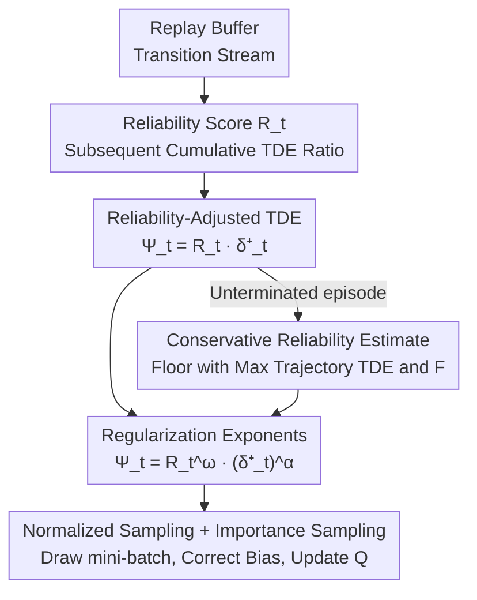

# Reliability-Adjusted Prioritized Experience Replay

**Conference**: ICLR 2026  
**OpenReview**: [https://openreview.net/forum?id=hmQk2Iwdh0](https://openreview.net/forum?id=hmQk2Iwdh0)  
**Code**: The paper states it will be open-sourced (source code included in supplementary materials)  
**Area**: Reinforcement Learning / Experience Replay  
**Keywords**: Experience Replay, Prioritized Sampling, Temporal Difference Error, Target Reliability, Off-policy RL

## TL;DR
The authors argue that using absolute Temporal Difference Error (TDE) as sampling weights in PER can "mislead learning" if the target Q-values themselves are inaccurate. They propose a "reliability score" $R_t$ based on the sum of subsequent TDEs within a trajectory, modifying the sampling weights to "Reliability × Absolute TDE." Theoretically, the convergence error is proven to be strictly superior to PER, and empirically, it consistently outperforms PER in classic control and Atari-10 (with a 22.97% higher median peak score in Atari-10).

## Background & Motivation
**Background**: Off-policy RL (DQN series) commonly utilizes experience replay to repeatedly learn from historical transitions to improve sample efficiency. The most basic approach is **uniform sampling** from the replay buffer, but different transitions have varying "learning values." PER (Prioritized Experience Replay), proposed by Schaul et al., samples transitions proportionally to their **absolute TDE** $\delta^+_t = |\delta_t|$, based on the premise that a larger TDE indicates a greater discrepancy between prediction and target, thus higher learning potential. To date, PER remains the only prioritized sampling strategy widely adopted by SOTA algorithms.

**Limitations of Prior Work**: The core assumption of PER—"large absolute TDE = high learning value"—is actually biased. The TDE is defined as $\delta_t = Q_{\text{target}}(S_t) - Q(S_t, A_t)$, where the bootstrapped target $Q_{\text{target}}(S_t) = R_{t+1} + \gamma(1-d_{t+1})\max_a Q(S_{t+1},a)$ is itself an **estimate**. If the target Q-value is inaccurate, a large TDE likely suggests that the "target is calculated incorrectly." Sampling based on such values amplifies the bias of unreliable targets, leading to degraded Q-value estimation, slower convergence, or even poor final policies.

**Key Challenge**: TDE simultaneously conflates two types of information—the true "value estimation error" of the transition (which should be learned) and the "target bias" (which should not mislead the update). PER cannot distinguish between the two and thus repeatedly samples transitions where the "target itself is wrong" as if they have "high learning value."

**Key Insight**: The authors use board games (Tic-Tac-Toe, Go) as an analogy: states closer to the end of the game have fewer remaining steps and shorter rollouts, making value estimation more reliable; states near the beginning rely on longer, more unreliable subsequent estimates. This implies a **temporal hierarchical dependence** within a trajectory—one must first learn the later transitions accurately before the targets for earlier transitions become reliable. Therefore, sampling should prioritize resolving TDEs "from back to front."

**Core Idea**: Weight the absolute TDE by a **reliability score** $R_t$ to obtain a "reliability-adjusted TDE" $\Psi_t = R_t \cdot \delta^+_t$ as the sampling criterion. This maintains the sample efficiency of PER by "picking high TDE" transitions while suppressing negative updates brought by unreliable targets. The method is algorithm-agnostic and can be integrated into any off-policy RL algorithm.

## Method

### Overall Architecture
ReaPER modifies only one component of the PER sampling pipeline: replacing the sampling weight from "absolute TDE" to "Reliability × Absolute TDE." The overall logic is as follows: for each transition in the buffer, first calculate its reliability $R_t$ within its trajectory (determined by the ratio of cumulative absolute TDEs after the transition to the cumulative absolute TDEs of the entire trajectory). This is multiplied by its own absolute TDE to obtain a priority $\Psi_t$, which is normalized into a sampling probability to draw mini-batches. After sampling, importance sampling weights are used to correct the bias introduced by non-uniform sampling, and finally, a Q-learning update is performed. On the theoretical side, proofs for "convergence hierarchy" and "variance reduction" are provided to explain why this weighting is strictly no worse than PER.

### Key Designs

**1. Reliability Score: Measuring target Q-value credibility via "Subsequent TDE Ratio"**

The fundamental problem with PER is the lack of distinction between "error to be learned" and "target bias." The authors formalize this through three observations: (i) the target $Q(S_{t+1},\cdot)$ of a non-terminal transition may be inaccurate and mislead updates; (ii) the target $Q_{\text{target}}(S_n)=R_n$ of a terminal transition is given directly by the environment and is **accurate and unbiased**; (iii) learning later transitions accurately recursively improves the target reliability of earlier transitions. The conclusion is that transitions should be addressed "from back to front." Accordingly, the reliability of the target $Q_{\text{target}}(S_t)$ is defined as inversely proportional to the "sum of subsequent absolute TDEs":

$$R_t = 1 - \frac{\sum_{i=t+1}^{n} \delta^+_i}{\sum_{i=1}^{n} \delta^+_i}.$$

The intuition is clear: if the TDEs following a transition are already small (indicating subsequent states are learned accurately), its target is reliable, and $R_t$ approaches 1. If there are many unresolved large TDEs ahead, $R_t$ is pulled down. A terminal transition has no subsequent transitions and thus has the highest reliability. Multiplying this into the sampling criterion $\Psi_t = R_t \cdot \delta^+_t$ ensures a high $\Psi_t$ signifies both a "large update magnitude" and a "trustworthy target."

**2. Convergence Hierarchy: Theoretical proof that ReaPER ⪰ PER ⪰ Uniform Sampling**

Intuition alone is insufficient; the authors prove that this weighting is superior. The expected change in the "squared error of true value" is decomposed into three terms: TDE variance, true squared error, and a **bias-error interaction term** $2\eta\sum_t \mu_t \mathbb{E}[e_t \varepsilon_t]$, where $e_t = Q(S_t,A_t)-Q^\star(S_t,A_t)$ is the true error, and $\varepsilon_t = Q_{\text{target}}(S_t)-Q^\star(S_t,A_t)$ is the target bias. While PER accelerates the reduction of "true squared error" by selecting large TDEs, it fails to control the bias-error interaction term. Under Key Assumption 3.4 ("target bias is bounded by the sum of downstream absolute TDEs," $|\varepsilon_t| \le \lambda\sum_{i=t+1}^n \delta^+_i$), Lemma 3.5 is proven: $|\varepsilon_t| \le \lambda(1-R_t)\sum_{i=1}^n \delta^+_i$, implying that higher reliability leads to smaller target bias. This yields the convergence hierarchy (Proposition 3.6):

$$\mathbb{E}\big[\|Q^{\text{Uniform}}_T - Q^\star\|^2\big] \ge \mathbb{E}\big[\|Q^{\text{PER}}_T - Q^\star\|^2\big] \ge \mathbb{E}\big[\|Q^{\text{ReaPER}}_T - Q^\star\|^2\big].$$

This means that under the stated assumption, the expected Q-value error of ReaPER is strictly no greater than that of PER. The authors also provide Remark 3.7 to generalize this to sub-optimal policies (by adding a policy-induced bias term $\zeta$).

**3. Variance Reduction: ReaPER as an approximation of Optimal Inverse-Variance Sampling**

The second theoretical pillar considers the "update variance." Fixing an episode and treating the current Q-values as constants, the update variance can be written as $\sum_t \mu_t \sigma^2_t$ (where $\sigma^2_t$ is the variance of the bootstrapped target). Proposition 3.8 proves that the optimal distribution minimizing variance is $\mu^\star_t \propto \delta^+_t / \sigma^2_t$. Since the true target $Q^\star$ is a constant, the target variance across runs is primarily derived from the target bias $\varepsilon$, making $\sigma^2$ directly related to $\varepsilon$. Under Assumption 3.4, it naturally follows that $R \propto 1/\sigma^2$. Thus, $\Psi_t = R_t \delta^+_t$ closely approximates the "inverse-variance weighted" optimal sampling strategy—providing a more rigorous justification for "multiplying by reliability" beyond mere intuition: it essentially performs variance reduction.

**4. Four Engineering Corrections: Transforming the naive algorithm into a runnable, stable RL implementation**

Directly implementing ReaPER as defined poses several critical issues, for which the authors provide four fixes. **(I) Priority Updates**: Recalculating all TDEs at every step is impractical, so lazy updates from PER are used—new transitions enter with maximum priority, and a transition's TDE is only updated when it is used for a Q-update. However, **whenever any transition within an episode is updated, the reliability of all transitions in that episode must be updated** (since the sum of TDEs has changed). **(II) Regularization**: TDEs may become outdated due to updates elsewhere; similar to PER, exponents $\alpha,\omega \in (0,1]$ are introduced to suppress extreme values: $\Psi_t = R^\omega_t \cdot (\delta^+_t)^\alpha$. **(III) Reliability for Unterminated Episodes**: For episodes that have not ended, the sum of TDEs is undefined. A conservative floor $F$ (the maximum sum of TDEs of any episode in the buffer) is used as a fallback (using position encoding vectors $\phi$ to label which trajectory each transition belongs to). The formula intentionally looks at within-episode variance without normalizing by episode length, as the authors found normalization biases towards short trajectories and is harmful in practice. **(IV) Weighted Importance Sampling**: Non-uniform sampling violates the i.i.d. assumption and introduces bias. Importance sampling weights $w_t = \big(\frac{1}{N}\cdot\frac{1}{p_t}\big)^\beta$ are used to scale the loss (using $\delta_t \cdot w_t$ instead of $\delta_t$ for updates) to correct this.

### Loss & Training
Training follows the standard DDQN Q-learning update $Q(S_t,A_t) \leftarrow Q(S_t,A_t) + \eta\cdot\delta_t$, with the only change being the use of $w_j\cdot\delta_j$ (the importance-sampling-corrected TDE) to accumulate weighted gradients. Key hyperparameters include the regularization exponents $\alpha,\omega$, the importance sampling exponent $\beta$, and the learning rate $\eta$. The authors emphasize that results were achieved with **minimal hyperparameter tuning**, suggesting further gains with fine-tuning.

## Key Experimental Results

Experiments used a unified DDQN agent, identical network architectures, and hyperparameters. Comparison was done with fixed random seeds and paired-seed comparisons, where the only variable was the experience replay algorithm (Uniform / PER / ReaPER).

### Main Results

| Environment Type | Environment / Benchmark | Metric | ReaPER vs PER | ReaPER vs Uniform |
|----------|-------------|------|---------------|-------------------|
| Continuous Control | ACROBOT | Reduction in steps to threshold | −16.6% | −25.0% |
| Continuous Control | CARTPOLE | Reduction in steps to threshold | −32.6% | −41.4% |
| Continuous Control | LUNARLANDER | Reduction in steps to threshold | −21.1% | −37.1% |
| High-dimensional | ATARI-10 | Median peak score | +22.97% | +229.78% |
| High-dimensional (POMDP) | ATARI-10 (POMDP) | Median peak score | +34.98% | — |

In three continuous control environments, ReaPER required 16.6%–32.6% fewer steps than PER to reach preset score thresholds (over 20 runs). In Atari-10, ReaPER outperformed PER in 8 out of 10 games and tied in 2, with a median peak score 22.97% higher than PER. In partial observability variants, the gap widened to 34.98%.

### Ablation Study

| Configuration | Key Observation | Description |
|------|---------|------|
| Full ReaPER ($\Psi=R\cdot\delta^+$) | Consistently optimal across three environments + Atari | The complete method |
| PER ($\Psi=\delta^+$, i.e., $R\equiv 1$) | Slower/Lower than ReaPER | Degenerates to no reliability weighting |
| Uniform | Worst | No prioritization |
| Reliability normalized by episode length | Empirically harmful | Biases towards short trajectories; thus within-episode variance form is used |
| Partially Observable Setting | Advantage increases from 22.97% to 34.98% | The more unreliable the target, the higher the gain from reliability weighting |

### Key Findings
- **Reliability weighting is the source of Gain**: The only difference between ReaPER and PER is the multiplication by $R_t$. Removing it ($R\equiv 1$) reverts the method to PER, leading to performance drops across all environments, highlighting that gains come entirely from the reliability term.
- **Greater benefits in harder/less observable tasks**: Gains increase from low-complexity continuous control (16.6%–32.6%) to Atari (22.97%) and further to partially observable Atari (34.98%). As target Q-values become less reliable, the value of suppressing target bias becomes more prominent—consistent with the motivation that TDE is least trustworthy when target bias is high.
- **Minimal tuning required**: The results were obtained with minimal hyperparameter search. The authors believe there is room for further improvement by fine-tuning $\alpha,\omega, \beta, \eta$.

## Highlights & Insights
- **Explicit target reliability in sampling criteria**: Previous prioritized sampling methods focused solely on TDE magnitude. This work is the first to quantify "how trustworthy this TDE is" into the weight. It approximates reliability using the "subsequent cumulative TDE ratio," which can be **calculated using existing TDEs** without requiring additional networks or uncertainty estimation, incurring low engineering cost.
- **Theoretical-intuitive closed loop**: The "learning back from the end" intuition in Tic-Tac-Toe corresponds to Lemma 3.5 (reliability bounding target bias) and Proposition 3.8 (ReaPER approximating optimal inverse-variance sampling). This provides "reliability weighting" with both intuitive clarity and rigorous proof, making it more persuasive than many heuristic PER variants.
- **Algorithm-agnostic, plug-and-play**: By only changing the sampling weight, it can be attached to any off-policy algorithm with minimal migration cost. The strategy of "using structured within-trajectory information (subsequent TDEs) to judge the credibility of current samples" can also be extended to other bootstrapping settings.

## Limitations & Future Work
- **Dependency on terminal states**: The reliability score requires an episode to terminate to calculate the full sum of TDEs. It is not directly applicable to infinite-horizon tasks or tasks without clear termination (continuing control), where unterminated episodes must rely on conservative fallbacks.
- **Computational overhead**: Maintaining the sum of cumulative TDEs for each episode adds overhead during TDE updates. A naive implementation is $O(N)$, which can be optimized to $O(n-t)$, but it remains heavier than PER.
- **Assumption boundaries**: Key Assumption 3.4 (target bias bounded by downstream TDEs) might be violated in early training stages before value estimates stabilize. Theoretical guarantees primarily hold once values start to converge.
- **Future Work**: The authors suggest exploring adaptive reliability estimation, extending to actor-critic and infinite-horizon settings, and integration with representation learning.

## Related Work & Insights
- **vs PER (Schaul et al. 2015)**: PER uses $\delta^+_t$ as weights; Ours uses $R_t\cdot\delta^+_t$. The difference lies in explicitly subtracting the influence of unreliable targets. Since ReaPER strictly reverts to PER when $R\equiv 1$, it acts as a "superset" rather than a replacement, being theoretically no worse and empirically better.
- **vs Prioritized Sequence Experience Replay (Brittain et al. 2019)**: This method **back-propagates** absolute TDEs along the episode to form a sampling criterion. While Ours also uses temporal information within a trajectory, the focus is different—not on propagating TDE, but on using the sum of subsequent TDEs to construct a reliability weight in $[0,1]$ to "suppress bias" rather than "propagate signals."
- **vs Uncertainty Prioritized Experience Replay (Carrasco-Davis et al. 2025) / Learning-based Selection (Zha 2019, Oh 2021)**: These methods introduce additional uncertainty or learned selection mechanisms. ReaPER’s selling point is that it **requires no additional models** and approximates reliability purely from existing TDEs in the buffer, making it more lightweight and easier to reproduce.

## Rating
- Novelty: ⭐⭐⭐⭐ The characterization of "reliability = subsequent TDE ratio" is simple yet novel, and explicitly incorporating target bias into sampling is a clean incremental innovation.
- Experimental Thoroughness: ⭐⭐⭐⭐ Covers classic control + Atari-10 + partial observability with rigorous paired-seed comparisons; however, lacks extensive horizontal comparisons with other PER variants and uses conservative tuning.
- Writing Quality: ⭐⭐⭐⭐⭐ Logic flows from intuition (Tic-Tac-Toe) to definitions, lemmas, and propositions. Both theory and engineering corrections are well-explained.
- Value: ⭐⭐⭐⭐ Algorithm-agnostic, plug-and-play, and theoretically grounded. It offers a low-cost, practical improvement for off-policy systems still using PER.

<!-- RELATED:START -->

## Related Papers

- [\[ICLR 2026\] ExGRPO: Learning to Reason from Experience](exgrpo_learning_to_reason_from_experience.md)
- [\[ICML 2026\] Agent Learning via Early Experience](../../ICML2026/reinforcement_learning/agent_learning_via_early_experience.md)
- [\[ACL 2026\] Deliberative Searcher: Improving LLM Reliability via Reinforcement Learning with Constraints](../../ACL2026/reinforcement_learning/deliberative_searcher_improving_llm_reliability_via_reinforcement_learning_with_.md)
- [\[ICLR 2026\] The Rank and Gradient Lost in Non-stationarity: Sample Weight Decay for Mitigating Plasticity Loss in Reinforcement Learning](the_rank_and_gradient_lost_in_non-stationarity_sample_weight_decay_for_mitigatin.md)
- [\[ICLR 2026\] Solving General-Utility Markov Decision Processes in the Single-Trial Regime with Online Planning](solving_general-utility_markov_decision_processes_in_the_single-trial_regime_wit.md)

<!-- RELATED:END -->
