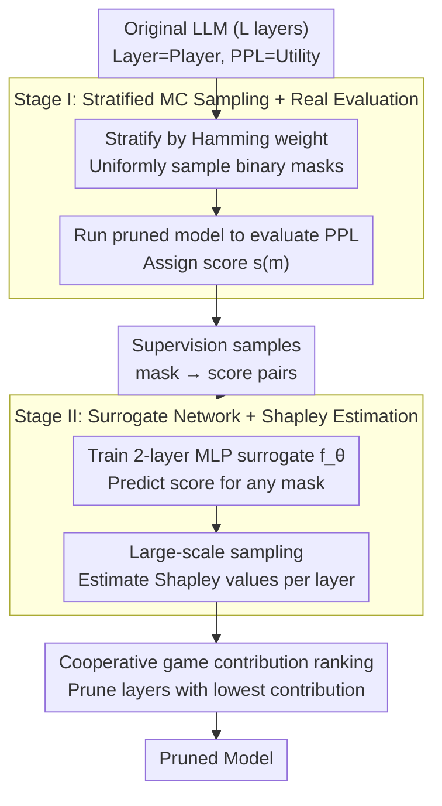

# Pruning as a Cooperative Game: Surrogate-Assisted Layer Contribution Estimation for Large Language Models

**Conference**: ICLR 2026  
**arXiv**: [2602.07804](https://arxiv.org/abs/2602.07804)  
**Code**: [GitHub](https://github.com/920927/Pruning_As_A_Cooperative_Game)  
**Area**: Reinforcement Learning  
**Keywords**: Layer pruning, cooperative game, Shapley value, surrogate network, Monte Carlo sampling, depth pruning

## TL;DR
LLM layer pruning is modeled as a cooperative game (each layer = player, model performance = utility). Since exact Shapley value calculation is infeasible ($2^L$ combinations), a two-stage approximation is proposed: (1) stratified Monte Carlo sampling to generate masks and evaluate PPL as supervision signals; (2) training a lightweight surrogate network to predict performance for arbitrary masks. This allows efficient estimation of each layer's Shapley value while capturing inter-layer dependencies, significantly outperforming static heuristic pruning baselines.

## Background & Motivation

**Background**: High LLM inference costs make model compression critical. Layer pruning (depth pruning) removes entire Transformer layers, offering simpler implementation and more direct inference acceleration compared to width pruning.

**Limitations of Prior Work**:
   - (1) **Static heuristic rules**: Existing methods score layers using weight magnitude, activation norms, or sensitivity analysis, assuming layer importance is fixed and independent. In reality, layer importance is context-dependent.
   - (2) **Neglect of inter-layer dependencies**: Removing one layer changes the relative importance of others; rankings obtained from single-layer evaluations fluctuate drastically during multi-layer pruning (Fig. 1). Middle layers are particularly unstable.
   - (3) **Greedy strategies are not globally optimal**: Pruning layers sequentially based on single-layer importance fails to find the optimal combination. For instance, pruning the two "least important" layers (Layer 27+10) individually yields PPL=15.4535, while the combination (Layer 10+11) is superior at PPL=15.4279 (Tab. 1).
   - (4) **Re-evaluation is insufficient**: Re-calculating importance after each pruning step still risks missing globally optimal combinations because layer interactions are not explicitly modeled.

**Key Insight**: Rethinking pruning from a game-theory perspective. Shapley values in cooperative games naturally capture interactive contributions among players. However, direct calculation is infeasible for LLMs, necessitating an affordable approximation.

**Core Problem**: How to accurately estimate the marginal contribution of each layer to model performance within computational limits while accounting for inter-layer dependencies?

**Mechanism**: Replace expensive full-model evaluations with a surrogate network. Training data is generated from stratified sampling of mask-performance pairs. The surrogate network generalizes to unseen masks, enabling large-scale Shapley value estimation.

**Design Motivation**: Layer importance is not a fixed value but depends on which other layers are retained. Only a game-theoretic framework can systematically model such "coalition-dependent" contributions.

## Method

### Overall Architecture

The method treats the pruning of an $L$-layer LLM as a cooperative game: each Transformer layer is a player, and the model's perplexity (PPL) on calibration data represents the coalition's utility. Each layer's importance is characterized by its Shapley value—the average marginal contribution across all possible layer combinations. Since exact calculation requires traversing $2^L$ coalitions, the method uses two stages: Stage 1 utilizes stratified Monte Carlo sampling to generate binary masks and evaluates their PPL to obtain "mask $\rightarrow$ score" supervision samples; Stage 2 trains a lightweight surrogate network to predict scores for any mask at near-zero cost, enabling large-scale Shapley estimation. Finally, layers with the lowest contributions are pruned.

### Key Designs

**1. Cooperative Game Modeling: From "Per-layer Scoring" to "Coalitional Contribution"**

Existing methods assign fixed importance scores to layers, assuming independence. However, pruning one layer alters the relative importance of others. This method treats the set of layers $\mathcal{L}=\{1,\dots,L\}$ as players. The utility $u(S)$ of a subset $S$ is defined by the model's PPL using those layers. The marginal contribution of layer $i$ to subset $S$ is $\Delta_i(S)=u(S\cup\{i\})-u(S)$. The Shapley value, a weighted average of marginal contributions across all possible coalitions, naturally encodes the dependency that "the value of layer $i$ depends on which other layers are kept."

**2. Stage I: Stratified Monte Carlo Sampling + Real Evaluation**

A binary mask $\mathbf{m}\in\{0,1\}^L$ represents a pruning configuration ($\mathbf{m}_i=1$ means layer $i$ is kept). Masks are stratified by Hamming weight $k(\mathbf{m})=\sum_i m_i$, and $N_{k_j}$ masks are sampled uniformly within each weight $k_j$. Stratification ensures that extreme pruning ratios (very high or very low) are adequately represented, whereas simple uniform sampling would concentrate masks near $L/2$. For each sampled mask, the pruned model is evaluated to yield a score $s(\mathbf{m})=\text{PPL}_{\text{orig}}/\text{PPL}(M(\mathbf{m}))$. This is the only computationally expensive step involving full LLM inference.

**3. Stage II: Surrogate Network + Shapley Estimation**

A surrogate $f_\theta$ (a two-layer feed-forward network) is trained on the collected samples to predict scores from masks. The objective is MSE: $\mathcal{L}(\theta)=\frac{1}{N}\sum_{n=1}^N\big(f_\theta(\mathbf{m}_n)-s(\mathbf{m}_n)\big)^2$. Despite being trained on limited samples, the surrogate generalizes to the $2^L$ space because inter-layer interactions are largely low-order. Shapley values are then approximated via large-scale sampling using the surrogate:

$$\hat{\phi}_i=\frac{1}{Q}\sum_{q=1}^Q\big(f_\theta(\mathbf{m}^{(k_j,q)}\cup\{i\})-f_\theta(\mathbf{m}^{(k_j,q)})\big)$$

Decoupling expensive evaluations (Stage 1) from massive sampling (Stage 2) makes the framework scalable. Layers are removed according to the ranked $\{\hat{\phi}_i\}$.

## Key Experimental Results

### Language Modeling (PPL Comparison)

| Method | LLaMA-2-7B Prune 3 Layers (WikiText2) | Prune 6 Layers (WikiText2) | Prune 9 Layers (WikiText2) | Prune 12 Layers (WikiText2) |
|------|:---:|:---:|:---:|:---:|
| SliceGPT | 108.10 | 212.89 | 291.85 | 393.89 |
| SLEB | 14.24 | 19.47 | 27.45 | 58.12 |
| Shortened-LLaMA | 16.65 | 36.37 | 81.96 | 304.52 |
| ShortGPT | 16.65 | 36.37 | 81.96 | 157.99 |
| **Ours** | **14.69** | **18.87** | **24.61** | **38.12** |

The advantage is most pronounced at high pruning ratios (12 layers removed): Ours (38.12) vs. SLEB (58.12) vs. ShortGPT (157.99).

### Meta-LLaMA-3-8B (High Compression)

| Method | Prune 3 Layers (WikiText2) | Prune 6 Layers (WikiText2) | Prune 9 Layers (WikiText2) | Prune 12 Layers (WikiText2) |
|------|:---:|:---:|:---:|:---:|
| SLEB | 20.40 | 33.64 | 63.83 | 126.94 |
| Shortened-LLaMA | 20.72 | 79.44 | 5928.34 | 15138.55 |
| ShortGPT | 23.85 | 84.56 | 2549.75 | 15138.55 |
| **Ours** | **18.58** | **25.39** | **45.26** | **304.52** |

On LLaMA-3, baselines collapse (PPL > 2000) when pruning 9+ layers, while Ours maintains a reasonable PPL of 45.26.

### Zero-shot Performance (LLaMA-2-7B, Avg. of 8 Tasks)

| Params | SliceGPT | SLEB | Shortened-LLaMA | ShortGPT | **Ours** |
|--------|:---:|:---:|:---:|:---:|:---:|
| 6.1B | 0.4430 | 0.5635 | 0.5816 | 0.5709 | **0.5782** |
| 5.5B | 0.3865 | 0.5138 | 0.5050 | 0.5050 | **0.5227** |
| 4.9B | 0.3645 | 0.4543 | 0.4506 | 0.4506 | **0.4689** |
| 4.3B | 0.3441 | 0.3812 | 0.3640 | 0.3911 | **0.3951** |

### Non-Transformer Architectures (RWKV-7B / Mamba-2.8B)

| Model | Params | ShortGPT PPL_Wiki | **Ours PPL_Wiki** |
|------|--------|:---:|:---:|
| RWKV-7B | 6.2B | 38.72 | **34.17** |
| RWKV-7B | 5.6B | 90.02 | **56.33** |
| Mamba-2.8B | 2.5B | 378.99 | **24.23** |
| Mamba-2.8B | 2.3B | 4074.49 | **31.11** |

Mamba results show a significant gap where ShortGPT collapses (PPL > 4000) at 2.3B parameters, while Ours remains stable at 31.11.

## Key Findings

1. **Layer importance is context-dependent**: Rankings for single-layer pruning fluctuate wildly during multi-layer pruning, especially for middle layers, proving static heuristics are unsuitable for depth pruning.
2. **Greedy pruning is not globally optimal**: Even with re-evaluation, greedy steps can miss optimal combinations (e.g., Layer 10+11 vs. Layer 27+10).
3. **Strong surrogate generalization**: Training on limited mask-performance pairs allows the surrogate to predict unseen combinations, suggesting inter-layer interactions are captured by low-order patterns.
4. **Magnified advantage at high compression**: As pruning depth increases, baseline performance degrades rapidly while the proposed method remains stable.
5. **Architectural generalization**: Success on RWKV and Mamba indicates that inter-layer dependency is a general model property, not exclusive to Transformers.
6. **Quantization compatibility**: Performing pruning after quantization yields better results than the reverse, as pruning decisions are based on the quantized model representation.

## Highlights & Insights

- **Game-theoretic Perspective**: Elevates pruning from "individual scoring" to "coalition contribution analysis" using the theoretically grounded Shapley value.
- **Efficient Surrogate Design**: Uses a simple 2-layer MLP to replace expensive LLM evaluations, making large-scale Shapley estimation computationally feasible.
- **Necessity of Stratified Sampling**: Prevents the surrogate from under-sampling extreme pruning ratios, ensuring high prediction accuracy across all compression levels.
- **Comprehensiveness**: Extensive validation across 6 model types, 12+ benchmarks, various compression ratios, and non-Transformer architectures.

## Limitations & Future Work

- **Stage I Computational Overhead**: Although the surrogate is fast, Stage I still requires running full LLM inference for hundreds of masks, incurring non-negligible calibration costs.
- **Surrogate Generalization Assumption**: Assumes inter-layer interactions are low-order and learnable by shallow MLPs; this may lack theoretical guarantees for extremely deep or specialized architectures.
- **Granularity**: Only focuses on layer-level pruning. Combining this with finer-grained head or channel pruning (hybrid pruning) remains unexplored.
- **Main Result Fine-tuning**: Most results focus on direct evaluation after pruning. Large-scale fine-tuning results (e.g., LoRA) are mostly in the appendix.

## Related Work & Insights

### vs ShortGPT (Men et al., 2024)
ShortGPT uses Block Influence (BI) for static importance scoring and prunes sequentially, ignoring dependencies. This method consistently outperforms ShortGPT, particularly at high compression where ShortGPT tends to collapse.

### vs SLEB (Song et al., 2024)
SLEB uses iterative pruning by removing the least important blocks. While it considers dependencies more than static methods, it remains a greedy strategy step-by-step. The proposed method provides a more global assessment of layer contributions via Shapley values.

### vs GTAP (Diaz-Ortiz Jr et al., 2023)
GTAP also applies cooperative game theory but at the neuron level using power indices. Its complexity limits scalability to LLMs. This work scales game-theoretic pruning to LLMs by operating at the layer level and introducing an efficient surrogate.

## Rating

- Novelty: ⭐⭐⭐⭐ (Novel application of Shapley values via surrogate expansion for LLMs)
- Experimental Thoroughness: ⭐⭐⭐⭐⭐ (Broad range of models, tasks, and architectures)
- Writing Quality: ⭐⭐⭐⭐ (Clear motivation and structure)
- Value: ⭐⭐⭐⭐ (Practical scalability and superior performance in high-compression scenarios)

<!-- RELATED:START -->

## Related Papers

- [\[ICLR 2026\] Efficient Estimation of Kernel Surrogate Models for Task Attribution](efficient_estimation_of_kernel_surrogate_models_for_task_attribution.md)
- [\[ICML 2026\] Game of Thought: Robust Information Seeking with Large Language Models Using Game Theory](../../ICML2026/reinforcement_learning/game_of_thought_robust_information_seeking_with_large_language_models_using_game.md)
- [\[ICLR 2026\] On Predictability of Reinforcement Learning Dynamics for Large Language Models](on_predictability_of_reinforcement_learning_dynamics_for_large_language_models.md)
- [\[ICLR 2026\] AWM: Accurate Weight-Matrix Fingerprint for Large Language Models](awm_accurate_weight-matrix_fingerprint_for_large_language_models.md)
- [\[ICLR 2026\] VerifyBench: Benchmarking Reference-based Reward Systems for Large Language Models](verifybench_benchmarking_reference-based_reward_systems_for_large_language_model.md)

<!-- RELATED:END -->
